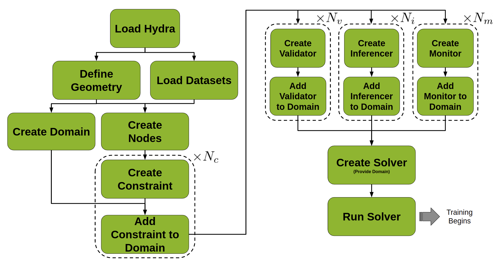
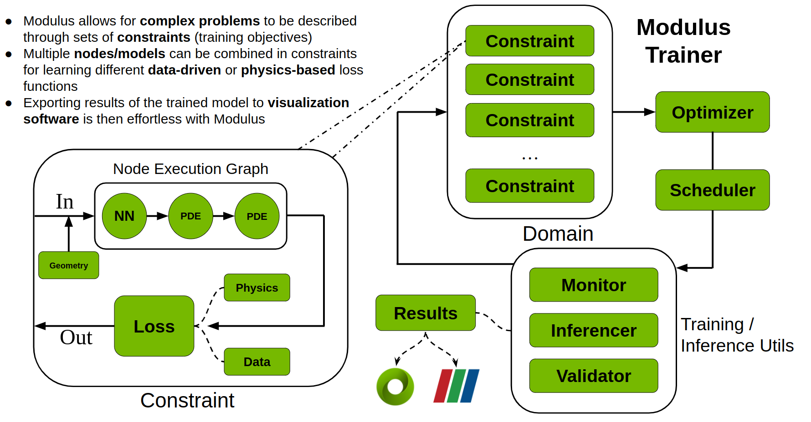

# Modulus Sym Overview

[公式ページ](https://docs.nvidia.com/deeplearning/modulus/modulus-sym/user_guide/basics/modulus_overview.html)

## Modulus Sym Building Blocks

### Geometry and Data

Modulus Symは、物理シミュレーション問題に対して、物理に基づいた学習ソリューションとデータ駆動型の機械学習ソリューションの両方を提供します。  
Modulus Symはのソリューションはすべて、物理問題を数学的最適化問題として表現しています。  
数学的最適化問題は、特定のジオメトリとデータセットで提起されます。  
Modulus Symのジオメトリモジュールでは、ユーザーがプリミティブな形状を使用して最初からジオメトリを構築するか、またはメッシュから既存のジオメトリをインポートするか選択することができます。
データ駆動型の問題に対して、Modulus Symはデータへのアクセス方法を複数提供しており、標準のインメモリデータセットや大規模データセットのための遅延ローディング方法を含みます。

### Nodes

Modulus Symでは、Nodeはトレーニング中のフォワードパスで実行されるコンポーネントを表します。  
Nodeはtorch.nn.Moduleをラップすることもあり、必要な入力変数と出力変数に関する追加情報を提供します。これにより、Modulus Symは実行グラフを構築し、必要な導関数を計算するために欠けているコンポーネントを自動的に補完することができます。  
Nodeには、Modulus Symに組み込まれたPyTorchニューラルネットワーク、ユーザー定義のPyTorchネットワーク、特徴変換、あるいは方程式などのモデルや関数が含まれることがあります。  

### Constraints

ConstraintはModulus Symのトレーニング目標です。  
Constraintには損失関数と、Modulus Symが実行のための計算グラフを構築するNodeのセットが含まれます。  
多くの物理問題では、問題が適切に定義されるために複数のトレーニング目標が必要です。Constraintはそのような問題を設定する手段を提供します。  

### Domain

DomainはすべてのConstraintおよびトレーニングプロセスに必要な追加コンポーネントを保持します。  
これらの追加コンポーネントにはInferencer、Validator、そしてMonitorが含まれます。  
Modulus Symで開発する際には、ユーザーが定義したConstraintがトレーニングDomainに追加され、トレーニング目標のコレクションを作成します。  

### Solver

Solverは、Modulus Symトレーナーのインスタンスです。最適化ループを実装し、トレーニングプロセスを管理します。
Solverは定義されたDomainを取り、必要に応じてConstraint、Inferencer、Validator、そしてMonitorを呼び出します。
一回のイテレーション中に、SolverはすべてのConstraintからグローバル損失を計算し、Constraintに提供されたNode内のトレーニング可能なモデルを最適化します。

### Hydra

HydraはModulus Symに組み込まれた設定パッケージです。YAML（標準的な人間が読めるテキストフォーマット）の設定ファイルを使用して、ニューラルネットワークの構造を決定し、そのトレーニングを管理するハイパーパラメータを設定することができます。
問題を解決するためにModulus Symを使用する際には、Hydraが最初に初期化されるコンポーネントです。これはModulus Symのすべてのコンポーネントに直接影響を与えます。

### Inferencers

Inferencerは、一連のNodeのフォワードパスのみを実行します。
Inferencerは、トレーニング中にトレーニング量を評価したり、視覚化やデプロイメントのための予測を得るために使用されることがあります。
Hydraの設定はInferencerが呼び出される頻度を制御します。

### Validators

ValidatorはInferencerのように機能しますが、バリデーションデータも取ります。
これらはトレーニング中にモデルの精度を定量化し、
他の方法で生成された物理的な結果に対して検証することで、
モデルを検証します。
（ここでの「検証」は、「検証と確認」の一部であり、Modulus Symが運用要件を満たしているかどうかを、Modulus Symが計算するシミュレーション結果を何らかの「既知の良い」結果と比較することによってチェックします。）

### Monitors

MonitorもInferencerのように機能しますが、フィールドの代わりに特定の測定値を計算します。
これらの測定値には、全エネルギーのようなグローバル量や、障害物の前の圧力のようなローカルプローブが含まれることがあります。
（「障害物」とは、特別な流体力学的特性を持つ形状の一種です。）
Monitorは自動的にTensorboardの結果に追加され、表示されます。
Monitorの結果は、カンマ区切り値（CSV）形式のテキストファイルにもエクスポートすることができます。

## Modulus Sym Development Workflow

下記の図は、Modulus Symで開発を行う際の典型的なワークフローを示しています。
すべての問題が正確にこのワークフローを要求するわけではありませんが、一般的なガイドとして機能します。
このプロセスの主要なステップには以下のものが含まれます：

1. "Load Hydra": YAML設定ファイルを読み込むために、Modulus Symのmainデコレータを使用してHydraを初期化します。

2. "Load Datasets": 必要に応じてデータをロードします。

3. "Define Geometry": 必要に応じてシステムの幾何学を定義します。

4. "Create Nodes": ニューラルネットワークモデルなど、必要なNodeを作成します。

5. "Create Domain": トレーニングDomainオブジェクトを作成します。

6. "Create Constraint" と "Add Constraint to Domain": それぞれの :math:N_{c} Constraintを順番に作成し、それをDomainに追加します。

7. "Create {Validator, Inferencer, Monitor}" と "Add {Validator, Inferencer, Monitor} to Domain": 必要なInferencer、Validator、またはMonitorを作成し、それらをDomainに追加します。

8. "Create Solver": 人口のトレーニングDomainでSolverを初期化します。

9. "Run Solver": Solverを実行します。この結果としてのトレーニングプロセスは、物理問題を解決するためにニューラルネットワークを最適化します。

各ステップの詳細は、Modulus Symへの手を動かしながらの導入を提供する:ref:Introductory Example`章で見ることができます。

## Modulus Sym Training Algorithm

