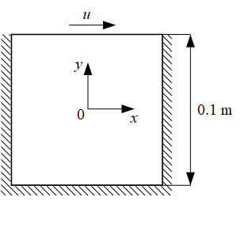
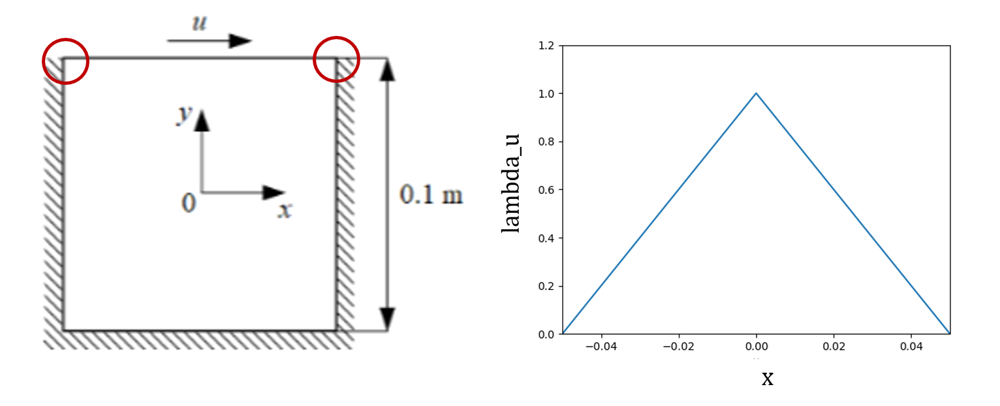
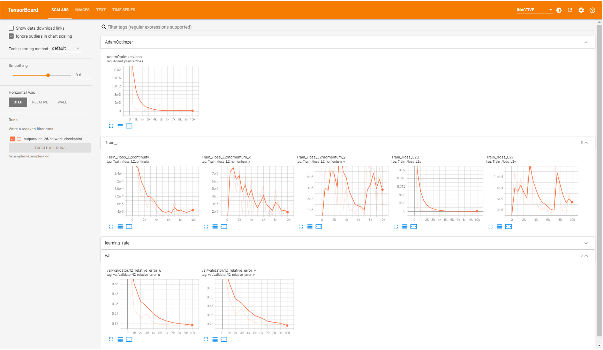
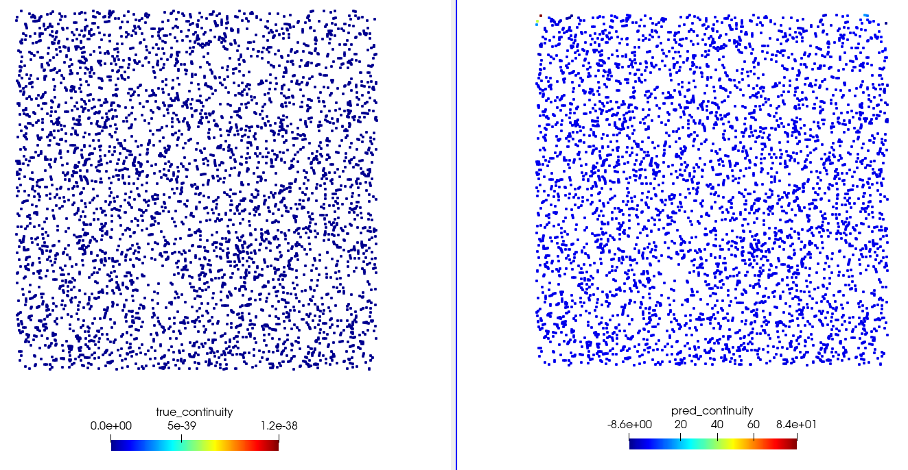
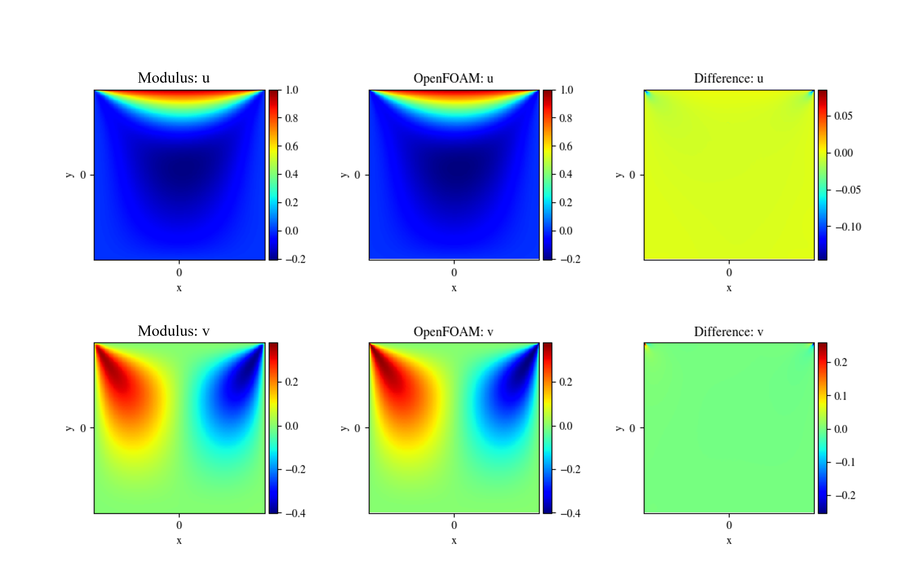
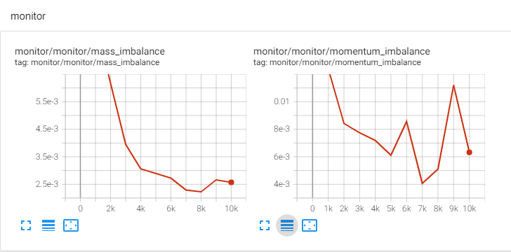
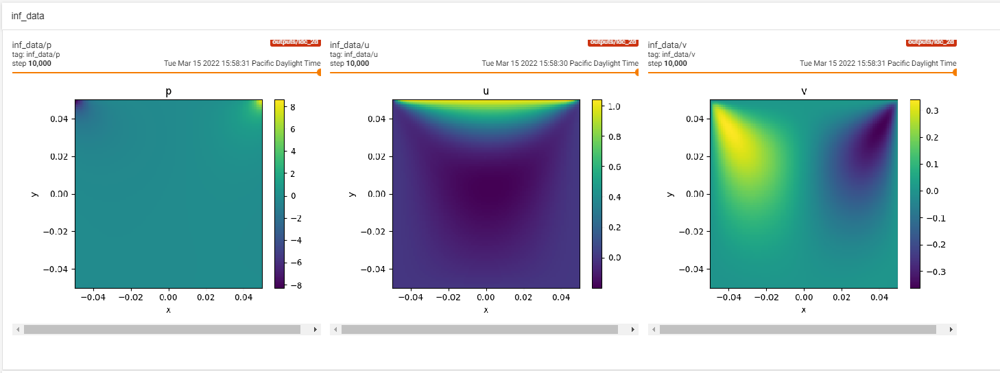

# Introductory Example

[公式ページ](https://docs.nvidia.com/deeplearning/modulus/modulus-sym/user_guide/basics/lid_driven_cavity_flow.html)

## Lid Driven Cavity Background

このチュートリアルでは、NVIDIA Modulus Symを使用して、Lid Driven Cavity（LDC）の例における2D流れを、物理情報ニューラルネットワーク（PINNs）を使用して解くプロセスを順を追って解説する。

このチュートリアルでは、以下について学習する：

1. geometryモジュールを使用してモデル形状を定義する
2. 境界条件を設定する
3. 流体方程式を設定する
4. 損失を計算し、ネットワークを調整する
5. 後処理を行う

## Problem Description

下に問題図を示します。ドメインは、一辺がそれぞれ 0.1[m] の正方形キャビティです。  
正方形領域の中心を座標原点として定義し、x方向は右側、y方向は上側を正とします。  
正方形領域の左、右、下側の壁は静止しており、上側の壁のみ+x方向に 1[m/s] で動きます。  
流体問題にとって重要な指標にレイノルズ数があります(<https://en.wikipedia.org/wiki/Reynolds_number>)。  
これは無次元量であり、流れが層流か乱流かを判定するのに役立ちます。  
レイノルズ数は、流速、代表長さ(この場合はキャビティの高さ)、および運動速度（以下で定義します）の関数です。  
この問題については、これらの量を選んでレイノルズ数が10となり、より層流の流れを示しています。



## Case Setup

まず、主要な概念とそれらがModulus Symの機能とどのように関連しているかを要約します。（より詳細な議論については、:ref:nn_methodologyを参照してください。）

微分方程式によって定義される物理駆動シミュレーションを解くには、問題を解くための空間領域とその支配方程式および境界条件に関する情報が必要です。  
ユーザーは、Modulus SymのConstructive Solid Geometry (CSG) モジュール、STLモジュール、またはカンマ区切り値（CSV）形式のテキストファイル、NumPyファイル、またはHDF5ファイルなどの外部ソースからのデータを使用してドメインを定義できます。  
この幾何学または点群が得られたら、それを2つのセットにサブサンプリングできます：境界条件を満たすための境界上の点、およびPDE/ODEの残差を最小化するための内部領域。

Note :
本例題のpythonスクリプトは`examples/ldc/ldc_2d.py`に書かれています

## Creating Nodes

### Importing the required packages

ジオメトリとニューラルネットワークを作成し、結果のプロットに必要なパッケージのインポートから始めます。

```python
import os
import warnings

from sympy import Symbol, Eq, Abs

import modulus.sym
from modulus.sym.hydra import to_absolute_path, instantiate_arch, ModulusConfig
from modulus.sym.solver import Solver
from modulus.sym.domain import Domain
from modulus.sym.geometry.primitives_2d import Rectangle
from modulus.sym.domain.constraint import (
    PointwiseBoundaryConstraint,
    PointwiseInteriorConstraint,
)
from modulus.sym.domain.validator import PointwiseValidator
from modulus.sym.domain.inferencer import PointwiseInferencer
from modulus.sym.key import Key
from modulus.sym.eq.pdes.navier_stokes import NavierStokes
from modulus.sym.utils.io import (
    csv_to_dict,
    ValidatorPlotter,
    InferencerPlotter,
)
```

### Creating a PDE Node

LDCの例では、流体流をモデル化するために2D定常非圧縮ナビエ-ストークス方程式を使用します。  
ナビエ-ストークス方程式は、領域内のすべての点での流速と圧力を記述する連立偏微分方程式（PDE）から成り立っています。  
この問題では 位置を示す独立変数 $x$ と $y$ から、$u$ , $v$ , $p$ (それぞれ x方向の流速 , y方向の流速 , 圧力)を求めます。

また、非圧縮ナビエ-ストークス方程式には2つのパラメータがあります。

- $μ$ : 運動粘性係数
- $ρ$ : 流体の密度

Modulus Symでは、非定数の $μ$ と $ρ$ を持つ問題にも対応できますが、この例では問題を単純にするため、これらを定数としています。  
密度が一定であると仮定し、$ρ$ を1と仮定すると、方程式は以下の形を取ります。

$$
\begin{align}
\frac{\partial u}{\partial x} + \frac{\partial v}{\partial y} &= 0\\
u\frac{\partial u}{\partial x} + v\frac{\partial u}{\partial y} &= -\frac{\partial p}{\partial x} + \nu \left(\frac{\partial^2 u}{\partial x^2} + \frac{\partial^2 u}{\partial y^2} \right)\\
u\frac{\partial v}{\partial x} + v\frac{\partial v}{\partial y} &= -\frac{\partial p}{\partial y} + \nu \left(\frac{\partial^2 v}{\partial x^2} + \frac{\partial^2 v}{\partial y^2} \right)
\end{align}
$$

(1)式は、流れが非圧縮であること（数学的には、流れが「発散フリー」であること）を表しています。(2), (3)式は、運動量保存による方程式です。  
サンプルコードの下記の箇所では、NavierStokes関数を呼び出して、ナビエ-ストークス方程式を解きたいことをModulus Symに伝える方法を示しています。  
運動粘性$μ$=0.01と密度$ρ$=1.0を設定します。  
本例題は定常状態の解を求める問題であるため、time=Falseと設定し、二次元の問題であるためdim=2と設定します。

この関数はNodeオブジェクトのリストを返しますが、これは後で必要になります。

```python
@modulus.sym.main(config_path="conf", config_name="config")
def run(cfg: ModulusConfig) -> None:
    # make list of nodes to unroll graph on
    ns = NavierStokes(nu=0.01, rho=1.0, dim=2, time=False)
```

### Creating a Neural Network Node

与えられた境界条件に対するナビエ-ストークス方程式の解を近似するために、ニューラルネットワークを作成します。  
ニューラルネットワークには2つの入力 $x$, $y$と3つの出力 $u$, $v$, $p$ があります。  
Modulus Symには、いくつかのニューラルネットワークアーキテクチャが付属しています。  
アーキテクチャの変更は、問題によってパフォーマンスをより良くしたり、逆に悪くする場合もあります。

ここで「パフォーマンス」とは、計算時間、メモリ使用量、並列処理効率などを意図します。  
最良のパフォーマンスではないですが、簡単のためこの例題では全結合ニューラルネットワークを使用します。  
Modulus Symのinstantiate_arch関数を呼び出してニューラルネットワークを作成します。  
input_keys引数は入力を指定し、output_keys引数は出力を指定します。  
各入力または出力を、対応するSymbolオブジェクトのラベルと同じ文字列ラベルを持つKeyオブジェクトとして指定します。

例えば、サンプルコードにおいて入力Key("x")はSymbol("x")に対応しています。  
Keyクラスは、モデルの展開/評価に使用される入出力を記述するために使用されます。  
最も基本的なKeyは、モデルの入力または出力の名前を表す文字列で設定されます。  
cfg=cfg.arch.fully_connectedを設定すると、デフォルトのFullyConnectedArchニューラルネットワークアーキテクチャが選択されます。  
これは、6層のマルチレイヤーパーセプトロン（MLP）ニューラルネットワークを使用するようModulus Symに指示します。  
各層には512のパーセプトロンが含まれ、"swish"（SiLUとしても知られる）活性化関数を使用します。  
これらのパラメーター(例えば、層数、各層のパーセプトロンの数、各層で使用する活性化関数など) はユーザーが設定可能です。  
この例では、デフォルト設定を利用していますが、より適切な設定がある可能性があります。  
この例題では、まず微分方程式(PDE)Node(= ns)を作成し、次にニューラルネットワークNode(= flow_net)を作成し、最後にこれらのNodeを一つにまとめています。

```python
flow_net = instantiate_arch(
        input_keys=[Key("x"), Key("y")],
        output_keys=[Key("u"), Key("v"), Key("p")],
        cfg=cfg.arch.fully_connected,
    )
    nodes = ns.make_nodes() + [flow_net.make_node(name="flow_network")]
```

すべてのPDEとアーキテクチャを定義したら、この問題について満たすべき制約に渡すNodeのリストを作成します。  
ここで、制約には、微分方程式、残差、境界条件が含まれています。

## Using Hydra to Configure Modulus Sym

Hydraによる設定ファイル読み込みは、Modulus Symを使用する上で中心的な役割を持ちます。  
各設定ファイルはYAML形式のテキストファイルです。  
Modulus Symのほとんどの機能はHydraを通じてカスタマイズできます。  
詳細は/examples/ldc/conf/config.yamlを参照ください。  
以下に、この例のための設定ファイルを示します。

```yaml
# Copyright (c) 2023, NVIDIA CORPORATION & AFFILIATES. All rights reserved.
#
# Licensed under the Apache License, Version 2.0 (the "License");
# you may not use this file except in compliance with the License.
# You may obtain a copy of the License at
#
# http://www.apache.org/licenses/LICENSE-2.0
#
# Unless required by applicable law or agreed to in writing, software
# distributed under the License is distributed on an "AS IS" BASIS,
# WITHOUT WARRANTIES OR CONDITIONS OF ANY KIND, either express or implied.
# See the License for the specific language governing permissions and
# limitations under the License.

defaults:
  - modulus_default
  - arch:
      - fully_connected
  - scheduler: tf_exponential_lr
  - optimizer: adam
  - loss: sum
  - _self_
scheduler:
  decay_rate: 0.95
  decay_steps: 4000

training:
  rec_validation_freq: 1000
  rec_inference_freq: 2000
  rec_monitor_freq: 1000
  rec_constraint_freq: 2000
  max_steps: 10000

batch_size:
  TopWall: 1000
  NoSlip: 1000
  Interior: 4000

graph:
  func_arch: true
```

## Creating Geometry

この例題におけるジオメトリを作成します。  
ジオメトリとは、モデル空間とその境界の物理的な形状を指します。  
ジオメトリは、PDEとニューラルネットワークを作成する前後で作成します。  
Modulus Symは、様々なジオメトリ定義の方法をユーザーに提供します。  
この例題では、Modulus SymのCSGモジュールを使用します。  
CSGモジュールは、さまざまな基本形状をサポートしています。  
二次元では、矩形、円、三角形、無限チャネル、線。三次元では、球、円錐、直方体、無限チャネル、平面、円筒、ドーナツ形、四面体、三角柱などが提供されます。  
ユーザーは、これらの基本形状を加算、減算、交差させることで、より複雑なジオメトリを構築できます。  
各形状の詳細や新しく追加されたジオメトリに関する情報については、APIドキュメントを参照してください。  

まずは、ジオメトリ定義に必要な変数を定義し、その後、Rectangleオブジェクトを使用して二次元の正方形ジオメトリを生成します。  
Modulus Symでは、Rectangleは対角の2点の座標を使用して定義します。  
変数は、後で制約を定義する際に、境界や内部領域を定義し、ジオメトリをサブサンプリングするために使用されます。  

以下のコードは、単純なジオメトリを定義するプロセスを示しています。  

```python
# add constraints to solver
    # make geometry
    height = 0.1
    width = 0.1
    x, y = Symbol("x"), Symbol("y")
    rec = Rectangle((-width / 2, -height / 2), (width / 2, height / 2))
```

ジオメトリを可視化したい場合、境界またはジオメトリ内部に対してポイントをサンプリングすることでジオメトリを可視化することができます。  
以下に示すコードでは、sample_boundaryメソッドを使ってジオメトリ境界の点をサンプリングしています。  
もし、境界でなくジオメトリ内部の点をサンプリングしたければ、sample_boundaryをsample_interiorに置き換えます。  
なお、var_to_polyvtk関数はジオメトリ確認が可能な.vtpポイントクラウドファイルを生成します。

このファイルは、ParaViewやその他のポイントクラウドプロッティングソフトウェアを使用して表示できます。  

```python
samples = geo.sample_boundary(1000)
var_to_polyvtk(samples, './geo')
```

ジオメトリモジュールには、translate（移動）やrotate（回転）などの機能もあり、任意の方向に形状を生成することができます。  
これらの使用方法については、別のチュートリアルで取り上げます。

## Adding Constraints

### Setting up the Domain

Domainオブジェクトには、PDEとその境界条件、およびValidatorとInferencerオブジェクトが含まれます。  
Modulus Symは、微分方程式(PDE)や境界条件を「Constraint(制約)」と呼びます。  
特に、PDEはドメイン内部の出力に対しての制約を定義します。  
DomainとHydraの2つが、最終的にSolverクラスのインスタンス生成に使用されます。  
例題の下記のコードは、Domainオブジェクトを作成する方法を示しています。  
Constraintは、後半で別途追加します。

```python
ldc_domain = Domain()
```

制約以外にも、Domainにさまざまなユーティリティを追加することができます。  
これには、モニター、検証データ、推論を行う点などが含まれます。  
これらの各項目は、この例で詳しく説明されています。  
Domainに制約を追加することは、ニューラルネットワークの最適化問題に特定の制約を追加することと同義に考えられます。  
PINNsを使った解法において、これらの制約は境界条件と方程式の残差になります。  
学習の目標は、境界条件を正確に満たし、内部残差（= PDEの解における誤差の尺度）をゼロにすることです。  
制約は、PointwiseBoundaryConstraintやPointwiseInteriorConstraintのようなクラスを使用してModulus Sym内で指定できます。  
Modulus Symは、制約から損失関数(= ニューラルネットワークの近似誤差の尺度)を構築します。  
デフォルトでは、Modulus SymはL2損失を使用しますが、これは変更することも可能です。  
optimizerは、損失関数を最小化することによってニューラルネットワークを訓練します。  
制約を指定するこの方法をソフト制約と呼びます。  
以下では、制約の指定方法について説明します。

### Boundary Constraints

Modulus Symで境界条件の制約を作成するには、まずそのジオメトリの一部をサンプリングし、次にそれらの点で評価したいNodeを指定します。最後に各Nodeに対して、目標値を割り当てます。  
「点をサンプリングする」とは、そのジオメトリの内部または境界部分に存在する点のセットを作成することを指します。  
「Node」はこの例題では前記の項目(ニューラルネットワークNodeの作成)で作成したPDEとニューラルネットワークのNodeのリストを指します。  
また、「Nodeを評価する」という表現に代わり、「Nodeを展開する」や「Nodeリスト上でグラフを展開する」といったフレーズを使用する例やドキュメントもあるので注意してください。  
「展開する」とは、「Nodeリスト上で計算グラフを構築する」という意味になります。  
その最後のポイントには、いくらかの詳細な説明が必要です。  
各ConstraintはNodeのリストを取得し、各Nodeには入力と出力のKeyが含まれています。  
Constraintへの入力は、この例では座標（$x$ と $y$ だけ）だけであり、出力は損失値になります。  
損失値を計算する一環として、Constraintには中間量を計算するモデルが含まれる可能性があります。  
例えば、本例題では、ジオメトリ内部のConstraintは、連続性および運動量方程式の残差を計算するために、入力に対する出力の導関数を必要とします。損失値は、それらの残差の二乗和から計算されます。  
内部的には、Modulus SymはモデルとPDEを評価し、必要な中間量（例えば、導関数）を計算する方法を把握する必要があります。  
これは、Node（計算のもとになる量）をエッジ（求めたい量を計算するためのNodeの組み合わせ方法）で接続して、そのConstraintのための「計算グラフ」を作成することに相当します。このプロセスを一般的に「グラフの展開」と呼びます。

PointwiseBoundaryConstraintオブジェクトを使用して境界をサンプリングします。  
これにより、オブジェクトを作成する際にgeometry引数で指定した幾何学の全境界がサンプリングされます。  
この例では、geometry=recを設定すると、矩形のすべての側面がサンプリングされます。幾何学の特定の境界をサブサンプリングするには、criteria引数を使用します。  
これは、sympyライブラリを使用して定義された任意の象徴的関数である可能性があります。  
例えば、上壁をサンプリングするには、criteria=Eq(y,height/2)を設定します。  
制約のoutvar引数は、境界条件の望ましい値を辞書として指定します。  
例えば、outvar={"u": 1.0, "v": 0.0}は、その境界上でのu出力の値が1.0であり、v出力の値がその境界上で0.0であることを示しています。  
制約のbatch_size引数は、各境界上でサンプリングする点の数を指定します。

Note :
criteria引数はオプションです。criteriaが指定されていない場合、ジオメトリの全ての境界がサンプリングされます。

ネットワークディレクトリは、単一のバッチでサンプリングされた点のみを示しますが、トレーニングで使用される総点数は、バッチサイズにbatch_per_epochパラメータを掛けた数になります。
このbatch_per_epochのデフォルト値は1000に設定されているので、上記の例において、上側境界条件（Top BC）でサンプリングされる総点数は、1000 * 1000 = 1000000 点になります。

LDC問題において、上壁が +x方向に $u$ = 1[m/s] の速度で移動すると定義し、他の全ての壁を静止している（$u$, $v$ = 0）と定義します。  
下図に示されるように、これにより $u$が0から1に急激にジャンプする鋭い不連続性が生じる可能性があります。  
この不連続性は、この境界の重み付けを指定することで避けることができ、損失の重みが連続的に変化し、境界上で0になるように設定します。  
この目的のために下図に示されているように関数 1.0 - 20.0|x| を利用します。  
方程式の損失の重み付けの利点に類似して、このような不連続性を排除することで収束が速くなり、精度が向上します。

任意の変数への重みは、Constraintオブジェクトへの入力として指定します。



### PDE Constraints

この例題のPDEは、所望の解を得るために、幾何学の内部の全ての点に適用される必要があります。  
境界と同様に、これにはまず必要な幾何学内部の点をサンプリングし、それらの点で評価するNodeを指定し、最後にそれらに対して望む真の値を割り当てることが必要です。  

PointwiseInteriorConstraintクラスを使用して、幾何学の内部の点をサンプリングします。  
そのoutvar引数は、辞書として解くべき方程式を指定します。2D LDCの場合、x方向とy方向の連続の式と運動量保存式が必要です。  
したがって、辞書リストには'continuity'、'momentum_x'、'momentum_y'のKeyがあります。  
これらのKeyには目標値(= 0)が設定してあります。  
これは、選択された点でこれらのKeyの所望の残差を表します（この場合、LDC幾何学の全内部）。  
非ゼロの値が許可されており、カスタムの強制またはソース項として機能します。これのさらなる例は、このユーザーガイドの後の章で見ることができます。  
方程式キーがどのように定義されているかを見るには、Modulus Symのソースを見るか、APIドキュメント（modulus/eq/pdes/navier_stokes.py）を参照できます。

例として、'continuity'の定義をここに示します。

```python
# set equations
self.equations = {}
self.equations['continuity'] = rho.diff(t) + (rho*u).diff(x) + (rho*v).diff(y) + (rho*w).diff(z)
```

以下の方程式は、PDEシステムの3つの方程式のそれぞれに対応する損失関数の一部を示しています。

$$
L_{continuity}= \frac{V}{N} \sum_{i=0}^{N} ( 0 - continuity(x_i,y_i))^2
$$
$$

L_{momentum_{x}}= \frac{V}{N} \sum_{i=0}^{N} ( 0 - momentum_{x}(x_i,y_i))^2
$$
$$
L_{momentum_{y}}= \frac{V}{N} \sum_{i=1}^{n} (0 - momentum_{y}(x_i, y_i))^2
$$

boundsパラメータは、変数 $x$ と $y$ の値をサンプリングする範囲を決定します。  
lambda_weightingパラメータは、異なる損失の重みを決定するために使用されます。  
この問題では、ジオメトリの符号付き距離場（SDF）を使用して、各点での各方程式を境界からの距離によって重み付けします。  
これは、境界から離れた点が、境界に近い点に比べて大きな重みを持つことを意味します。  
この重み付けにより、境界での不連続性を避けることができるため、収束が速くなります（別資料で詳細解説）。

Note :
lambda_weightingパラメータはオプションです。
指定されていない場合、各点での各方程式/境界変数の損失は等しく重み付けされます。

```python
interior = PointwiseInteriorConstraint(
    nodes=nodes,
    geometry=rec,
    outvar={"continuity": 0, "momentum_x": 0, "momentum_y": 0},
    batch_size=cfg.batch_size.Interior,
    lambda_weighting={
        "continuity": Symbol("sdf"),
        "momentum_x": Symbol("sdf"),
        "momentum_y": Symbol("sdf"),
    },
)
ldc_domain.add_constraint(interior, "interior")
```

## Adding Validation Node

「Validation(検証)」とは、Modulus Symによって計算された近似解を、他の方法で得られた結果を表すデータと比較することを意味します。  
結果は、Modulus Sym以外のシミュレーションや実験の任意の組み合わせから得られたものを利用します。

このセクションでは、Modulus Symでそのような検証を行う方法を示します。  
ここでは、検証データとしてニューラルネットワークに基づかない非線形および線形な有限要素法を使用した解法を持つ、オープンソースの計算流体力学（CFD）ソルバーであるOpenFOAMからの結果を使用します。  
結果は、.csv、.npz、または.vtkを含むさまざまな標準ファイル形式からModulus Symにインポートできます。  
Modulus Symでは、データを入力と出力のNumPy変数の辞書に変換する必要があります。  
.csvファイルの場合、これはcsv_to_dict関数を使用して行うことができます。

その後、検証データはPointwiseValidatorを使用してドメインに追加されます。  
入力と出力変数のために生成されたNumPy配列の辞書は、入力として使用されます。

```python
file_path = "openfoam/cavity_uniformVel0.csv"
if os.path.exists(to_absolute_path(file_path)):
    mapping = {"Points:0": "x", "Points:1": "y", "U:0": "u", "U:1": "v", "p": "p"}
    openfoam_var = csv_to_dict(to_absolute_path(file_path), mapping)
    openfoam_var["x"] += -width / 2  # center OpenFoam data
    openfoam_var["y"] += -height / 2  # center OpenFoam data
    openfoam_invar_numpy = {
        key: value for key, value in openfoam_var.items() if key in ["x", "y"]
    }
    openfoam_outvar_numpy = {
        key: value for key, value in openfoam_var.items() if key in ["u", "v"]
    }
    openfoam_validator = PointwiseValidator(
        nodes=nodes,
        invar=openfoam_invar_numpy,
        true_outvar=openfoam_outvar_numpy,
        batch_size=1024,
        plotter=ValidatorPlotter(),
    )
    ldc_domain.add_validator(openfoam_validator)
```

## Training

設定オプションcfgと、先ほど設定を完了したDomainを用いてSolverを作成します。  
その後、問題を解決するためにSolver上でsolve()メソッドを呼び出します。

```:python
slv = Solver(cfg, ldc_domain)
slv.solve()
```

Modulus Symのセットアップファイルはこれで完了です。これで、Modulus Symのニューラルネットワークソルバーを使用してCFDシミュレーションを解決する準備が整いました。

### Training the model

Pythonスクリプトを実行すると、ニューラルネットワークの訓練が行われます。

.. code:: bash

   python ldc_2d.py

コンソールは各ステップでの損失を出力します。Tensorboardを使用して、訓練が進むにつれてグラフィカルに損失を監視することもできます。以下でTensorboardの設定と使用方法を説明します。

## Results and Post Processing

### Setting up Tensorboard

Tensorboard (<https://www.tensorflow.org/tensorboard>) は、機械学習の経過や結果の可視化に非常に適したツールです。  
例えば、様々な訓練と検証の損失を可視化するために、Tensorboardを次のように設定できます。

新しいターミナルウィンドウを開き、作業ディレクトリで下記のコマンドを入力します。

```bash
tensorboard --logdir=./ --port=7007
```

この例における7007はポート番号です。使用したいポートを指定できます。実行中、コマンドプロンプトにTensorbord表示用のURLが表示されます。  
Tensorbordで結果を表示するため、ブラウザを開いてコマンドプロンプトに表示されたURLを開きます。例えば、この例題であれば<http://localhost:7007/#scalars>などのURLでTensorboardにアクセスできます。  
ブラウザに下図に示されるウィンドウが開きます。

Tensorboardウィンドウは、訓練中の各ステップでの様々な損失を表示します。  
AdamOptimizer損失は、ネットワークによって計算された損失の合計です。  
loss_continuity、loss_momentum_x、およびloss_momentum_yは、それぞれ連続の式と$x$、$y$方向の運動量保存式の残差に対して計算された損失を示します。  
loss_uとloss_vは、境界条件がどの程度満たされているか（ソフト制約）を示します。



## Output Files

チェックポイントは、'rec_results_freq'で指定された結果の記録頻度に基づいて保存されます。  
ネットワークディレクトリフォルダ（この例題では'outputs/'）には、以下の重要なファイル/ディレクトリが出力されます。

1. optim_checkpoint.pth、flow_network.pth：  
訓練中に保存された訓練のチェックポイントとネットワーク。

2. constraints：  
このディレクトリには、add_constraint()を使用してドメインに追加された点で計算されたデータが含まれています。  
データは.vtpファイルとして保存され、Paraviewのような可視化ツールを使用して表示できます。  
制約のnodes引数に渡された全てのNodeの真の値と予測値を見ることができます。  
例えば、"./constraints/Interior.vtp"にはpred_continuityとtrue_continuityの変数が含まれており、continuityのネットワーク予測値と真の値が表されます。  
下図は、真値と計算された連続性の比較を示しています。  
これは、サンプリングされた点で境界条件と方程式がどの程度満たされているかを判断するのに役立ちます。



1. validators: このディレクトリには、add_validator()を使用してドメインに追加された点で計算されたデータが含まれています。このドメインは、参照解との関係でデータを検証するのにより役立ちます。データは.vtpおよび.npzファイル（save_filetypes設定オプションに基づく）として保存されます。.vtpファイルは、Paraviewのような可視化ツールを使用して表示できます。このディレクトリの.vtpおよび.npzファイルは、選択された点での予測値、真の値（検証データ）、予測値（モデルの推論）を報告します。例えば、./validators/validator.vtpには、変数:math:u、:math:y、:math:pの真の値とネットワーク予測値に対応するtrue_u、true_v、true_p、およびpred_u、pred_v、pred_pなどの変数が含まれています。図 :numref:fig-val-vs-train-1は、そのような変数の真の値とModulus Symによる予測値の比較を示しています。



## Extra: Adding Monitor and Inferencer

### Monitor Node

Modulus Symを使用すると、シミュレーションの進行に伴う、任意の観測値の変化をTensorboardで一定数のイテレーションごとにプロットし、その相対的な変化から収束を分析することができます。  
PointwiseMonitorを使用することで、そのような機能を作成できます。  
任意の観測値の例として、特定の点における変数の値、表面平均、体積平均、または解を使用した二次的な計算値などが設定できます。

流体変数はPyTorchテンソルとして利用可能です。  
テンソル操作を実行して、選択した任意の派生変数を作成できます。  
以下のコードは、ジオメトリ内部の連続性と運動量の残差をモニターするためのものです。

なお、サンプリングする点は、sample_interiorおよびsample_boundaryメソッドを使用して選択できます。

```python
global_monitor = PointwiseMonitor(
    rec.sample_interior(4000, bounds={x: (-width/2, width/2), y: (-height/2, height/2)}),
    output_names=["continuity", "momentum_x", "momentum_y"],
    metrics={
        "mass_imbalance": lambda var: torch.sum(
            var["area"] * torch.abs(var["continuity"])
        ),
        "momentum_imbalance": lambda var: torch.sum(
            var["area"]
            * (torch.abs(var["momentum_x"]) + torch.abs(var["momentum_y"]))
        ),
    },
    nodes=nodes,
)
ldc_domain.add_monitor(global_monitor)
```



### Inferencer Node

Modulus Symでは、任意のドメイン上の結果をプロットすることもできます。  
さらに、これらのドメインをParaviewやTensorboardで確認することもできます。  
TensorboardにModulus Symの情報を追加する方法の詳細は別資料で解説します。  
以下のコードは PointwiseInferencer の使用方法を示しています。

```python
grid_inference = PointwiseInferencer(
    nodes=nodes,
    invar=openfoam_invar_numpy,
    output_names=["u", "v", "p"],
    batch_size=1024,
    plotter=InferencerPlotter(),
)
ldc_domain.add_inferencer(grid_inference, "inf_data")
```


