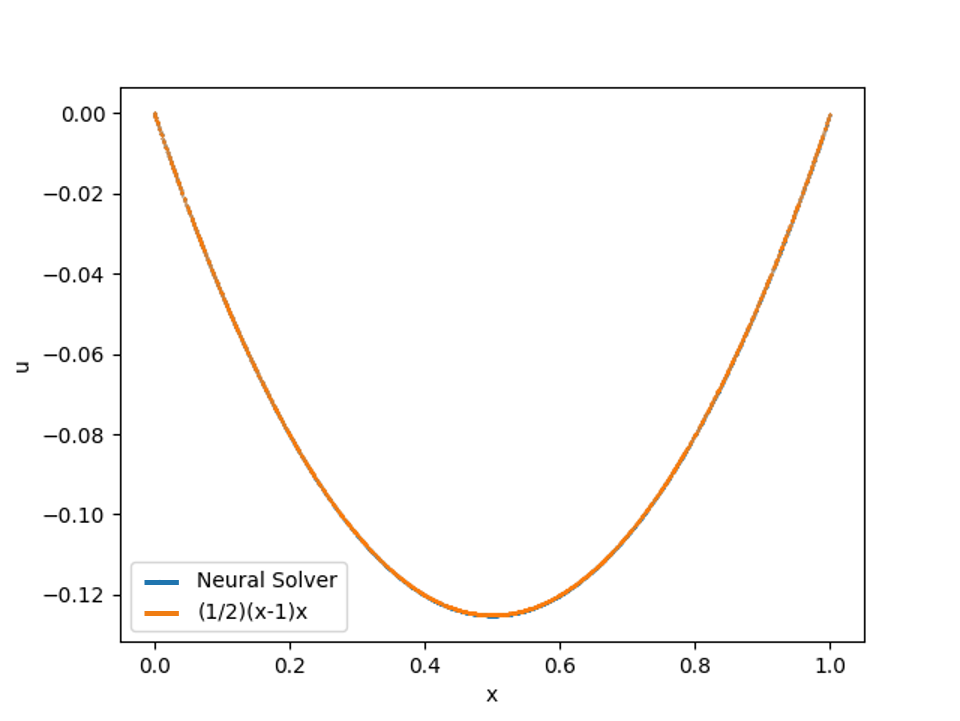
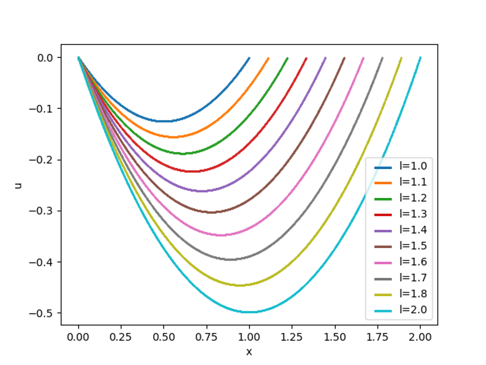
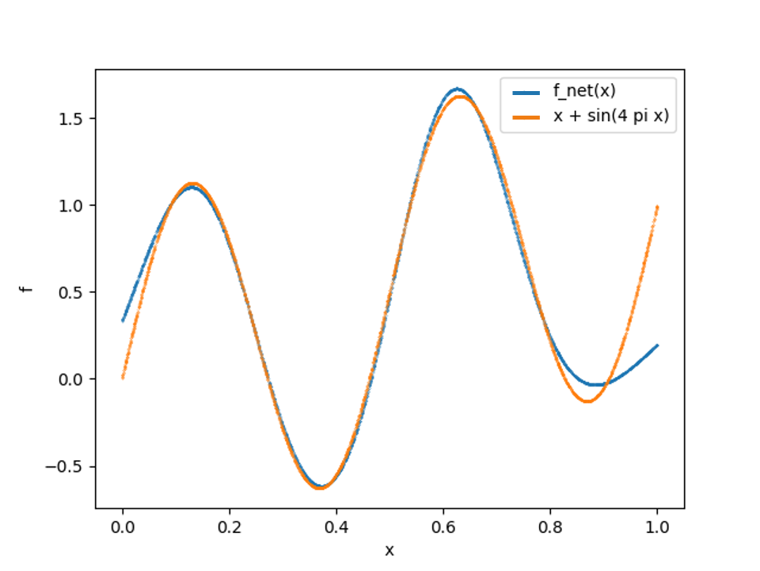
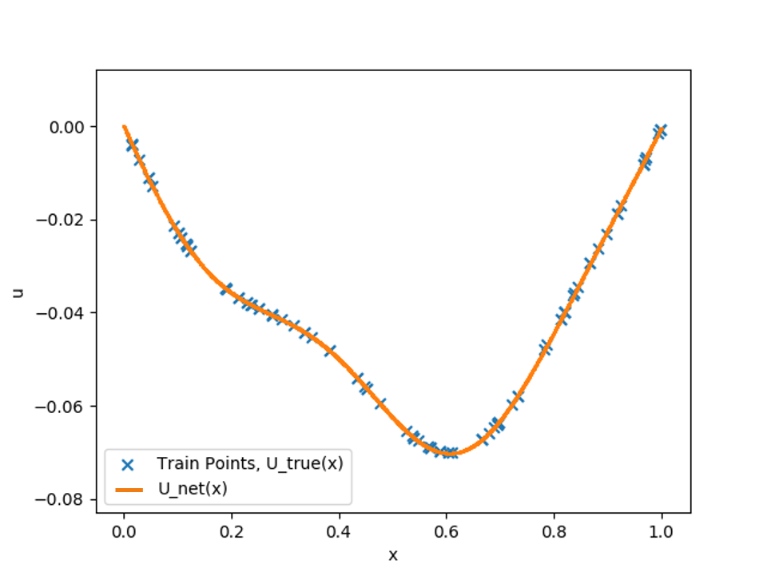

# Physics Informed Neural Networks in Modulus Sym

[公式ページ](https://docs.nvidia.com/deeplearning/modulus/modulus-sym/user_guide/theory/phys_informed.html#basic-methodology)

## Basic methodology

このセクションでは、ニューラルネットワークを使用して微分方程式を解く方法について簡単に紹介します。  
この方法では、ニューラルネットワークが微分方程式と境界条件をどれだけ満たしているかを評価する損失関数を構築して、このニューラルネットワークをトレーニングします。  
ネットワークがこの損失関数を最小化できれば、実質的に与えられた微分方程式を解くことができます。

次の問題を解いてみます。

$$
\mathbf{P} : \left\{\begin{matrix}
\frac{\delta^2 u}{\delta x^2}(x) = f(x)
\\\\
u(0) = u(1) = 0
\end{matrix}\right.
\tag{5}$$

まず、ニューラルネットワーク$u_{\text{net}}(x)$を構築します。  
このネットワークは単一の入力$x$を受取り、単一の出力$u_{\text{net}}(x)$を出力する。  
このニューラルネットワークは活性化関数が無限回微分可能な全結合深層ネットワークです。

次に、このニューラルネットワークをトレーニングするための損失関数を構築する必要があります。境界条件を簡単に損失として実装する方法は次の通りです：

$$
L_{BC} = u_{net}(0)^2 + u_{net}(1)^2
\tag{6}$$

方程式をエンコードするためには、$u_{\text{net}}$の微分を計算する必要があります。自動微分を使用することで、$\frac{\delta^2 u_{\text{net}}}{\delta x^2}(x)$を計算し、次の形式の損失関数を書くことができます：

$$
L_{residual} = \frac{1}{N}\sum^{N}_{i=0} \left( \frac{\delta^2 u_{net}}{\delta x^2}(x_i) - f(x_i) \right)^2
\tag{7}$$

ここで、$x_i$は内部でサンプリングされた点のバッチであり、$x_i \in (0, 1)$です。したがって、全体の損失は$L = L_{\text{BC}} + L_{\text{residual}}$となります。Adam[1](#ref1)などの最適化手法を使用して、このニューラルネットワークをトレーニングします。$f(x)=1$とすると、真の解は$\frac{1}{2}(x-1)x$です。問題を解くと、厳密な解とニューラルネットワークの解の間で良好な一致が得られます。

Modulus SymのPINNsを使用することで、複雑なジオメトリと複数の物理を持つ問題を解決することができました。これを実現するために、我々はいくつかの重要な方法で現在の最先端技術から逸脱し、改善を行ってきました。このセクションでは、これに関連するいくつかのトピックについて簡単に説明します。

### Monte Carlo integration for loss formulation
---

文献では、損失は通常、上記の[式7](#eq7)に類似した総和として定義されます[2](#ref2)。Modulus Symでは、異なるアプローチを取り、損失を積分として捉えます。代わりに、$L_{\text{residual}}$を次の形式で書くことができます。

$$
L_{residual} = \int^1_0 \left( \frac{\delta^2 u_{net}}{\delta x^2}(x) - f(x) \right)^2 dx
\tag{8}$$

今、この積分をどのように近似するかという問題があります。モンテカルロ積分を使用すれば、[式7](#eq7)での同じ総和に到達することが簡単にわかります。

$$
\int^1_0 \left( \frac{\delta^2 u_{net}}{\delta x^2}(x) - f(x) \right)^2 dx \approx (\int^1_0 dx) \frac{1}{N} \sum^{N}_{i=0} \left( \frac{\delta^2 u_{net}}{\delta x^2}(x_i) - f(x_i) \right)^2 = \frac{1}{N} \sum^{N}_{i=0} \left( \frac{\delta^2 u_{net}}{\delta x^2}(x_i) - f(x_i) \right)^2
\tag{9}$$

これは、$\int^1_0 dx = 1$であるため、まったく同じ総和に到達します。しかし、これにより、損失が領域に比例してスケーリングされます。これを利点と見なす理由は、領域ごとの損失を一貫して維持するためです。また、これによりより効率的な積分技術が可能になります。このユーザーガイドのいくつかの例では、積分損失をより効率的に近似するために、ドメインの特定の領域でより頻繁にサンプリングしています。

### Integral Equations
---

Many PDEs of interest have integral formulations. Take for example the
continuity equation for incompressible flow,

$$
\frac{\delta u}{\delta x} + \frac{\delta v}{\delta y} + \frac{\delta w}{\delta z} = 0
\tag{10}$$

これを積分形式で次のように書くことができます。

$$
\iint_{S} (n_xu + n_yv + n_zw) dS = 0
\tag{11}$$

ここで、$S$はドメイン内の任意の閉じた表面であり、$n_x, n_y, n_z$は法線です。この積分形式を使用して損失関数を構築し、次のようにモンテカルロ積分で近似することができます。

$$
L_{IC} = \left(\iint_{S} (n_xu + n_yv + n_zw) dS \right)^2 \approx \left((\iint_{S} dS) \frac{1}{N} \sum^N_{i=0} (n^i_xu_i + n^i_yv_i + n^i_zw_i)\right)^2
\tag{12}$$

興味深いPDEの多くは積分形式を持っています。たとえば、非圧縮流体の連続方程式を取り上げてみましょう。

## Parameterized Geometries
---

ニューラルネットワークソルバーの重要な利点の1つは、パラメータ化されたジオメトリを解決できる能力です（#sun2020surrogate）。この概念を説明するために、[式5](#eq5)のパラメータ化されたバージョンを解決します。この方程式の解が境界条件$u(l)=0$の位置を移動するにつれてどのように変化するかを知りたいとします。この位置を変数$l \in [1,2]$でパラメーター化し、我々の方程式は次の形になります。

$$
\mathbf{P} : \left\{\begin{matrix}
\frac{\delta^2 u}{\delta x^2}(x) = f(x), 
\\\\
u(0) = u(l) = 0,
\end{matrix}\right.
\tag{13}$$

このパラメータ化された問題を解決するために、ニューラルネットワークに$l$を入力として与えます。したがって、$u_{\text{net}}(x,l)$となります。その後、損失は次のようになります。

$$
L_{residual} = \int_1^2 \int_0^l \left( \frac{\delta^2 u_{net}}{\delta x^2}(x,l) - f(x) \right)^2 dx dl \approx \left(\int_1^2 \int^l_0 dxdl\right) \frac{1}{N} \sum^{N}_{i=0} \left(\frac{\delta^2 u_{net}}{\delta x^2}(x_i, l_i) - f(x_i)\right)^2
\tag{14}$$

$$
L_{BC} = \int_1^2 (u_{net}(0,l))^2 + (u_{net}(l,l) dl \approx \left(\int_1^2 dl\right) \frac{1}{N} \sum^{N}_{i=0} (u_{net}(0, l_i))^2 + (u_{net}(l_i, l_i))^2
\tag{15}$$

:numref:fig-every-parabolaでは、この損失に対してネットワークを最適化した後の、さまざまな$l$値に対する微分方程式の解が示されています。この例題は過度に単純化されていますが、パラメータ化されたジオメトリを解決する能力は、産業価値が非常に高いものです。単一のシミュレーションを実行する代わりに、複数の設計を同時に解決し、計算コストを削減することができます。このような例は、後述するユーザーガイドで示されます。

Fig. 11 Modulus Sym solving parameterized differential equation problem.

## Inverse Problems

ニューラルネットワークソルバーのもう1つの有用な応用は、逆問題の解決です。逆問題では、一連の観測値から始めて、それらの観測値を生成した原因を計算します。ニューラルネットワークソルバーを使用して逆問題を解決する方法を説明するために、[式5](#eq5)からソース項$f(x)$を逆にする例を示します。$0$から$1$の間の100個のランダムな点での解$u_{\text{true}}(x)$が与えられ、それが引き起こす$f(x)$を決定したいとします。これを行うために、$u(x)$と$f(x)$の両方を近似する2つのニューラルネットワーク$u_{\text{net}}(x)$と$f_{\text{net}}(x)$を作成します。これらのネットワークは、次の損失を最小化するように最適化されます。

$$
L_{residual} \approx \left(\int^1_0 dx\right) \frac{1}{N} \sum^{N}_{i=0} \left(\frac{\delta^2 u_{net}}{\delta x^2}(x_i, l_i) - f_{net}(x_i)\right)^2
\tag{16}$$

$$
L_{data} = \frac{1}{100} \sum^{100}_{i=0} (u_{net}(x_i) - u_{true}(x_i))^2
\tag{17}$$

関数$u_{\text{true}}(x)=\frac{1}{48} (8 x (-1 + x^2) - (3 \sin(4 \pi x))/\pi^2)$を使用すると、$f(x)$の解は$x + \sin(4 \pi x)$となります。この問題を解決し、結果を:numref:fig-inverse-parabola、:numref:fig-inverse-parabola-2で比較します。

Fig. 12 Comparison of true solution for and the function approximated by the NN.

Fig. 13 Comparison of $u_{net}(x)$ and train points from $u_{true}$.

## Weak solution of PDEs using PINNs
---

以前のPINNsに関する議論では、PDEの古典的な解を求めることを目指しました。しかし、一部の物理現象には古典的な（または強い）形式ではなく、変分的な（または弱い）形式しかありません[4](#ref4)。これには、界面問題、凹型領域、特異問題など、元の（古典的な）形式とは異なるアプローチでPDEを扱う必要があります。Modulus Symでは、PDEをその古典的な形式だけでなく、その弱い形式でも解くことができます。PINNsを使用してPDEの弱解を記述する理論を説明する前に、古典的、強い、および弱い解の定義から始めましょう。

Note :
後続のセクションで使用される異なる空間の数学的定義、例えば$L^p$、$C^k$、$W^{k,p}$、$H$などについての詳細は、:ref:appendixで見つけることができます。偏微分方程式と変分アプローチの一般的な理論については、[5](#ref5)、[6](#ref6)をお勧めします。

## Classical solution, Strong solution, Weak solution

このセクションでは、ディリクレ問題の古典的解、強解、および弱解を紹介します。以下のポアソン方程式を考えてみましょう。

$$
\left\{\begin{matrix}
\Delta u = f \quad \text{ in } \Omega
\\\\
u = 0 \quad \text{ on } \partial \Omega
\end{matrix}\right.
\tag{18}$$

**Definition (Classical Solution):**

[式18](#eq18)において、$f\in C(\overline{\Omega})$とします。このとき、[式18](#eq18)には$u\in C^2(\Omega)\cap C_0^1(\Omega)$という唯一の解が存在します。これを[式18](#eq18)の古典的解と呼びます。

**Definition (Strong Solution):**

[式18](#eq18)において、$f\in L^2(\Omega)$とします。このとき、[式18](#eq18)には$u\in H^2(\Omega)\cap H_0^1(\Omega)$という唯一の解が存在します。これを[式18](#eq18)の強解と呼びます。

強解とSobolev空間の定義から、[式18](#eq18)の解は実際には次の問題の解です。$u\in H^2(\Omega)\cap H_0^1(\Omega)$を探し、以下を満たすものを見つけることです。

$$
\int_{\Omega}(\Delta u + f)v dx = 0\qquad \forall v \in C_0^\infty(\Omega)
\tag{19}$$

積分部分を適用し、$u = 0$とすると、次の式を得ます。

$$
\int_{\Omega}\nabla u\cdot\nabla v dx = \int_{\Omega} fv dx
\tag{20}$$

これにより、次のように弱解の定義に至ります。

**Definition (Weak Solution):**

[式18](#eq18)において、$f\in L^2(\Omega)$とします。このとき、次の問題の唯一の解$u\in H_0^1(\Omega)$が存在します。$u\in H_0^1(\Omega)$を探し、以下を満たすものを見つけることです。

$$
\int_{\Omega} \nabla u \cdot\nabla v dx = \int_{\Omega}fv dx\qquad \forall v\in H_0^1(\Omega).
\tag{21}$$

この解を、[式18](#eq18)の弱解と呼びます。

より簡単な言葉で言えば、これら三種類の解の違いは次のように要約されます。

古典的解、強解、弱解の間の本質的な違いは、それらの正則性要件です。古典的解は、2次の連続微分を持つ解です。強解は、2次の弱微分を持ちますが、弱解は弱い1次の弱微分を持ちます。明らかに、古典的解は最も高い正則性要件を持ち、弱解は最も低い正則性要件を持ちます。

## PINNs for obtaining weak solution

PINNsを使用して、PDEを元の（古典的な）形式とは異なるアプローチで処理する方法について説明します。[7](#ref7),[8](#ref8)では、著者らがVPINNおよびhp-VPINN方法を導入し、PDEの積分形式を解く方法を紹介しています。この積分形式は、[式19](#eq19)に基づいています。したがって、これは古典的な解よりも優れた強解を解くものです。

PINNsの性能をさらに向上させるために、式:eq:weakに基づく方法を確立します。つまり、我々は弱解を解いています。[式18](#eq18)を解いていると仮定します。弱解を求めるためには、次の変分形式に焦点を当てることができます。

$$
\int_{\Omega}\nabla u\cdot\nabla v dx = \int_{\Omega} fv dx
\tag{22}$$

$$
u = 0 \quad\mbox{ on } \partial \Omega
\tag{23}$$

[式23](#eq23)に対して、それを従来のPINNsと同様に扱うことができます。ランダムな点${\mathbf{x_i}^b}_{i=1}^{N_b}\subset\partial\Omega$を取り、その境界損失は次のようになります。

$$
MSE_b = \frac{1}{N_b}\sum_{i=1}^{N_b}\left(u_{NN}(\mathbf{x_i}^b)-0\right)^2
\tag{24}$$

[式22](#eq22)に対して、$u: \Omega\mapsto\mathbb{R}$に対して、次のような重みを持つ積分点${\mathbf{x_i}^q,w_i^q}_{i=1}^{N_q}$の積分規則を選択します。

$$
\int_{\Omega} u dx \approx \sum_{i=1}^{N_q}w_i^q u(\mathbf{x_i}^q)
\tag{25}$$

一様ランダム点または準モンテカルロ点の場合、$i=1,\cdots, N_q$に対して$w_i^q=1/N_qとします。また、テスト関数のセット$v_j\in V_h, $j=1,\cdots, M`を選択し、積分の損失は以下のようになります。

$$
MSE_v = \left[\sum_{i=1}^{N_q}w_i^q\left(\nabla u(\mathbf{x_i}^q)\cdot\nabla v_j(\mathbf{x_i}^q)-f(\mathbf{x_i}^q)v_j(\mathbf{x_i}^q)\right)\right]^2
\tag{26}$$

その後、合計損失は以下のようになります。

$$
MSE=\lambda_v*MSE_v+\lambda_b*MSE_b
\tag{27}$$

ここで、$\lambda_v$と$\lambda_b$は各項の対応する重みです。

チュートリアルの例:ref:variational-exampleで見るように、このスキームは柔軟であり、界面とノイマン境界条件を簡単に処理することができます。また、不連続ガラーキン法を適用して異なる領域で複数のニューラルネットワークを使用することもできます。

## Reference

$$
\text{ref1 : Kingma, Diederik P., and Jimmy partial}
\\\
\text{"Adam: A method for stochastic optimization." arXiv preprint arXiv:1412.6980 (2014)}
\tag{ref1}$$

$$
\text{ref2 : Sun, Luning, et al}
\\\
\text{"Surrogate modeling for fluid flows based on physics-constrained deep learning without simulation data." Computer Methods in Applied Mechanics and Engineering 361 (2020): 112732}
\tag{ref2}$$

$$
\text{ref3 : Braess, Dietrich. Finite elements}
\\\
\text{Theory, fast solvers, and applications in solid mechanics. Cambridge University Press, 2007}
\tag{ref3}$$

$$
\text{ref4 : Gilbarg, David, and Neil S. Trudinger}
\\\
\text{Elliptic partial differential equations of second order. Vol. 224. springer, 2015}
\tag{ref4}$$

$$
\text{ref5 : Evans, Lawrence C}
\\\
\text{"Partial differential equations and Monge-Kantorovich mass transfer." Current developments in mathematics 1997.1 (1997): 65-126}
\tag{ref5}$$

$$
\text{ref6 : Kharazmi, Ehsan, Zhongqiang Zhang, and George Em Karniadakis}
\\\
\text{"Variational physics-informed neural networks for solving partial differential equations." arXiv preprint arXiv:1912.00873 (2019)}
\tag{ref6}$$

$$
\text{ref7 : Kharazmi, Ehsan, Zhongqiang Zhang, and George Em Karniadakis}
\\\
\text{"hp-VPINNs: Variational physics-informed neural networks with domain decomposition." Computer Methods in Applied Mechanics and Engineering 374 (2021): 113547.}
\tag{ref7}$$
