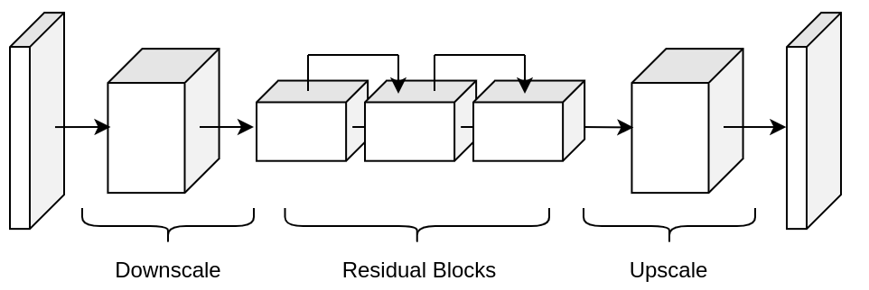

# Architectures In Modulus Sym

[公式ページ](https://docs.nvidia.com/deeplearning/modulus/modulus-sym/user_guide/theory/architectures.html)

このセクションでは、Modulus Symライブラリの一部となった、いくつかの高度で最先端のディープラーニングアーキテクチャとスキームについて議論します。

## Fourier Network

ニューラルネットワークは一般的に低周波の解に偏っており、「スペクトルバイアス」として知られる現象です[1](#ref1)。これは、トレーニングの収束やモデルの精度に悪影響を与える可能性があります。この問題を緩和するアプローチの1つは、入力エンコーディングを行うことです。つまり、入力を高次元の特徴空間に変換することです。これには高周波関数を使います[1](#ref1),[2](#ref2),[3](#ref3)。これは、フーリエネットワークを使用してModulus Symで行われ、次のような形式を取ります。

$$
u_{net}(\mathbf{x};\mathbf{\theta}) = \mathbf{W}_n \big \{\phi_{n-1} \circ \phi_{n-2} \circ \cdots \circ \phi_1 \circ \phi_E \big \} (\mathbf{x}) + \mathbf{b}_n,  \; \; \; \; \phi_{i}(\mathbf{x}_i) = \sigma \left( \mathbf{W}_i \mathbf{x}_i + \mathbf{b}_i \right)
\tag{28}$$

ここで、$u_{net}(\mathbf{x};\mathbf{\theta})$は近似解、$\mathbf{x} \in \mathbb{R}^{d_0}$はネットワークへの入力、$\phi_{i} \in \mathbb{R}^{d_i}$はネットワークの$i$番目の層、$\mathbf{W}i \in \mathbb{R}^{d_i \times d{i-1}}, \mathbf{b}_i \in \mathbb{R}^{d_i}$は$i$番目の層の重みとバイアスです。$\mathbf{\theta}$はネットワークの学習可能なパラメータのセットを表し、つまり、$\mathbf{\theta} = {\mathbf{W}_1, \mathbf{b}_1, \cdots, \mathbf{b}_n, \mathbf{W}_n}$、$n$は層の数を示します。また、$\sigma$は活性化関数です。$\phi_E$は入力エンコーディング層であり、これを恒等関数に設定することで、標準のフィードフォワード完全接続アーキテクチャに到達します。Modulus Symの入力エンコーディング層は、学習可能なエンコーディングを持つ[3](#ref3)で提案されたものの変形であり、次のような形を取ります。

$$
\phi_E = \big[ \sin \left( 2\pi \mathbf{f} \times \mathbf{x} \right); \cos \left( 2\pi \mathbf{f} \times 
\mathbf{x} \right) \big]^T,
\tag{29}$$

ここで、$\mathbf{f} \in \mathbb{R}^{n_f \times d_0}$は学習可能な周波数行列であり、$n_f$は周波数セットの数です。

パラメータ化された例の場合、空間入力に加えてパラメータにエンコードを適用することも可能です。実際、空間入力に加えてパラメータ入力にエンコードを適用すると、モデルの精度とトレーニングの収束性が向上することが観察されています。Modulus Symは、空間およびパラメトリック入力に入力エンコーディングを完全に分離された設定で適用し、その後、空間/時間およびパラメトリックフーリエ特徴を結合します。フーリエネットの使用方法の詳細は、[Modulus Sym Configuration](https://docs.nvidia.com/deeplearning/modulus/modulus-sym/user_guide/features/configuration.html#config)で見つけることができます。FPGAヒートシンクへの適用に関するチュートリアルは、[FPGA Heat Sink with Laminar Flow](https://docs.nvidia.com/deeplearning/modulus/modulus-sym/user_guide/advanced/fpga.html#fpga)で見ることができます。

## Modified Fourier Network

フーリエネットワークでは、フーリエ特徴とモデルの出力の間の非線形マッピングとして、標準の完全接続型ニューラルネットワークが使用されます。修正されたフーリエネットワークでは、[4](#ref4)で提案されたものに類似した完全接続型ネットワークの変形が使用されます。フーリエ特徴を別の学習済みの特徴空間に射影するために、2つの変換層が導入され、それらは要素ごとの乗算を介して隠れ層を更新するために使用されます。これは、[4](#ref4)の標準的な完全接続型相当物と類似しています。これにより、トレーニング収束と精度が向上することが[FPGA Heat Sink with Laminar Flow](https://docs.nvidia.com/deeplearning/modulus/modulus-sym/user_guide/advanced/fpga.html#fpga)で示されていますが、イテレーションごとのトレーニング時間がわずかに増加するというコストがかかります。このアーキテクチャの隠れ層は、次のような形を取ります。

$$
\phi_{i}(\mathbf{x}_i) = \left(1 - \sigma \left( \mathbf{W}_i \mathbf{x}_i + \mathbf{b}_i \right) \right) \odot \sigma \left( \mathbf{W}_{T_1} \phi_E + \mathbf{b}_{T_1} \right) + \sigma \left( \mathbf{W}_i \mathbf{x}_i + \mathbf{b}_i \right) \odot \sigma \left( \mathbf{W}_{T_2} \phi_E + \mathbf{b}_{T_2} \right),
\tag{30}$$

ここで、$i>1$であり、${ \mathbf{W}{T_1}, \mathbf{b}{T_1}}, { \mathbf{W}{T_2}, \mathbf{b}{T_2}}$は2つの変換層のパラメータであり、$\phi_E$は等[式29](#eq29)で定義される形を取ります。修正されたフーリエネットワークの使用方法の詳細は、[Modulus Sym Configuration](https://docs.nvidia.com/deeplearning/modulus/modulus-sym/user_guide/features/configuration.html#config)で見つけることができます。FPGAヒートシンクへの適用に関するチュートリアルは、[FPGA Heat Sink with Laminar Flow](https://docs.nvidia.com/deeplearning/modulus/modulus-sym/user_guide/advanced/fpga.html#fpga)で見ることができます。

## Highway Fourier Network

Highway Fourier networkは、[5](#ref5)で提案されたハイウェイネットワークに着想を得た、FourierネットワークのModulus Symのバリエーションです。ハイウェイネットワークは、情報の流れを制御する適応的なゲートユニットで構成されており、非常に深いネットワークのトレーニングに使用するために開発されました。このネットワークの隠れ層は以下のような形を取ります。

$$
\phi_{i}(\mathbf{x}_i) = \sigma \left( \mathbf{W}_i \mathbf{x}_i + \mathbf{b}_i \right) \odot \sigma_s \left( \mathbf{W}_{T} \phi_E + \mathbf{b}_{T} \right) + \left( \mathbf{W}_P \mathbf{x} + \mathbf{b}_P \right) \odot \left (1 - \sigma_s \left( \mathbf{W}_{T} \phi_E + \mathbf{b}_{T} \right) \right).
\tag{31}$$

ここで、$\sigma_s$はシグモイド活性化関数であり、{${ \mathbf{W_T}, \mathbf{b_T}}$}は変換層のパラメータであり、{${ \mathbf{W_P}, \mathbf{b_P}}$}はプロジェクタ層のパラメータです。プロジェクタ層は、基本的にはネットワークの入力を別の空間に射影し、隠れ層の次元と一致させます。ここでの変換層は、ネットワークの隠れ状態とネットワークの入力の相対的な寄与を隠れ層の出力に制御します。また、ネットワークの入力と隠れ状態の間での乗算相互作用メカニズムを提供します。これは、修正されたFourierネットワークと類似しています。Highway Fourierネットワークの使用方法の詳細は、[Modulus Sym](https://docs.nvidia.com/deeplearning/modulus/modulus-sym/user_guide/features/configuration.html#config) で見つけることができます。FPGAヒートシンクへの適用に関するチュートリアルは、[FPGA Heat Sink with Laminar Flow](https://docs.nvidia.com/deeplearning/modulus/modulus-sym/user_guide/advanced/fpga.html#fpga)で見ることができます。

## Multi-scale Fourier Feature Network

[9](#ref9)では、Wangらは、多尺度の振る舞いを示す偏微分方程式に対処するためのマルチスケールフーリエ特徴ネットワークアーキテクチャを提案しました。提案されたアーキテクチャのキーは、入力座標に異なる周波数で初期化された複数のフーリエ特徴埋め込みを適用し、これらの埋め込まれた入力を同じ完全に接続されたニューラルネットワークを通過させ、最後に線形層で出力を連結することです。マルチスケールフーリエ特徴ネットワークのフォワードパスは以下のようになります。

$$
\begin{aligned}
&\phi_{E}^{(i)}(\mathbf{x})=[\sin (2 \pi \mathbf{f}^{(i)} \times \mathbf{x}) ; \cos (2 \pi \mathbf{f}^{(i)} \times \mathbf{x})]^{T},  \quad \text{ for } i=1, 2, \dots, M\\
&\mathbf{H}^{(i)}_1 = \sigma(\mathbf{W}_1 \cdot\phi_{E}^{(i)}(\mathbf{x})  + \mathbf{b}_1),  \quad \text{ for } i=1, 2, \dots, M \\
& \mathbf{H}^{(i)}_\ell = \sigma(\mathbf{W}_\ell \cdot \mathbf{H}^{(i)}_{\ell - 1}  + \mathbf{b}_\ell),  \quad \text{ for } \ell=2,  \dots, L,  i=1, 2, \dots, M\\
& \mathbf{u}_{net}(\mathbf{x}, {\mathbf{\theta}}) = \mathbf{W}_{L+1} \cdot \left[  \mathbf{H}^{(1)}_L,  \mathbf{H}^{(2)}_L, \dots,   \mathbf{H}^{(M)}_L  \right] + \mathbf{b}_{L+1},\end{aligned}
\tag{32}$$

ここで、$\phi_{E}^{(i)}$と$\sigma$はそれぞれフーリエ特徴マッピングと活性化関数を示し、$\mathbf{f}^{(i)} \in \mathbb{R}^{m \times d}$内の各エントリはガウス分布$\mathcal{N}(0, \sigma_i)$からサンプリングされます。このアーキテクチャの重みとバイアスは、基本的には標準の完全接続型ニューラルネットワークと同じですが、訓練可能なフーリエ特徴が追加されています。ここで、$\sigma_i$の選択は問題に依存し、典型的な値は$1, 10, 100$などです。

## Spatio-temporal Fourier Feature Network

時間依存性の問題では、多尺度の振る舞いが空間方向だけでなく時間方向でも存在する可能性があります。著者らは、時空間領域における多尺度の問題に対処するために、別の新しい多尺度フーリエ特徴アーキテクチャを提案しました[9](#ref9)。具体的には、ネットワークのフィードフォワードパスは以下のように定義されます。

$$
\begin{aligned}
&\phi_{E}^{(x_i)}(x_i)=[\sin (2 \pi \mathbf{f}^{(x_i)} \times x_i) ; \cos (2 \pi \mathbf{f}^{(x_i)} \times \mathbf{x}_i)]^{T}, \\
& \phi_{E}^{(t)}(t)=[\sin (2 \pi \mathbf{f}^{(t)} \times t) ; \cos (2 \pi \mathbf{f}^{(t)} \times x_i)]^{T}, \\ 
& \mathbf{H}^{(x_i)}_1 = \sigma(\mathbf{W}_1 \cdot \phi_{E}^{(x_i)}(x_i) + \mathbf{b}_1),
\quad \text{ for } i=1, 2, \dots, d,\\
& \mathbf{H}^{(t)}_1 = \sigma(\mathbf{W}_1 \cdot \phi_{E}^{(t)}(t) + \mathbf{b}_1),\\
& \mathbf{H}_{\ell}^{(x_i)} = \sigma(\mathbf{W}_\ell \cdot \mathbf{H}^{(x_i)}_{\ell-1}  + \mathbf{b}_\ell),  \quad \text{ for } \ell=2,  \dots, L \text{ and } i=1,2, \dots, d,\\
& \mathbf{H}^{(t)}_{\ell} = \sigma(\mathbf{W}_\ell \cdot \mathbf{H}^{(t)}_{\ell-1}  + \mathbf{b}_\ell),  \quad \text{ for } \ell=2,  \dots, L, \\
&    \mathbf{H}_{L} =  \prod_{i=1}^d H^{(x_i)}_{L} \cdot H^{(t)}_{L}  , \\
& \mathbf{u}_{net}(\mathbf{x}, t; {\mathbf{\theta}}) = \mathbf{W}_{L+1} \cdot \mathbf{H}_{L} + \mathbf{b}_{L+1},\end{aligned}
\tag{33}$$

ここで、$\phi_{E}^{(x_i)}$と$\phi_{E}^{(t)}$はそれぞれ空間と時間のフーリエ特徴マッピングを示し、$\odot$は要素ごとの乗算を表します。ここで、$\mathbf{f}^{(x_i)}$と$\mathbf{f}^{(t)}$の各要素は異なるガウス分布からサンプリングされる可能性があります。多尺度フーリエ特徴ネットワークとの主な違いの1つは、空間および時間の入力座標に個別のフーリエ特徴埋め込みが適用され、埋め込まれた入力が同じ完全に接続されたネットワークを通過する前にそれぞれが別々に処理されることです。もう1つの主な違いは、ネットワークの出力が要素ごとの乗算を使用して統合され、それらが線形層を通過することです。

## Sinusoidal Representation Networks (SiReNs)

[6](#ref6)では、著者らはSinアクティベーション関数を使用したニューラルネットワークを提案しており、これを正弦表現ネットワークまたはSiReNsと呼んでいます。このネットワークは、上記のフーリエネットワークと類似しています。なぜなら、Sinアクティベーション関数を使用することは、ネットワークの最初の層の入力エンコーディングと同じ効果があるからです。  
このネットワークアーキテクチャの重要な要素の1つは、初期化スキームです。ネットワークの重み行列は、一様分布
$W \sim U(-\sqrt{\frac{6}{\text{fan_in}}},\sqrt{\frac{6}{\text{fan_in}}})$
から抽出されます。  
ここで、
$\text{fan_in}$
はその層への入力サイズです。  
各Sinアクティベーションの入力はガウス正規分布を持ち、各Sinアクティベーションの出力はarcSin分布です。これにより、アクティベーションの分布が保存され、深いアーキテクチャを効果的に構築およびトレーニングできます。ネットワークの最初の層は、Sin関数の複数の周期にわたるように因数$\omega$でスケーリングされます。これは実証的に良い性能を示し、フーリエネットワークの入力エンコーディングの利点と一致しています。著者らは、$\omega=30$が多くの状況でうまく機能すると提案しており、これはModulus Symでもデフォルト値として与えられています。Modulus SymでSiReNアーキテクチャを使用する方法の詳細は、[Modulus Sym Configuration](https://docs.nvidia.com/deeplearning/modulus/modulus-sym/user_guide/features/configuration.html#config)に記載されています。

## DGM Architecture

DGM（Deep Galerkin Method）アーキテクチャは、[7](#ref7) で提案され、いくつかの完全に接続された層で構成されています。各層には、LSTMアーキテクチャに類似したサブレイヤーが含まれています。

$$
\begin{split}
&S^1 = \sigma(XW^1 + b^1),\\
&Z^\ell = \sigma(XV_z^{\ell} + S^{\ell}W_z^{\ell} + b_z^{\ell}), \>\>\>\> \forall \ell \in \{1,\cdots,n_{\ell}\},\\
&G^\ell = \sigma(XV_g^{\ell} + S^{\ell}W_g^{\ell} + b_g^{\ell}), \>\>\>\> \forall \ell \in \{1,\cdots,n_{\ell}\},\\
&R^\ell = \sigma(XV_r^{\ell} + S^{\ell}W_r^{\ell} + b_r^{\ell}), \>\>\>\> \forall \ell \in \{1,\cdots,n_{\ell}\},\\
&H^\ell = \sigma(XV_h^{\ell} + (S^\ell \odot R^\ell)^{\ell}W_h^{\ell} + b_h^{\ell}), \>\>\>\> \forall \ell \in \{1,\cdots,n_{\ell}\},\\
&S^{\ell+1} = (1-G^\ell) \odot H^\ell + Z^\ell \odot S^\ell,\\
&u_{net}(X;\theta) = S^{n_\ell+1}W + b.
\end{split}
\tag{34}$$

DGMネットワークのパラメータセットには、

$$
\theta = \{W^1,b^1,\left(V_z^{\ell},W_z^{\ell},b_z^{\ell}\right)_{\ell=1}^{n_\ell}, \left(V_g^{\ell},W_g^{\ell},b_g^{\ell}\right)_{\ell=1}^{n_\ell}, \left(V_r^{\ell},W_r^{\ell},b_r^{\ell}\right)_{\ell=1}^{n_\ell}, \left(V_h^{\ell},W_h^{\ell},b_h^{\ell}\right)_{\ell=1}^{n_\ell},W,b\}.
\tag{35}$$

ここで、$X$ はネットワークへの入力、$\sigma(\cdot)$ は活性化関数、$n_\ell$ は隠れ層の数、$\odot$ はアダマール積を表し、$u_{\text{net}}(X;\theta)$ はネットワークの出力です。このアーキテクチャの重要な特徴の1つは、入力の非線形変換の複数の要素ごとの積から構成されていることであり、これは複雑な関数の学習に役立つ可能性があることです [7](#ref7)。このアーキテクチャの応用例として、FPGAヒートシンクのチュートリアルが [FPGA Heat Sink with Laminar Flow](https://docs.nvidia.com/deeplearning/modulus/modulus-sym/user_guide/advanced/fpga.html#fpga) にあります。

## Multiplicative Filter Network

乗法フィルターネットワーク [8](#ref8) は、入力のフーリエまたはガボールフィルターの線形または非線形変換で構成され、各隠れ層で乗算されます。

$$
\begin{split}
&\mathbf{\phi}_1 = f(\mathbf{x}, \mathbf{\xi}_1),\\
&\mathbf{\phi}_{i+1} = \sigma \left( \mathbf{W}_i \mathbf{\phi}_i + \mathbf{b}_i \right) \odot f(\mathbf{x}, \mathbf{\xi}_{i+1}), \>\>\>\> \forall i \in \{1,\cdots,n-1\},\\
&u_{net}(\mathbf{x};\mathbf{\theta}) = \mathbf{W}_n \mathbf{\phi}_n + \mathbf{b}_n.
\end{split}
\tag{36}$$

ここで、$f(\mathbf{x}, \mathbf{\xi}_{i})$ は乗法的なフーリエまたはガボールフィルターです。乗法フィルターネットワークのパラメータセットは $\theta = {\mathbf{W}_1, \mathbf{b}_1, \mathbf{\xi}_1, \cdots \mathbf{W}_n, \mathbf{b}_n, \mathbf{\xi}_n }$ です。[8](#ref8)での元の実装では、活性化関数は使用されず、ネットワークの非線形性は乗法フィルターのみから来ます。この設定では、乗法フィルターネットワークの出力はフーリエまたはガボール基底の線形組み合わせとして表現できることが示されています。Modulus Symでは、ユーザーが活性化関数の使用を選択できます。フーリエフィルターは次のような形式を取ります：

$$
f(\mathbf{x}, \mathbf{\xi}_{i}) = \sin(\mathbf{\omega}_i \mathbf{x} + \mathbf{\phi}_i)
\tag{37}$$

ここで、$\mathbf{\xi}_i = {\mathbf{\omega}_i, \mathbf{\phi}_i}$ です。
ガボールフィルターも次の形式を取ります：

$$
f(\mathbf{x}, \mathbf{\xi}_{i}) = \exp \left( - \frac{\mathbf{\gamma}_i}{2} ||\mathbf{x}-\mathbf{\mu}_i||_2^2 \right) \sin(\mathbf{\omega}_i \mathbf{x} + \mathbf{\phi}_i),
\tag{38}$$

ここで、$\mathbf{\xi}_i = {\mathbf{\gamma}_i, \mathbf{\mu}_i, \mathbf{\omega}_i, \mathbf{\phi}_i}$ です。
乗法フィルターネットワークおよびネットワークの初期化の詳細については、参照してください。
乗法フィルターネットワークの使用方法の詳細については、[Modulus Sym Configuration](https://docs.nvidia.com/deeplearning/modulus/modulus-sym/user_guide/features/configuration.html#config)を参照してください。

## Fourier Neural Operator

フーリエニューラルオペレーター（FNO）は、PDEの解の分布をパラメータ化するために使用できるデータ駆動型のアーキテクチャです [10](#ref10)。FNOの主要な特徴は、スペクトル畳み込みです：積分カーネルをフーリエ空間に配置する操作です。スペクトル畳み込み（フーリエ積分演算子）は以下のように定義されます：

$$
(\mathcal{K}(\mathbf{w})\phi)(x) = \mathcal{F}^{-1}(R_{\mathbf{W}}\cdot \left(\mathcal{F}\right)\phi)(x), \quad \forall x \in D
$\tag{39}$$

ここで、$\mathcal{F}$ および $\mathcal{F}^{-1}$ はそれぞれ正規と逆正規のフーリエ変換を表します。$R_{\mathbf{w}}$ は学習可能なパラメータ $\mathbf{w}$ を含む変換です。この演算子は、$n$ 個のポイントで離散化された「構造化されたユークリッド」ドメイン $D$ 全体で計算されます。高速フーリエ変換（FFT）が使用され、フーリエ変換を効率的に実行し、結果として得られる変換 $R_{\mathbf{w}}$ は、学習可能な重みの有限サイズの行列です。スペクトル畳み込み内部では、フーリエ係数が下位モードのみに切り捨てられるため、スペクトル空間の次元を明示的に制御し、線形演算子を行うことができます。

FNOモデルは、完全に接続された "リフティング" レイヤー、$L$ スペクトル畳み込み、ポイントごとの線形スキップ接続、そして最後にポイントごとの完全に接続されたニューラルネットワークのデコーディングで構成されます。

$$
u_{net}(\Phi;\theta) = \mathcal{Q}\circ \sigma(W_{L} + \mathcal{K}_{L}) \circ ... \circ \sigma(W_{1} + \mathcal{K}_{1})\circ \mathcal{P}(\Phi), \quad \Phi=\left\{\phi(x); \forall x \in D\right\}
\tag{40}$$

ここで、$\sigma(W_{i} + \mathcal{K}{i})$ は、ポイントごとの線形変換 $W{i}$ と活性化関数 $\sigma(\cdot)$ を持つスペクトル畳み込みレイヤー $i$ です。
$\mathcal{P}$ は、入力をより高次元の潜在空間に射影するポイントごとのリフティングネットワークであり、$\mathcal{P}: \mathbb{R}^{d_{\text{in}} \times n} \rightarrow \mathbb{R}^{k}$ です。
同様に、$\mathcal{Q}$ は、ポイントごとの完全接続デコーディングネットワークであり、$\mathcal{Q}: \mathbb{R}^{k} \rightarrow \mathbb{R}^{d_{\text{out}} \times n}$ です。
FNOのすべての完全接続コンポーネントがポイントごとの操作であるため、モデルは入力の次元に対して不変です。
FNOとそのModulus Symでの実装に関する追加情報は、例:ref:darcy_fnoで見つけることができます。

Note :
FNOは技術的には、離散化された領域 $D$ の次元に対して不変ですが、**この領域はユークリッド空間の構造化されたグリッドでなければなりません**。FNOへの入力は画像に類似していますが、モデルは画像の解像度に対して不変です。

## Adaptive Fourier Neural Operator

アダプティブフーリエニューラルオペレーター（AFNO）[11](#ref11)のアーキテクチャは、高解像度の入力に対して非常に効果的で計算効率が高いです。これは、PDEシステムをモデリングするための重要な最近の進歩であるフーリエニューラルオペレーター（FNO）と、画像処理のためのパワフルなビジョントランスフォーマ（ViT）モデルを組み合わせています。FNOは、ナビエストークス流などのPDEシステムのモデリングで素晴らしい結果を示しています。ViTおよび関連する変種のトランスフォーマモデルは、画像処理タスクでのSOTAパフォーマンスを達成しています。ViTの多頭自己注意（MHSA）メカニズムは、その印象的なパフォーマンスの鍵です。自己注意メカニズムは、ニューラルネットワークの各層で長距離相互作用をモデル化しますが、これはほとんどの畳み込みニューラルネットワークには存在しない特徴です。ViTの自己注意アーキテクチャの欠点は、トークンシーケンスの長さの2次関数としてスケーリングするため、入力画像の解像度とともに2次的にスケーリングすることです。AFNOは、ViTのスケーリングの複雑さに対する解決策を提供します。AFNOモデルは、フーリエドメインでのトークンの混合操作を実装しています。混合操作の計算量は、バニラのViTアーキテクチャの $\mathcal{O}({N_{token}^2})$ の計算量とは対照的に、$\mathcal{O}(N_{token}\log N_{token})$ です。

アーキテクチャの最初のステップでは、入力画像を $h \times w$ 個のサイズ $p\times p$ の等しい大きさのパッチに分割します。パラメータ $p$ はパッチサイズと呼ばれます。単純化のため、単一チャネルの画像を考えます。各パッチはサイズ $d$ のトークンに埋め込まれます。パッチ埋め込み操作により、サイズ $h \times w \times d$ のトークンテンソル（$X_{h\times w \times d}$）が生成されます。パッチサイズと埋め込み次元はユーザーが選択するパラメータです。小さなパッチサイズは、モデルが細かいスケールの詳細をよりよく捉えることを可能にしますが、モデルのトレーニングの計算コストが増加します。埋め込み次元が高いほど、モデルのパラメータ数も増加します。トークンテンソルは、空間的およびチャンネルの混合を行う複数のトランスフォーマーアーキテクチャの層で処理されます。AFNOアーキテクチャでは、各層で以下の操作が実装されます。

最初に、トークンテンソルをフーリエ領域に変換します。

$$
z_{m,n} = [\mathrm{DFT}(X)]_{m,n}
\tag{41}$$

ここで、$m,n$ はパッチの位置のインデックスであり、DFTは2次元離散フーリエ変換を示します。その後、モデルはフーリエ領域でのトークンの重み付けを適用し、ソフトスレッショルディングと収縮操作によって疎さを促進します。

$$
\tilde{z}_{m,n} = S_{\lambda} ( \mathrm{MLP}(z_{m,n})),
\tag{42}$$

ここで、$S_{\lambda}(x) = \mathrm{sign}(x) \max(|x| - \lambda, 0)$ であり、ここで $\lambda$ は疎さを制御するパラメータです。また、$\mathrm{MLP(\cdot)}$ は、全てのパッチに共有されるブロック対角の重み行列を持つ2層のパーセプトロンです。ブロック対角のMLP重み行列のブロック数は、適切に調整されるべきユーザーが選択するハイパーパラメータです。

ANFOレイヤー内の最後の操作は、パッチ領域に戻るための逆フーリエ変換を行い、残差接続を追加することです。

$$
y_{m,n} = [\mathrm{IDFT}(\tilde{Z})]_{m,n} + X_{m,n}
\tag{43}$$

すべてのトランスフォーマーレイヤーの最後に、線形デコーダーが特徴テンソルを画像空間に変換します。

AFNOの精度と計算コストに影響を与えるいくつかの重要なハイパーパラメータがあります。実証的には、手元のタスクを念頭に置きながら調整すべき最も重要なハイパーパラメータは、層の数、パッチサイズ、埋め込み次元、およびブロックの数です。AFNOおよびそのModulus Symでの実装に関する追加情報は、[Darcy Flow with Adaptive Fourier Neural Operator](https://docs.nvidia.com/deeplearning/modulus/modulus-sym/user_guide/neural_operators/darcy_afno.html#darcy-afno)で確認できます。

## Physics Informed Neural Operator

物理情報付きニューラルオペレーター（PINO）は、[12](#ref12)で紹介されました。PINOのアプローチは、PDEを用いる計算モデルのサロゲート化を目的とした、[フーリエニューラルオペレーター](https://docs.nvidia.com/deeplearning/modulus/modulus-sym/user_guide/theory/architectures.html#fourier-neural-operator)によるデータ指向の教師あり学習フレームワークと物理情報付き学習フレームワークを効果的に組み合わせます。

PINOは、フーリエニューラルオペレーターにPDE損失 $\mathcal{L}_{pde}$ を組み込んでいます。これにより、サロゲートモデルを訓練するために必要なデータ量を削減することが可能です。  
なぜなら、PDE損失が解の空間を制約するからです。PDE損失は、サロゲートMLモデルによって計算された解に物理的制約を強制し、検証可能で正確かつ解釈可能なMLサロゲートモデリングツールとして魅力的なオプションとなります。  

ここでは、単純化のために、静的なPDEシステムを考えますが、PINOメソッドは動的システムにも適用できます。[12](#ref12)で使用されている表記に従って、次のように表されるPDEを考えます。

$$
\mathcal{P}(u, a) = 0 , \text{ in } D \subset \mathbb{R}^d
\tag{44}$$

$$
u = g ,  \text{ in } \partial D.
\tag{45}$$

ここで、$\mathcal{P}$ は偏微分演算子、$a$ は係数/パラメータ、$u$ はPDEの解です。

FNOフレームワークでは、サロゲートMLモデルは解演算子 $\mathcal{G}^\dagger_{\theta}$ によって与えられ、これは係数空間 $a$ 内の任意の係数を解 $u$ にマッピングします。  
FNOは、入力/出力のペア $\lbrace a_j, u_j \rbrace_{j = 1}^N$ の形式のトレーニングデータを用いて、教師あり学習で訓練されます。  
FNOのトレーニング損失は、すべてのトレーニングペア $\lbrace a_i, u_i, \rbrace_{i=1}^N$ にわたってデータ損失を合計したものであり、$\mathcal{L}{data}(\mathcal{G}\theta) = \lVert u - \mathcal{G}_\theta(a) \rVert^2$ となります。

PINOフレームワークでは、解演算子は、パラメータ/係数空間内の適切なサポートされた分布からの i.i.d. サンプル $a_j$ 上で計算される追加のPDE損失 $\mathcal{L}{pde}(a, \mathcal{G}{\theta}(a))$ によって最適化されます。

一般に、PDE損失にはPDE演算子の計算が含まれ、これにはフーリエニューラルオペレーターのアンサッツの偏微分の計算が含まれます。  
一般に、これは自明ではありません。PINOの主要な革新のセットは、演算子アンサッツの偏微分を計算するさまざまな方法です。PINOフレームワークは、4つの異なる方法で微分を実装しています。

・有限差分法（FDM）を使用した数値微分

・スペクトル微分によって計算された数値微分

・一次の"正確"な微分と二次のFDM微分の組み合わせに基づくハイブリッド微分

## DeepONet

ディープオペレーターネットワーク（DeepONet）は、無限次元の関数空間間の演算子を学習することを目的としたネットワークアーキテクチャで、[文献13](#ref13)ではじめて紹介されました。  
その後、PINNsに基づいたネットワークが[文献14](#ref14)で提案され、DeepONetモデルの出力を物理的な一貫性を確保する方向にバイアスをかける効果的な正則化メカニズムが導入されました。

演算子 $G$ が以下のように定義されていると仮定します。

$$
G:\quad u\mapsto G(u)
\tag{46}$$

ここで、$u$ と $G(u)$ は2つの関数です。$G(u)$ の定義域の変数を $y$ で示します。

[文献13](#ref13)に示されているように、DeepONetは、ブランチネットとトランクネットとして参照される2つのサブネットワークで構成されています。  

ブランチネットは $u$ を入力として受け取り、次元数 $q$ の特徴埋め込みを出力します。  
ここで、$u=[u(x_1), u(x_2), \dots, u(x_m)]$ は固定されたセンサー ${x_i}_i^m$ で評価された関数 $u$ を表します。  

トランクネットは座標 $y$ を入力として受け取り、同様に次元数 $q$ の特徴埋め込みを出力します。  

DeepONetの最終出力は、ブランチネットとトランクネットの出力をドット積を用いて結合することで得られます。DeepONetは、すべてのトレーニング入出力項 $\lbrace u_i, y_i, G(u_i)(y_i) \rbrace_{i=1}^N$ に対して、損失$\mathcal{L}_{data}(\mathcal{G}_\theta) = \lVert \mathcal{G}_\theta(u)(y) - \mathcal{G}(u)(y) \rVert^2$を最小化することで教師あり学習で訓練されます。

さらに、PINNs-DeepONetは、PDE損失によっても訓練されます。

$$
\mathcal{L}_{pde}(\mathcal{G}_\theta) = \lVert  \mathcal{N}[\mathcal{G}_\theta(u)](y) \rVert^2
\tag{47}$$

ここで $\mathcal{N}$ は、基礎となる物理法則の支配する偏微分方程式を示す微分演算子です。

また、ブランチネットとトランクネットのアーキテクチャを選択する柔軟性がユーザーに与えられることを言及する価値があります。  
例えば、CNNはブランチネットの主軸として使用され、高次元データから特徴を抽出します。  
これは、完全連結ニューラルネットワークよりも効率的であると[13](#ref13)で述べられています。

## Pix2Pix Net

Modulus Sym内のPix2Pixネットワークは、pix2pix[15](#ref15) およびpix2pixHD[16](#ref16)の生成モデルに基づく畳み込みエンコーダーデコーダーです。Modulus Sym内の実装は、これらのモデルの簡略化されたバージョンであり、構造化されたデータを用いるさまざまな問題に使用できます。このモデルは、3つの主要なコンポーネントで構成されています：ダウンスケーリングレイヤー、残差ブロック、およびアップスケーリングレイヤー。

モデルのダウンスケーリング部分は、特徴入力の次元を減らす $n$ 個の畳み込みから構成されています。各層は、ストライドが2の畳み込みのセット、正規化操作、および活性化関数 $\sigma$ で構成されています。

$$
z = (\textrm{Conv}(s=2) \circ \textrm{BatchNorm}(\cdot) \circ \sigma(\cdot))^{\circ n}(x)
\tag{48}$$

モデルの中間部分は、以下の形式の $m$ 個の残差ブロックから構成されます。

$$
z = \left(\textrm{z}_{i} + (\textrm{Conv} \circ \textrm{BatchNorm}(\cdot) \circ \sigma(\cdot) \circ \textrm{Conv} \circ \textrm{BatchNorm}(\cdot) \circ \sigma(\cdot))\right)^{\circ m}(z)
\tag{49}$$

最後に、アップスケーリング部分は、転置畳み込みを用いてダウンスケーリング部分を反映します。

$$
y = (\textrm{ConvT}(s=2) \circ \textrm{BatchNorm}(\cdot) \circ \sigma(\cdot))^{\circ n}(z)
\tag{50}$$

Pix2Pixエンコーダーデコーダーでは、追加の転置畳み込み層を使用して入出力特徴の解像度をアップスケールすることも可能です。このモデルをModulus Symで使用する方法に関する情報は、[Turbulence Super Resolution](https://docs.nvidia.com/deeplearning/modulus/modulus-sym/user_guide/intermediate/turbulence_super_resolution.html#turbulence-super-res)で確認できます。

## Super Resolution Net

Modulus Sym内の超解像ネットワークは、超解像の問題に特化した畳み込みデコーダーです[17](#ref17)。このモデルは、構造化されたグリッド上の低解像度から高解像度へのデータのマッピングに特に有用です。このモデルは、畳み込み残差ブロックとアップスケーリングブロックの2つの部分で構成されています。

モデルの前半部分は、2つの標準畳み込み操作、正規化、および活性化関数 $\sigma$ からなる $m$ 個の残差ブロックで構成されます。

$$
z = \left(\textrm{z}_{i} + (\textrm{Conv} \circ \textrm{BatchNorm}(\cdot) \circ \sigma(\cdot) \circ \textrm{Conv} \circ \textrm{BatchNorm}(\cdot) \circ \sigma(\cdot))\right)^{\circ m}(x)
\tag{51}$$

モデルの第2部分は、それぞれが畳み込み操作、ピクセルシャッフルのアップスケーリング、および活性化関数からなる $n$ 個のアップスケーリングブロックで構成されます。

$$
y = (\textrm{Conv} \circ \textrm{PixShuffle}(s=2) \circ \sigma(\cdot))^{\circ n}(z).
\tag{52}$$

各アップスケーリングレイヤーは、特徴の次元を2倍に増やします。このモデルやModulus Symでの使用方法に関する追加情報は、[Turbulence Super Resolution](https://docs.nvidia.com/deeplearning/modulus/modulus-sym/user_guide/intermediate/turbulence_super_resolution.html#turbulence-super-res)で見つけることができます。

## Reference

$$
\text{ref1 : Rahaman, Nasim, et al. “On the spectral bias of neural networks.” International Conference on Machine Learning. PMLR, 2019.}
\tag{ref1}$$

$$
\text{ref2 : Mildenhall, Ben, et al. “Nerf: Representing scenes as neural radiance fields for view synthesis.” European conference on computer vision. Springer, Cham, 2020.}
\tag{ref2}$$

$$
\text{Tancik, Matthew, et al. “Fourier features let networks learn high frequency functions in low dimensional domains.” Advances in Neural Information Processing Systems 33 (2020): 7537-7547.}
\tag{ref3}$$

$$
\text{ref4 : Tancik, Matthew, et al. “Fourier features let networks learn high frequency functions in low dimensional domains.” Advances in Neural Information Processing Systems 33 (2020): 7537-7547.}
\tag{ref4}$$

$$
\text{ref5 : Srivastava, Rupesh K., Klaus Greff, and Jürgen Schmidhuber. “Training very deep networks.” Advances in neural information processing systems 28 (2015).}
\tag{ref5}$$

$$
\text{ref6 : Sitzmann, Vincent, et al. “Implicit neural representations with periodic activation functions.” Advances in Neural Information Processing Systems 33 (2020): 7462-7473}
\tag{ref6}$$

$$
\text{ref7 : Sirignano, Justin, and Konstantinos Spiliopoulos. “DGM: A deep learning algorithm for solving partial differential equations.” Journal of computational physics 375 (2018): 1339-1364.}
\tag{ref7}$$

$$
\text{ref8 : Fathony, Rizal, et al. “Multiplicative filter networks.” International Conference on Learning Representations. 2020.}
\tag{ref8}$$

$$
\text{ref9 : Wang, Sifan, Hanwen Wang, and Paris Perdikaris. “On the eigenvector bias of fourier feature networks: From regression to solving multi-scale pdes with physics-informed neural networks.” Computer Methods in Applied Mechanics and Engineering 384 (2021): 113938.}
\tag{ref9}$$

$$
\text{ref10 : Li, Zongyi, et al. “Fourier Neural Operator for Parametric Partial Differential Equations.” International Conference on Learning Representations. 2020.}
\tag{ref10}$$

$$
\text{ref11 : Guibas, John, et al. “Adaptive fourier neural operators: Efficient token mixers for transformers” International Conference on Learning Representations, 2022.}
\tag{ref11}$$

$$
\text{ref12 : Li, Zongyi, et al. “Li, Zongyi, et al. “Physics-informed neural operator for learning partial differential equations.” arXiv preprint arXiv:2111.03794 (2021).}
\tag{ref12}$$

$$
\text{ref13 : Lu, L., Jin, P., Pang, G., Zhang, Z. and Karniadakis, G.E., 2021. Learning nonlinear operators via DeepONet based on the universal approximation theorem of operators. Nature Machine Intelligence, 3(3), pp.218-229.}
\tag{ref13}$$

$$
\text{ref14 : Wang, S., Wang, H. and Perdikaris, P., 2021. Learning the solution operator of parametric partial differential equations with physics-informed DeepONets. Science advances, 7(40), p.eabi8605.}
\tag{ref14}$$

$$
\text{ref15 : Isola, Phillip, et al. “Image-To-Image translation With conditional adversarial networks” Conference on Computer Vision and Pattern Recognition, 2017.}
\tag{ref15}$$

$$
\text{ref16 : Wang, Ting-Chun, et al. “High-Resolution image synthesis and semantic manipulation with conditional GANs” Conference on Computer Vision and Pattern Recognition, 2018.}
\tag{ref16}$$

$$
\text{ref17 : Ledig, Christian, et al. “Photo-Realistic single image super-resolution using a generative adversarial network” Conference on Computer Vision and Pattern Recognition, 2017.}
\tag{ref17}$$
