# Advanced Schemes and Tools

[公式ページ](https://docs.nvidia.com/deeplearning/modulus/modulus-sym/user_guide/theory/advanced_schemes.html)

## Adaptive Activation Functions

ニューラルネットワークのトレーニングでは、線形変換だけでなく、非線形変換も学習できます。提案されたグローバル適応活性化関数[3](#ref3)を使用することで、収束とモデルの精度を向上させる可能性があります。グローバル適応活性化関数には、入力に乗算される単一の学習可能なパラメータが含まれており、活性化関数の勾配を変更するために使用されます。したがって、層ℓにおける非線形変換は次のようになります。

<div id="eq53"></div>

$$
\mathcal{N}^\ell \left(H^{\ell-1}; \theta, a \right) = \sigma\left(a \mathcal{L}^{\ell} \left(H^{\ell-1}\right) \right)
\tag{53}$$


ここで、$\mathcal{N}^\ell$は層$\ell$での非線形変換、$H^{\ell-1}$は隠れ層$\ell-1$の出力、$\theta$はモデルの重みとバイアスの集合、$a$はグローバル適応活性化パラメータ、$\sigma$は活性化関数、$\mathcal{L}^\ell$は層$\ell$での線形変換です。ネットワークの重みとバイアスと同様に、グローバル適応活性化パラメータ$a$も学習可能なパラメータであり、これらの学習可能なパラメータは最適化されます。

<div id="eq54"></div>

$$
\theta^*, a^* = \underset{{\theta,a}}{\operatorname{argmin}} L(\theta,a)
\tag{54}$$

## Self-scalable tanh (Stan) activation function

自己拡張型タンジェント関数（Stan）は、適応活性化関数の一種として、[15](#ref15) によって提案されました。この関数は、必要な微分を計算するために勾配の通常の流れを可能にし、また入出力マッピングの系統的なスケーリングも可能にします。具体的には、$k = 1, 2, \dots , D − 1, i = 1, 2, \dots, N_k$ の$k$番目の層の$i$番目のニューロンに対して、Stanは次のように定義されます。

<div id="eq55"></div>

$$
\sigma_k^i(x) = \text{tanh}(x) + \beta_k^i x \cdot \text{tanh}(x)
\tag{55}$$

ここで、$\beta_k^i$はニューロンごとの学習可能なパラメータで、1で初期化されます。

Stan活性化関数の例は、'''examples/helmholtz/helmholtz_stan.py''' で提供されています。下図に示されているように、Stan活性化はより速い収束とより良い検証精度をもたらします。

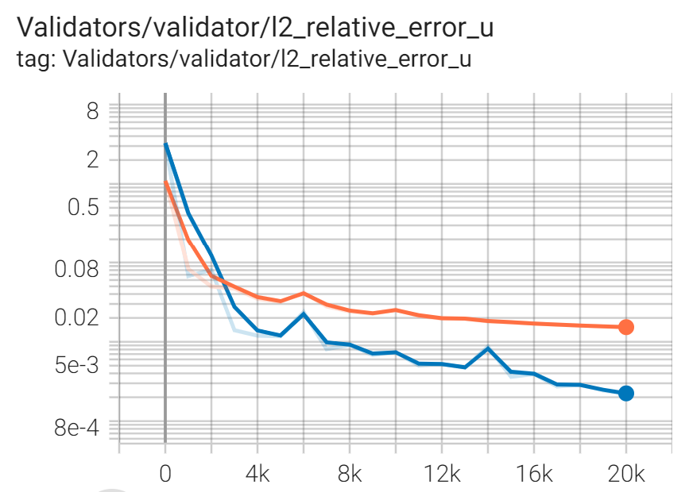

Fig. 14 A comparison of the validation error results between default SiLU and Stan activations for the Helmholtz example.

## Sobolev (Gradient Enhanced) Training

Son[5](#ref5)とYu[6](#ref6)の提案する物理情報ニューラルネットワークのSobolevまたは勾配強化トレーニングは、PDE残差の導関数情報をニューラルネットワークソルバーのトレーニングに活用します。  
具体的には、ニューラルネットワークソルバーの標準的なトレーニングでは、PDE残差の適切なノルムをゼロにすることを強制しますが、Sobolevまたは勾配強化トレーニングでは、PDE残差を空間入力に対して一次またはそれ以上の導関数を取り、それらの残差導関数の適切なノルムをゼロに設定することができます。  
参照論文[5](#ref5), [6](#ref6)によれば、Sobolevまたは勾配強化トレーニングは、標準的なニューラルネットワークソルバーのトレーニングと比較して、より良いトレーニング精度を提供する可能性があります。  
ただし、標準的なPDE残差および境界条件の損失項との相対的な重みを選択する際には注意が必要です。  
そうでないと、Sobolevまたは勾配強化トレーニングはニューラルネットワークソルバーのトレーニング収束と精度に悪影響を及ぼす可能性があります。  
さらに、Sobolevまたは勾配強化トレーニングは、微分の次数が増加するためトレーニング時間が増加し、追加のバックプロパゲーションが必要になります。ナビエ・ストークス方程式のSobolevまたは勾配強化トレーニングの例は、```examples/annular_ring/annular_ring_gradient_enhanced/annular_ring_gradient_enhanced.py```で見ることができます。

## Importance Sampling

私たちの問題は、モンテカルロ近似による積分損失が最小化されるような最適なパラメータ$\mathbf{\theta^*}$を見つけることです。

$$
\begin{aligned}
\begin{split}
\mathbf{\theta^*} &= \underset{{ \mathbf{\theta} }}{\operatorname{argmin}} \ \mathbb{E}_f \left[ \ell (\mathbf{\theta}) \right] \\
& \approx \underset{{ \mathbf{\theta} }}{\operatorname{argmin}} \ \frac{1}{N} \sum_{i=1}^{N} \ell (\mathbf{\theta}; \mathbf{x_i} ),  \quad \mathbf{x_i} \sim {f}(\mathbf{x})
\end{split}\end{aligned}
$$

ここで、$f$は一様確率密度関数です。重点サンプリングでは、サンプリングポイントは代替サンプリング分布$q$から描かれます。これにより、積分損失の推定分散が減少します。

$$
\mathbf{\theta^*}  \approx \underset{{ \mathbf{\theta} }}{\operatorname{argmin}} \ \frac{1}{N} \sum_{i=1}^{N} \frac{f(\mathbf{x_i})}{q(\mathbf{x_i})} \ell (\mathbf{\theta}; \mathbf{x_i} ),  \quad \mathbf{x_i} \sim q(\mathbf{x}).
$$

Modulus Symは、収束と精度の向上のためにポイントクラウドの重点サンプリングを提供しており、これは元々[12](#ref12) で提案されました。このスキームでは、一様サンプリングと比較して、サンプリング測度$q$に基づいてトレーニングポイントが適応的に更新され、損失のより正確な無バイアスの近似が実現されます。Modulus Symでの重点サンプリングの実装の詳細は、```examples/ldc/ldc_2d_importance_sampling.py```スクリプトで説明されています。Fig.15では、円環リングの例における一様サンプリングと重点サンプリングの検証エラー結果が比較され、重点サンプリングを使用するとより良い精度が示されています。この例では、トレーニングポイントは速度の2次導関数に比例した分布に従ってサンプリングされます。100Kイテレーションで計算されたサンプリング確率もFig.16に示されています。

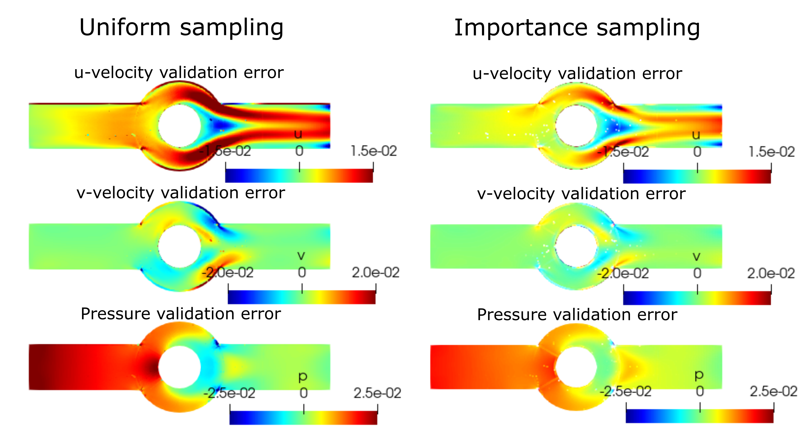

Fig. 15 A comparison between the uniform and importance sampling validation error results for the annular ring example.

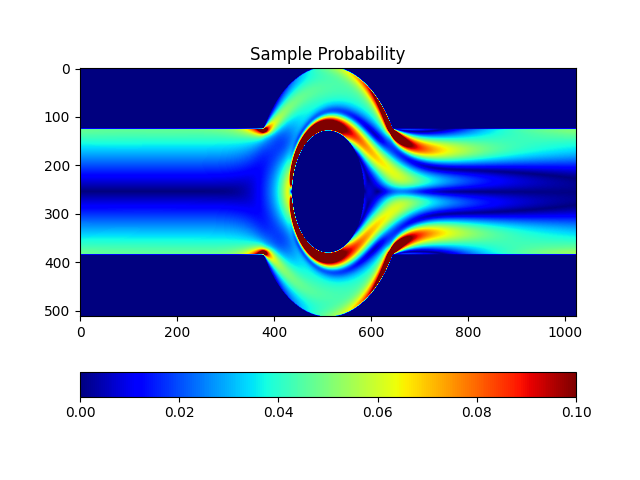

Fig. 16 A visualization of the training point sampling probability at iteration 100K for the annular ring example.

## Quasi-Random Sampling

Modulus Symでは、デフォルトで一様分布に従ってトレーニングポイントが生成されます。一様サンプリングの代替として、準ランダムサンプリングがあります。これにより、ドメイン全体で不整合が低いレベルでトレーニングポイントを生成する手段が提供されます。一般的な低不整合のシーケンスには、ハルトンシーケンス[13](#ref13)、ソボルシーケンス、およびハマースリーセットがありますが、その中でModulus Symではハルトンシーケンスが採用されています。円環リングの例で一様サンプリングとハルトンシーケンスを使用して生成されたトレーニングポイントのバッチのスナップショットが下図に示されています。サンプル生成のためのハルトンシーケンスは、制約の定義時に```quasirandom=True```を設定することで有効にできます。ハルトンシーケンスを使用して共役熱伝達の例を解決する方法に関するケーススタディも、チュートリアル[FPGA Heat Sink with Laminar Flow](https://docs.nvidia.com/deeplearning/modulus/modulus-sym/user_guide/advanced/fpga.html#fpga)で紹介されています。

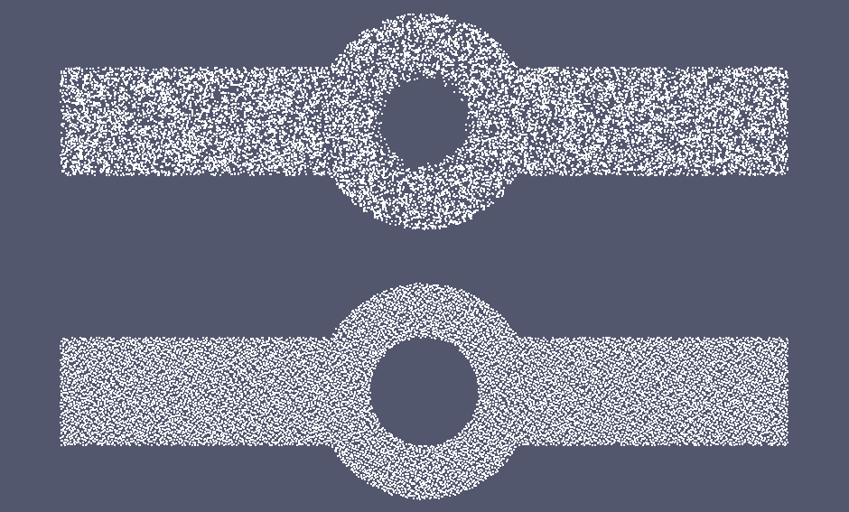

Fig. 17 A snapshot of a batch of training points generated using uniform sampling (top) and Halton sequences (bottom) for the annular ring example.

## Exact Boundary Condition Imposition

標準的なニューラルネットワークソルバーは、境界条件をソフトな形式で課します。これは、境界条件を損失関数の追加の損失項として制約として組み込むことによって行われます。この形式では、境界条件が厳密に満たされるわけではありません。論文[#sukumar2022exact]_では、ニューラルネットワークソルバーに厳密に境界条件を課す新しいアプローチが紹介されました。これには、ドメインの境界に対する近似距離関数（ADF）$\phi (\mathbf{x})$をR-関数の理論を用いて導入しました。まず、このADFの計算方法を見てから、境界条件のタイプに基づいて解のアンサッツの形成について議論します。ここで、$D \subset \mathbb{R}^d$は境界$\partial D$を持つ計算領域を示します。厳密な距離は、任意の点$\mathbf{x} \in \mathbb{R}^d$と領域の境界$\partial D$との間の最短距離であり、したがって、$\partial D$上ではゼロです。厳密な距離関数は2次またはそれ以上の微分可能性がないため、ADF関数$\phi (\mathbf{x})$を代わりに使用することができます。

Modulus Symでは、厳密な境界条件の課しは現在2次元の幾何形状にのみ制限されています。ここで、$\partial D \in \mathbb{R}^2$は$n$個の線分と曲線$D_i$からなる境界であり、$\phi_i$は各曲線または線分へのADFを示します。つまり、$\phi_1 \cup \phi_2 \cup ... \cup \phi_n = \phi$です。ADF関数の特性は以下の通りです：

(1) 任意の点$\mathbf{x}$が$\partial D$上にある場合、$\phi(x) = 0$であり、

(2)$\phi(x)$は$m$次の正規化されており、つまり、単位内向き法線ベクトルに対するその導関数は1であり、2次から$m$次の導関数は$\partial D$上のすべての点でゼロです。

R-関数の基本的な性質、R-論理和（和集合）、R-論理積（共通部分）、およびR-否定は、境界$\partial D$への合成ADF $\phi(\mathbf{x})$を構築する際に使用できます。ADF $\phi_i(\mathbf{x})$が$\partial D$のパーティションに対して既知である場合、これらの性質が役立ちます。$\partial D$のすべてのパーティションに対するADF $\phi_i(\mathbf{x})$が計算されたら、R-等価演算を使用して$\partial D$へのADFを計算できます。$\partial D$が$n$個の部分$\partial D_i$で構成されている場合、次のように規格化された$m$次までのADF $\phi$が得られます。

$$
\phi(\phi_1,...,\phi_n):=\phi_1~...~\phi_n=\frac{1}{\sqrt[m]{\frac{1}{(\phi_1)^m}+\frac{1}{(\phi_2)^m}+...+\frac{1}{(\phi_n)^m}}}.
$$

次に、線分や円弧の個々のADF $\phi_i$がどのように計算されるかを見ていきます。詳細については、参考文献[#sukumar2022exact]_を参照してください。2点$\mathbf{x}_1 \equiv (x_1,y_1)$と$\mathbf{x}_2 \equiv (x_2,y_2)$を通る無限直線のADFは以下のように計算されます。

$$
\phi_l(\mathbf{x}; \mathbf{x}_1, \mathbf{x}_2) = \frac{(x-x_1)(y_2-y_1)-(y-y_1)(y_2-y_1)}{L}
$$

ここで、$L$は2点間の距離です。同様に、半径$R$で中心が$\mathbf{x}_c \equiv (x_c, y_c)$にある円のADFは以下のように与えられます。

$$
\phi_c(\mathbf{x}; R, \mathbf{x}_c) = \frac{R^2-(\mathbf{x}-\mathbf{x}_c).(\mathbf{x}-\mathbf{x}_c)}{2R}
$$

線分と円弧のADFを計算するために、トリミング関数を使用する必要があります。線分の長さが$L$で、端点が$\mathbf{x}_1 \equiv (x_1,y_1)$と$\mathbf{x}_2 \equiv (x_2,y_2)$、中点が$\mathbf{x}_c=(\frac{x_1+x_2}{2},\frac{y_1+y_2}{2})$であり、長さが$L = ||\mathbf{x}_2-\mathbf{x}_1||$であるとします。この場合、線分のADF $\phi(\mathbf{x})$は次のように計算できます。

$$
f = \phi_l(\mathbf{x}, \mathbf{x}_1, \mathbf{x}_2)
$$

$$
t = \phi_c(\mathbf{x}; R=\frac{L}{2}, \mathbf{x}_c=\frac{\mathbf{x}_1 + \mathbf{x}_2}{2})
$$

$$
\Phi = \sqrt{t^2 + f^4}
$$

$$
\phi(\mathbf{x}) = \sqrt{f^2+(\frac{\Phi - t}{2})^2}
$$

ここで、$f$は無限直線のADFであり、$t$はトリミング関数であり、円のADFです。言い換えれば、線分のADFは円によって無限直線を切り取ることで得られます。同様に、上記の式を使用して、$f$を円のADFに設定し、$t$を無限直線セグメントのADFに設定することで、円弧のADFを取得できます。

線分と円弧のADFを形成する方法がわかったので、境界条件が厳密に満たされるようにADFを使用して解のアンサッツを形成する方法について議論しましょう。ディリクレ境界条件の場合、$\partial D$上で$u=g$が指定されている場合、解のアンサッツは次のようになります。

$$
u_{sol} = g + \phi u_{net}
$$

ここで、$u_{sol}$は近似解であり、$u_{net}$はニューラルネットワークの出力です。Neumann、Robin、および混合境界条件の場合、解のアンサッツがどのように形成されるかを見るには、参考文献[#sukumar2022exact]を参照してください。

異なる不均一な本質的境界条件が$\partial D$の異なる部分集合に課されている場合、
境界$\partial D$全体の境界条件関数を表す$g$関数を計算するために、transfinite interpolationを使用できます。
transfinite interpolation関数は以下のように書くことができます。

$$
g(\mathbf{x}) =  \sum_{i=1}^{M} w_i(\mathbf{x})g_i(\mathbf{x})
$$

$$
w_i(\mathbf{x}) = \frac{\phi_i^{-\mu_i}}{\sum_{j=1}^{M}\phi_j^{-\mu_j}} = \frac{\prod_{j=1;j \neq i}^{M} \phi_j^{-\mu_j}}{\sum_{k=1}^{M}\prod_{j=1;j \neq k}^{M} \phi_j^{-\mu_j} + \epsilon}
$$

ここで、重み$w_i$は1になり、集合$\partial D_i$上で$g_i$を補間します。$\mu_i \geq 1$は補間の性質を制御する定数です。$\epsilon$はゼロで割り算を防ぐための小さな数値です。この境界値関数$g(\mathbf{x})$は、ディリクレ境界条件の解のアンサッツで使用され、厳密な境界条件の課しにより最終的な解を計算するのに使用されます。

提案された方法は、特に2次以上の導関数を含むPDEを解く場合には特定の課題があります。R関数の理論を用いて構築された近似距離関数は、直線と円弧の接合点で正規化されていないため、これらの点では2次以上の導関数が定義されず、これらの点に近いところでは非常に大きな値を取ることがあります。これは、ニューラルネットワークの収束挙動に影響を与える可能性があります。提案された解決策は、これらの点の近くでコロケーションポイントをサンプリングしないことです。ただし、これは収束性と最終的な解の精度に悪影響を与える可能性があることがわかりました。代替案として、変数の変更によるPDEの1次の形式を使用することを提案します。興味のある量の1次導関数を新しい変数として扱うことで、2次のPDEを追加の適合性方程式を含む一連の1次のPDEとして書き直すことができます。これらの方程式は損失関数の追加項として現れます。例えば、以下の形式を取るHelmholtz方程式を考えてみましょう。

$$
k^2 u + \frac{\partial ^2 u}{\partial x ^2} + \frac{\partial ^2 u}{\partial y ^2} + \frac{\partial ^2 u}{\partial z ^2} = f
$$

ここで、$k$は波数であり、$f$はソース項です。新しい変数$u_x$、$u_y$、$u_z$を定義することで、解に対する$x$、$y$、$z$座標に関するそれぞれの導関数を表すことができ、Helmholtz方程式を次の形式の一次方程式の集合として書き直すことができます。

$$
k^2 u + \frac{\partial u_x}{\partial x } + \frac{\partial u_y}{\partial y} + \frac{\partial u_z}{\partial z} = f
$$

$$
u_x = \frac{\partial u}{\partial x }
$$

$$
u_y = \frac{\partial u}{\partial y }
$$

$$
u_z = \frac{\partial u}{\partial z }
$$

この形式を使用すると、ニューラルネットワークの出力には$u$に加えて$u_x$、$u_y$、$u_z$が含まれるようになりますが、これにより微分の階数が1つ減少します。Helmholtz方程式とNavier-Stokes方程式の1次の実装例は、それぞれexamples/helmholtz/pdes/helmholtz_first_order.pyとexamples/annular_ring/annular_ring_hardBC/pdes/navier_stokes_first_order.pyで利用できます。

PDEの1次の形式を使用する利点の1つは、2次導関数を計算するための追加の逆伝播が行われなくなるため、トレーニングイテレーションの速度が向上する可能性があることです。さらに、この形式ではAutomatic Mixed Precision (AMP)の使用が可能になります。AMPは現在、2次およびそれ以上の導関数を持つ問題には適していませんが、AMPの使用によりトレーニングをさらに加速することができます。

以下の図は、基準モデル（ソフトBC課題と2次のPDE）と、ハードBC課題と1次のPDEで訓練されたモデルとの間の内部検証精度の比較を示しています。明らかに、ハードBCアプローチは、基準モデルと比較して検証精度を約1桁低下させます。さらに、ハードBC課題で訓練されたモデルの境界検証エラーは、基準モデルとは異なり、厳密にゼロです。これらの例は「examples/helmholtz」で利用可能です。

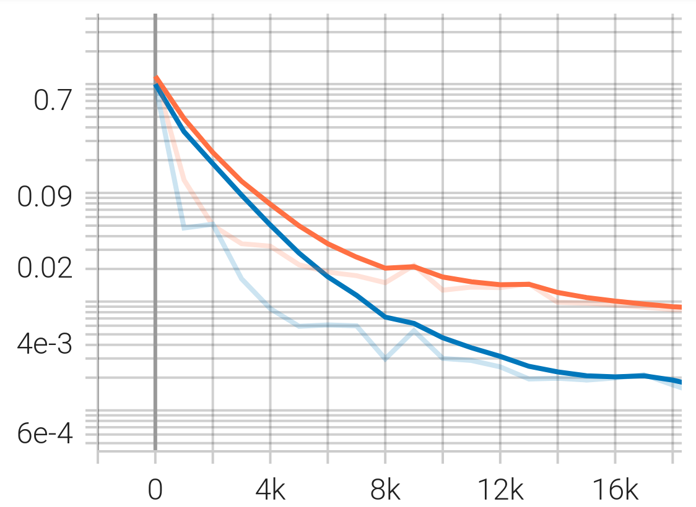

Fig. 18 Interior validation accuracy for models trained with soft BC (orange) and hard BC (blue) imposition for the Helmholtz example.

AMPを使用すると、厳密なBC課題を持つモデルのトレーニングは、基準モデルのトレーニングと比較して25％高速です。

厳密なBC課題で、一次形式のNavier-Stokes方程式を解く別の例は、「examples/annular_ring/annular_ring_hardBC」で見つけることができます。この例の境界条件は以下の通りです：左壁に指定された放物線流入速度、右壁にゼロ圧力、および上下の壁と内円周の壁に滑りなしのBC。以下の図は、ハードBC課題での環状リング例の解を示しています。

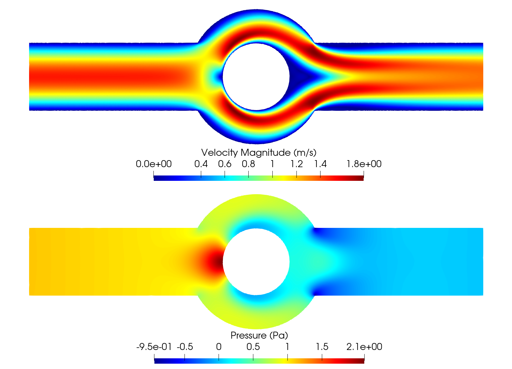

Fig. 19 Solution for the the annular ring example obtained using hard BC imposition.

## Causal training

次のような一般形式を持つ時間依存性のある偏微分方程式のシステムがあると仮定しましょう。

$$
u_t + \mathcal{N}[u] = 0, \quad t \in [0, T], x \in \Omega
$$

ここでは、$u$がPDEシステムによって支配される未知の潜在的な解を表し、$\mathcal{N}$は可能な非線形微分演算子です。[#wang2022respecting]_ で示されているように、連続時間のPINNsモデルは時間的因果関係を破る可能性があり、したがって一時的な問題に対する誤った解に収束する可能性があります。因果関係のあるトレーニング [#wang2022respecting]_ は、この根本的な制約と誤差の主要な原因に対処しようとし、モデルのトレーニング中に物理的な因果関係を明示的に考慮するようにPDE残差損失を再定式化します。これを導入するために、時間領域$[0, T]$を$N$個のチャンク${ [t_i, t_{i+1}] }_{i=0}^{N-1}$に分割し、$i$番目のチャンクにおけるPDE残差損失を定義します。

$$
\mathcal{L}_i(\mathbf{\theta}) = \sum_j | \frac{\partial u_{\mathbf{\theta}}}{\partial t}(t_j, x_j)+ \mathcal{N}[u](t_j, x_j) |^2
$$

${t_j, x_j} \subset [t_{i-1}, t_i] \times \Omega$となるような${t_j, x_j}$に対して、全因果関係の損失は以下のように与えられます。

$$
\mathcal{L}_r(\mathbf{\theta}) = \sum_{i=1}^N w_i \mathcal{L}_i(\mathbf{\theta}).
$$

ここで、

$$
w_i = \exp(-\epsilon \sum_{k=1}^{i-1} \mathcal{L}_i(\mathbf{\theta}), \quad \text{for} i=2,3, \dots, N
$$

$w_i$は前のチャンクからの累積残差損失の大きさに逆指数的に比例しています。その結果、$\mathcal{L}_i(\mathbf{\theta})$が十分小さい値に減少しない限り、$w_i$が十分大きくなるまで最小化されません。この単純なアルゴリズムは、PINNモデルが動的進化の固有の因果構造を尊重しながら、PDEの解を徐々に学習するように強制します。

因果関係のトレーニングの実装詳細は、Modulus Symで提供されているスクリプトexamples/wave_equation/wave_1d_causal.pyに記載されています。:numref:fig-wave_1d_causalは、ベースラインと因果関係のトレーニングの間の検証エラーの比較を示しています。因果関係のトレーニングでは、1桁のオーダーまで予測精度が大幅に向上することが観察されます。

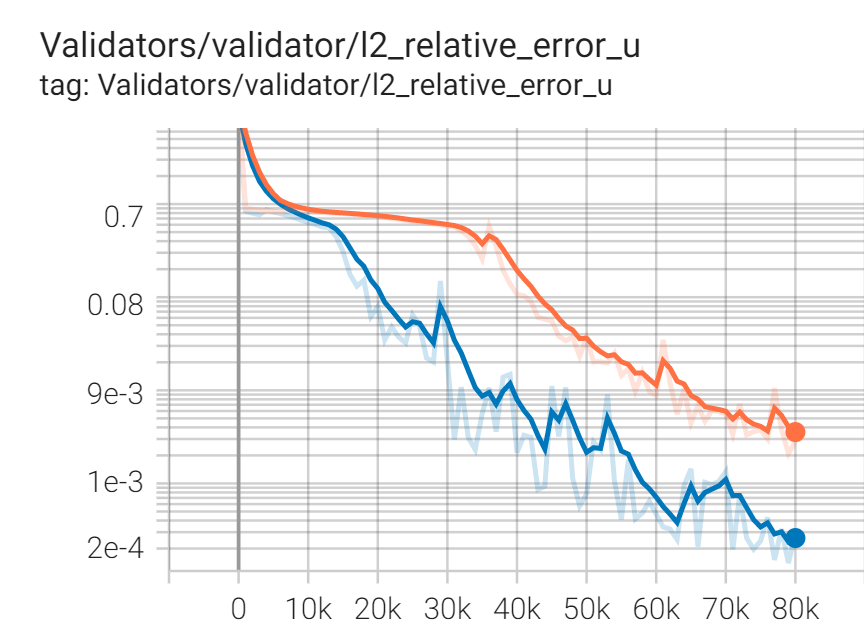

Fig. 20 Interior validation accuracy for models trained with (blue) and without (red) the causal loss function for the 1D wave equation example.

因果関係のトレーニングスキームは、Modulus Symで移動時間ウィンドウや異なるネットワークアーキテクチャとシームレスに組み合わせることができます。例えば、スクリプトexamples/taylor_green/taylor_green_causal.pyでは、複雑な一時的なNavier-Stokes問題を解決するための時間進行戦略と因果関係の損失関数を組み合わせる方法が示されています。

## Learning Rate Annealing

PINNのトレーニングにおける主要なアプローチは、初期/境界条件を損失関数への加法的なペナルティ項として表現することです。通常、これは各項の寄与を全体の損失に均衡させるために、これらの項のそれぞれにパラメータ$\lambda$を乗算することによって行われます。しかし、これらのパラメータを手動で調整するのは簡単ではなく、これらのパラメータを定数として扱う必要があります。[#wang2021understanding]_で提案されている学習率のアニーリングのアイデアは、トレーニング中にこれらのパラメータを自動的かつ適応的に調整するためのルールです。定常状態の問題の損失関数が以下の形式を取ると仮定しましょう。

$$
L(\theta) = L_{residual}(\theta) + \lambda^{(i)} L_{BC}(\theta)
$$

ここで、上付き$(i)$はトレーニングの反復インデックスを表します。次に、各トレーニング反復で、学習率のアニーリングスキーム[#wang2021understanding]_は、PDE損失項と境界項の勾配統計の比率を以下のように計算します。

$$
\bar{\lambda}^{(i)} = \frac{max\left(\left|\nabla_{\theta}L_{residual}\left(\theta^{(i)}\right)\right|\right)}{mean \left(\left|\nabla_{\theta}L_{BC}\left(\theta^{(i)}\right)\right|\right)}
$$

最後に、アニーリングパラメータ$\lambda^{(i)}$は、指数移動平均を使用して以下のように計算されます。

$$
\lambda^{(i)} = \alpha \bar{\lambda}^{(i)} + (1-\alpha) \lambda^{(i-1)}
$$

ここで、$\alpha$は指数移動平均の減衰率です。

## Homoscedastic Task Uncertainty for Loss Weighting

[#kendall2018multi]_では、著者らが同一散在するタスクの不確実性を持つガウス尤度を、マルチタスク学習アプリケーションにおけるトレーニング損失として提案しています。このスキームでは、損失関数は次の形式を取ります。

$$
L(\theta) = \sum_{j=1}^T \frac{1}{2\sigma_j^2} L_j(\theta) + \log \Pi_{j=1}^T \sigma_j,
$$

ここで、$T$はタスクの総数（または残差および初期/境界条件の損失項）です。この損失を最小化することは、同一散在性の不確実性を持つ対数ガウス尤度を最大化することに相当します[#kendall2018multi]_、そして不確実性項$\sigma$は異なる損失項に対する適応的な重みとして機能します。:numref:fig-uncertainty_loss_weightingは、不確実性の損失の重み付けと重みなしの比較を示しています。これは円環リングの例で、不確実性の損失の重み付けがトレーニングの収束と精度を向上させることを示しています。このスキームの詳細については、[#kendall2018multi]_を参照してください。

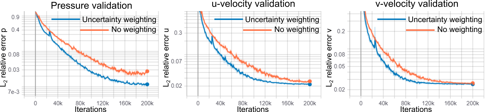

Fig. 21 A comparison between the uncertainty loss weighting vs. no loss weighting for the annular ring example.

## SoftAdapt

Softadaptは、トレーニング中に損失の重みを動的に調整する単純な損失バランシングアルゴリズムです。各損失項の相対的なトレーニングの進捗を測定し、各反復での損失値を前の反復での値で割ることによって測定します。そして、これらの相対的な進捗の測定値をソフトマックス変換を通じて渡し、その結果得られた損失の重みが決定されます。

$$
w_j(i) = \frac{\exp \left( \frac{L_j(i)}{L_j(i-1)} \right)}{\Sigma_{k=1}^{n_{loss}} \exp \left( \frac{L_k(i)}{L_k(i-1)} \right)}
$$

ここで、$w_j(i)$は反復$i$での損失項$j$の重み、$L_j(i)$は反復$i$での損失項$j$の値、$n_{loss}$は損失項の数です。私たちは、このsoftmax変換が簡単にオーバーフローを引き起こすことを観察しています。したがって、softmaxトリックを使用してsoftadapt方程式を修正します。

$$
w_j(i) = \frac{\exp \left( \frac{L_j(i)}{L_j(i-1) + \epsilon} - \mu(i) \right)}{\Sigma_{k=1}^{n_{loss}} \exp \left( \frac{L_k(i)}{L_k(i-1)+\epsilon} - \mu(i) \right)}
$$

ここで、$\mu(i) = \max \left(L_j(i)/L_j(i-1) \right)$であり、$\epsilon$はゼロ除算を防ぐための小さな数です。

## Relative Loss Balancing with Random Lookback (ReLoBRaLo)

Relative Loss Balancing with Random Lookback (ReLoBRaLo) [#bischof2021multi]_はSoftadaptの改良バージョンであり、移動平均とランダムな遡及機構を採用しています。各反復での損失の重みは次のように計算されます。

$$
w_j(i) = \alpha \left( \beta w_j(i-1) + (1-\beta) \hat{w}_j^{(i;0)} \right) + (1-\alpha) \hat{w}_j^{(i;i-1)}
$$

ここで、$w_j(i)$は反復$i$での損失項$j$の重み、$\alpha$は移動平均パラメータ、$\beta$は期待値が1に近いベルヌーイ乱数変数です。$\hat{w}_j^{(i;i')}$は以下のような形を取ります。

$$
\hat{w}_j^{(i;i')} = \frac{n_{loss} \exp \left( \frac{L_j(i)}{\tau L_j(i')} \right)}{\Sigma_{k=1}^{n_{loss}} \exp \left( \frac{L_k(i)}{\tau L_k(i')}\right)}
$$

ここで、$n_{loss}$は損失項の数、$L_j(i)$は反復$i$での損失項$j$の値を示し、$\tau$は温度と呼ばれます[#bischof2021multi]。温度の値が非常に大きい場合、損失の重みは類似の値を取る傾向がありますが、このパラメータの値がゼロの場合、softmaxはargmax関数に変換されます[#bischof2021multi]。Softadaptの改良バージョンと同様に、$\hat{w}_j^{(i;i')}$の式をオーバーフローおよびゼロ除算を防ぐために修正します。

$$
\hat{w}_j^{(i;i')} = \frac{n_{loss} \exp \left( \frac{L_j(i)}{\tau L_j(i') + \epsilon} - \mu(i) \right)}{\Sigma_{k=1}^{n_{loss}} \exp \left( \frac{L_k(i)}{\tau L_k(i') + \epsilon} - \mu(i) \right)}
$$

ここで、$\mu(i) = \max \left(L_j(i)/L_j(i') \right)$であり、$\epsilon$は小さな数です。

## GradNorm

コンピュータビジョンやマルチタスク学習における最も人気のある損失バランシングアルゴリズムの1つは、GradNorm [#chen2018gradnorm]_です。このアルゴリズムでは、トレーニング中に異なる損失項の勾配ノルムが類似の相対的な大きさを持つようにする追加の損失項が最小化されます。これにより、ネットワークが異なる損失項に対して類似の割合でトレーニングされるようになります。損失の重みは、異なる損失の相対的なトレーニング速度に基づいてトレーニング中に動的に調整されます。


$$
L_{gn}(i, w_j(i)) = \sum_j \left| G_w^{(j)}(i) - \bar{G}_W(i) \times \left[ r_j(i) \right]^\alpha  \right|_1
$$

ここで、$L_{gn}$はGradNorm損失です。$W$はGradNorm損失に使用されるニューラルネットワークの重みのサブセットであり、通常はネットワークの最後の層の重みです。$G_w^{(j)}(i) = || \nabla_W w_j(i) L_j(i)||_2$は、反復$i$での重み$W$に関する加重損失項$j$の勾配の$L_2$ノルムです。$\bar{G}_W(i)=E [G_w^{(j)}(i)]$は、反復$i$でのすべてのトレーニング損失に対する平均勾配ノルムです。また、$r_j(i)=\tilde{L}_j(i)/E[\tilde{L}_j(i)]$は、損失項$j$に対応する相対逆トレーニング速度であり、ここで$\tilde{L}_j(i)=L_j(i)/L_j(0)$は逆トレーニング速度を測定します。$\alpha$は、トレーニング速度のバランスの強さを定義するハイパーパラメータです。

GradNorm損失$L_{gn}(i, w_j(i))$の勾配を取る際には、参照勾配ノルム$\bar{G}W(i) \times \left[ r_j(i) \right]^\alpha$は定数として扱われ、GradNorm損失は損失重み$w_j$に関してのみ微分されて最小化されます。最後に、各トレーニング反復後に、重み$w_j$は$\Sigma_j w_j(i)=n{loss}$となるように正規化されます。ここで$n_{loss}$はGradNorm損失を除く損失項の数です。GradNormアルゴリズムの詳細については、参考文献[#chen2018gradnorm]_を参照してください。

GradNormアルゴリズムでは、場合によっては重み$w_j$が負の値を取ることが観察され、これがニューラルネットワークソルバーのトレーニング収束に悪影響を与える可能性があります。これを防ぐために、Modulus SymのGradNormの実装では、訓練可能な重みパラメータの指数変換を使用して損失項を重み付けします。

GradNormは、参照論文で、さまざまなネットワークアーキテクチャや分類および回帰タスクの両方で、精度を向上させ、過学習を減少させる効果的な手法として示されています。ここでは、GradNormがニューラルネットワークソルバーの損失バランシングにも効果的であることを観察しました。特に、非常に小さな初期重みを運動量損失項に割り当て、他の損失重みを基準ケースと比較してそのままにした場合のGradNormのパフォーマンスをテストしました。これは、この貧弱な初期損失の重み付けから始めて、トレーニング中に適切な損失の重みを回復できるかどうかを評価するためです。検証結果は以下の図に示されています。青の線はベースケースを示し、赤は運動量方程式が$1e-4$で重み付けされ、損失バランシングアルゴリズムが使用されていない場合を示し、オレンジは同じケースでGradNormが損失バランシングに使用されている場合を示しています。このテストケースで損失項の重みを適切にバランスさせないと収束に失敗することが明らかであり、GradNormがこれを効果的に達成できることが示されています。

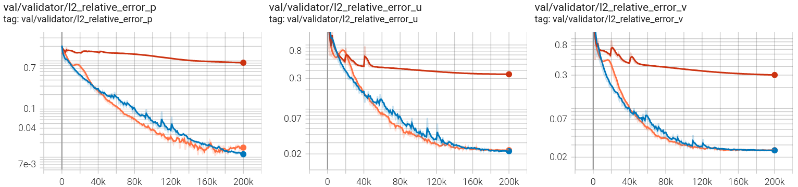

Fig. 22 GradNorm performance for loss balancing in the annular example. Blue: base case, red: momentum losses multiplied by 1e-4 and no loss balancing is used, orange: momentum losses multiplied by 1e-4 and GradNorm is used.

## ResNorm

Residual Normalization (ResNorm)は、Modulus SymとNational Energy Technology Laboratory (NETL)の共同開発による損失バランシングスキームです。
このアルゴリズムは、GradNormの単純化されたバリエーションであり、トレーニング中に個々の損失が類似の相対的な大きさを取るように促す追加の損失項が最小化されます。
損失の重みは、異なる損失の相対的なトレーニング速度に基づいて、トレーニング中に動的に調整されます。

$$
L_{rn}(i, w_j(i)) = \sum_j \left| L_w^{(j)}(i) - \bar{L}(i) \times \left[ r_j(i) \right]^\alpha  \right|_1
$$

ここで、$L_{rn}$はResNorm損失であり、$L_w^{(j)}(i)=w_j(i) L_j(i)$は反復$i$での加重損失項$j$です。また、$\bar{L}(i)=E [L_j(i)]$は反復$i$でのすべてのトレーニング損失の平均損失値です。また、$r_j(i)=\tilde{L}_j(i)/E[\tilde{L}_j(i)]$は、損失項$j$に対応する相対逆トレーニング速度であり、ここで$\tilde{L}_j(i)=L_j(i)/L_j(0)$は逆トレーニング速度を測定します。$\alpha$は、トレーニング速度のバランスの強さを定義するハイパーパラメータです。

ResNormの損失$L_{rn}(i, w_j(i))$に関する損失重み$w_j(i)$の勾配を取る際には、GradNormと同様に、項$\bar{L}(i) \times \left[ r_j(i) \right]^\alpha$は定数として扱われます。
最後に、各トレーニング反復後に、重み$w_j(i)$は$\Sigma_j w_j(i)=n{loss}$となるように正規化されます。ここで、$n_{loss}$はResNorm損失を除く損失項の数です。
GradNormとは異なり、ResNormではモデルパラメータに関する勾配を計算する必要がないため、GradNormと比較してResNormは計算効率が高くなることに注意してください。
GradNormの実装と同様に、損失重みが負の値を取るのを防ぐために、訓練可能な重みパラメータの指数変換を使用して損失項を重み付けします。

ResNormのパフォーマンスを円環リングの例でテストしました。このテストでは、運動量損失項に非常に小さな初期重みを割り当て、他の損失重みを基準ケースと比較してそのままにしました。これは、この貧弱な初期損失の重み付けから始めて、トレーニング中に適切な損失の重みを回復できるかどうかを評価するためです。検証結果は以下の図に示されています。ResNormは損失項の間で良いバランスを見つけ、適切な収束を提供できることが明らかであり、損失バランシングを行わないベースラインケースでは収束に失敗することが示されています。

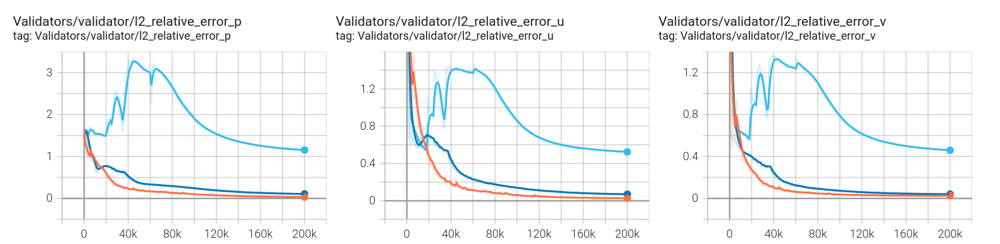

Fig. 23 ResNorm performance for loss balancing in the annular example. The following are plotted: Base line (orange), momentum losses multiplied by $1e-4$ (light blue) and momentum losses multiplied by $1e-4$ with ResNorm (dark blue).

## Neural Tangent Kernel (NTK)

Neural Tangent Kernel（NTK）アプローチを使用すると、異なる損失項に自動的に重みを割り当てることができます。NTKの観点からは、各損失項の重みはNTKの大きさに比例するべきであり、それによってすべての損失項が均一に収束するはずです。総損失$\mathcal{L}(\boldsymbol{\theta})$が以下で定義されると仮定します。

$$
\mathcal{L}(\boldsymbol{\theta}) = \mathcal{L}_b(\boldsymbol{\theta}) + \mathcal{L}_r(\boldsymbol{\theta})
$$

ここで

$$
\mathcal{L}_b(\boldsymbol{\theta}) = \sum_{i=1}^{N_b}|u(x_b^i,\boldsymbol{\theta})-g(x_b^i)|^2,
$$

$$
\mathcal{L}_r(\boldsymbol{\theta}) = \sum_{i=1}^{N_b}|r(x_r^i,\boldsymbol{\theta})|^2
$$

境界損失とPDE残差損失をそれぞれ表し、$r$はPDE残差を示します。$\mathbf{J}_r$と$\mathbf{J}_b$をそれぞれ$\mathcal{L}_r$と$\mathcal{L}_b$のヤコビアンとします。それらのNTKは次のように定義されます。

$$
\mathbf{K}_{bb}=\mathbf{J}_b\mathbf{J}_b^T\qquad \mathbf{K}_{rr}=\mathbf{J}_r\mathbf{J}_r^T
$$

[#wang2022when]によると、重みは以下のように与えられます。

$$
\lambda_b = \frac{Tr(\mathbf{K}_{bb})+Tr(\mathbf{K}_{rr})}{Tr(\mathbf{K}_{bb})}\quad
\lambda_r = \frac{Tr(\mathbf{K}_{bb})+Tr(\mathbf{K}_{rr})}{Tr(\mathbf{K}_{rr})}
$$

where $Tr(\cdot)$ is the trace operator.

重みはNTKによって割り当てられます。NTKのアイデアは、各損失項について、その収束速度がNTKの固有値によって示されるというものです。したがって、各項が基本的に同じ収束速度を持つように、その固有値によって損失項を再重み付けします。詳細については、[#wang2022when]_を参照してください。Modulus Symでは、NTKを自動的に計算し、重みを即座に割り当てることができます。スクリプト「examples/helmholtz/helmholtz_ntk.py」は、Helmholtz問題のNTKの実装を示しています。:numref:fig-no-ntkは、NTKの重み付け前の結果を示しています。最大誤差が0.04であることが観察されます。NTKの重みを使用すると、この誤差は0.006に減少します。:numref:fig-ntkに示されています。

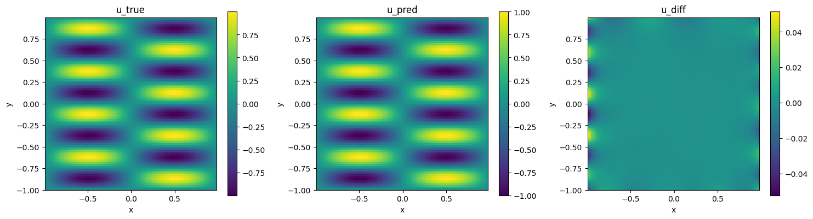

Fig. 24 Helmholtz problem without NTK weights

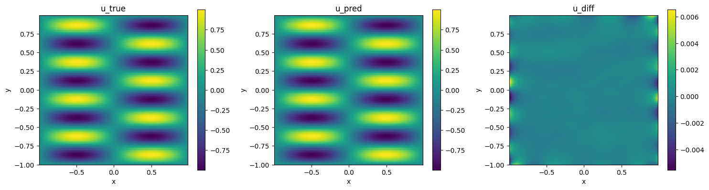

Fig. 25 Helmholtz problem with NTK weights

## Selective Equations Term Suppression (Equation terms attention)

Selective Equations Term Suppression (SETS)は、National Energy Technology Laboratory (NETL)との共同開発による機能です。いくつかのPDEでは、物理方程式の項には時間と大きさの異なる尺度があります（時には硬いPDEとしても知られています）。そのようなPDEでは、小さい項の扱いが悪いにもかかわらず、損失方程式が最小化されているように見えることがあります。これを解決するために、同じPDEの複数のインスタンスを作成し、特定の項を凍結します（凍結は、PyTorchの.detach()を使用してバックエンドで項の勾配呼び出しを停止することで実現されます）。最適化プロセス中、これにより、凍結された項について前の反復からの値を使用するようにオプティマイザに強制されます。したがって、オプティマイザはPDEの各項を最小化し、効率的に方程式残差を減少させます。これにより、PDEの中のどの項も損失の勾配を支配せず（すべての項に注意が向けられます）。異なる凍結項を持つ複数のインスタンスを作成することで、物理学の全体的な表現を同じままにすることができます。

同じ方程式の複数のインスタンス（異なる凍結項を持つ）を作成すると、それぞれが異なる重み付けが可能な複数の損失項が生成されます。このスキームは、ResNormなどの他の損失バランシングアルゴリズムと組み合わせて、これらの異なるインスタンスに対する最適なタスク重みを得るために使用できます。

Modulus SymのAPIを使用して方程式の複数のインスタンスを作成する例は、スクリプト「examples/annular_ring_equation_instancing/annular_ring.py」に提供されています。この例で使用されている不圧縮ナビエ・ストークス方程式は、この機能のための最良のテストではありません（PDEのシステムが硬さを示さないため）。ただし、運動量方程式の複数のインスタンスを作成し、移流項と拡散項を個別に凍結すると、ベースラインよりも改善が見られます。このスキームの効果は、異なる項のスケールの大きな差異を持つ硬いPDEシステムに対して主に観察されます。

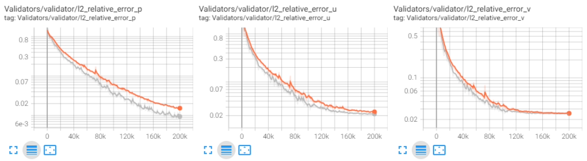

Fig. 26 Equation instancing for annular ring example. Base line (orange), equation instancing (one instance with diffusion terms frozen and other with advection terms frozen) (gray).

## Reference
<a id="ref1"></a>

$$
\text{ref1 : Wang, Sifan, Yujun Teng, and Paris Perdikaris. “Understanding and mitigating gradient flow pathologies in physics-informed neural networks.” SIAM Journal on Scientific Computing 43.5 (2021): A3055-A3081.}
\tag{ref1}$$

<a id="ref2"></a>

$$
\text{ref2 : Kendall, Alex, Yarin Gal, and Roberto Cipolla. “Multi-task learning using uncertainty to weigh losses for scene geometry and semantics.” Proceedings of the IEEE conference on computer vision and pattern recognition. 2018.}
\tag{ref2}$$

<a id="ref3"></a>

$$
\text{Jagtap, Ameya D., Kenji Kawaguchi, and George Em Karniadakis. “Adaptive activation functions accelerate convergence in deep and physics-informed neural networks.” Journal of Computational Physics 404 (2020): 109136.}
\tag{ref3}$$

<a id="ref4"></a>

$$
\text{ref4 : Sukumar, N., and Ankit Srivastava. “Exact imposition of boundary conditions with distance functions in physics-informed deep neural networks.” Computer Methods in Applied Mechanics and Engineering 389 (2022): 114333.}
\tag{ref4}$$

<a id="ref5"></a>

$$
\text{ref5 : Son, Hwijae, Jin Woo Jang, Woo Jin Han, and Hyung Ju Hwang. “Sobolev training for the neural network solutions of pdes.” arXiv preprint arXiv:2101.08932 (2021).}
\tag{ref5}$$

<a id="ref6"></a>

$$
\text{ref6 : Yu, Jeremy, Lu Lu, Xuhui Meng, and George Em Karniadakis. “Gradient-enhanced physics-informed neural networks for forward and inverse PDE problems.” arXiv preprint arXiv:2111.02801 (2021).}
\tag{ref6}$$

<a id="ref7"></a>

$$
\text{ref7 : Heydari, A. Ali, Craig A. Thompson, and Asif Mehmood. “Softadapt: Techniques for adaptive loss weighting of neural networks with multi-part loss functions.” arXiv preprint arXiv:1912.12355 (2019).}
\tag{ref7}$$

<a id="ref8"></a>

$$
\text{ref8 : Bischof, Rafael, and Michael Kraus. “Multi-objective loss balancing for physics-informed deep learning.” arXiv preprint arXiv:2110.09813 (2021).}
\tag{ref8}$$

<a id="ref9"></a>

$$
\text{ref9 : Chen, Zhao, Vijay Badrinarayanan, Chen-Yu Lee, and Andrew Rabinovich. “Gradnorm: Gradient normalization for adaptive loss balancing in deep multitask networks.” In International Conference on Machine Learning, pp. 794-803. PMLR, 2018.}
\tag{ref9}$$

<a id="ref10"></a>

$$
\text{ref10 : Wang, S., Yu, X. and Perdikaris, P., 2022. When and why PINNs fail to train: A neural tangent kernel perspective. Journal of Computational Physics, 449, p.110768.}
\tag{ref10}$$

<a id="ref11"></a>

$$
\text{ref11 : The contributors to the work on hard BC imposition using the theory of R-functions and the first-order formulation of the PDEs are: M. A. Nabian, R. Gladstone, H. Meidani, N. Sukumar, A. Srivastava.}
\tag{ref11}$$

<a id="ref12"></a>

$$
\text{ref12 : Nabian, Mohammad Amin, Rini Jasmine Gladstone, and Hadi Meidani. “Efficient training of physics‐informed neural networks via importance sampling.” Computer‐Aided Civil and Infrastructure Engineering 36.8 (2021): 962-977.}
\tag{ref12}$$

<a id="ref13"></a>

$$
\text{ref13 : Halton, John H. “On the efficiency of certain quasi-random sequences of points in evaluating multi-dimensional integrals.” Numerische Mathematik 2.1 (1960): 84-90.}
\tag{ref13}$$

<a id="ref14"></a>

$$
\text{ref14 : Wang, Sifan, Sankaran, Shyam, and Perdikaris, Paris. Respecting causality is all you need for training physics-informed neural networks. arXiv preprint arXiv:2203.07404, 2022.}
\tag{ref14}$$

<a id="ref15"></a>

$$
\text{ref15 : Gnanasambandam, Raghav and Shen, Bo and Chung, Jihoon and Yue, Xubo and others. Self-scalable Tanh (Stan): Faster Convergence and Better Generalization in Physics-informed Neural Networks. arXiv preprint arXiv:2204.12589, 2022.}
\tag{ref15}$$
