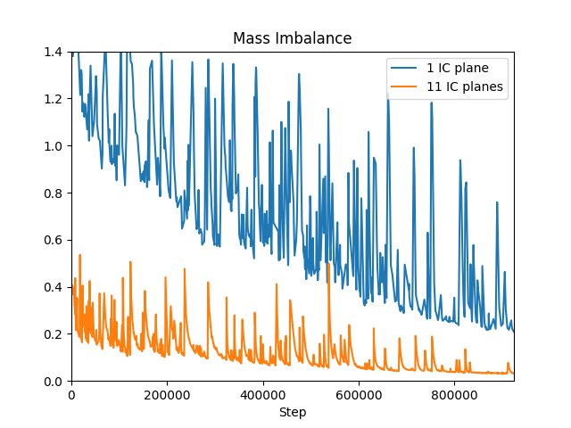
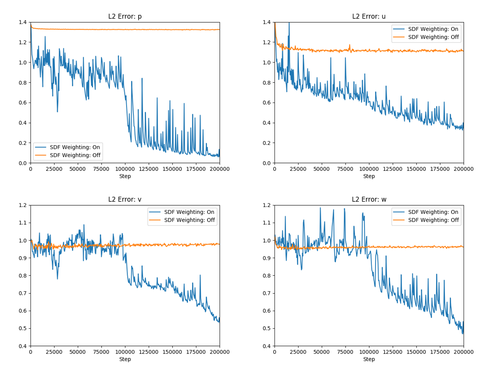
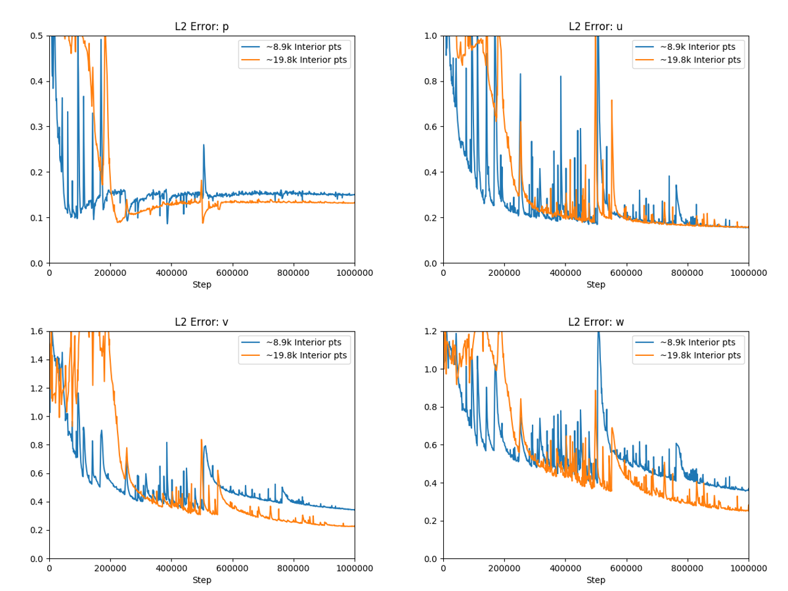
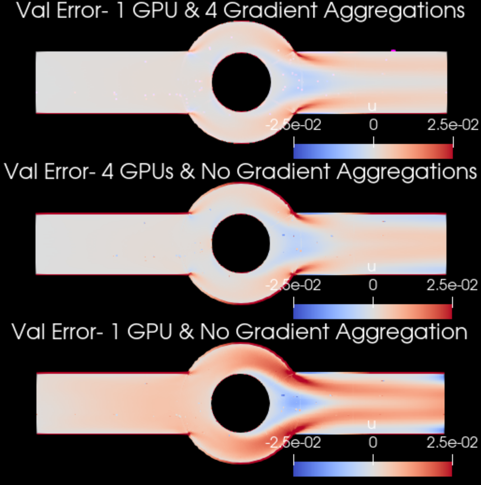

# Recommended Practices in Modulus Sym

[公式ページ](https://docs.nvidia.com/deeplearning/modulus/modulus-sym/user_guide/theory/recommended_practices.html)

## Physics Informed Neural Networks

いくつかの改善点、例えば積分連続性面の追加、損失の空間的な重み付け、および興味のある領域でのポイント密度の変化は、Modulus Symを頑強にし、より大規模な問題を処理できるようにする上で重要な要素となっています。このセクションでは、いくつかの重要な改善点について詳細に説明します。

## Scaling and Nondimensionalizing the Problem

問題の入力ジオメトリは、特徴的な長さが単位に近く、ジオメトリが原点を中心に配置されるようにスケーリングすることができます。また、物理量や偏微分方程式の無次元化形式を使用することがしばしば有利です。これは、出力スケーリングまたはいくつかの特性的な寸法や特性を用いて偏微分方程式自体を無次元化することによって実現できます。このような簡単なテクニックは収束性を向上させるだけでなく、より正確な結果を提供することができます。偏微分方程式の無次元化に関する詳細な情報は、[Scaling of
Differential Equations](https://hplgit.github.io/scaling-book/doc/pub/book/html/sphinx-cbc/index.html)にあります。ユーザーガイドのいくつかの例では、この哲学が既に採用されています。このような無次元化が広く活用されているいくつかの例は、[linear_elasticity](https://docs.nvidia.com/deeplearning/modulus/modulus-sym/user_guide/foundational/linear_elasticity.html#linear-elasticity), [2d_heat](https://docs.nvidia.com/deeplearning/modulus/modulus-sym/user_guide/advanced/2d_heat_transfer.html#d-heat), [limerock](https://docs.nvidia.com/deeplearning/modulus/modulus-sym/user_guide/advanced/industrial_heat_sink.html#limerock)などです。

Modulus Symは、スケーリングや無次元化を容易にするために、[Pint](https://pint.readthedocs.io/en/stable/)をベースとしたユーティリティを提供しています。
これにより、ユーザーはModulus Symで```quantity```を定義し、値と単位を持つ物理量を表すことができます。```Pint```には強力な文字列解析サポートがあり、指定された単位は厳密な形式に従う必要はありません。
例えば、速度単位は```meter/second```、```m/s```、または```meter/s```として定義することができます。
異なるModulus Symの量に対して異なる代数的操作を行うことができ、Modulus Symは自動的に単位を追跡します。
ユーザーは、必要な特性スケールを```NonDimensionalizer```メソッドに提供して無次元化オブジェクトをインスタンス化し、このオブジェクトを使用して量をスケーリングおよび無次元化することができます。

Pintベースのユーティリティを使用したスケーリングと無次元化の例は、円柱周りの流れを学習するために```examples/cylinder/cylinder_2d.py```にあります。
後処理のためのユーザー指定の単位で、無次元化された量を任意のターゲット量にスケーリングするために```Scaler```ノードが使用されます。また、推論や検証の領域でも使用されます。

## Integral Continuity Planes

流体流れに関する一部の問題では、ナビエ・ストークス方程式を微分形式で解くだけでなく、ドメイン内の一部の平面を通る質量流を指定することで収束速度が大幅に向上し、より良い精度が得られることがわかりました。流れの漏れがないと仮定すると、システムから流出する流れはシステムに入る流れと等しくなることを保証できます。また、内部のいくつかの平面でそのような制約を指定することにより、さらに精度が向上することがわかりました。非圧縮流れの場合、質量流を体積流量で置き換えることができます。

下図は、チャンネル内の3D 3フィンヒートシンク上の流れを解く問題（チュートリアル：:ref:ParameterizedSim）に適用される、内部にさらに多くの積分連続平面と点を追加した場合の比較を示しています。1つのIC平面の場合は、アウトレットに1つのIC平面がありますが、11のIC平面の場合はアウトレットに加えて内部に10のIC平面があります。システム内の質量不均衡が低いと、11つの積分連続平面を使用して実行されたケースが連続方程式をより良くかつ速く満たすのに役立つことを示しています。

下図は、チャンネル内の3D 3フィンヒートシンク上の流れを解く問題（チュートリアル[ParameterizedSim](https://docs.nvidia.com/deeplearning/modulus/modulus-sym/user_guide/advanced/parametrized_simulations.html#parameterizedsim)）に適用される、内部にさらに多くの積分連続平面と点を追加した場合の比較を示しています。1つのIC平面の場合は、アウトレットに1つのIC平面がありますが、11のIC平面の場合はアウトレットに加えて内部に10のIC平面があります。システム内の質量不均衡が低いと、11つの積分連続平面を使用して実行されたケースが連続方程式をより良くかつ速く満たすのに役立つことを示しています。



Fig. 27 Improvements in accuracy by adding more Integral continuity planes and points inside the domain

## Spatial Weighting of Losses (SDF weighting)

重要な関心事の1つは、損失を互いに重み付けることです。例えば、次のように、方程式[式5](https://docs.nvidia.com/deeplearning/modulus/modulus-sym/user_guide/theory/phys_informed.html#equation-1d-equation)からの損失に重みをつけることができます。

<div id="eq93"></div>

$$
L = \lambda_{BC}L_{BC} + \lambda_{residual}L_{residual}
\tag{93}$$

$\lambda_{BC}$と$\lambda_{residual}$によって、ソルバーの収束に影響を与える可能性があります。この考えを空間的に重み付けることもできます。損失の積分形式で書き出すと、以下のようになります。

<div id="eq94"></div>

$$
L_{residual} = \int_0^1 \lambda_{residual}(x) \left( \frac{\delta^2 u_{net}}{\delta x^2}(x) - f(x) \right)^2 dx
\tag{94}$$

$\lambda_{residual}(x)$の選択は、問題定義に基づいて変更することができ、現在の研究分野です。一般的に、ドメインの急激な勾配や不連続な領域で損失を低く重み付けることが有益であることがわかっています。例えば、境界条件に不連続がある場合、これらの不連続で損失を$0$に減衰させることがあります。もう1つの例は、幾何学の符号付き距離関数（SDF）によって方程式の残差を重み付けることです。幾何学が急激なコーナーを持つ場合、これはしばしば微分方程式の解で急激な勾配をもたらします。SDFによる重み付けは、これらの急激な勾配を低く重み付ける傾向があり、収束速度の向上や時には精度の向上にもつながることがあります。このユーザーガイドには、これに関する多くの例があり、具体的な例に関する議論はそちらに譲ります。

:numref:fig-sdfは、ラミナー流れ（レイノルズ数50）が17フィンヒートシンク（チュートリアル：:ref:fpga）上を流れる1つの例について、初期の10万回の繰り返しにおける :math:L_2 誤差を示しています。複数の密接に配置された細いフィンは、ヒートシンク周辺の流れ方程式の残差にいくつかの急激な勾配をもたらします。これらを空間的に重み付けすることで、反復中にこれらの急激な勾配の支配力を最小限に抑え、より速い収束速度を達成します。



Fig. 28 Improvements in convergence speed by weighting the equation residuals spatially.

同様の重み付けは、不連続がある境界の交差点にも適用されます。これについては、リッド駆動キャビティ流れの最初のチュートリアル（チュートリアル：:ref:Introductory Example）で詳しく説明します。

## Increasing the Point Cloud Density

このセクションでは、場所によってはより強い空間的変動が期待される領域にさらに多くの点を追加することによる精度の向上について議論します。これは、場所によってはフィールドをよりよく解決したい領域でメッシュ密度を増加させる有限要素法（FEM）/有限体積法（FVM）アプローチといくぶん似ています。訓練時にポイントがあまりにも少ないと、問題が発生する可能性があります。この問題は、ネットワークがこれらのポイントで方程式と境界条件を正しく満たしているが、これらのポイントの間の空間では満たしていないというものです。必要なポイントの密度を定量化することは未解決の研究課題ですが、実際には、検証損失や検証残差損失が訓練の終わりに向かって増加し始める場合、より多くのポイントが必要になる可能性があります。

:numref:fig-more-pts-fpgaでは、以前のセクション :ref:spatial_loss_weighting で見たものと同じ17フィンヒートシンク周辺の点密度を増加させる比較を示していますが、ここではレイノルズ数500で、方程式の乱流がゼロの状態です。ヒートシンクの近くでより多くの点を使用することで、$p$、$v$、および$w$の $L_2$ 誤差を改善することができます。



Fig. 29 Improvements in accuracy by adding more points in the interior.

```:
Note :
積分連続面を増やしたり、ドメインにより多くの点を追加したりする際には注意が必要です。なぜなら、トレーニング中にメモリの問題に遭遇する可能性があるからです。このような問題に遭遇した場合、それを回避するためのいくつかの方法があります。1つは、各バッチでサンプリングされるポイントを減らし、GPUの数を増やすことです。別の方法は、次に説明する勾配の集約を使用することです。
```

## Gradient Aggregation

前のサブセクションで述べたように、複雑な問題のニューラルネットワークソルバーのトレーニングには、利用可能なGPUメモリ制限を超える大きなバッチサイズが必要です。GPUの数を増やすことで効果的にバッチサイズを増やすことができますが、GPUの利用可能性が限られている場合は代わりに勾配の集約を使用することができます。勾配の集約では、必要な勾配が異なるミニバッチのポイントクラウドを使用していくつかのフォワード/バックワードイテレーションで計算され、それらが集約されてモデルパラメータが更新されます。これにより、効果的にバッチサイズが増加しますが、トレーニング時間が増加します。複数のGPU/ノードでのトレーニングの場合、各ミニバッチに対応する勾配は各GPUでローカルに集約され、モデルパラメータが更新される直前にグローバルに集約されます。したがって、勾配の集約はワーカー間での追加の通信オーバーヘッドを導入しません。Modulus Symで勾配の集約を使用する方法の詳細については、チュートリアル :ref:configを参照してください。



Fig. 30 Increasing the batch size can improve the accuracy of neural network solvers. Results are for the $u$-velocity of an annular ring example trained with different number of GPUs and gradient aggregations.

## Exact Continuity

速度-圧力形式はナビエ・ストークス方程式の中でも最も広く使われる形式です。しかし、この形式には取り扱いが難しい2つの問題があります。1つ目は、自然に与えられない圧力境界条件です。2つ目は、連続方程式における圧力の欠如です。さらに、質量保存を調整するための圧力の進化方程式がないこともあります。質量保存を確保する方法の1つは、速度場をベクトルポテンシャルから定義することです。

$$
\vec{V}=\nabla \times \vec{\psi}=\left(\frac{\partial \psi_{z}}{\partial y}-\frac{\partial \psi_{y}}{\partial z}, \frac{\partial \psi_{x}}{\partial z}-\frac{\partial \psi_{z}}{\partial x}, \frac{\partial \psi_{y}}{\partial x}-\frac{\partial \psi_{x}}{\partial y}\right)^{T},
$$

ここで、$\vec{\psi}=\left(\psi_{x}, \psi_{y}, \psi_{z}\right)$とします。この速度場の定義により、それが発散フリーであり、連続性を満たすことが保証されます。

$$
\nabla \cdot \vec{V}=\nabla \cdot(\nabla \times \vec{\psi})=0.
$$

関連する形式とそれらの利点についての良い概要は、[Young et al., 2015]に詳しく説明されています。

## Symmetry

PINNsのトレーニングにおいて、ジオメトリと物理量に対する対称性がある問題では、計算ドメインを縮小し、対称境界を使用することでトレーニングを加速し、メモリ使用量を減らし、場合によっては精度を向上させることができます。Modulus Symでは、以下のような対称境界条件が使用されます。

・奇数対称性の物理変数に対しては、物理変数の値がゼロとなります。  
・偶数対称性の物理変数に対しては、物理変数の法線勾配がゼロとなります。  

対称境界条件を使用した例の設定方法の詳細は、チュートリアル [FPGA Heat Sink with Laminar Flow](https://docs.nvidia.com/deeplearning/modulus/modulus-sym/user_guide/advanced/fpga.html#fpga)に記載されています。

## Operator Learning Networks

このサブセクションでは、オペレーター学習ネットワークに関するいくつかの推奨事項を提供します。文字通り、オペレーター学習ネットワークは、2つの関数空間間のオペレーターまたはパラメーター化されたオペレーターを学習することを目指しています。Modulus Symでは、この問題を扱うための2つのネットワーク構造、DeepONetとFourier Neural Operatorがあります。これら2つの構造は、データに基づくモデリングと物理に基づくモデリングの方法があります。

データに基づくアプローチでは、計算グラフは比較的単純です。損失項に勾配が関与しないためです。ただし、十分なデータを提供する必要があります。これは、数値ソルバーや実験で得ることができます。物理に基づくアプローチでは、トレーニングにデータは必要ありませんが、検証のためのわずかなデータが必要です。代わりに、物理法則がネットワークをトレーニングするために使用されます。したがって、計算グラフは比較的大きく、トレーニングにはより多くの時間が必要です。問題に応じて、適切な構造を選択できます。

## DeepONet

ディープオペレーターネットワーク（DeepONet）は、ブランチネットとトランクネットで構成されています。ブランチネットは入力関数から特徴を取り出し、トランクネットは最終的な評価点から特徴を取り出します。入力関数データがグリッド上に定義されている場合、ブランチネットにはCNNやフーリエニューラルオペレーターなどの特別なネットワーク構造を使用することができます。これらの構造は、全結合層よりもデータから特徴を効率的に抽出できるため、より効率的です。

トランクネットは、出力関数を評価する場所を決定します。したがって、トランクネットに適切なネットワーク構造を選択することができます。例えば、出力関数が高周波である場合、適切な周波数を持つフーリエネットワークを使用することができます。これにより、ネットワークのトレーニングがはるかに容易になります。

Modulus SymでのDeepONetの具体的な例については、チュートリアル[Deep Operator Network](https://docs.nvidia.com/deeplearning/modulus/modulus-sym/user_guide/neural_operators/deeponet.html#deeponet)を参照してください。

## Reference

<a id="ref1"></a>

$$
\text{ref1 : Young, D. L., C. H. Tsai, and C. S. Wu. }
\\\
\text{“A novel vector potential formulation of 3D Navier–Stokes equations with through-flow boundaries by a local meshless method.” Journal of Computational Physics 300 (2015): 219-240.}
\tag{ref1}$$
