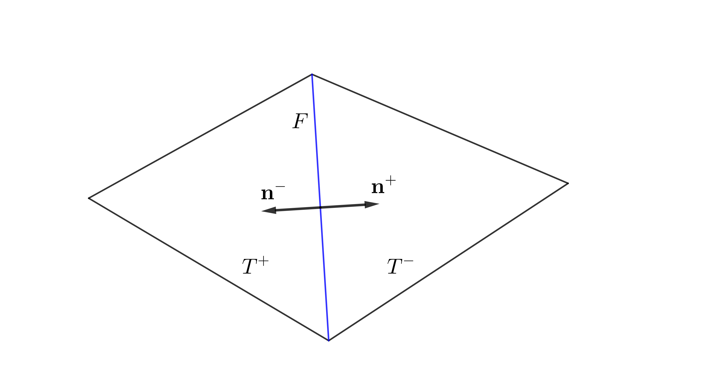

# Miscellaneous Concepts

[公式ページ](https://docs.nvidia.com/deeplearning/modulus/modulus-sym/user_guide/theory/miscellaneous.html)

## Generalized Polynomial Chaos

このセクションでは、一般化された多項式カオス（gPC）展開について簡単に紹介します。これは、モデル入力の不確実性が出力にどのように表れるかを評価するための効率的な方法です。後のセクションである[limerock_gPC_surrogate](https://docs.nvidia.com/deeplearning/modulus/modulus-sym/user_guide/advanced/industrial_heat_sink.html#limerock-gpc-surrogate)では、gPCがテッセレーションおよび構造的なソリッドジオメトリモジュールの形状パラメータ化の代替手段としてどのように使用されるかを示します。

$d$次元の入力$\mathbf{\Xi}$の$p$次のgPC展開は、次の形式を取ります。

$$
u_p (\mathbf{\Xi}) = \sum_{\mathbf{i} \in \Lambda_{p,d}} c_{\mathbf{i}} \psi_{\mathbf{i}}(\mathbf{\Xi})
\tag{97}$$

ここで、$\mathbf{i}$は多重指数であり、$\Lambda_{p,d}$は次のように定義される多重指数の集合です。

$$
\Lambda_{p,d} = \{\mathbf{i} \in \mathbb{N}_0^d: ||\mathbf{i}||_1 \leq p\}
\tag{98}$$

$\Lambda_{d,p}$の基数は、

$$
C = |\Lambda_{p,d}| = \frac{(p+d)!}{p!d!}.
\tag{99}$$

${c_{\mathbf{i}}}_{\mathbf{i} \in \mathbb{N}_0^d}$は展開の未知の係数の集合であり、確率的ガレルキン法、確率的コロケーション法、または最小二乗法に基づいて決定できます。このユーザーガイドで紹介されている例では、最小二乗法を使用します。この最小二乗問題を解くために必要なサンプル数は$C$ですが、合理的な精度のためには少なくとも$2C$のサンプルを使用することが推奨されています。

${\psi_{\mathbf{i}}}_{\mathbf{i} \in \mathbb{N}_0^d}$は、次の条件を満たす直交基底関数の集合です。

$$
\int \psi_\mathbf{m}(\mathbf{\xi}) \psi_\mathbf{n}(\mathbf{\xi}) \rho(\mathbf{\xi}) d\mathbf{\xi} = \delta_{\mathbf{m} \mathbf{n}}, \,\,\, \mathbf{m}, \mathbf{n} \in \mathbb{N}_0^d
\tag{100}$$

たとえば、一様分布および正規分布の場合、正規化されたLegendre多項式およびHermite多項式は、それぞれ[式100](#eq100)の直交性条件を満たします。

## Relative Function Spaces and Integral Identities

このセクションでは、相対関数空間、ソボレフ空間、およびいくつかの重要な等式のいくつかの基本的な定義を示します。このセクションでのすべての積分は、ルベーグ積分によって理解されるべきです。

## $L^p$ space

$\Omega \subset \mathbb{R}^d$が開集合であるとします。任意の実数$1<p<\infty$に対して、次のように定義します。

$$
L^p(\Omega)=\left\{u:\Omega\mapsto\mathbb{R}\bigg|u\text{ is measurable on }\Omega,\ \int_{\Omega}|u|^pdx<\infty \right\}
\tag{101}$$

ノルムを持つようにします。

$$
\|u\|_{L^p(\Omega)}=\left(\int_{\Omega}|u|^pdx\right)^{\frac{1}{p}}
\tag{102}$$

$p=\infty$の場合、次のようになります。

$$
L^\infty(\Omega)=\left\{u:\Omega\mapsto\mathbb{R}\bigg|u\text{ is uniformly bounded in  $\Omega$  except a zero measure set} \right\}
\tag{103}$$

ノルムを持つようにします。

$$
\|u\|_{L^\infty(\Omega)}=\sup_{\Omega}|u|.
\tag{104}$$

時々、非有界領域上の関数については、その局所積分可能性を考慮します。
このために、次のような局所 $L^p$ 空間を定義します。

$$
L^p_{loc}(\Omega)=\left\{u:\Omega\mapsto\mathbb{R}\bigg|u\in L^p(V),\ \forall V\subset\subset\Omega \right\},
\tag{105}$$

ここで、$V \subset\subset \Omega$ は $V$ が $\Omega$ のコンパクト部分集合であることを意味します。

## $C^k$ space

Let $k\geq 0$ be an integer, and $\Omega\subset \mathbb{R}^d$ is an
open set. The $C^k(\Omega)$ is the $k$-th differentiable
function space given by

$$
C^k(\Omega)=\left\{u:\Omega\mapsto\mathbb{R}\bigg|u\text{ is $ k $-times continuously differentiable}\right\}
\tag{106}$$

$k \geq 0$ を整数とし、$\Omega \subset \mathbb{R}^d$ を開集合とします。$C^k(\Omega)$ は以下で与えられる$k$ 次微分可能な関数空間です。

$$
D^{\mathbf{\alpha}}u=\frac{\partial^k}{\partial x_1^{\alpha_1}\partial x_2^{\alpha_2}\cdots\partial x_d^{\alpha_d}}u
\tag{107}$$

$\Omega$ の閉包を $\overline{\Omega}$ で表すと、次の関係が成り立ちます。

$$
C^k(\overline{\Omega})=\left\{u:\Omega\mapsto\mathbb{R}\bigg|D^{\mathbf{\alpha}}u\text{ is uniformly continuous on bounded subsets of $ \Omega $, }\forall|\mathbf{\alpha}|\leq k\right\}
\tag{108}$$

$k=0$ の場合、$C(\Omega)=C^0(\Omega)$ および $C(\overline{\Omega})=C^0(\overline{\Omega})$ と書きます。

我々は無限回微分可能な関数空間を定義します。

$$
C^\infty(\Omega)=\left\{u:\Omega\mapsto\mathbb{R}\bigg|u\text{ is infinitely differentiable} \right\}=\bigcap_{k=0}^\infty C^k(\Omega)
\tag{109}$$

そして、

$$
C^\infty(\overline{\Omega})=\bigcap_{k=0}^\infty C^k(\overline{\Omega})
\tag{110}$$

$C_0(\Omega)$および$C_0^k(\Omega)$は、コンパクトな台を持つ$C(\Omega)$、$C^k(\Omega)$内の関数を示すために使用されます。

## $W^{k,p}$ space

弱微分は以下の定義によって与えられます。[1](#ref1)

**Definition**

$u,\ v\in L^1_{\text{loc}}(\Omega)$ であり、$\mathbf{\alpha}$ がマルチインデックスであるとします。$v$ が $u$ の $\mathbf{\alpha}$ 階弱微分であると言います。これを次のように書きます。

$$
D^{\mathbf{\alpha}}u=v
\tag{111}$$

provided

$$
\int_\Omega uD^{\mathbf{\alpha}}\phi dx=(-1)^{|\mathbf{\alpha}|}\int_{\Omega}v\phi dx
\tag{112}$$

典型的な例として、$u(x)=|x|$ および $\Omega=(-1,1)$ を考えます。微積分では、$x=0$ で $u$ は（古典的な）微分可能ではないことがわかります。しかし、$u$ は次のような弱微分を持ちます。

$$
(Du)(x)=
\begin{cases}
1   & x>0,\\
-1  &   x\leq 0.
\end{cases}
\tag{113}$$

**Definition**

整数 $k\geq 0$ および実数 $p\geq 1$ に対して、ソボレフ空間は以下で定義されます。

$$
W^{k,p}(\Omega)=\left\{u\in L^p(\Omega)\bigg|D^{\mathbf{\alpha}}u\in L^p(\Omega),\ \forall|\mathbf{\alpha}|\leq k\right\}
\tag{114}$$

ノルムで定義される

$$
\|u\|_{k,p}=\left(\int_{\Omega}\sum_{|\mathbf{\alpha}|\leq k}|D^{\mathbf{\alpha}}u|^p\right)^{\frac{1}{p}}
\tag{115}$$

明らかに、$k=0$ のとき、$W^{0,p}(\Omega)=L^p(\Omega)$ です。

$p=2$ のとき、$W^{k,p}(\Omega)$ は Hilbert 空間です。これはまた、$H^k(\Omega)=W^{k,2}(\Omega)$ と表記されます。$H^k(\Omega)$ の内積は以下のように与えられます。

$$
\langle u, v \rangle =\int_{\Omega}\sum_{|\mathbf{\alpha}|\leq k}D^{\mathbf{\alpha}}uD^{\mathbf{\alpha}}v dx
\tag{116}$$

$W^{k,p}(\Omega)$ の重要な部分集合は、$W^{k,p}_0(\Omega)$ であり、

$$
W^{k,p}_0(\Omega)=\left\{u\in W^{k,p}(\Omega)\bigg| D^{\mathbf{\alpha}}u|_{\partial\Omega}=0,\ \forall|\mathbf{\alpha}|\leq k-1\right\}.
\tag{117}$$

$H^k_0(\Omega)$ を $W_0^{k,2}(\Omega)$ と書くのは一般的です。

## Integral Identities
---

この小節では、$\Omega\subset \mathbb{R}^d$ がリプシッツ有界領域であると仮定します（リプシッツ領域の定義については[3](#ref3)を参照してください）。

**Theorem (Green's formulae)**

$u,\ v\in C^2(\overline{\Omega})$ とします。

$$
\int_\Omega \Delta u dx =\int_{\partial\Omega} \frac{\partial u}{\partial n} dS
\tag{118}$$

$$
\int_\Omega \nabla u\cdot\nabla v dx = -\int_\Omega u\Delta v dx+\int_{\partial\Omega} u \frac{\partial v}{\partial n} dS
\tag{119}$$

$$
\int_{\Omega} u\Delta v-v\Delta u dx = \int_{\partial\Omega} u\frac{\partial v}{\partial n}-v\frac{\partial u}{\partial n} dS
\tag{120}$$

カール演算子にはいくつか類似した同等の式があります。まず、1次元および2次元のカール演算子を定義します。スカラー関数$u(x_1,x_2)\in C^1(\overline{\Omega})$に対して、次の式が成り立ちます。

$$
\nabla \times u = \left(\frac{\partial u}{\partial x_2},-\frac{\partial u}{\partial x_1}\right)
\tag{121}$$

2次元のベクトル関数$\mathbf{v}=(v_1(x_1,x_2),v_2(x_1,x_2))\in(C^1(\overline{\Omega}))^2$に対して、以下の式が成り立ちます。

$$
\nabla \times \mathbf{v} = \frac{\partial v_2}{\partial x_1}-\frac{\partial v_1}{\partial x_2}
\tag{122}$$

次に、カール演算子に対する次の積分の同等性が成り立ちます。

**Theorem**

$\Omega\subset \mathbb{R}^3$かつ$\mathbf{u},\ \mathbf{v}\in (C^1(\overline{\Omega}))^3$であるとします。すると、以下が成り立ちます。

$$
\int_{\Omega}\nabla \times \mathbf{u}\cdot\mathbf{v} dx = \int_{\Omega}\mathbf{u}\cdot\nabla \times \mathbf{v} dx+\int_{\partial\Omega}\mathbf{n} \times \mathbf{u} \cdot \mathbf{v} dS
\tag{123}$$

ここで、$\mathbf{n}$は外向き単位法線ベクトルです。

$\Omega\subset \mathbb{R}^2$かつ$\mathbf{u}\in (C^1(\overline{\Omega}))^2$かつ$v\in C^1(\overline{\Omega})$であるとします。すると、以下が成り立ちます。

$$
\int_{\Omega}\nabla\times\mathbf{u} v dx = \int_{\Omega}\mathbf{u}\cdot\nabla\times v dx+\int_{\partial\Omega}\mathbf{\tau}\cdot\mathbf{u} vdS,
\tag{124}$$

ここで、$\mathbf{\tau}$は$\partial \Omega$の単位接線です。

## Derivation of Variational Form Example

$\Omega_1 = (0,0.5)\times(0,1)$、$\Omega_2 = (0.5,1)\times(0,1)$、$\Omega=(0,1)^2$とします。インタフェースは$\Gamma=\overline{\Omega}_1\cap\overline{\Omega}_2$であり、ディリクレ境界は$\Gamma_D=\partial\Omega$です。問題の領域は:numref:fig-domain-appendixで視覚化されています。この問題は[4](#ref4)で元々定義されていました。

Fig. 31 Left: Domain of interface problem. Right: True Solution

$$
\begin{aligned}
-u &= f \quad \text{ in } \Omega_1 \cup \Omega_2\\
u &= g_D \quad \text{ on } \Gamma_D\\
\frac{\partial u}{\partial \textbf{n}} &=g_I \quad \text{ on } \Gamma\end{aligned}
\tag{125}$$

ここで$f=-2$, $g_I=2$とすると

$$
g_D =
\begin{cases}
x^2 &   0\leq x\leq \frac{1}{2}\\
(x-1)^2 &   \frac{1}{2}< x\leq 1
\end{cases}
\tag{126}$$

$g_D$は[式125](#eq125)の厳密解です。

界面$\Gamma$上のジャンプ$[\cdot]$は次のように定義されます。

$$
\left[\frac{\partial u}{\partial \mathbf{n}}\right]=\nabla u_1\cdot\mathbf{n}_1+\nabla u_2\cdot\mathbf{n}_2
\tag{127}$$

ここで、$u_i$は$\Omega_i$内の解であり、$\mathbf{n}_i$は$\partial\Omega_i\cap\Gamma$上の単位法線です。

元の参照文献で示されているように、この問題は強い（古典的な）解を受け入れず、一意の弱い解（$g_D$）のみを受け入れます。これは:numref:fig-domain-appendixに示されています。

**Note:**
元の論文[4](#ref4)_では、PDEが正しくないことに注意してください。[式125](#eq125)は、問題の修正されたPDEを定義しています

ここで、[式125](#eq125)の変分形式を構築します。これは、その弱解を得るための第一歩です。方程式が解の導関数が界面（$\Gamma$）で途切れることを示唆しているので、$\Omega_1$と$\Omega_2$で変分形式を個別に行う必要があります。具体的には、$\Omega_i$上の適切なテスト関数$v_i$を使用して、部分積分を行うと、$i=1,2$について以下が得られます。

$$
\int_{\Omega_i}(\nabla u\cdot\nabla v_i-fv_i) dx - \int_{\partial\Omega_i}\frac{\partial u }{\partial \mathbf{n}}v_i ds = 0.
\tag{128}$$

もし1つのニューラルネットワークと$\Omega$全体で定義されたテスト関数を使用している場合、これら2つの等式を足し合わせることで、次のようになります。

$$
\int_{\Omega}(\nabla u\cdot\nabla v - fv) dx - \int_{\partial} g_Iv ds - \int_{\Gamma_D} \frac{\partial u}{\partial \mathbf{n}}v ds = 0
\tag{129}$$

もし$\Omega_1$と$\Omega_2$で異なるテスト関数を使用している場合、不連続Galerkin法[5](#ref5)を使用できます。そのためには、まずスカラーとベクトル関数のジャンプと平均を定義します。下図に示されているように、隣接する2つの要素を考えます。$T^+$、$T^-$上の単位法線$\mathbf{n}^+$、$\mathbf{n}^-$、$F=T^+\cap T^-$にそれぞれ。観察されるように、$\mathbf{n}^+=-\mathbf{n}^-$です。

$u^+$と$u^-$を$T^+$と$T^-$上の2つのスカラー関数とし、$\mathbf{v}^+$と$\mathbf{v}^-$をそれぞれ$T^+$と$T^-$上の2つのベクトル場とします。$F$上のジャンプと平均は次のように定義されます。

$$
\begin{aligned}
\langle u \rangle = \frac{1}{2}(u^++u^-)    &&  \langle \mathbf{v} \rangle = \frac{1}{2}(\mathbf{v}^++\mathbf{v}^-)\\
[\![ u ]\!] = u^+\mathbf{n}^++u^-\mathbf{n}^-  && [\![ \mathbf{v} ]\!] = \mathbf{v} ^+\cdot\mathbf{n}^++\mathbf{v} ^-\cdot\mathbf{n}^-\end{aligned}
\tag{130}$$

Fig. 32 Adjacent Elements.

**Lemma**

上図の$F$では、

$$
[\![ u\mathbf{v} ]\!] = [\![ u ]\!] \langle \mathbf{v} \rangle + [\![ \mathbf{v} ]\!] \langle u \rangle.
\tag{131}$$

上記の補題を使用することで、不連続形式の重要なツールである次の等式が得られます。

**Theorem**

$\Omega$がメッシュに分割されているとします。$\mathcal{T}$をメッシュのすべての要素の集合、$\mathcal{F}_I$をメッシュのすべての内部ファセットの集合、$\mathcal{F}_E$をメッシュのすべての外部（境界）ファセットの集合とします。すると、次のようになります。

$$
\sum_{T\in\mathcal{T}}\int_{\partial T}\frac{\partial u}{\partial \mathbf{n}} v ds = \sum_{e\in\mathcal{F}_I}\int_e \left([\![ \nabla u ]\!] \langle v \rangle + \langle \nabla u \rangle [\![  v ]\!] \right)ds+\sum_{e\in\mathcal{F}_E}\int_e \frac{\partial u}{\partial \mathbf{n}} v ds
\tag{132}$$

[式127](#eq127)と[式132](#eq132)を使用すると、次のような変分形式が得られます。

$$
\sum_{i=1}^2(\nabla u_i\cdot v_i - fv_i) dx - \sum_{i=1}^2\int_{\Gamma_D}\frac{\partial u_i}{\partial \mathbf{n}} v_i ds-\int_{\partial}(g_I\langle v \rangle+\langle \nabla u \rangle [\![ v ]\!] ds =0
\tag{133}$$

これらの形式の使用方法の詳細については、チュートリアル:ref:variational-exampleを参照してください。

## Reference

$$
\text{ref1 : Evans, Lawrence C}
\\\
\text{"Partial differential equations and Monge-Kantorovich mass transfer.” Current developments in mathematics 1997.1 (1997): 65-126.}
\tag{ref1}$$

$$
\text{ref2 : Xiu, Dongbin}
\\\
\text{Numerical methods for stochastic computations. Princeton university press, 2010.}
\tag{ref2}$$

$$
\text{ref3 : Cockburn, Bernardo, George E. Karniadakis, and Chi-Wang Shu, eds.}
\\\
\text{“A finite element method for approximating the time-harmonic Maxwell equations.” Numerische mathematik 63.1 (1992): 243-261.}
\tag{ref3}$$

$$
\text{ref4 : Monk, Peter.}
\\\
\text{"Discontinuous Galerkin methods: theory, computation and applications. Vol. 11. Springer Science \& Business Media, 2012."}
\tag{ref4}$$
