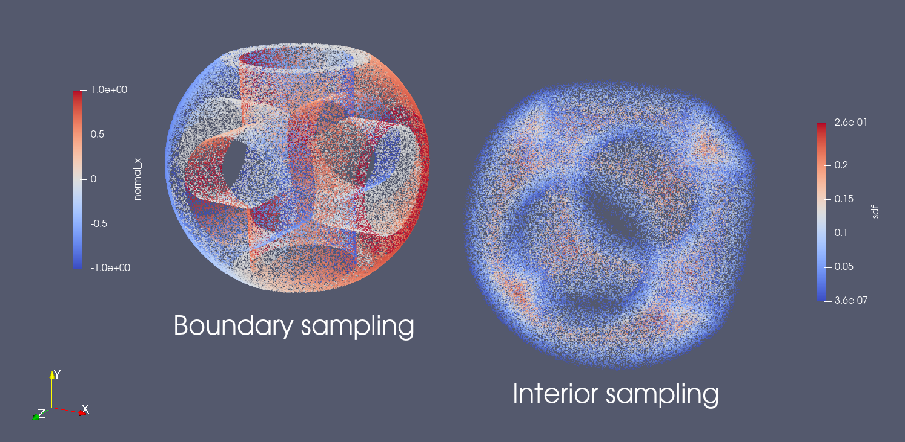
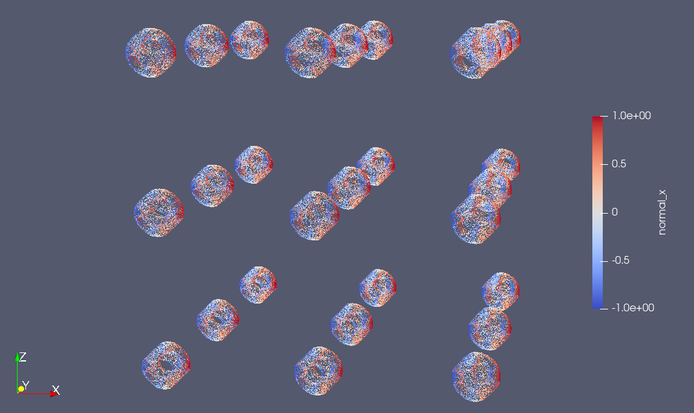
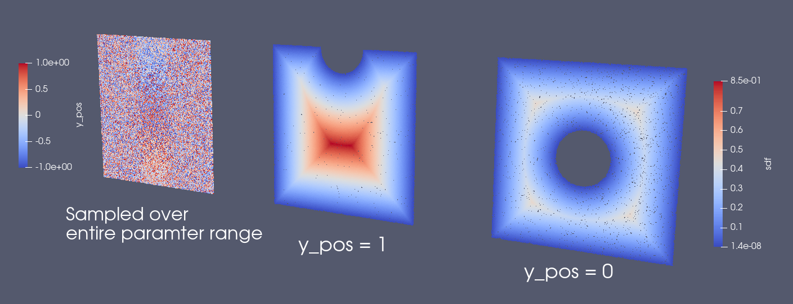
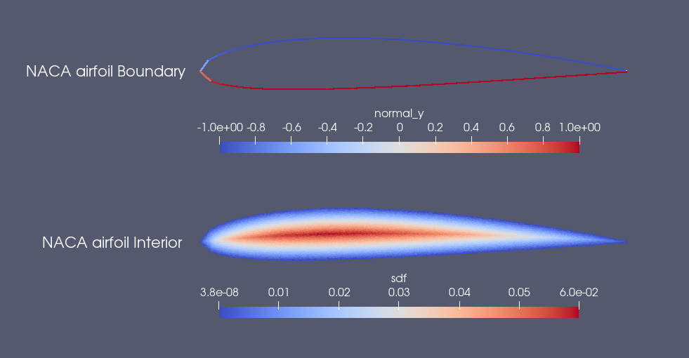
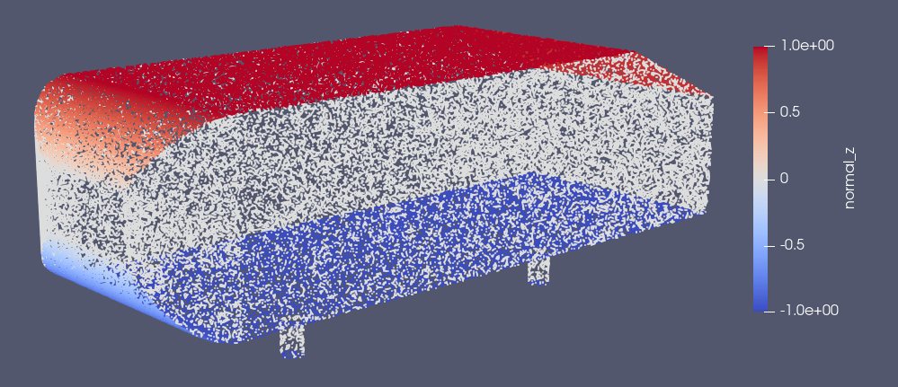
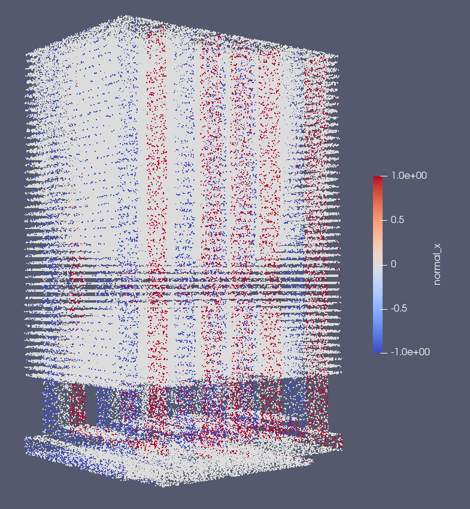
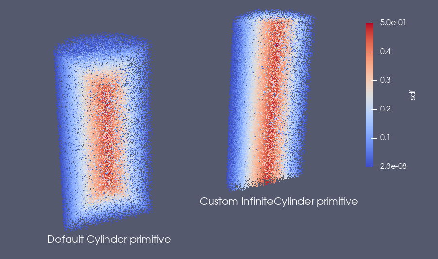
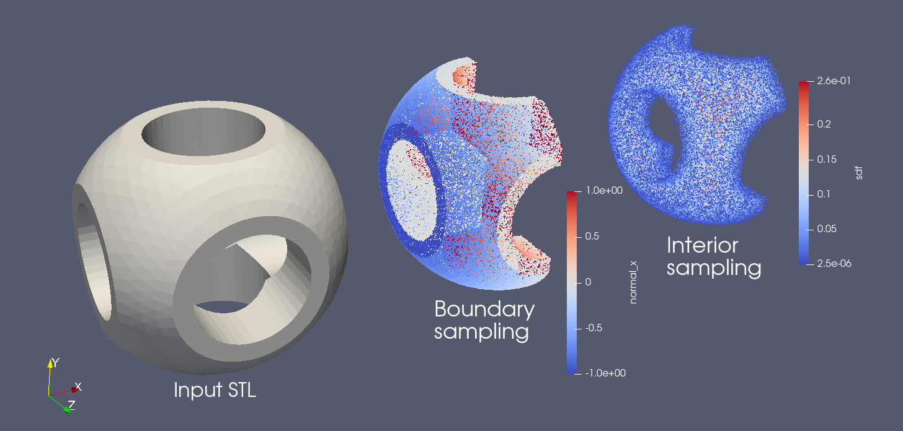
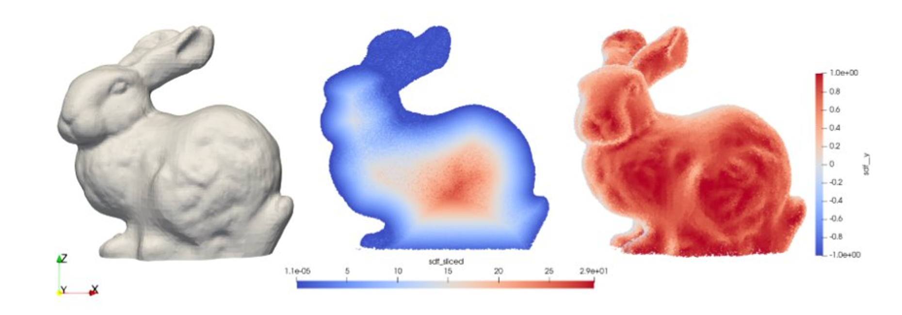

# Geometry Modules

[公式ページ](https://docs.nvidia.com/deeplearning/modulus/modulus-sym/user_guide/features/csg_and_tessellated_module.html)

## Constructive Solid Geometry

Modulus Symでは、物理情報を与えられたトレーニングに必要なポイントクラウドのサンプリングに使用できるいくつかの1D、2D、および3Dプリミティブが提供されています。
これらのプリミティブは、和（```+```）、積（```&```）、差（```-```）などの標準のブール演算*をサポートしています。ブール演算は、異なるプリミティブの符号付き距離フィールド上で機能します。

以下の例は、Modulus Symを使用して構築されたシンプルなCSGプリミティブを示しています。

``` python
import numpy as np
from modulus.sym.geometry.primitives_3d import Box, Sphere, Cylinder
from modulus.sym.utils.io.vtk import var_to_polyvtk

# number of points to sample
nr_points = 100000

# make standard constructive solid geometry example
# make primitives
box = Box(point_1=(-1, -1, -1), point_2=(1, 1, 1))
sphere = Sphere(center=(0, 0, 0), radius=1.2)
cylinder_1 = Cylinder(center=(0, 0, 0), radius=0.5, height=2)
cylinder_2 = cylinder_1.rotate(angle=float(np.pi / 2.0), axis="x")
cylinder_3 = cylinder_1.rotate(angle=float(np.pi / 2.0), axis="y")

# combine with boolean operations
all_cylinders = cylinder_1 + cylinder_2 + cylinder_3
box_minus_sphere = box & sphere
geo = box_minus_sphere - all_cylinders

# sample geometry for plotting in Paraview
s = geo.sample_boundary(nr_points=nr_points)
var_to_polyvtk(s, "boundary")
print("Surface Area: {:.3f}".format(np.sum(s["area"])))
s = geo.sample_interior(nr_points=nr_points, compute_sdf_derivatives=True)
var_to_polyvtk(s, "interior")
print("Volume: {:.3f}".format(np.sum(s["area"])))
```



Fig. 33 Constructive Solid Geometry using Modulus Sym primitives

プリミティブの完全なリストは、```modulus.geometry.primitives_*```を参照してください。

Note :
複雑なプリミティブを生成する際に注意すべき点は、ブール演算が最終段階で行われるため、ブール演算の順序に不変であることです。言い換えると、1つのプリミティブから別のプリミティブを減算している場合、減算された領域に別のプリミティブを追加することになっても、新しく追加されたプリミティブは見えないことです。

生成されたジオメトリオブジェクトは、```translate```、```scale```、```rotate```、```repeat```などの操作もサポートしており、より複雑なプリミティブをさらに生成することができます。

```python
# apply transformations
geo = geo.scale(0.5)
geo = geo.rotate(angle=np.pi / 4, axis="z")
geo = geo.rotate(angle=np.pi / 4, axis="y")
geo = geo.repeat(spacing=4.0, repeat_lower=(-1, -1, -1), repeat_higher=(1, 1, 1))

# sample geometry for plotting in Paraview
s = geo.sample_boundary(nr_points=nr_points)
var_to_polyvtk(s, "repeated_boundary")
print("Repeated Surface Area: {:.3f}".format(np.sum(s["area"])))
s = geo.sample_interior(nr_points=nr_points, compute_sdf_derivatives=True)
var_to_polyvtk(s, "repeated_interior")
print("Repeated Volume: {:.3f}".format(np.sum(s["area"])))
```



Fig. 34 Geometry transforms

CSG（Constructive Solid Geometry）オブジェクトは、sympyを使用して簡単にパラメータ化できます。これに関する例は、:ref:ParameterizedSimで使用されています。

```python
from modulus.sym.geometry.primitives_2d import Rectangle, Circle
from modulus.sym.utils.io.vtk import var_to_polyvtk
from modulus.sym.geometry.parameterization import Parameterization, Parameter

# make plate with parameterized hole
# make parameterized primitives
plate = Rectangle(point_1=(-1, -1), point_2=(1, 1))
y_pos = Parameter("y_pos")
parameterization = Parameterization({y_pos: (-1, 1)})
circle = Circle(center=(0, y_pos), radius=0.3, parameterization=parameterization)
geo = plate - circle

# sample geometry over entire parameter range
s = geo.sample_boundary(nr_points=100000)
var_to_polyvtk(s, "parameterized_boundary")
s = geo.sample_interior(nr_points=100000)
var_to_polyvtk(s, "parameterized_interior")

# sample specific parameter
s = geo.sample_boundary(
    nr_points=100000, parameterization=Parameterization({y_pos: 0})
)
var_to_polyvtk(s, "y_pos_zero_boundary")
s = geo.sample_interior(
    nr_points=100000, parameterization=Parameterization({y_pos: 0})
)
var_to_polyvtk(s, "y_pos_zero_interior")
```



Fig. 35 Parameterized Constructive Solid Geometry using Modulus Sym primitives

Modulus Symのジオメトリモジュールを使用して生成されたいくつかの興味深い形状が以下に示されています。



Fig. 36 NACA airfoil usiing ``Polygon`` primitive. (script at ``/examples/geometry/naca_airfoil.py``)



Fig. 37 Ahmed body



Fig. 38 Industrial heatsink geometry

## Defining Custom Primitives

アプリケーションに定義されたプリミティブが見つからない場合、Modulus Symの基本クラスを使用して簡単に設定できます。必要なのは、符号付き距離場とジオメトリの表面の適切な式を考えることです。以下に例を示します。

```python
from sympy import Symbol, pi, sin, cos, sqrt, Min, Max, Abs

from modulus.sym.geometry.geometry import Geometry, csg_curve_naming
from modulus.sym.geometry.helper import _sympy_sdf_to_sdf
from modulus.sym.geometry.curve import SympyCurve, Curve
from modulus.sym.geometry.parameterization import Parameterization, Parameter, Bounds
from modulus.sym.geometry.primitives_3d import Cylinder
from modulus.sym.utils.io.vtk import var_to_polyvtk

class InfiniteCylinder(Geometry):
    """
    3D Infinite Cylinder
    Axis parallel to z-axis, no caps on ends

    Parameters
    ----------
    center : tuple with 3 ints or floats
        center of cylinder
    radius : int or float
        radius of cylinder
    height : int or float
        height of cylinder
    parameterization : Parameterization
        Parameterization of geometry.
    """

    def __init__(self, center, radius, height, parameterization=Parameterization()):
        # make sympy symbols to use
        x, y, z = Symbol("x"), Symbol("y"), Symbol("z")
        h, r = Symbol(csg_curve_naming(0)), Symbol(csg_curve_naming(1))
        theta = Symbol(csg_curve_naming(2))

        # surface of the cylinder
        curve_parameterization = Parameterization(
            {h: (-1, 1), r: (0, 1), theta: (0, 2 * pi)}
        )
        curve_parameterization = Parameterization.combine(
            curve_parameterization, parameterization
        )
        curve_1 = SympyCurve(
            functions={
                "x": center[0] + radius * cos(theta),
                "y": center[1] + radius * sin(theta),
                "z": center[2] + 0.5 * h * height,
                "normal_x": 1 * cos(theta),
                "normal_y": 1 * sin(theta),
                "normal_z": 0,
            },
            parameterization=curve_parameterization,
            area=height * 2 * pi * radius,
        )
        curves = [curve_1]

        # calculate SDF
        r_dist = sqrt((x - center[0]) ** 2 + (y - center[1]) ** 2)
        sdf = radius - r_dist

        # calculate bounds
        bounds = Bounds(
            {
                Parameter("x"): (center[0] - radius, center[0] + radius),
                Parameter("y"): (center[1] - radius, center[1] + radius),
                Parameter("z"): (center[2] - height / 2, center[2] + height / 2),
            },
            parameterization=parameterization,
        )

        # initialize Infinite Cylinder
        super().__init__(
            curves,
            _sympy_sdf_to_sdf(sdf),
            dims=3,
            bounds=bounds,
            parameterization=parameterization,
        )


nr_points = 100000

cylinder_1 = Cylinder(center=(0, 0, 0), radius=0.5, height=2)
cylinder_2 = InfiniteCylinder(center=(0, 0, 0), radius=0.5, height=2)

s = cylinder_1.sample_interior(nr_points=nr_points, compute_sdf_derivatives=True)
var_to_polyvtk(s, "interior_cylinder")

s = cylinder_2.sample_interior(nr_points=nr_points, compute_sdf_derivatives=True)
var_to_polyvtk(s, "interior_infinite_cylinder")
```



Fig. 39 Custom primitive  in Modulus Sym. The cylinders are sliced to visualize the interior SDF

## Tesselated Geometry

Modulus Symでは、より複雑な形状の場合、ジオメトリをSTL形式でインポートすることができます。このモジュールは、SDFとその導関数を計算するためにレイトレーシングを使用します。また、ジオメトリの表面サンプリングのためにジオメトリの表面法線も提供します。ジオメトリがインポートされると、ポイントクラウドをトレーニングに使用できます。これに関する例は、[STL Geometry: Blood Flow in Intracranial Aneurysm](https://docs.nvidia.com/deeplearning/modulus/modulus-sym/user_guide/intermediate/adding_stl_files.html#stl)にあります。

テッセレーションされたジオメトリは、プリミティブと組み合わせることもできます。

```python
import numpy as np
from modulus.sym.geometry.tessellation import Tessellation
from modulus.sym.geometry.primitives_3d import Plane
from modulus.sym.utils.io.vtk import var_to_polyvtk

# number of points to sample
nr_points = 100000

# make tesselated geometry from stl file
geo = Tessellation.from_stl("./stl_files/tessellated_example.stl")

# tesselated geometries can be combined with primitives
cut_plane = Plane((0, -1, -1), (0, 1, 1))
geo = geo & cut_plane

# sample geometry for plotting in Paraview
s = geo.sample_boundary(nr_points=nr_points)
var_to_polyvtk(s, "tessellated_boundary")
print("Repeated Surface Area: {:.3f}".format(np.sum(s["area"])))
s = geo.sample_interior(nr_points=nr_points, compute_sdf_derivatives=True)
var_to_polyvtk(s, "tessellated_interior")
print("Repeated Volume: {:.3f}".format(np.sum(s["area"])))
```



Fig. 40 Tesselated Geometry sampling using Modulus Sym



Fig. 41 Tesselated Geometry sampling using Modulus Sym: Stanford bunny
