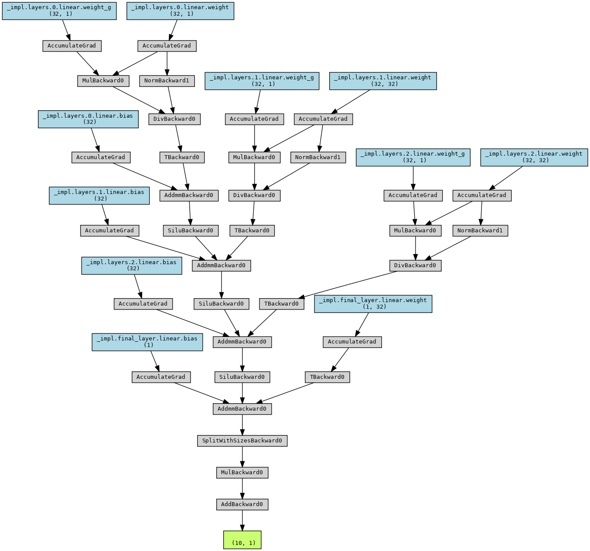

# Computational Graph, Nodes and Architectures

[公式ページ](https://docs.nvidia.com/deeplearning/modulus/modulus-sym/user_guide/features/nodes.html)

Modulus Symには、ニューラルネットワークアーキテクチャや方程式を問題に追加することが非常に簡単になるAPIが含まれています。
Modulus Symは、これらのさまざまなノードを構築するためにPytorchのtorch.nn.Moduleを利用しています。ノードは、トレーニング中のフォワードパスで実行されるコンポーネントを表します。
Modulus Symのノードは、入出力変数がどのように必要かに関する追加情報を含むtorch.nn.Moduleのラッパーと考えることができます。これにより、Modulus Symはマルチオブジェクティブ問題の実行グラフを開発することができます。ノードには、Modulus Symに組み込まれたPyTorchニューラルネットワークや、ユーザー定義のPyTorchネットワーク、特徴変換、および方程式などのモデルまたは関数が含まれる可能性があります。

ノードは、互いに簡単に対話できるように組み合わされています。言い換えれば、数行のコードで、ニューラルネットワークアーキテクチャの出力を使用してPDE損失を計算する計算グラフを作成したり、いくつかの方程式の出力を使用するアーキテクチャを作成したりすることが可能です。Modulus Symは、問題を最適化問題のように設定して解決します。最適化目的は、Modulus Symの制約を使用して定義されます。さまざまなタイプの制約については、[Constraints](https://docs.nvidia.com/deeplearning/modulus/modulus-sym/user_guide/features/constraints.html#constraints-doc) で詳しく説明されています。各制約への入力の1つは```ノード```です。
これは、指定された出力（制約またはデータセットの```outvar```で指定された）を計算するために必要なすべてのModulus Symノード（アーキテクチャ、方程式など）のリストです。入力（制約またはデータセットの```invar```で指定された）から。 Modulus Symは、必要な導関数とモデルの勾配を計算して計算グラフを準備し、損失を評価する方法を解決します。指定されたinvarsから必要なoutvarsを計算するのを妨げる情報が不足している場合、Modulus Symはグラフの展開エラーをスローします。

Note :
Modulus SymのCSG / Tessellatedジオメトリオブジェクトに対してmodulus.domain.continuousモジュールからの制約を使用する場合、追加情報（法線、面積、符号付き距離関数など）が必要に応じてinvarディクショナリに暗黙的に追加されます

この例では、Modulus Sym内で利用可能なさまざまなタイプのアーキテクチャと方程式を探索し、それぞれをカスタマイズして独自のカスタムモデルを準備する方法について見ていきます。

## Architectures

Modulus Symには、完全に接続された多層パーセプトロン、フーリエ特徴量ニューラルネットワーク、SiReNs、フーリエニューラル演算子、DeepNeuralOperatorsなど、いくつかの最適化されたアーキテクチャが含まれているモデルゾーが用意されています。これらの各アーキテクチャは、プロジェクトで簡単にインスタンス化でき、モデルのハイパーパラメータをhydraを使用して調整できます。
これらのさまざまなニューラルネットワークの構成に関する詳細については、:ref:configを参照してください。
これらのモデルの理論と数学的基礎について詳しく知りたい場合は、:ref:architecturesを参照してください。
以下では、Modulus Sym内でニューラルネットワークモデルを使用する2つの異なる方法を紹介します。

Modulus Symのすべてのモデルには、```.make_nodes()```というメソッドがあり、このメソッドを使用してネットワークアーキテクチャの計算グラフを生成します。

モデルや```torchviz```などの可視化ライブラリを使用して、アーキテクチャとその中間層を視覚化することができます。

```python
from modulus.sym.models.fully_connected import FullyConnectedArch
from modulus.sym.key import Key

u_net = FullyConnectedArch(
    input_keys=[Key("x")], output_keys=[Key("u")], nr_layers=3, layer_size=32
)

# visualize the network
print(u_net)

# graphically visualize the PyTorch execution graph # NOTE: Requires installing torchviz library: https://pypi.org/project/torchviz/
import torch
from torchviz import make_dot

# pass dummy data through the model 
data_out = u_net({"x": (torch.rand(10, 1)),})
make_dot(data_out["u"], params=dict(u_net.named_parameters())).render("u_network", format="png")
```



Fig. 42 Visualizing a neural network model in Modulus Sym using Torchviz

いくつかの場所で、```Key```と```Node```の使用が見られます。 ```Key```クラスは、グラフの展開/評価に使用される入力および出力を記述するために使用されます。最も基本的なキーは、単にモデルの入力または出力の名前を表す文字列です。 ```Node```クラスは、グラフ内の典型的なノードを表します。 ノードは、いくつかの入力を与えられた場合に、式を評価して出力を生成します。

## Equations

Modulus Symは、科学や工学の問題に対するソリューションを開発するためのフレームワークです。これらの両分野には方程式が中心にありますので、Modulus Symにはこれらの方程式を簡単に定義するためのいくつかのユーティリティが用意されています。Modulus Symのシンボリックライブラリを使用すると、SymPyを使用して方程式を最も自然な方法で定義できます。これらの式は、バックエンドでPyTorchの式に変換されます。Modulus Symには、1D/2D/3Dの定常または過渡的な問題に適用できるようにカスタマイズ可能ないくつかの組み込みの偏微分方程式（PDE）が付属しています（これはすべてのPDEに適用されるわけではありません）。現在、Modulus Symで利用可能なPDEの非網羅的なリストは以下の通りです。

・AdvectionDiffusion: 移流拡散方程式  
・GradNormal: スカラーの法線勾配  
・Diffusion: 拡散方程式  
・MaxwellFreqReal: 周波数領域のマクスウェル方程式  
・LinearElasticity: 線形弾性方程式  
・LinearElasticityPlaneStress: 平面応力の線形弾性方程式  
・NavierStokes: 流体流れのナビエ・ストークス方程式  
・ZeroEquation: ゼロ方程式乱流モデル  
・WaveEquation: 波動方程式  

偏微分方程式（PDEs）はシンボリックに定義されているため、正しい実装を確認するために印刷できます。

```python
>>> from modulus.sym.eq.pdes.navier_stokes import NavierStokes

>>> ns = NavierStokes(nu=0.01, rho=1, dim=2)
>>> ns.pprint()
    continuity: u__x + v__y
    momentum_x: u*u__x + v*u__y + p__x + u__t - 0.01*u__x__x - 0.01*u__y__y
    momentum_y: u*v__x + v*v__y + p__y + v__t - 0.01*v__x__x - 0.01*v__y__y
```

## Custom PDEs

```PDE```クラスを使用すると、SymPyで方程式をシンボリックに記述できます。これにより、できるだけ自然な方法で方程式を素早く記述できます。
以下に、単純な偏微分方程式を設定するためのコードが示されています。

```python
from sympy import Symbol, Number, Function
from modulus.sym.eq.pde import PDE

class CustomPDE(PDE):
    def __init__(self, f=1.0):
        # coordinates
        x = Symbol("x")

        # make input variables
        input_variables = {"x": x}

        # make u function
        u = Function("u")(*input_variables)

        # source term
        if type(f) is str:
            f = Function(f)(*input_variables)
        elif type(f) in [float, int]:
            f = Number(f)

        # set equations
        self.equations = {}
        self.equations["custom_pde"] = (
            u.diff(x, 2) - f
        )  # "custom_pde" key name will be used in constraints

eq = CustomPDE(f=1.0)
```

## Custom Nodes

Modulus Symは、ユーザーがカスタム計算用の単純なノードを作成することも可能です。これらは、SymPyを使用するか、基本の```Node```クラスを使用して生成することができます。以下に、その例をいくつか示します。

## Custom Nodes using ``torch.nn.Module``

```python
>>> import torch
>>> import torch.nn as nn
>>> from torch import Tensor
>>> from typing import Dict
>>> import numpy as np
>>> from modulus.sym.node import Node
>>> class ComputeSin(nn.Module):
...     def forward(self, in_vars: Dict[str, Tensor]) -> Dict[str, Tensor]:
...         return {"sin_x": torch.sin(in_vars["x"])}
... 
>>> node = Node(['x'], ['sin_x'], ComputeSin())
>>> node.evaluate({"x": (torch.ones(10, 1))*np.pi/4,})
    {'sin_x': tensor([[0.7071],
    [0.7071],
    [0.7071],
    [0.7071],
    [0.7071],
    [0.7071],
    [0.7071],
    [0.7071],
    [0.7071],
    [0.7071]])}
```

## Custom Nodes using SymPy

以下に、シンボリックな式を使用して```Node```を生成する例コードを示します。

```python
>>> import torch
>>> import numpy as np
>>> from sympy import Symbol, sin
>>> from modulus.sym.node import Node
>>> node = Node.from_sympy(sin(Symbol("x")), "sin_x")
>>> node.evaluate({"x": (torch.ones(10, 1))*np.pi/4,})
    {'sin_x': tensor([[0.7071],
    [0.7071],
    [0.7071],
    [0.7071],
    [0.7071],
    [0.7071],
    [0.7071],
    [0.7071],
    [0.7071],
    [0.7071]])}
```
