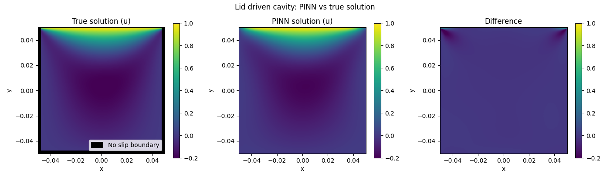
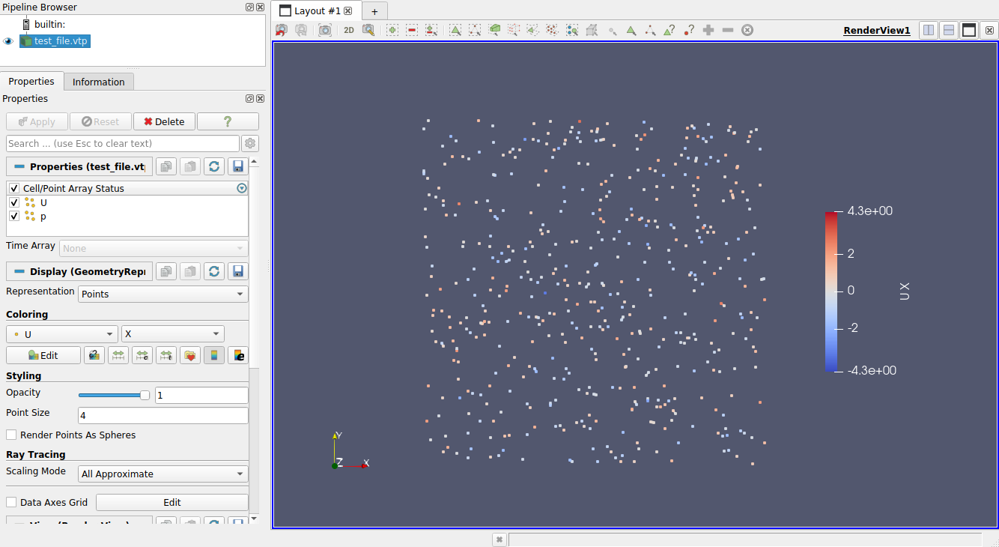
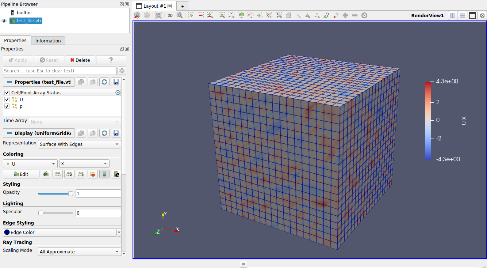
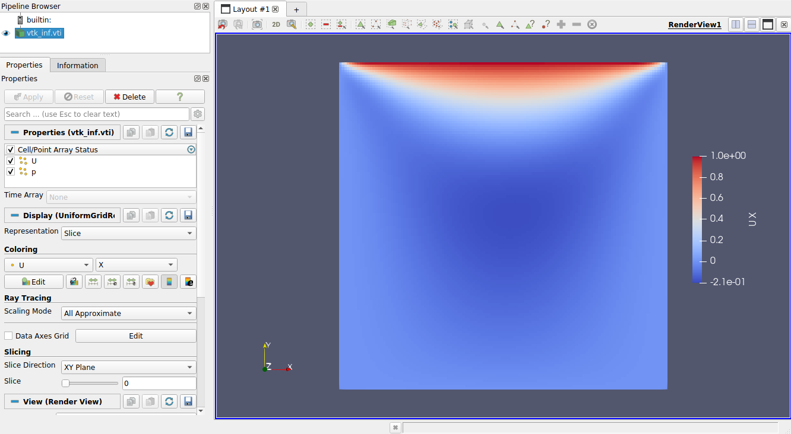
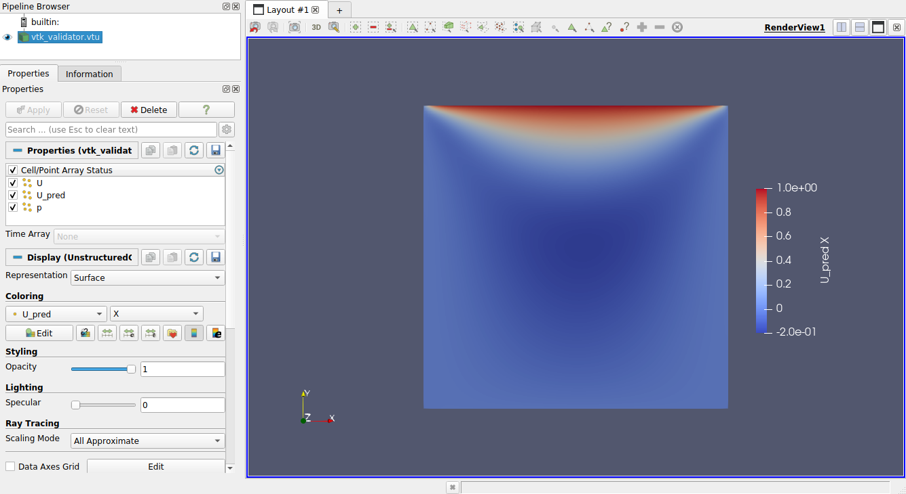
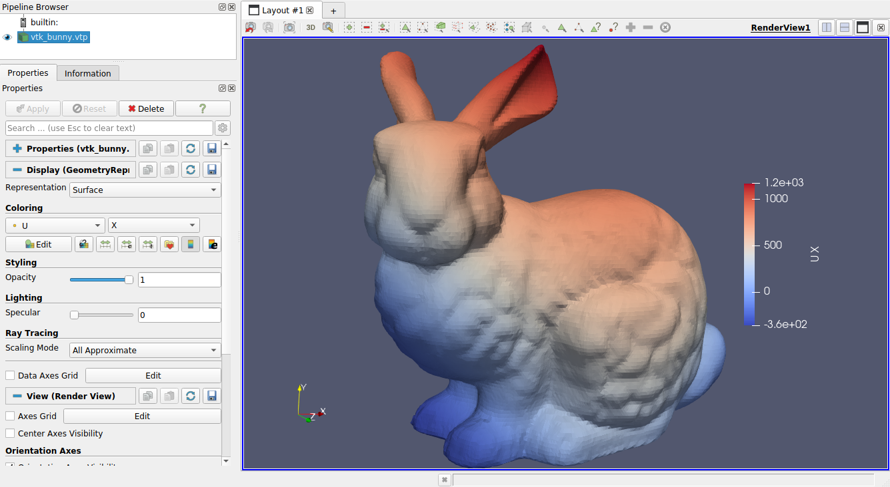
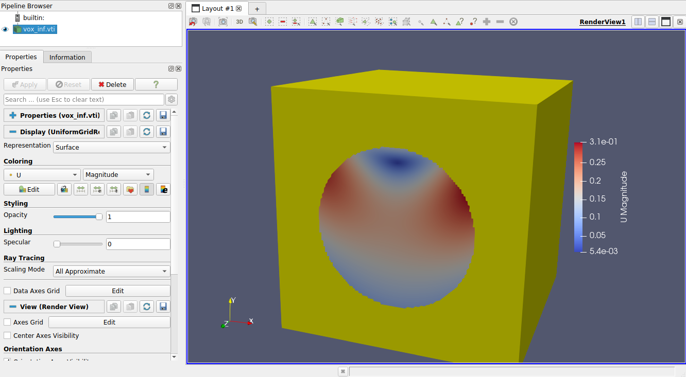
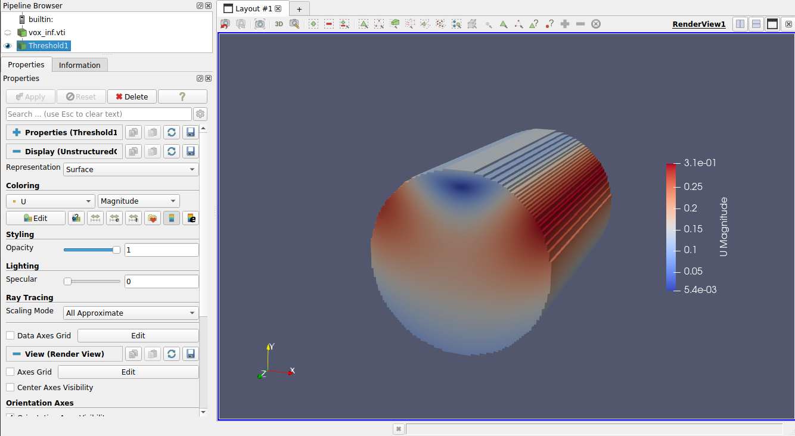

# Post Processing in Modulus Sym

[公式ページ](https://docs.nvidia.com/deeplearning/modulus/modulus-sym/user_guide/features/post_processing.html)

## TensorBoard in Modulus Sym

## Introduction

このセクションでは、（カスタム）プロットをTensorBoardに追加することで、モデルのトレーニング中にモデルの出力を視覚化する方法を示します。これらの視覚化は、モデルの性能を定性的に評価するための簡単な方法を提供します。
プロットは、Modulus Symのバリデータ（つまり、モデルの出力をある基準データセットと比較してプロットする）またはインファレンサー（つまり、一連の入力を与えられた場合にモデルの出力だけをプロットする）を使用して作成できます。
提供されているデフォルトのプロッターを使用するか、独自のカスタムプロッターを定義することができます。
リッド駆動空洞の例でTensorBoardのカスタムプロットの例を示します：ref：Introductory Example。



Fig. 43 Example custom TensorBoard plots for the lid driven cavity example.

## Workflow Overview

TensorBoardにプロットを追加する全体のワークフローは以下の通りです：

1. modulus.utils.io.plotterからValidatorPlotterまたはInferencerPlotterクラスのいずれかをインスタンス化します。例えば、plotter = ValidatorPlotter()のようにします。

2. バリデータまたはインファレンサーオブジェクトを作成する際に、このプロッターをオプション引数として渡します。例えば、validator = PointwiseValidator(invar, true_outvar, nodes, plotter=plotter)のようにします。

3. このバリデータまたはインファレンサーオブジェクトを通常通りにドメイン／ソルバーに追加します。

Modulus Symが残りの作業を処理し、一定数のトレーニング反復後、プロッターがバリデータまたはインファレンサーの入力と出力のプロットをTensorBoardに追加します。
カスタムプロッターを定義するには、独自のPlotterクラスを定義し、ValidatorPlotterまたはInferencerPlotterを継承し、その__call__メソッドをオーバーライドします。リッド駆動空洞の例で詳細を説明します。

Note :
これらのプロットがTensorBoardに追加される頻度は、プロジェクトの設定ファイルである```config```の```rec_validation_freq```と```rec_inference_freq```の値を変更することで変更できます。頻度を下げることで、大きなTensorBoardイベントファイルの作成を避けることができます。

プロットはTensorBoardの```Images```タブで見つけることができます。

## Lid Driven Cavity Example

To show you how to use this workflow, an example of creating custom TensorBoard plots for the lid driven cavity  (:ref:`Introductory Example`) example is provided below.
First you define a custom ``ValidatorPlotter`` class, overriding its ``__call__`` methods with a custom plotting function:

```python
import numpy as np
import scipy.interpolate
import matplotlib.pyplot as plt

from modulus.sym.utils.io.plotter import ValidatorPlotter

# define custom class
class CustomValidatorPlotter(ValidatorPlotter):

    def __call__(self, invar, true_outvar, pred_outvar):
        "Custom plotting function for validator"
        
        # get input variables
        x,y = invar["x"][:,0], invar["y"][:,0]
        extent = (x.min(), x.max(), y.min(), y.max())        
        
        # get and interpolate output variable
        u_true, u_pred = true_outvar["u"][:,0], pred_outvar["u"][:,0]
        u_true, u_pred = self.interpolate_output(x, y, 
                                                [u_true, u_pred], 
                                                extent,
        )
        
        # make plot
        f = plt.figure(figsize=(14,4), dpi=100)
        plt.suptitle("Lid driven cavity: PINN vs true solution")
        plt.subplot(1,3,1)
        plt.title("True solution (u)")
        plt.imshow(u_true.T, origin="lower", extent=extent, vmin=-0.2, vmax=1)
        plt.xlabel("x"); plt.ylabel("y")
        plt.colorbar()
        plt.vlines(-0.05, -0.05, 0.05, color="k", lw=10, label="No slip boundary")
        plt.vlines( 0.05, -0.05, 0.05, color="k", lw=10)
        plt.hlines(-0.05, -0.05, 0.05, color="k", lw=10)
        plt.legend(loc="lower right")
        plt.subplot(1,3,2)
        plt.title("PINN solution (u)")
        plt.imshow(u_pred.T, origin="lower", extent=extent, vmin=-0.2, vmax=1)
        plt.xlabel("x"); plt.ylabel("y")
        plt.colorbar()
        plt.subplot(1,3,3)
        plt.title("Difference")
        plt.imshow((u_true-u_pred).T, origin="lower", extent=extent, vmin=-0.2, vmax=1)
        plt.xlabel("x"); plt.ylabel("y")
        plt.colorbar()
        plt.tight_layout()
        
        return [(f, "custom_plot"),]
    
    @staticmethod
    def interpolate_output(x, y, us, extent):
        "Interpolates irregular points onto a mesh"
        
        # define mesh to interpolate onto
        xyi = np.meshgrid(
            np.linspace(extent[0], extent[1], 100),
            np.linspace(extent[2], extent[3], 100),
            indexing="ij",
        )
        
        # linearly interpolate points onto mesh
        us = [scipy.interpolate.griddata(
            (x, y), u, tuple(xyi)
            )
            for u in us]
        
        return us
```

Note :
```__call__```の入力は、プロッターに関連付けられたバリデータまたはインファレンサーオブジェクトを初期化する際に指定されたモデルの入力および出力変数のディクショナリです。ValidatorPlotterの場合、基準の出力変数も渡されます。
```__call__```関数は、```[(Figure, "<name>"), ...]```というタイプのリストを返す必要があります。ここで、```Figure```は```matplotlib```の図であり、```"<name>"```はTensorBoardの各図に割り当てられた名前文字列です。

次に、例のコード内の以下の行を変更してください。

```python

openfoam_validator = PointwiseValidator(
    ...,
    plotter=CustomValidatorPlotter(),
)
```

最後に、例のコードを実行してください。モデルがトレーニングされるにつれて、Images タブにプロットが自動的に追加されるはずです。

## VTK Utilities in Modulus Sym

### Introduction

Modulus Sym がサポートする主要な出力ファイル形式は、複数の科学領域で広く使用されている [Visualization Toolkit (VTK)](https://vtk.org/)ファイルです。
VTK ファイルの主な利点は、データに対して使用できる VTK の豊富なフィルターのライブラリや、 [ParaView](https://www.paraview.org/)などの業界標準の可視化ソフトウェアからのサポートです。
VTK や ParaView に馴染みがない場合は、 ParaView の[ドキュメント](https://docs.paraview.org/en/latest/)を参照して、始めるのに役立てることをお勧めします。
Modulus Sym は、データのインポートやエクスポートを容易にするために、いくつかの VTK ユーティリティをサポートしています。

Modulus Sym では、デフォルトで VTK 出力が選択されており、Hydra 設定の save_filetypes パラメータで制御できます。
Modulus Sym は、いくつかの VTK データ形式（レガシーおよび XML バージョン）をサポートしています。

Table 1 Modulus Sym VTK Data Types

| VTK Class          | Modulus Sym Wrapper   | Description                                                    | File extension |
|--------------------|-----------------------|----------------------------------------------------------------|----------------|
| `vtkUniformGrid`   | `VTKUniformGrid`      | Data stored on a uniform grid, such as an image.               | `.vti`         |
| `vtkRectilinearGrid` | `VTKRectilinearGrid` | Data stored on a rectilinear domain, such as a square domain with nonuniform mesh density. | `.vtr`         |
| `vtkStructuredGrid` | `VTKStructuredGrid`  | Data stored on a structured domain. This includes structured meshes with curved boundaries. | `.vts`         |
| `vtkUnstructuredGrid` | `VTKUnstructuredGrid` | Data stored on an unstructured mesh domain.                    | `.vtu`         |
| `vtkPolyData`      | `VTKPolyData`         | General polygon data. Can contain objects including points, lines, faces, cells, etc. | `.vtp`         |

一般的に、これらのファイルタイプは、最も制限が多いものから最も制限が少ないものへとリストされます。
Modulus Sym は、柔軟性が高いため、データを出力する際に主に vtkPolyData を使用しますが、適用可能な場合には他の形式が著しいメモリの節約を提供することがあります。

Warning :  
現時点では、Modulus SymはマルチブロックVTKファイルをサポートしていません。

## Converting Variables to VTK Files

Modulus Symの事後処理の中核をなすのは、それぞれ非構造化点データとグリッドデータ用に使用される2つの関数、```var_to_polyvtk```と```grid_to_vtk```です。
これらの関数は、NumPy配列の辞書を取り、それらをVTKファイルに書き込みます。
カスタムの制約、推論器、または検証器を書く際には、これらの関数のいずれかを使用して結果を記録する必要があるでしょう。

## `var_to_polyvtk`

この関数は、変数データの辞書、```Dict[str: np.array]```を使用して、vtkPolyDataデータセットを使用してポイントクラウドに変換します。
入力辞書のすべての配列の第1次元のデータポイント数は、一貫している必要があります。
さらに、辞書には、アイテムの空間位置を表す変数を含める必要があります。
メモリ効率は良くありませんが、空間座標が提供されている限り、この関数はすべてのデータで普遍的に動作します。

変換をよりよく理解するために、次の2Dポイントクラウドの最小限の例を考えてみてください：

```python
import numpy as np
from modulus.sym.utils.io.vtk import var_to_polyvtk

n_points = 500
save_var = {
    "U": np.random.randn(n_points, 2), # Different number of var dims supported
    "p": np.random.randn(n_points, 1), 
    "x": np.random.uniform(0, 1 ,size=(n_points, 1)),  # x coordinates
    "y": np.random.uniform(0, 1 ,size=(n_points, 1)), # y coordinates
    # Modulus Sym will fill in z locations with zero
}
var_to_polyvtk(save_var, "./test_file")
```



Fig. 44 Visualization of `test_file.vtp` in ParaView

### `grid_to_vtk`

この関数は、変数データの辞書、```Dict[str: np.array]```を使用して、vtkUniformGridデータセットを使用して一様なグリッドに変換します。
grid_to_vtkは、画像ベースのデータを想定して構築されているため、配列は次の形式であることを期待しています：[batch, D, xdim]、[batch, D, xdim, ydim]、または [batch, D, xdim, ydim, zdim]。これは、それぞれ1D、2D、および3Dデータです。
すべての空間次元が辞書エントリ間で同一である必要があります。
```var_to_polyvtk```とは異なり、```座標は提供されません```。
カスタム制約でこの関数が使用されている良い例は、:ref:turbulence_super_resの例です。

次の最小限の例は、3Dグリッドのこの関数を示します：

```python

import numpy as np
from modulus.sym.utils.io.vtk import grid_to_vtk

n_points = 20
batch_size = 2
save_var = {
    "U": np.random.randn(batch_size, 2, n_points, n_points, n_points),
    "p": np.random.randn(batch_size, 1, n_points, n_points, n_points),
}
# Export second example in batch
grid_to_vtk(save_var, "./test_file", batch_index=1)
```



Fig. 45 Visualization of test_file.vti in ParaView

## VTK Validator and Inferencer

Modulus Symには、VTKオブジェクトから直接構築された```PointVTKValidator```と```PointVTKInferencer```と呼ばれるバリデータおよびインファレンサーノードもあります。
これらのオブジェクトは、Modulus Symの組み込みVTKクラスの1つを入力として受け取り、自動的にモデルにポイント位置でクエリを実行します。
これらの利点は、メッシュデータがバリデータ/インファレンサーに保持され、出力ファイルに追加されることです。

## Constructing VTK Objects from Scratch

これの最初の使用例は、Modulus Symでゼロから独自のVTKオブジェクトを定義することです。
[Introductory Example](https://docs.nvidia.com/deeplearning/modulus/modulus-sym/user_guide/basics/lid_driven_cavity_flow.html#introductory-example)の例に新しいインファレンサーを追加することを検討してください。
以下の例は、推論を行うための一様なメッシュを定義しています：

```python
from modulus.sym.utils.io.vtk import VTKUniformGrid
from modulus.sym.domain.inferencer import PointVTKInferencer

vtk_obj = VTKUniformGrid(
    bounds=[[-width / 2, width / 2], [-height / 2, height / 2]],
    npoints=[128, 128],
    export_map={"U": ["u", "v", None], "p": ["p"]},
)
grid_inference = PointVTKInferencer(
    vtk_obj=vtk_obj,
    nodes=nodes,
    input_vtk_map={"x": "x", "y": "y"},
    output_names=["u", "v", "p"],
    requires_grad=False,
    batch_size=1024,
)
ldc_domain.add_inferencer(grid_inference, "vtk_inf")
```

```VTKUniformGrid```は、Modulus Symの```vtkUniformGrid```クラスのラッパーであり、一様なドメインを簡単に定義するために使用できます。
上記の例では、解像度が :math:128\times 128 の正方形ドメインを定義しています。
これを```:ref:Introductory Example```の```ldc_2d.py```に追加すると、メッシュではなくポイントクラウドとして視覚化される出力ファイル```vtk_inf.vti```を持つ追加のインファレンサーが追加されます。



Fig. 46 Visualization of `vtk_inf.vti`` in ParaView from LDC inferencer

Note :
```export_map```は、VTK変数名とModulus変数名の間のマッピングに使用される辞書、```Dict[str, List[str]]```です。
この例では、VTKファイルの```U```フィールドには、Modulus Symの変数```u```と```v```が、最初と2番目の次元にあり、3番目の次元にはゼロが含まれます。

Note :
```input_vtk_map```は、VTKオブジェクトからモデルの入力として使用するパラメータを定義します。
これは、VTKファイル内のポイントデータ配列や座標にアクセスするために使用できます。

## Reading VTK Objects from File

これらのVTKインファレンサー/バリデーターの2番目でより強力な使用例は、ファイルから直接VTKメッシュをロードできる能力です。
これにより、流体シミュレーションの結果からテストデータを直接インポートし、内部のメッシュデータを視覚化することができます。
OpenFOAMシミュレーションファイルを読み込んで、それをバリデーターの構築に使用する例を以下に示します：

```python
from modulus.sym.utils.io.vtk import VTKFromFile
from modulus.sym.domain.validator import PointVTKValidator 

vtk_obj = VTKFromFile(
    to_absolute_path("./openfoam/cavity_openfoam.vtk"), # Legacy VTK files supported
    export_map={"U_pred": ["u", "v", None]},
)
points = vtk_obj.get_points()
points[:, 0] += -width / 2  # center OpenFoam data
points[:, 1] += -height / 2  # center OpenFoam data
vtk_obj.set_points(points)

openfoam_validator = PointVTKValidator(
    vtk_obj=vtk_obj,
    nodes=nodes,
    input_vtk_map={"x": "x", "y": "y"},
    true_vtk_map={"u": ["U:0"], "v": ["U:1"]},
    requires_grad=False,
    batch_size=1024,
)
ldc_domain.add_validator(openfoam_validator, "vtk_validator")
```

```cavity_openfoam.vtk```が非構造化グリッドであるため、このバリデーターの出力は```vtk_validator.vtu```となり、同じメッシュ構造が含まれます。
これを```:ref:Introductory Example```の```ldc_2d.py```に追加すると、ParaViewでメッシュ化された検証結果が生成されます。



Fig. 47 Visualization of `vtk_validator.vtu` in ParaView from LDC validator

Note :  
```true_vtk_map```は、Modulus Symに対して目標値として使用するポイントフィールドを指示します。
ここでは、```u```と```v```という2つのターゲット変数を定義し、```U```フィールド内の最初と2番目の成分のデータを使用します。

Warning :  
Modulus Symは、VTKオブジェクト内のポイントデータ配列の使用のみをサポートしています。

これには、より複雑なメッシュからバリデーター/インファレンサーを構築することも含まれます。
2Dシステムの結果でも、VTKポイントインファレンサーを使用して3Dオブジェクトに投影することができます。
たとえば、[Stanford bunny](http://graphics.stanford.edu/data/3Dscanrep/)をダウンロードして、ParaViewでVTK形式に変換できます。これにより、このメッシュで推論を行うことができます。

```python
from modulus.sym.utils.io.vtk import VTKFromFile
from modulus.sym.domain.inferencer  import PointVTKInferencer 

vtk_obj = VTKFromFile(
    to_absolute_path("./bunny.vtk"), # Legacy VTK files supported
    export_map={"U_pred": ["u", "v", None]},
)

openfoam_inferencer = PointVTKInferencer(
    vtk_obj=vtk_obj,
    nodes=nodes,
    input_vtk_map={"x": "x", "y": "y"}, # Invariant to z location
    output_names=["u", "v", "p"],
    requires_grad=False,
    batch_size=1024,
)
ldc_domain.add_inferencer(openfoam_inferencer, "vtk_bunny")
```

選択したVTK非構造メッシュのファイル```bunny.vtk```を含む、次のコードをリッド駆動キャビティの例に配置することができます。
結果は、```vtk_bunny.vtp```として示され、これにはStanfordバニーのメッシュの頂点ポイントでネットワークへのクエリの結果が含まれています。
これはLDCフローにとってあまり実用的な結果ではありませんが、これは事前定義されたジオメトリを迅速にロードし、それに推論を行う方法を示しています。



Fig. 48 Visualization of `vtk_bunny.vtp` in ParaView from LDC inferencer

## Voxel Inferencer

```VoxelInferencer```は、ジオメトリのボリュームメッシュを持っていない場合に特に便利なユニークなクラスです。
これには、Modulus Symのジオメトリモジュールが使用されている場合や境界のメッシュのみを持っている場合などが含まれます。

```VoxelInferencer```は、正方形のドメイン上に一様なグリッドを定義することで機能します。
SDF（符号付き距離関数）などのマスキング関数が提供され、その後、どの点が推論領域内にあるかをフラグで示します。
マスクされた点は```NaN```に設定され、その後ParaViewでフィルタリングされます。以下のコードは、LDCの例にこれを使用する方法を示しています。

```python
from modulus.sym.domain.inferencer  import VoxelInferencer 

# Define mask function, should be a callable with parameters being the variables
mask_fn = lambda x, y: x**2 + y**2 > 0.001

voxel_inferencer = VoxelInferencer(
    bounds = [[-width / 2, width / 2], [-height / 2, height / 2], [0, 0.1]],
    npoints = [128, 128, 128],
    nodes=nodes,
    output_names=["u", "v", "p"],
    export_map={"U": ["u", "v", None], "p": ["p"]},
    mask_fn = mask_fn,
    requires_grad=False,
    batch_size=1024,
)
ldc_domain.add_inferencer(voxel_inferencer, "vox_inf")
```

ここでは、解像度 $128\times 128\times 128$ の一様なグリッドが使用されます。
```mask_fn```は、どの点が```NaN```に設定され、推論中に無視されるかを定義します。この場合、円の外側にあります。
これを```ldc_2d.py```に追加すると、```vox_inf.vti```というファイルが出力されます。
最初にParaViewでこのVTKファイルを読み込むと、すべてのマスクされたポイントとマスクされていないポイントが表示されます。
デフォルト設定で```Threshold```フィルターを使用して、マスクされたポイントを除去し、きれいな円柱を残します。



Fig. 49 Visualization of `vox_inf.vti` in ParaView from LDC inferencer



Fig. 50 Visualization of `vox_inf.vti` with threshold filter in ParaView from LDC inferencer

Note :
```PointVTKInferencer```もマスク関数の使用をサポートしており、```VTKUniformGrid```と組み合わせて同じ結果を得ることができます。
```stl```と```limerock```といった例では、特定の解像度で複雑なドメインを推論するためにこれを行います。
