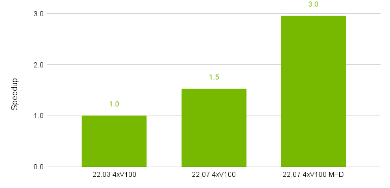
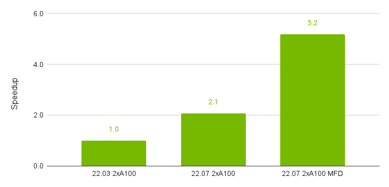
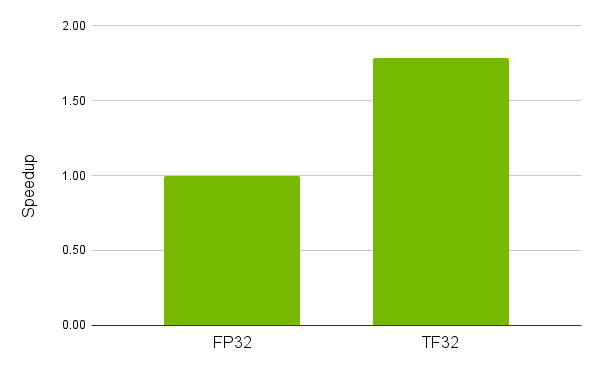
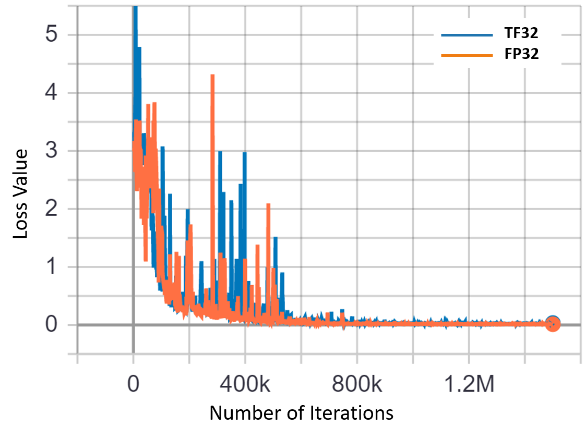
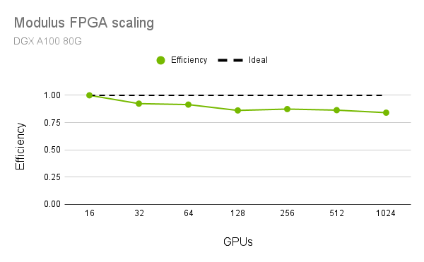

# Performance

[公式ページ](https://docs.nvidia.com/deeplearning/modulus/modulus-sym/user_guide/features/performance.html)

以下に、Modulus Symを加速するための様々な方法が示されています。
以下の図は、さまざまなModulus Symの機能を使用したパフォーマンスの改善の概要を示しています。


Fig. 51 Speed-up across different Modulus Sym releases on V100 GPUs. (MFD: Meshless Finite Derivatives)



Fig. 52 Speed-up across different Modulus Sym releases on A100 GPUs. (MFD: Meshless Finite Derivatives)

Note :  
A100 GPUのvRAMが大きいため、V100ランに比べて、1つのGPUあたりのバッチサイズを2倍にすることができます。
比較のために、合計のバッチサイズを一定に保ちますので、A100のプロットでは2つのA100 GPUを使用しています。

Note :  
これらの数字は要約目的のみであり、実行は例の「limerock」の流れの部分で行われました。
個々の機能によるパフォーマンスの向上の詳細については、後続のセクションを参照してください。

## Running jobs using TF32 math mode

[TensorFloat-32 (TF32)](https://blogs.nvidia.com/blog/tensorfloat-32-precision-format/)は、ニューラルネットワークのトレーニング中に使用される行列演算とテンソル操作を処理するための、NVIDIA A100 GPUで利用可能な新しい数学モードです。

A100 GPUでは、TF32機能がデフォルトで「ON」になっており、この機能を使用するために通常のスクリプトに変更を加える必要はありません。この機能を使用すると、FPGAの問題でA100 GPU上のFP32に比べて最大1.8倍の高速化が可能です（:numref:fig-fpga_tf32_speedup）。これにより、精度や損失の収束に変更がなく、訓練時間が劇的に短縮されることで同じ結果を達成できます（:numref:tab-fpga-tf32および:numref:fig-fpga_tf32）。



Fig. 53 Achieved speed-up using the TF32 compute mode on an A100 GPU for the FPGA example

Table 2 Comparison of results with and without TF32 math mode

| **Case Description**                                |$P_{drop}(Pa)$ |
|-----------------------------------------------------|---------------|
| **Modulus Sym:** Fully Connected Networks with FP32 |29.24          |
| **Modulus Sym:** Fully Connected Networks with TF32 |29.13          |
| **OpenFOAM Solver**                                 |28.03          |
| **Commercial Solver**                               |28.38          |



Fig. 54 Loss convergence plot for FPGA simulation with TF32 feature

## Running jobs using Just-In-Time (JIT) compilation

JIT（Just-In-Time）コンパイルは、計算グラフの要素がネイティブのPyTorchから[TorchScript](https://pytorch.org/docs/stable/jit.html)バックエンドにコンパイルされる機能です。これにより、Pythonのグローバルインタプリタロック（GIL）の回避や、デッドコードの除去、共通の部分文字列の除去、ポイントワイズカーネルの融合などの計算最適化など、最適化が可能になります。

Modulus Symで使用されるPINNsには、多くの特異性があり、多数のポイントワイズ演算が存在します。これらの操作は計算コストが低いですが、GPUのメモリサブシステムに大きな圧力をかけます。JITを使用すると、カーネルの融合が可能になり、これらの操作の多くを単一のカーネルで同時に計算し、GPUメモリから計算ユニットへのメモリ転送の回数を減らすことができます。

Modulus Symでは、構成ファイルのjitオプションを介してデフォルトでJITが有効になっています。オプションでJITを無効にするには、構成ファイルにjit: falseオプションを追加するか、コマンドラインにjit=Falseオプションを追加します。

## CUDA Graphs

Modulus Symは、CUDA Graph最適化をサポートしており、起動待ちのレイテンシがボトルネックとなる問題を加速し、並列性能を向上させることができます。GPUハードウェアの強力なスケーリングにより、一部の機械学習問題はGPUを飽和させるのに苦労し、作業の提出レイテンシが発生します。これは、これらのボトルネックからの作業の遅延により、スケーラビリティにも影響を与えます。CUDA Graphsは、CPUが個々にではなくGPUに一連のジョブを提出することを許可することで、この問題の解決策を提供します。GPU上で行列乗算にバインドされていない問題に対しては、これが著しいスピードアップをもたらす場合があります。性能の向上に関係なく、可能な限りCUDA Graphsを使用することが推奨されます、特にマルチGPUやマルチノードのトレーニングを行う場合に特に有用です。PyTorchのCUDA Graphsに関する詳細については、読者は[PyTorchブログ](https://pytorch.org/blog/accelerating-pytorch-with-cuda-graphs/)を参照してください。

CUDA Graphsを使用するには、次の3つのステップがあります。

1. 通常のトレーニングが実行されるウォームアップフェーズ。

2. 1つのトレーニングイテレーション中に前向きおよび後向きのカーネルがグラフに記録される記録フェーズ。

3. 記録されたグラフの再生、これはトレーニングの残りの部分で使用されます。

Modulus Symでは、このPyTorchユーティリティをサポートしており、デフォルトで有効になっています。
CUDA GraphsはHydraを使用して有効にできます。
少なくとも20回のウォームアップステップを使用することが推奨されており、これがデフォルトです。
20回のトレーニングイテレーションの後、Modulus SymはCUDA Graphを記録しようと試み、成功した場合は残りのトレーニングに再生します。

```yaml
cuda_graphs: True
cuda_graph_warmup: 20
```

Warning :  
CUDA Graphsは現在、PyTorchのベータ機能であり、将来変更される可能性があります。
この機能には、より新しい[NCCLバージョン](https://docs.nvidia.com/deeplearning/nccl/user-guide/docs/usage/cudagraph.html)とホストGPUドライバ（R465以上）が必要です。
エラーが発生している場合は、ドライバが最新であることを確認してください。

Warning :  
CUDAグラフは、複数のGPUを使用する場合にすべてのユーザーガイドの例で機能するわけではありません。
一部の例では、DDPを使用する際に:code:find_unused_parametersが必要であり、これはCUDAグラフと互換性がありません。

Note :
CUDAグラフ内ではNVTXマーカーが機能しないため、コードのプロファイリング時にはこの機能をオフにすることをお勧めします。

## Meshless Finite Derivatives

メッシュレス有限導関数は、物理学に基づいた学習のための導関数を計算する代替手法です。
自動微分に依存せず、有限差分を使用して勾配を近似するためにステンシルポイントをクエリし、解析的な勾配を計算する代わりに、メッシュレス有限導関数は、オンザフライでステンシルポイントをクエリして勾配を近似します。
自動微分では、より高次の導関数や最適化のための逆伝播を計算するために複数の自動微分呼び出しが必要です。
問題は、必要な追加の自動微分パスごとに計算の複雑さが指数関数的に増加するため、トレーニングが大幅に遅くなる可能性があることです。
メッシュレス有限導関数は、追加のフォワードパスで自動微分の必要性を取り除きます。
有限差分ステンシルポイントがオンデマンドでクエリされるため、グリッドの細分割が不要であり、メッシュフリーなトレーニングを維持します。

多くの問題では、メッシュレス有限導関数のフォワードパスで必要な追加計算量は、自動微分の同等物よりもはるかに少ないです。
このアプローチは、同等の精度を持つ場合に、自動微分アプローチよりも2〜4倍のスピードアップを実現できる可能性があります。

メッシュレス有限導関数を使用するには、単に :code:MeshlessFiniteDerivative ノードを定義し、勾配数量を必要とする制約に追加します。
Modulus Symは、メッシュレス有限導関数を提供するときに自動微分よりも優先します。
:code:MeshlessFiniteDerivative ノードを作成する際に、必要な導関数を明示的に定義する必要があります。
これはリストを使って行うことも、他のノードから必要な導関数にアクセスすることもできます。
また、このノードには、独立変数から構成される入力と、導関数が必要な量の出力を持つノードが必要です。
たとえば、導関数 $\partial f / \partial x$ を求める場合、入力変数に $x$ を含むノードと、出力に $f$ を持つノードが必要です。
メッシュレス有限導関数への切り替えは、ほとんどの問題にとって直感的です。
例として、LDCの場合、以下のコードスニペットでメッシュレス有限導関数を有効にして、速度を3倍にすることができます：

```python
from modulus.sym.eq.derivatives import MeshlessFiniteDerivative

# Make list of nodes to unroll graph on
ns = NavierStokes(nu=0.01, rho=1.0, dim=2, time=False)
flow_net = instantiate_arch(
    input_keys=[Key("x"), Key("y")],
    output_keys=[Key("u"), Key("v"), Key("p")],
    cfg=cfg.arch.fully_connected
)
flow_net_node = flow_net.make_node(name="flow_network", jit=cfg.jit)
# Define derivatives needed to be calculated
# Requirements for 2D N-S
derivatives_strs = set(["u__x", "v__x", "p__x", "v__x__x", "u__x__x", "u__y", "v__y", \
    "p__y", "u__y__y", "v__y__y"])
derivatives = Key.convert_list(derivatives_strs)
# Or get the derivatives from the N-S node itself
derivatives = []
for node in ns.make_nodes():
    for key in node.derivatives:
        derivatives.append(Key(key.name, size=key.size, derivatives=key.derivatives))

# Create MFD node
mfd_node = MeshlessFiniteDerivative.make_node(
    node_model=flow_net_node,
    derivatives=derivatives,
    dx=0.001,
    max_batch_size=4*cfg.batch_size.Interior,
)
# Add to node list
nodes = ns.make_nodes() + [flow_net_node, mfd_node]
```

Warning :  
メッシュレス有限導関数は、Modulus Symチームによる開発であり、現在ベータ版です。
ご自身の裁量でご利用ください。安定性や収束性は保証されていません。
APIは将来のバージョンで変更される可能性があります。

## Present Pitfalls

1. dxパラメータを設定することは、メッシュレス有限導関数の非常に重要な部分です。
従来の数値解法はこのトピックについて明確なガイダンスを提供しますが、後向きパスと最適化によって追加の安定性制約が設定されているため、これらは直接適用されません。
ユーザーガイドのほとんどの問題では、0.001に近いdxがうまく機能し、良好な収束をもたらしますが、float32精度モデルではより低い値はトレーニング中に不安定性を引き起こす可能性があります。
dxの仕様に関する詳細、ツール、およびガイダンスについての追加の詳細は、近い将来に提供される予定です。

2. メッシュレス有限導関数は、その近似的な性質により、自動微分と比較してトレーニング中のノイズを増加させる可能性があります。
そのため、この機能は現在、自動微分の不安定なトレーニング特性を示す問題には推奨されていません。

3. メッシュレス有限導関数は誤った解に収束する可能性があり、精度は使用されるdxに強く依存します。

4. パフォーマンスの向上は問題に依存し、必要な導関数に基づきます。
現在、メッシュレス有限導関数のパフォーマンスをさらに向上させる最良の方法は、メッシュレス有限導関数ノードを作成する際にmax_batch_sizeを増やすことです。

5. メッシュレス有限導関数に必要なすべての導関数が指定されていない場合、Modulus Symは自動微分ノードを追加します。

## Running jobs using multiple GPUs

Modulus Symでは、パフォーマンスを向上させ、より大きな問題を実行するために、マルチGPUおよびマルチノードスケーリングをサポートしています。これにより、各プロセスが単一のGPUを対象とし、独立した前方および後方パスを実行し、勾配を集約してからモデルの重みを更新することができます。 :numref:fig-fpga_scaling では、Modulus Symのスケーリングパフォーマンスを、ラミナーFPGAテスト問題（スクリプトはexamples/fpga/laminar/fpga_flow.pyで見つけることができます）で、128ノード上の1024台のA100 GPUまで示しています。16から1024台のGPUへのスケーリング効率はほぼ85%です。

このデータ並列のマルチGPUトレーニングの方法では、GPUごとにサンプリングされるポイント数を一定に保ちながら、合計の効果的なバッチサイズを増やします。これを利用して、GPUの数を増やすことでサンプリングされるポイント数を増やし、より大きな問題を処理できるようにすることができます。

単一のコンピュートノード上で複数のGPUを使用してModulus Symソリューションを実行するには、まず利用可能なGPUを調べることができます。

``bash
nvidia-smi
'''

利用可能なGPUを調べたら、mpirun -np #GPUsを使用してジョブを実行できます。以下のコマンドは、2つのGPUを使用してジョブを実行する方法を示しています。

```bash
mpirun -np 2 python fpga_flow.py 
```

Modulus Symは、SLURMスケジューラーを使用して複数のノードで問題を実行することもサポートしています。単純に、srunを使用してジョブを起動し、適切なフラグを指定すると、Modulus Symがマルチノード分散プロセスグループを設定します。以下のコマンドは、ノードあたり8つのGPUを使用する2つのノードのジョブを起動する方法を示しています（合計16のGPU）。

```bash
srun -n 16 --ntasks-per-node 8 --mpi=none python fpga_flow.py
```

Modulus Symは、以下の環境変数が各プロセスに設定されている限り、SLURMスケジューラーを持たない他のクラスターでも実行することができます。

1. MASTER_ADDR: ランク0のノードのIPアドレス

2. MASTER_PORT: 異なるプロセス間で通信するために使用できるポート

3. RANK: そのプロセスのランク

4. WORLD_SIZE: 参加プロセスの総数

5. LOCAL_RANK (オプション): ノード上のプロセスのランク

詳細については、[Environment variable initialization](https://pytorch.org/docs/stable/distributed.html#environment-variable-initialization)を参照してください。



Fig. 55 Multi-node scaling efficiency for the FPGA example
