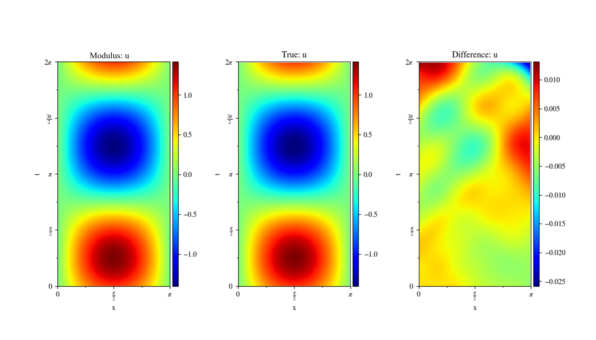
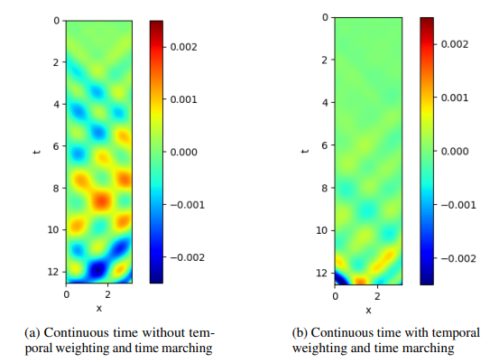
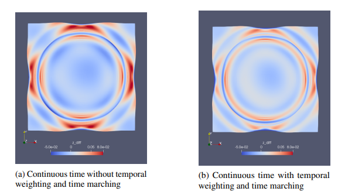
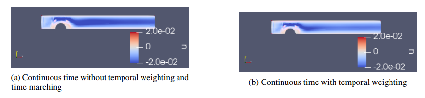

# 1D Wave Equation

[公式ページ](https://docs.nvidia.com/deeplearning/modulus/modulus-sym/user_guide/foundational/1d_wave_equation.html)

## Introduction

このチュートリアルでは、Modulus SymでカスタムPDE（偏微分方程式）を設定する方法を解説します。
この例題では、時間依存の単純な1D波動方程式問題に対するModulus Symによる解法を実演します。  
また、Modulus Symで過渡的な物理現象を解決する方法も解説します。  
まとめると、このチュートリアルでは、以下のことを学びます

1. Modulus Symで独自の偏微分方程式と境界条件を記述する方法。

2. Modulus Symで時間依存問題を解決する方法。

3. 過渡的問題に初期条件と境界条件を適用する方法。

4. 解析解から検証データを生成する方法。

Note :  
このチュートリアルは、LDCチュートリアルを完了しており、Modulus Sym APIの基本に慣れていることを前提としています。

## Problem Description

このチュートリアルでは、簡単な1D波動方程式を解決します。波は以下の方程式によって記述されます。

<div id="eq137"></div>

$$
\begin{aligned}
u_{tt} & = c^2 u_{xx}\\
u(0,t) & = 0, \\
u(\pi, t) & = 0,\\
u(x,0) & = \sin(x), \\
u_t(x, 0) & = \sin(x). \\
\end{aligned}
\tag{137}$$

<br>

ここで、波の速度は $c=1$ であり、上記の問題の解析解は $\sin(x)(\sin(t) + \cos(t))$ によって与えられます。

<br>

## Writing custom PDEs and boundary/initial conditions

このチュートリアルでは、Modulus Sym APIを使用して[一次元波動方程式](https://en.wikipedia.org/wiki/Wave_equation) を記述します。
また、導関数型の境界条件を扱う方法についても解説します。
ソースディレクトリ(ライブラリディレクトリ) ```modulus/eq/pdes/``` に定義されたPDEも参考にしてください。

このチュートリアルにおいて、```wave_equation.py``` スクリプトには一次元波動方程式が定義されています。```PDES```クラスを使用して、Sympyで方程式を記述することができます。  
これにより、読みやすく自然な方法でスピーディに方程式を記述できます。  
Sympyの方程式はバックエンドでPytorch表現に変換されますが、printで実装内容を確認することもできます。

まず、```PDES```を継承した```WaveEquation1D```クラスを作成します。

```python
from sympy import Symbol, Function, Number
from modulus.sym.eq.pde import PDE

class WaveEquation1D(PDE):
```

クラスの初期化メソッドを作成し、関心のある方程式を定義します。  
波速度 ($c$) を使用して波動方程式を定義します。  
もし $c$ が文字列として与えられた場合、それを関数形式に変換します。  
これにより、空間的/時間的に変化する波速度の問題を解決できます。  
これは、後続の逆問題の例でも使用されます。

以下の説明はPDEの定義を示しています。  
まず、入力変数 $x$ と $t$ をSympyのシンボルで定義します。  
次に、$x$ と $t$ に依存する関数 $u$ と $c$ を定義します。  
これらを使用して、単純な方程式 $u_{tt} = (c^2 u_x)_x$ を記述します。  
この方程式をクラスに格納し、方程式の辞書に追加します。

ここで具体的なPythonコードの実装については説明していませんが、このチュートリアルから、Modulus Symを使用して1D波動方程式を定義および解決する方法についてイメージできるはずです。

```python
def __init__(self, c=1.0):
        # coordinates
        x = Symbol("x")

        # time
        t = Symbol("t")

        # make input variables
        input_variables = {"x": x, "t": t}

        # make u function
        u = Function("u")(*input_variables)

        # wave speed coefficient
        if type(c) is str:
            c = Function(c)(*input_variables)
        elif type(c) in [float, int]:
            c = Number(c)

        # set equations
        self.equations = {}
        self.equations["wave_equation"] = u.diff(t, 2) - (c**2 * u.diff(x)).diff(x)
```

```'wave_equation'```の方程式の再配置に注意してください。  
PDEのすべての項を方程式の左辺(LHS)または右辺(RHS)に移動させ、一方の側にのみソース項を持つようにする必要があります。  
この方法により、制約の中で方程式を使用する際に、PDEにソースを追加するために0ではなくカスタムソース関数を```'wave_equation'```キーに割り当てることができます。

自身で波動方程式のPDEを書いたら、Modulus Symのソースから```modulus/eq/pdes/wave_equation.py```スクリプトを参照して、実装を検証できます。  
また、簡単なPDEをコードするプロセスを理解したら、追加の入力変数、定数などを作成することで、異なるPDEを複数の次元（2D、3Dなど）に簡単に拡張することができます。  
さらに、方程式の辞書に新しいキーを追加することで、複数のPDEをクラス定義にまとめることもできます。

これで、新しくコード化された波動方程式を使用して問題を解決できるソルバーファイルを記述できます。

## Case Setup

このチュートリアルでは、単一次元で点をサンプリングするために```Line1D```を使用します。  
時間依存方程式は、関心のある時間ドメインの範囲とともに、変数パラメータとして$t$を```parameterization```引数に提供することにより解決されます。  
```parameterization```引数は、幾何学的な変化や変数PDE定数を含む問題を解決する際にも使用されます。

Note :

1. この解法は、時間を連続変数として扱い、問題を解決します。離散時間ステッピングの例として、[Turbulent physics: Zero Equation Turbulence Model](https://docs.nvidia.com/deeplearning/modulus/modulus-sym/user_guide/intermediate/moving_time_window.html#transient-navier-stokes)で紹介されている連続時間ウィンドウアプローチがあります。

2. この問題に関するPythonスクリプトはexamples/wave_equation/wave_1d.pyにあります。参考のために、wave_equation.pyにコードされたPDEも同じディレクトリ内にあります。

### 1. Importing the required packages

このチュートリアルで新たにインポートされるパッケージ/モジュールは、1Dジオメトリを使用するためのgeometry_1dです。新規のpythonファイルを作成しWaveEquation1Dをインポートしてください。

```python
import numpy as np
from sympy import Symbol, sin

import modulus.sym
from modulus.sym.hydra import instantiate_arch, ModulusConfig
from modulus.sym.solver import Solver
from modulus.sym.domain import Domain
from modulus.sym.geometry.primitives_1d import Line1D
from modulus.sym.domain.constraint import (
    PointwiseBoundaryConstraint,
    PointwiseInteriorConstraint,
)

from modulus.sym.domain.validator import PointwiseValidator
from modulus.sym.key import Key
from modulus.sym.node import Node
from wave_equation import WaveEquation1D
```

### 2. Creating Nodes and Domain

この部分は、キャビティ流れのチュートリアルと似ています。  
```WaveEquation1D``` クラスは波動方程式を計算するために使用されます。波速は問題の条件に基づいて定義されます。  
入力が ```x``` と ```t``` で出力が ```u``` のニューラルネットワークも作成されます。

```python
@modulus.sym.main(config_path="conf", config_name="config")
def run(cfg: ModulusConfig) -> None:
    # make list of nodes to unroll graph on
    we = WaveEquation1D(c=1.0)
    wave_net = instantiate_arch(
        input_keys=[Key("x"), Key("t")],
        output_keys=[Key("u")],
        cfg=cfg.arch.fully_connected,
    )
    nodes = we.make_nodes() + [wave_net.make_node(name="wave_network")]
    # make domain
    domain = Domain()
```

### 3. Creating Geometry and Adding Constraints

この問題のジオメトリを生成するには、Line1D(pt1, pt2)を使用します。  
Line1Dの境界は端点であり、内部は2つの端点の間のすべての点をカバーします。

前に説明したように、時間に対して解くためにparameterization引数を使用します。初期条件を定義するには、parameterization={t_symbol: 0.0}と設定します。

You will solve the wave equation for
$t=(0, 2\pi)$. The derivative boundary condition can be handled by
specifying the key ```'u__t'```. The derivatives of the variables can be
specified by adding ```'__t'``` for time derivative and ```'__x'``` for
spatial derivative (```'u__x'``` for $\partial u/\partial x$,
```'u__x__x'``` for $\partial^2 u/\partial x^2$, etc.).

以下のコードは、これらのツールを使用して幾何学、初期/境界条件、および方程式を生成します。

```python
# add constraints to solver
# make geometry
x, t_symbol = Symbol("x"), Symbol("t")
L = float(np.pi)
geo = Line1D(0, L)
time_range = {t_symbol: (0, 2 * L)}

# initial condition
IC = PointwiseInteriorConstraint(
    nodes=nodes,
    geometry=geo,
    outvar={"u": sin(x), "u__t": sin(x)},
    batch_size=cfg.batch_size.IC,
    lambda_weighting={"u": 1.0, "u__t": 1.0},
    parameterization={t_symbol: 0.0},
)
domain.add_constraint(IC, "IC")

# boundary condition
BC = PointwiseBoundaryConstraint(
    nodes=nodes,
    geometry=geo,
    outvar={"u": 0},
    batch_size=cfg.batch_size.BC,
    parameterization=time_range,
)
domain.add_constraint(BC, "BC")

# interior
interior = PointwiseInteriorConstraint(
    nodes=nodes,
    geometry=geo,
    outvar={"wave_equation": 0},
    batch_size=cfg.batch_size.interior,
    parameterization=time_range,
)
domain.add_constraint(interior, "interior")
```

### 4. Adding Validation data from analytical solutions

この問題において、解析解は.csvファイルをインポートする代わりに、同時に解くことができます。このコードは、そのようなデータセットを定義するプロセスを示しています。

```python
# add validation data
deltaT = 0.01
deltaX = 0.01
x = np.arange(0, L, deltaX)
t = np.arange(0, 2 * L, deltaT)
X, T = np.meshgrid(x, t)
X = np.expand_dims(X.flatten(), axis=-1)
T = np.expand_dims(T.flatten(), axis=-1)
u = np.sin(X) * (np.cos(T) + np.sin(T))
invar_numpy = {"x": X, "t": T}
outvar_numpy = {"u": u}
validator = PointwiseValidator(
    nodes=nodes, invar=invar_numpy, true_outvar=outvar_numpy, batch_size=128
)
domain.add_validator(validator)
```

## Results

以下の図は、Modulus Symの結果と解析解との比較を示しています。  
時間が経過するにつれてModulus Symの予測誤差が増加することがわかります。  
過渡的問題に対処するためのいくつかの高度なアプローチは、別資料で扱います。



## Temporal loss weighting and time marching schedule

過渡的シミュレーションの連続時間アプローチの性能を向上させるための2つの簡単なテクニック、すなわち時間的損失重み付けと時間進行スケジュールがあります。時間的損失重み付けの背後にある考え方は、時間ドメインで早い時期に対応する項に比べて、後の時期に対応する項よりも大きな重みを持たせるように、損失項を時間的に重み付けすることです。例えば、時間的損失重み付けは以下のような線形形式を取ることができます。

$$
\lambda_T = C_T \left( 1 - \frac{t}{T} \right) + 1
$$

ここで、$\lambda_T$は時間的損失の重み、$C_T$は重みのスケールを制御する定数、$T$は時間ドメインの上限、$t$は時間を表します。

時間進行スケジュールの背後にある考え方は、時間ドメインの上限 $T$ を変数として、トレーニングの反復に応じた関数とみなすことです。  
この変数は、後の時刻よりも早い時刻の方が多くのトレーニング反復を行うように変更することができます。  
いくつかのスケジュールを考慮することができますが、たとえば、以下を使用することができます。

$$
T_v (s) = \min \left( 1, \frac{2s}{S} \right)
$$

ここで、$T_v(s)$は変数の時間ドメイン上限、$s$はトレーニングの反復回数、$S$ はトレーニングの最大反復回数です。  
各トレーニング反復において、Modulus Symは時間ドメインの範囲 $[0, T_v(s)]$ から連続的にサンプリングします。

以下の図は、時間的損失重み付けおよび時間進行を使用してトレーニングされたモデルと使用せずにトレーニングされたモデルのModulus Symの検証誤差を示しています。  
これは、過渡的1D、2D波の例およびバンプ上の2Dチャネルフローに対するものです。  
これら2つの単純なテクニックがトレーニングの精度を向上させることが明らかです。

<br>


1次元の瞬時波の例におけるModulus Sym検証エラー：  
（a）標準の連続時間アプローチ；（b）時間損失の重み付けと時間進行を伴う連続時間アプローチ。

<br>


2次元の瞬時波の例におけるModulus Sym検証エラー：  
（a）標準の連続時間アプローチ；（b）時間損失の重み付けと時間進行を伴う連続時間アプローチ。

<br>


段差を越える2次元の瞬時流路流れに対するModulus Sym検証エラー：  
（a）標準の連続時間アプローチ；（b）時間損失の重み付けを伴う連続時間アプローチ。
