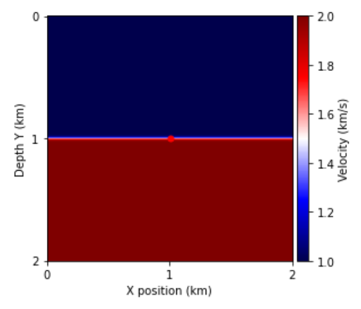
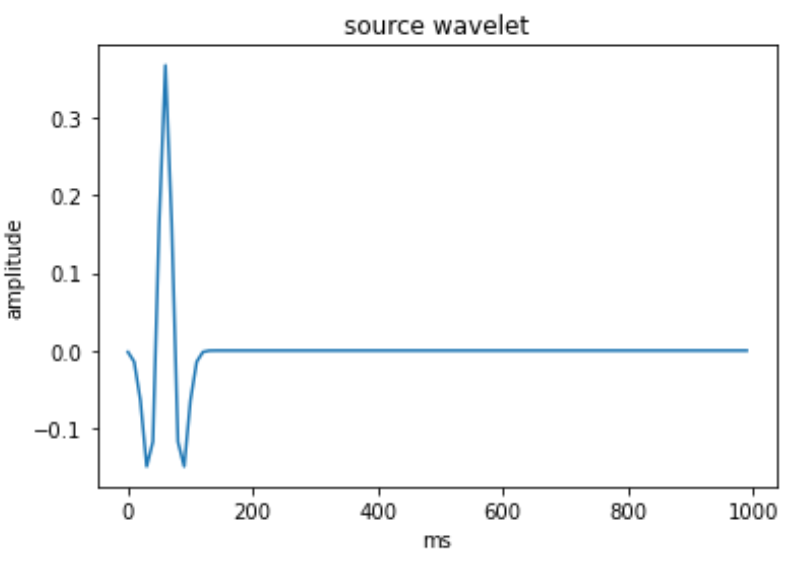
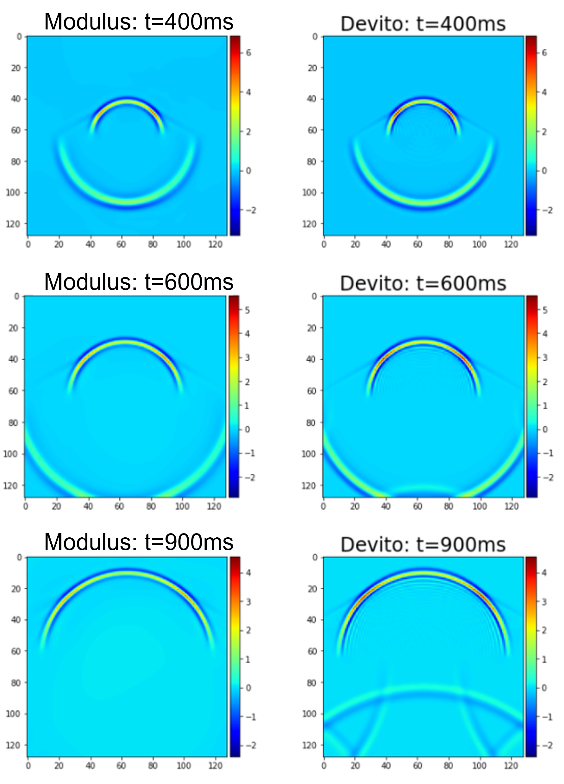

# 2D Seismic Wave Propagation

[公式ページ](https://docs.nvidia.com/deeplearning/modulus/modulus-sym/user_guide/foundational/2d_wave_equation.html)

## Introduction

このチュートリアルは、前回の1次元波動方程式の例を拡張し、地震測量で一般的に使用される2次元地震波伝播問題を扱います。  
このチュートリアルでは、以下のことを学習します：

1. Modulus Symで2次元の時間依存性の問題を解く方法
2. カスタム方程式を使用して開境界条件を定義する方法
3. 追加のネットワークとして可変速度モデルを提示する方法

Note:  
このチュートリアルでは、Lid Driven Cavity flowの:ref:Introductory Exampleチュートリアルを完了し、Modulus Symの基本に慣れていることを前提としています。また、新しい微分方程式の定義やModulus Symで時間依存性の問題を解決する方法に関する詳細は、:ref:transientチュートリアルも参照してください。

## Problem Description

音波方程式は、密度が一定の物理媒体における音速（速度）を$c$とし、ソース$q$が与えられた場合に次のように表されます

<div id="eq140"></div>

$$
u_{tt} = c^2u_{xx} + c^2u_{yy} + q \quad \text{ in } \Omega
\tag{140}$$

ここで、$u(\mathbf{x},t)$は音響媒体内の位置ベクトル$\mathbf{x}$と時間$t$における圧力応答（「波場」とも呼ばれる）を表します。波動方程式は線形であるにもかかわらず、複雑な媒体での解決は難しいことがよく知られています。なぜなら、媒体の界面での波場のダイナミクスは非常に複雑であり、多くの種類の波が同時に干渉し、広範囲の振幅や周波数を持つことがあるからです。  

このチュートリアルでは、1.0 $km/s$の上層と2.0 $km/s$の下層で層状の速度モデルを持つ中で、単一のリッカー源を用いて2次元の音波方程式を解きます（:numref:fig-seismic-wave-velocityを参照）。地震測量での源泉は、モデル化したい領域に人工的な圧力が注入される単一または複数の物理的な位置に配置されます。陸上測量の場合、通常は特定の場所でダイナマイトが爆発するか、または振動プレートが連続した音波を生成する振動源（vibroseis）が使用されます。海洋測量の場合、源泉は水中に圧縮された空気のバブルを送り込むエアガンであり、これが膨張して地震波を生成します。  

この問題では、領域のサイズは2 $km$ × 2 $km$ であり、単一の源泉が領域の中心に配置されています。源泉のシグネチャは、:numref:fig-seismic-wave-sourceに示されているリッカー波形を使用してモデル化されており、ピーク波形の周波数は:f_0=15 Hzです。  



Fig. 60 Velocity model of the medium



Fig. 61 Ricker source signature

この問題では、有限差分シミュレーションから生成された時間ステップ（150ミリ秒から300ミリ秒）の波場データを、時間境界条件の制約として使用し、Modulus Symをトレーニングして、後の時間ステップ（300ミリ秒から1000ミリ秒）での波場を生成します。

## Problem Setup

The setup for this problem is similar to tutorial :ref:`transient`. So, only
the main highlights of this problem is discussed here.

.. note::
   The full python script for this problem can be found at ``examples/seismic_wave/wave_2d.py``

## Defining Boundary Conditions
---

2階の偏微分方程式では、解が一意になるために初期波場とその導関数の両方に厳格な境界条件が必要です。実際の現場では、地震波はあらゆる方向に「無限」の距離まで伝播します。有限の計算領域では、吸収境界条件（ABC）または完全一致層（PML）などの人工境界条件が一般的に適用され、領域の端で波を減衰させ、吸収することで無限の媒質を近似し、境界からの反射を回避します。しかし、NNソルバーはメッシュレスであるため、ABCやPMLを実装するには適していません。計算領域を離れて境界を通過し、境界を通過して波が妨害されないようにするには、[オープン境界条件](http://hplgit.github.io/wavebc/doc/pub/._wavebc_cyborg002.html) 、または放射条件と呼ばれる条件を適用することができます。これは境界で1次の偏微分方程式を課します：

<div id="eq141"></div>

$$
\begin{split}
\frac{\partial u}{\partial t} - c\frac{\partial u}{\partial x} &= 0,\quad \text{ at } x = 0 \\
\frac{\partial u}{\partial t} + c\frac{\partial u}{\partial x} &= 0,\quad \text{ at } x = dLen \\
\frac{\partial u}{\partial t} - c\frac{\partial u}{\partial y} &= 0,\quad \text{ at } y = 0 \\
\frac{\partial u}{\partial t} + c\frac{\partial u}{\partial y} &= 0,\quad \text{ at } y = dLen \\
\end{split}
\tag{141}$$

以前のチュートリアルでは、カスタムPDEを定義する方法について説明されています。同様に、ここでは```PDES```を継承したクラス```OpenBoundary```を作成します。

```python
# define open boundary conditions
class OpenBoundary(PDE):
    """
Open boundary condition for wave problems
Ref: http://hplgit.github.io/wavebc/doc/pub/._wavebc_cyborg002.html

Parameters
==========
u : str
The dependent variable.
c : float, Sympy Symbol/Expr, str
Wave speed coefficient. If `c` is a str then it is
converted to Sympy Function of form 'c(x,y,z,t)'.
If 'c' is a Sympy Symbol or Expression then this
is substituted into the equation.
dim : int
Dimension of the wave equation (1, 2, or 3). Default is 2.
time : bool
If time-dependent equations or not. Default is True.
"""

    name = "OpenBoundary"

    def __init__(self, u="u", c="c", dim=3, time=True):
        # set params
        self.u = u
        self.dim = dim
        self.time = time

        # coordinates
        x, y, z = Symbol("x"), Symbol("y"), Symbol("z")

        # normal
        normal_x, normal_y, normal_z = (
            Symbol("normal_x"),
            Symbol("normal_y"),
            Symbol("normal_z"),
        )

        # time
        t = Symbol("t")

        # make input variables
        input_variables = {"x": x, "y": y, "z": z, "t": t}
        if self.dim == 1:
            input_variables.pop("y")
            input_variables.pop("z")
        elif self.dim == 2:
            input_variables.pop("z")
        if not self.time:
            input_variables.pop("t")

        # Scalar function
        assert type(u) == str, "u needs to be string"
        u = Function(u)(*input_variables)

        # wave speed coefficient
        if type(c) is str:
            c = Function(c)(*input_variables)
        elif type(c) in [float, int]:
            c = Number(c)

        # set equations
        self.equations = {}
        self.equations["open_boundary"] = (
            u.diff(t)
            + normal_x * c * u.diff(x)
            + normal_y * c * u.diff(y)
            + normal_z * c * u.diff(z)
        )
```

## Variable Velocity Model

「:ref:transient」チュートリアルでは、物理媒体の速度（$c$）が一定でした。この問題では、位置$x$によって変化する速度モデルがあります。速度$c$を$x$と$y$の関数として表すために、$tanh$関数の形を使用します：

Note :  
インターフェースでの急激な不連続性を避けるために、$tanh$関数が使用されました。急激な境界の滑らか化は、ニューラルネットワークソルバーの収束を助けます。

```python
# define target velocity model
    # 2.0 km/s at the bottom and 1.0 km/s at the top using tanh function
    mesh_x, mesh_y = np.meshgrid(
        np.linspace(0, 2, 512), np.linspace(0, 2, 512), indexing="ij"
    )
    wave_speed_invar = {}
    wave_speed_invar["x"] = np.expand_dims(mesh_x.flatten(), axis=-1)
    wave_speed_invar["y"] = np.expand_dims(mesh_y.flatten(), axis=-1)
    wave_speed_outvar = {}
    wave_speed_outvar["c"] = np.tanh(80 * (wave_speed_invar["y"] - 1.0)) / 2 + 1.5
```

## Creating PDE and Neural Network Nodes

まず、この問題のModulus Sym PDEとNNノードを定義します。

```python
# define PDEs
    we = WaveEquation(u="u", c="c", dim=2, time=True)
    ob = OpenBoundary(u="u", c="c", dim=2, time=True)

    # define networks and nodes
    wave_net = instantiate_arch(
        input_keys=[Key("x"), Key("y"), Key("t")],
        output_keys=[Key("u")],
        cfg=cfg.arch.fully_connected,
    )
    speed_net = instantiate_arch(
        input_keys=[Key("x"), Key("y")],
        output_keys=[Key("c")],
        cfg=cfg.arch.fully_connected,
    )
    nodes = (
        we.make_nodes(detach_names=["c"])
        + ob.make_nodes(detach_names=["c"])
        + [
            wave_net.make_node(name="wave_network"),
            speed_net.make_node(name="speed_network"),
        ]
    )
```

PDEノードは、上記で定義した```OpenBoundary PDE```と```Modulus Sym```内で定義された```WaveEquation PDE```の両方を使用して作成されます。時間に依存する問題なので、```time=True```引数を使用します。

ここでは、2つのニューラルネットワークノードが定義されています。```wave_net```は波動方程式の解を学習するために使用され、```speed_net```は上記で定義されたトレーニングデータ（```wave_speed_invar```と```wave_speed_outvar```）から速度モデルを学習するために使用されます。

## Creating Geometry

計算領域の2Dジオメトリと解の時間範囲が定義されます。

```python
# define geometry
    dLen = 2  # km
    rec = Rectangle((0, 0), (dLen, dLen))
```

## Adding Constraints

この問題を定義するためには、合計で4つの異なる制約が十分です。最初の制約は、速度モデルを上記のトレーニングデータに合わせる単純な教師付き制約です。2番目は別の教師付き制約であり、Devitoを使用して生成された数値波場を4つの開始時間ステップで一致させる制約です。3番目の制約は、ドメインの内部で```WaveEquation PDE```が尊重されることを保証し、4番目の制約はドメインの境界で```OpenBoundary PDE```が尊重されることを保証します。

```python
# make domain
    domain = Domain()

    # add velocity constraint
    velocity = PointwiseConstraint.from_numpy(
        nodes=nodes, invar=wave_speed_invar, outvar=wave_speed_outvar, batch_size=1024
    )
    domain.add_constraint(velocity, "Velocity")

    # add initial timesteps constraints
    batch_size = 1024
    for i, ms in enumerate(np.linspace(150, 300, 4)):
        timestep_invar, timestep_outvar = read_wf_data(ms, dLen)
        lambda_weighting = {}
        lambda_weighting["u"] = np.full_like(timestep_invar["x"], 10.0 / batch_size)
        timestep = PointwiseConstraint.from_numpy(
            nodes,
            timestep_invar,
            timestep_outvar,
            batch_size,
            lambda_weighting=lambda_weighting,
        )
        domain.add_constraint(timestep, f"BC{i:04d}")

    # add interior constraint
    interior = PointwiseInteriorConstraint(
        nodes=nodes,
        geometry=rec,
        outvar={"wave_equation": 0},
        batch_size=4096,
        bounds={x: (0, dLen), y: (0, dLen)},
        lambda_weighting={"wave_equation": 0.0001},
        parameterization=time_range,
    )
    domain.add_constraint(interior, "Interior")

    # add open boundary constraint
    edges = PointwiseBoundaryConstraint(
        nodes=nodes,
        geometry=rec,
        outvar={"open_boundary": 0},
        batch_size=1024,
        lambda_weighting={"open_boundary": 0.01 * time_length},
        parameterization=time_range,
    )
    domain.add_constraint(edges, "Edges")
```

教師付き制約は、```PointwiseConstraint.from_numpy(...)```コンストラクタを使用して追加されます。

## Validation

最後に、以下に示すようにModulus Symバリデータ内で定義されたDevitoからの13個の後の時間ステップを使用して、結果を検証することができます。

```python
# add validators
    for i, ms in enumerate(np.linspace(350, 950, 13)):
        val_invar, val_true_outvar = read_wf_data(ms, dLen)
        validator = PointwiseValidator(
            nodes=nodes,
            invar=val_invar,
            true_outvar=val_true_outvar,
            batch_size=1024,
            plotter=WavePlotter(),
        )
        domain.add_validator(validator, f"VAL_{i:04d}")
    validator = PointwiseValidator(
        nodes=nodes,
        invar=wave_speed_invar,
        true_outvar=wave_speed_outvar,
        batch_size=1024,
        plotter=WavePlotter(),
    )
    domain.add_validator(validator, "Velocity")
```

examples/seismic_wave/wave_2d.py内でカスタムテンソルボードプロッターを定義して、TensorBoardに検証プロットを追加することができます。これについての詳細は、:ref:tensorboardを参照してください。

モデルとその制約、検証データを定義したので、モデルをトレーニングするためのソルバーを形成することができます。使用されるすべてのハイパーパラメータは、プロジェクトのHydra構成ファイルで見つけることができます。

```python
plotter=WavePlotter(),
```

## Results

トレーニング結果はTensorBoardで表示できます。Modulus Symの結果はDevitoよりも顕著に優れており、特に後の時間ステップで波場を予測する際の境界反射がはるかに少ないことがわかります。



Fig. 62 Comparison of Modulus Sym results with Devito solution