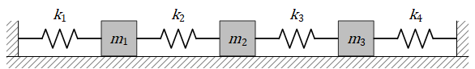
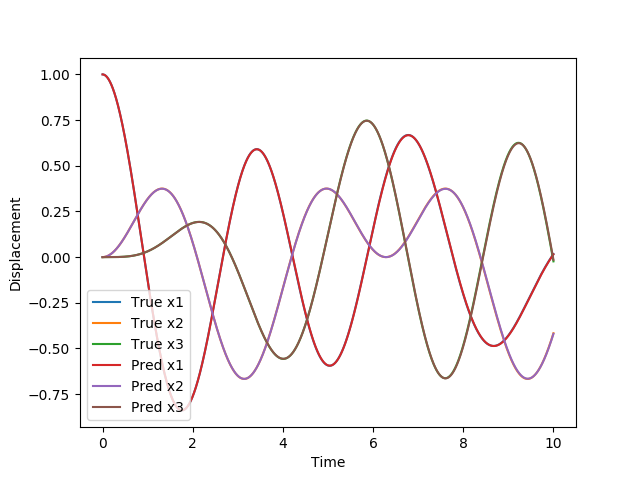

# Coupled Spring Mass ODE System

[公式ページ](https://docs.nvidia.com/deeplearning/modulus/modulus-sym/user_guide/foundational/ode_spring_mass.html)

## Introduction

このチュートリアルでは、Modulus Symを使用して連立常微分方程式のシステムを解くことに焦点を当てています。この問題で使用されるAPIは以前のチュートリアルで既に取り上げられているため、コードの詳細には触れずに問題の説明のみが議論されます。

Note :  
このチュートリアルは、LDCチュートリアルを完了し、Modulus Sym APIの基本に慣れていることを前提としています。また、新しい微分方程式の定義と、Modulus Symで時間依存問題を解決する手法については、1D波動方程式のチュートリアルを参照してください。

## Problem Description

このチュートリアルでは、下図に示されているシンプルなばね-マズ系を解きます。  
この問題には、4つのばねで互いに接続された3つのマスがあります。  
ばねへの摩擦は考慮せず、マスは点質量とみなされ、ばねの質量はないものとします。  
問題は質量($m's$)とばね定数($k's$)が定数として解かれますが、この部分を問題に含めることも可能です。別のチュートリアル([Parameterized 3D Heat Sink](https://docs.nvidia.com/deeplearning/modulus/modulus-sym/user_guide/advanced/parametrized_simulations.html#parameterizedsim))を参照ください。

モデルの方程式は以下の通りです：

$$
\begin{split}
m_1 x_1''(t) &= -k_1 x_1(t) + k_2(x_2(t) - x_1(t)),\\
m_2 x_2''(t) &= -k_2 (x_2(t) - x_1(t))+ k_3(x_3(t) - x_2(t)),\\
m_3 x_3''(t) &= -k_3 (x_3(t) - x_2(t)) - k_4 x_3(t)
\end{split}
$$

ここで、 $x_1(t), x_2(t), \text{and } x_3(t)$は、平衡位置からの質量の水平面に沿った位置を表し、プラスは右方向、マイナスは左方向です。図に示されているように、最初と最後のばねは壁に固定されています。

このチュートリアルでは、以下の条件を想定します：

$$
\begin{split}
[m_1, m_2, m_3] &= [1, 1, 1],\\
[k_1, k_2, k_3, k_4] &= [2, 1, 1, 2],\\
[x_1(0), x_2(0), x_3(0)] &= [1, 0, 0],\\
[x_1'(0), x_2'(0), x_3'(0)] &= [0, 0, 0].
\end{split}
$$



Fig. 63 Three masses connected by four springs on a frictionless surface

## Case Setup

この問題のケース設定は、チュートリアル```transient```の設定と非常に似ています。 ```spring_mass_ode.py```で微分方程式を定義し、次に```spring_mass_solver.py```でドメインとソルバーを定義できます。

Note :
この問題用のPythonスクリプトは、```examples/ode_spring_mass/```に見つけることができます。

## Defining the Equations

式142は、[1D Wave Equation](https://docs.nvidia.com/deeplearning/modulus/modulus-sym/user_guide/foundational/1d_wave_equation.html#transient)と同様に、sympy表記を使用してコーディングできます。

```python
from sympy import Symbol, Function, Number
from modulus.sym.eq.pde import PDE


class SpringMass(PDE):
    name = "SpringMass"

    def __init__(self, k=(2, 1, 1, 2), m=(1, 1, 1)):
        self.k = k
        self.m = m

        k1 = k[0]
        k2 = k[1]
        k3 = k[2]
        k4 = k[3]
        m1 = m[0]
        m2 = m[1]
        m3 = m[2]

        t = Symbol("t")
        input_variables = {"t": t}

        x1 = Function("x1")(*input_variables)
        x2 = Function("x2")(*input_variables)
        x3 = Function("x3")(*input_variables)

        if type(k1) is str:
            k1 = Function(k1)(*input_variables)
        elif type(k1) in [float, int]:
            k1 = Number(k1)
        if type(k2) is str:
            k2 = Function(k2)(*input_variables)
        elif type(k2) in [float, int]:
            k2 = Number(k2)
        if type(k3) is str:
            k3 = Function(k3)(*input_variables)
        elif type(k3) in [float, int]:
            k3 = Number(k3)
        if type(k4) is str:
            k4 = Function(k4)(*input_variables)
        elif type(k4) in [float, int]:
            k4 = Number(k4)

        if type(m1) is str:
            m1 = Function(m1)(*input_variables)
        elif type(m1) in [float, int]:
            m1 = Number(m1)
        if type(m2) is str:
            m2 = Function(m2)(*input_variables)
        elif type(m2) in [float, int]:
            m2 = Number(m2)
        if type(m3) is str:
            m3 = Function(m3)(*input_variables)
        elif type(m3) in [float, int]:
            m3 = Number(m3)

        self.equations = {}
        self.equations["ode_x1"] = m1 * (x1.diff(t)).diff(t) + k1 * x1 - k2 * (x2 - x1)
        self.equations["ode_x2"] = (
            m2 * (x2.diff(t)).diff(t) + k2 * (x2 - x1) - k3 * (x3 - x2)
        )
        self.equations["ode_x3"] = m3 * (x3.diff(t)).diff(t) + k3 * (x3 - x2) + k4 * x3
```

ここでは、各パラメータ $(k's \text{ と } m's)$ が関数として書かれ、定数であれば数値に置換されます。これにより、それらの任意の定数を文字列として渡すことでパラメータ化することができます。

## Solving the ODEs: Creating Geometry, defining ICs and making the Neural Network Solver

ODEが定義されると、以前のチュートリアルで見たように、最適化に必要な制約を簡単に形成できます。
この例では、点質量を作成するために```Point1D```ジオメトリが使用されます。また、解の時間範囲を定義し、時間の記号 ($t$) を作成して初期条件などを設定する必要があります。このコードは、この問題のジオメトリ定義を示しています。このチュートリアルでは、ポイントのx座標 ($x$) 情報は使用されません。これは、空間内の点をサンプリングするためにのみ使用されます。  
ポイントには、変数 ($t$) のみに異なる値が割り当てられます (時間範囲内の初期条件およびODE)。ノードと関連する制約を生成するコードは次のとおりです：

```python
import numpy as np
from sympy import Symbol, Eq

import modulus.sym
from modulus.sym.hydra import instantiate_arch, ModulusConfig
from modulus.sym.solver import Solver
from modulus.sym.domain import Domain
from modulus.sym.geometry.primitives_1d import Point1D
from modulus.sym.domain.constraint import (
    PointwiseBoundaryConstraint,
    PointwiseBoundaryConstraint,
)
from modulus.sym.domain.validator import PointwiseValidator
from modulus.sym.key import Key
from modulus.sym.node import Node

from spring_mass_ode import SpringMass


@modulus.sym.main(config_path="conf", config_name="config")
def run(cfg: ModulusConfig) -> None:
    # make list of nodes to unroll graph on
    sm = SpringMass(k=(2, 1, 1, 2), m=(1, 1, 1))
    sm_net = instantiate_arch(
        input_keys=[Key("t")],
        output_keys=[Key("x1"), Key("x2"), Key("x3")],
        cfg=cfg.arch.fully_connected,
    )
    nodes = sm.make_nodes() + [sm_net.make_node(name="spring_mass_network")]

    # add constraints to solver
    # make geometry
    geo = Point1D(0)
    t_max = 10.0
    t_symbol = Symbol("t")
    x = Symbol("x")
    time_range = {t_symbol: (0, t_max)}

    # make domain
    domain = Domain()

    # initial conditions
    IC = PointwiseBoundaryConstraint(
        nodes=nodes,
        geometry=geo,
        outvar={"x1": 1.0, "x2": 0, "x3": 0, "x1__t": 0, "x2__t": 0, "x3__t": 0},
        batch_size=cfg.batch_size.IC,
        lambda_weighting={
            "x1": 1.0,
            "x2": 1.0,
            "x3": 1.0,
            "x1__t": 1.0,
            "x2__t": 1.0,
            "x3__t": 1.0,
        },
        parameterization={t_symbol: 0},
    )
    domain.add_constraint(IC, name="IC")

    # solve over given time period
    interior = PointwiseBoundaryConstraint(
        nodes=nodes,
        geometry=geo,
        outvar={"ode_x1": 0.0, "ode_x2": 0.0, "ode_x3": 0.0},
        batch_size=cfg.batch_size.interior,
        parameterization=time_range,
    )
    domain.add_constraint(interior, "interior")
```

次に、この問題の検証データを定義できます。この問題の解は解析的に得られ、その式はnumpy配列の辞書にコーディングできます。これは、$x_1, x_2, \text{および} x_3$のためのものです。このコードのこの部分は、チュートリアル[1D Wave Equation](https://docs.nvidia.com/deeplearning/modulus/modulus-sym/user_guide/foundational/1d_wave_equation.html#transient)と類似しています。

```python
# add validation data
    deltaT = 0.001
    t = np.arange(0, t_max, deltaT)
    t = np.expand_dims(t, axis=-1)
    invar_numpy = {"t": t}
    outvar_numpy = {
        "x1": (1 / 6) * np.cos(t)
        + (1 / 2) * np.cos(np.sqrt(3) * t)
        + (1 / 3) * np.cos(2 * t),
        "x2": (2 / 6) * np.cos(t)
        + (0 / 2) * np.cos(np.sqrt(3) * t)
        - (1 / 3) * np.cos(2 * t),
        "x3": (1 / 6) * np.cos(t)
        - (1 / 2) * np.cos(np.sqrt(3) * t)
        + (1 / 3) * np.cos(2 * t),
    }
    validator = PointwiseValidator(
        nodes=nodes, invar=invar_numpy, true_outvar=outvar_numpy, batch_size=1024
    )
    domain.add_validator(validator)
```

さまざまな制約とドメインの定義が完了したので、ソルバーを形成して問題を実行できます。
同じことを行うためのコードは以下にあります：

```python
slv = Solver(cfg, domain)
slv.solve()
```

Pythonファイルがセットアップされたら、他のチュートリアルで見られるように、ソルバースクリプト```spring_mass_solver.py```を実行して問題を解決できます。

## Results and Post-processing

モデルシムのシミュレーションの結果は、解析的な検証データと比較されます。解が解析結果に非常に速く収束することがわかります。プロットは、ネットワークチェックポイント内の```validator/```ディレクトリに作成される```.npz```ファイルを使用して作成できます。



Fig. 64 Comparison of Modulus Sym results with an analytical solution.
