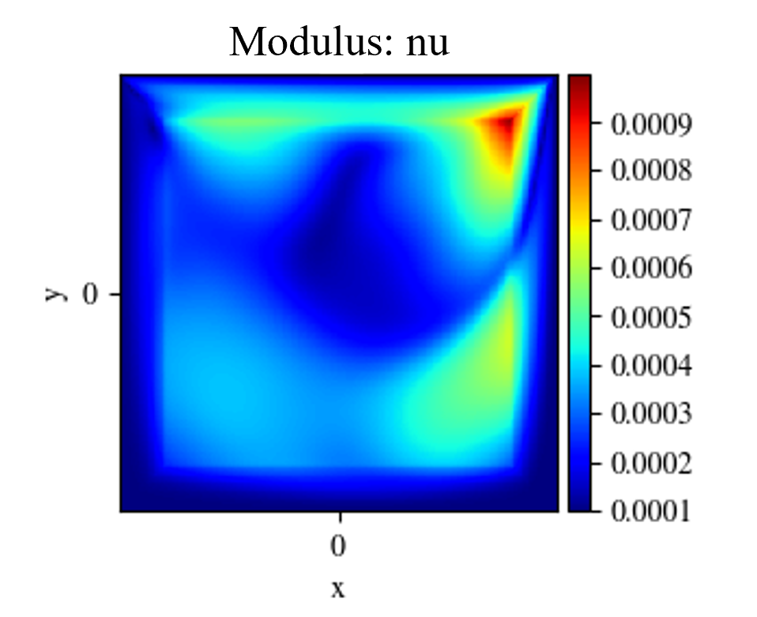
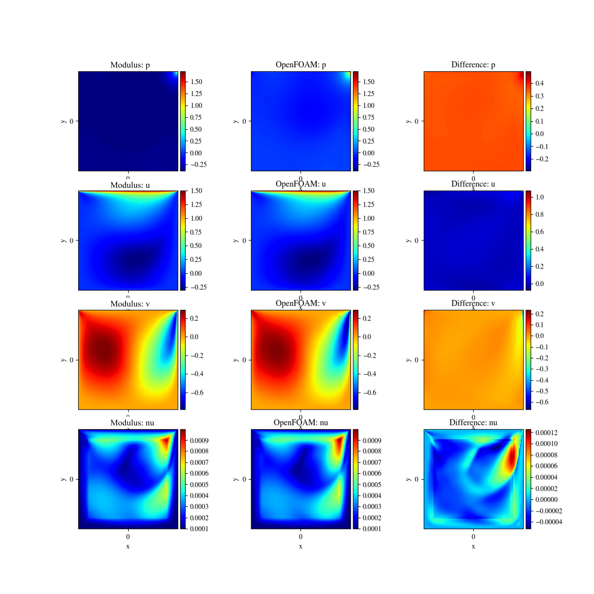

# Turbulent physics: Zero Equation Turbulence Model

[公式ページ](https://docs.nvidia.com/deeplearning/modulus/modulus-sym/user_guide/foundational/zero_eq_turbulence.html)

## Introduction

このチュートリアルでは、Modulus Symシミュレーションに代数的（ゼロ方程式）乱流モデルを追加するプロセスを解説します。このチュートリアルでは、以下の内容を学びます。

1. Modulus Symでゼロ方程式乱流モデルを使用する方法。

2. グラフ内で任意の変数のノードを作成する方法。

Note :
このチュートリアルでは、LDCチュートリアルを完了し、Modulus Sym APIの基本を理解していることを前提としています。

## Problem Description

このチュートリアルでは、Lid Driven Cavity流れのゼロ方程式乱流を追加します。問題設定は、Lid Driven Cavityチュートリアルで見られるものとほとんど同じです。ただし、レイノルズ数は1000に増加し、速度プロファイルは以前と同じものを使用します。また、レイノルズ数を増加させるため、粘度を$1 × 10^-4$ $(m^2/s)$に減少させます。

## Case Setup

このチュートリアルでのケース設定は、LDCチュートリアルと非常に似ています。前回のコードに追加された内容のみ記載します。

Note :
この問題のPythonスクリプトは、```examples/ldc/ldc_2d_zeroEq.py```で見つけることができます。

## Importing the required packages

Modulus Symの```ZeroEquation```をインポートます。その他のインポートモジュールは以前のLDCとほぼ同じです。

``` python
import os
import warnings

from sympy import Symbol, Eq, Abs
import torch
import modulus.sym
from modulus.sym.hydra import to_absolute_path, instantiate_arch, ModulusConfig
from modulus.sym.utils.io import csv_to_dict
from modulus.sym.solver import Solver
from modulus.sym.domain import Domain
from modulus.sym.geometry.primitives_2d import Rectangle

from modulus.sym.domain.constraint import (
    PointwiseBoundaryConstraint,
    PointwiseInteriorConstraint,
)
from modulus.sym.domain.monitor import PointwiseMonitor
from modulus.sym.domain.validator import PointwiseValidator
from modulus.sym.domain.inferencer import PointwiseInferencer
from modulus.sym.eq.pdes.navier_stokes import NavierStokes
from modulus.sym.eq.pdes.turbulence_zero_eq import ZeroEquation
from modulus.sym.utils.io.plotter import ValidatorPlotter, InferencerPlotter
from modulus.sym.key import Key
```

## Defining the Equations, Networks and Nodes

ナビエ・ストークス方程式に加えて、ゼロ方程式乱流モデルは、```ZeroEquation```方程式クラスをインスタンス化することで含まれます。ナビエ・ストークス方程式の運動粘性$\nu$は、現在はZeroEquationによって与えられるsympy式です。ZeroEquation乱流モデルは、ナビエ・ストークス方程式に効果的な粘性$(\nu+\nu_t)$を提供します。レイノルズ数に基づいて計算された流体の運動粘性が、```ZeroEquation```クラスへの入力として与えられます。

ゼロ方程式乱流モデルは以下の方程式で定義されます。注意：$\mu_t = \rho \nu_t$です。

$$
\mu_t=\rho l_m^2 \sqrt{G}
$$

$$
G=2(u_x)^2 + 2(v_y)^2 + 2(w_z)^2 + (u_y + v_x)^2 + (u_z + w_x)^2 + (v_z + w_y)^2
$$

$$
l_m=\min (0.419d, 0.09d_{max})
$$

ここで、$l_m$は混合長さ、$d$は壁からの法線距離、$d_{\text{max}}$は最大法線距離、$\sqrt{G}$は平均ひずみ率テンソルモジュールです。

ゼロ方程式乱流モデルでは、乱れ粘性係数を計算するために壁からの法線距離が必要です。  
ほとんどの場合、符号付き距離場（[SDF : Signed Distance Function](https://www.sbd.jp/column/powder_vol17_sdf.html)）が法線距離として機能します。ジオメトリがModulus Symのジオメトリモジュール/テッセレーションモジュールを使用して生成された場合、内部サンプリングで使用される他の座標変数と同様に、sdf変数にアクセスできます。ゼロ方程式モデルは粘性の微分も計算するため、```PointwiseInteriorConstraint```を使用する場合、```compute_sdf_derivatives=True```という引数を渡すことができます。これにより、```sdf__x```、```sdf__y```などの必要なSDFの微分が計算されます。

``` python
# make geometry
    height = 0.1
    width = 0.1
    x, y = Symbol("x"), Symbol("y")
    rec = Rectangle((-width / 2, -height / 2), (width / 2, height / 2))

    # make list of nodes to unroll graph on
    ze = ZeroEquation(nu=1e-4, dim=2, time=False, max_distance=height / 2)
    ns = NavierStokes(nu=ze.equations["nu"], rho=1.0, dim=2, time=False)
    flow_net = instantiate_arch(
        input_keys=[Key("x"), Key("y")],
        output_keys=[Key("u"), Key("v"), Key("p")],
        cfg=cfg.arch.fully_connected,
    )

    nodes = (
        ns.make_nodes() + ze.make_nodes() + [flow_net.make_node(name="flow_network")]
    )
```

## Setting up domain, adding constraints and running the solver

コードのこのセクションはLDCチュートリアルと非常に似ているため、コードと最終結果をここに示します。

``` python
# make ldc domain
    ldc_domain = Domain()

    # top wall
    top_wall = PointwiseBoundaryConstraint(
        nodes=nodes,
        geometry=rec,
        outvar={"u": 1.5, "v": 0},
        batch_size=cfg.batch_size.TopWall,
        lambda_weighting={"u": 1.0 - 20 * Abs(x), "v": 1.0},  # weight edges to be zero
        criteria=Eq(y, height / 2),
    )
    ldc_domain.add_constraint(top_wall, "top_wall")

    # no slip
    no_slip = PointwiseBoundaryConstraint(
        nodes=nodes,
        geometry=rec,
        outvar={"u": 0, "v": 0},
        batch_size=cfg.batch_size.NoSlip,
        criteria=y < height / 2,
    )
    ldc_domain.add_constraint(no_slip, "no_slip")

    # interior
    interior = PointwiseInteriorConstraint(
        nodes=nodes,
        geometry=rec,
        outvar={"continuity": 0, "momentum_x": 0, "momentum_y": 0},
        batch_size=cfg.batch_size.Interior,
        compute_sdf_derivatives=True,
        lambda_weighting={
            "continuity": Symbol("sdf"),
            "momentum_x": Symbol("sdf"),
            "momentum_y": Symbol("sdf"),
        },
    )
    ldc_domain.add_constraint(interior, "interior")

    # add validator
    file_path = "openfoam/cavity_uniformVel_zeroEqn_refined.csv"
    if os.path.exists(to_absolute_path(file_path)):
        mapping = {
            "Points:0": "x",
            "Points:1": "y",
            "U:0": "u",
            "U:1": "v",
            "p": "p",
            "d": "sdf",
            "nuT": "nu",
        }
        openfoam_var = csv_to_dict(to_absolute_path(file_path), mapping)
        openfoam_var["x"] += -width / 2  # center OpenFoam data
        openfoam_var["y"] += -height / 2  # center OpenFoam data
        openfoam_var["nu"] += 1e-4  # effective viscosity
        openfoam_invar_numpy = {
            key: value
            for key, value in openfoam_var.items()
            if key in ["x", "y", "sdf"]
        }
        openfoam_outvar_numpy = {
            key: value for key, value in openfoam_var.items() if key in ["u", "v", "nu"]
        }
        openfoam_validator = PointwiseValidator(
            nodes=nodes,
            invar=openfoam_invar_numpy,
            true_outvar=openfoam_outvar_numpy,
            batch_size=1024,
            plotter=ValidatorPlotter(),
            requires_grad=True,
        )
        ldc_domain.add_validator(openfoam_validator)

        # add inferencer data
        grid_inference = PointwiseInferencer(
            nodes=nodes,
            invar=openfoam_invar_numpy,
            output_names=["u", "v", "p", "nu"],
            batch_size=1024,
            plotter=InferencerPlotter(),
            requires_grad=True,
        )
        ldc_domain.add_inferencer(grid_inference, "inf_data")
    else:
        warnings.warn(
            f"Directory{file_path}does not exist. Will skip adding validators. Please download the additional files from NGC https://catalog.ngc.nvidia.com/orgs/nvidia/teams/modulus/resources/modulus_sym_examples_supplemental_materials"
        )

    # add monitors
    global_monitor = PointwiseMonitor(
        rec.sample_interior(4000),
        output_names=["continuity", "momentum_x", "momentum_y"],
        metrics={
            "mass_imbalance": lambda var: torch.sum(
                var["area"] * torch.abs(var["continuity"])
            ),
            "momentum_imbalance": lambda var: torch.sum(
                var["area"]
                * (torch.abs(var["momentum_x"]) + torch.abs(var["momentum_y"]))
            ),
        },
        nodes=nodes,
        requires_grad=True,
    )
    ldc_domain.add_monitor(global_monitor)

    # make solver
    slv = Solver(cfg, ldc_domain)

    # start solver
    slv.solve()


if __name__ == "__main__":
    run()
```

乱れのあるリッド駆動の空洞流の結果は以下の通りです。



Fig. 65 Visualizing variables from Inference domain



Fig. 66 Comparison with OpenFOAM data. Left: Modulus Sym Prediction. Center:OpenFOAM, Right: Difference
