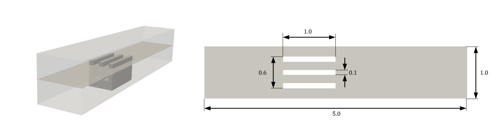
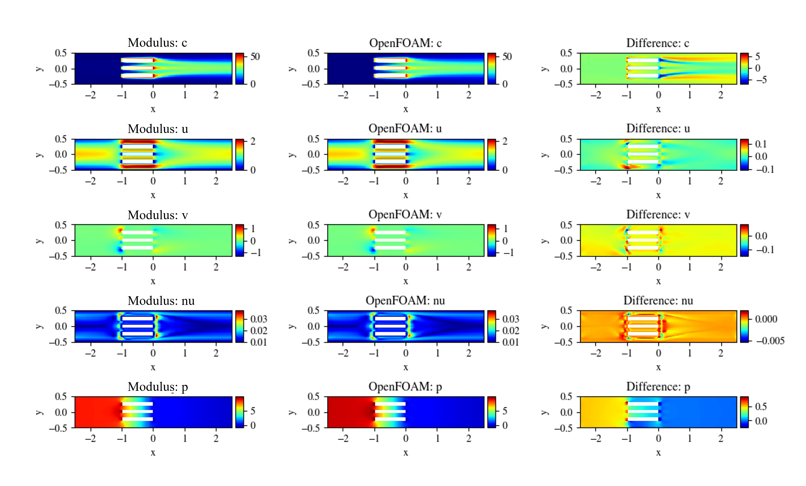

# Scalar Transport: 2D Advection Diffusion

[公式ページ](https://docs.nvidia.com/deeplearning/modulus/modulus-sym/user_guide/foundational/scalar_transport.html)

## Introduction

このチュートリアルでは、温度に関する移流拡散輸送方程式と連続の式、ナビエ・ストークスの式を使用して、2次元流れにおける熱伝達をモデル化します。このチュートリアルでは以下を学びます。

1. スカラー量の移流拡散を実装する方法。
2. 境界条件のカスタムプロファイルを作成し、勾配境界条件を設定する方法。
3. ```IntegralBoundaryConstraint```のような追加制約を使用して収束を高速化する方法。

Note :
このチュートリアルでは、LDCのチュートリアルを完了し、Modulus Sym APIの基本を理解していることを前提としています。

## Problem Description

このチュートリアルでは、3枚のフィンを持つヒートシンクからの熱伝達を計算します。  
Fig.67は問題を示した図です。ヒートシンクは350 Kの一定温度、入口温度は293.498 Kです。チャンネルの壁面は断熱的に扱われます。入口流速は、ピーク速度が1.5 m/sの放物線型速度プロファイルを持つと仮定します。動粘性$\nu$は0.01 $m^2/s$、プランドル数は5です。流れは層流ですが、zero乱流モデルが有効になっています。



Fig. 67 2D slice of three fin heat sink geometry (All dimensions in $m`)

## Case Setup

Note :
この問題のPythonスクリプトは、```examples/three_fin_2d/heat_sink.py```で見つけることができます。

## Importing the required packages

このチュートリアルでは、チャンネルを作成するために```Channel2D```ジオメトリを使用します。  
```Line```ジオメトリは、積分境界条件のための入口、出口、および中間平面を作成するために使用します。```AdvectionDiffusion```方程式は、```PDES```モジュールからインポートします。  
```parabola```と```GradNormal```は、必要な境界条件を生成するために利用します。

``` python
import os
import warnings

import torch
import numpy as np
from sympy import Symbol, Eq

import modulus.sym
from modulus.sym.hydra import to_absolute_path, instantiate_arch, ModulusConfig
from modulus.sym.solver import Solver
from modulus.sym.domain import Domain
from modulus.sym.geometry.primitives_2d import Rectangle, Line, Channel2D
from modulus.sym.utils.sympy.functions import parabola
from modulus.sym.utils.io import csv_to_dict
from modulus.sym.eq.pdes.navier_stokes import NavierStokes, GradNormal
from modulus.sym.eq.pdes.basic import NormalDotVec
from modulus.sym.eq.pdes.turbulence_zero_eq import ZeroEquation
from modulus.sym.eq.pdes.advection_diffusion import AdvectionDiffusion
from modulus.sym.domain.constraint import (
    PointwiseBoundaryConstraint,
    PointwiseInteriorConstraint,
    IntegralBoundaryConstraint,
)
from modulus.sym.domain.monitor import PointwiseMonitor
from modulus.sym.domain.validator import PointwiseValidator
from modulus.sym.key import Key
from modulus.sym.node import Node
from modulus.sym.geometry import Parameterization, Parameter
```

## Creating Geometry

この問題のジオメトリを生成するには、```Channel2D```をダクト用に、```Rectangle```をヒートシンクを生成するために使用します。  
```Channel2D```の定義方法は、```Rectangle```と同じです。ChannelとRectangleの違いは、Channelが無限であり、2つの曲線のみで構成されるのに対し、Rectangleは閉じた境界を形成する4つの曲線で構成されることです。

```Line```は、2つの端点のx座標とy座標、および曲線の法線方向を使用して定義します。  
```Line```では、両方の点のx座標が同じである必要があります。  
任意の方向の直線は、```Line```オブジェクトを回転させることで作成できます。  

以下のコードは、2次元ヒートシンク問題のジオメトリを生成します。  

``` python
# params for domain
    channel_length = (-2.5, 2.5)
    channel_width = (-0.5, 0.5)
    heat_sink_origin = (-1, -0.3)
    nr_heat_sink_fins = 3
    gap = 0.15 + 0.1
    heat_sink_length = 1.0
    heat_sink_fin_thickness = 0.1
    inlet_vel = 1.5
    heat_sink_temp = 350
    base_temp = 293.498
    nu = 0.01
    diffusivity = 0.01 / 5

    # define sympy varaibles to parametize domain curves
    x, y = Symbol("x"), Symbol("y")

    # define geometry
    channel = Channel2D(
        (channel_length[0], channel_width[0]), (channel_length[1], channel_width[1])
    )
    heat_sink = Rectangle(
        heat_sink_origin,
        (
            heat_sink_origin[0] + heat_sink_length,
            heat_sink_origin[1] + heat_sink_fin_thickness,
        ),
    )
    for i in range(1, nr_heat_sink_fins):
        heat_sink_origin = (heat_sink_origin[0], heat_sink_origin[1] + gap)
        fin = Rectangle(
            heat_sink_origin,
            (
                heat_sink_origin[0] + heat_sink_length,
                heat_sink_origin[1] + heat_sink_fin_thickness,
            ),
        )
        heat_sink = heat_sink + fin
    geo = channel - heat_sink

    inlet = Line(
        (channel_length[0], channel_width[0]), (channel_length[0], channel_width[1]), -1
    )
    outlet = Line(
        (channel_length[1], channel_width[0]), (channel_length[1], channel_width[1]), 1
    )

    x_pos = Parameter("x_pos")
    integral_line = Line(
        (x_pos, channel_width[0]),
        (x_pos, channel_width[1]),
        1,
        parameterization=Parameterization({x_pos: channel_length}),
    )
```

## Defining the Equations, Networks and Nodes

この問題では、熱と流体の問題を解くため、2つの独立したネットワークアーキテクチャを作成して、精度を向上させます。

[Turbulent physics: Zero Equation Turbulence Model](https://docs.nvidia.com/deeplearning/modulus/modulus-sym/user_guide/foundational/zero_eq_turbulence.html#ldc-zeroeq)と比較して、積分連続性（```NormalDotVec```）、AdvectionDiffusion、および```GradNormal```を追加するための式が指定され、計算対象の変数が```GradNormal```と```AdvectionDiffusion```に定義されます。

また、特定の方程式で計算グラフから特定の変数を切り離すことができます。これは、他の方程式から切り離すためにバックエンドで```.detach()```メソッドを使用して[勾配の計算を停止](https://pytorch.org/docs/stable/generated/torch.Tensor.detach.html)します。  
この問題では、$u$、$v$で勾配呼び出しを停止しています。これにより、流体方程式からの残差を最小化するために$u$、$v$を最適化するネットワークの更新を防ぎます。この方法で、システムを片側結合にすることができ、熱が流れに影響を与えないが、流れが熱に影響を与えるようにします。このように計算を分離することで収束の振る舞いを改善できます。

``` python
# make list of nodes to unroll graph on
ze = ZeroEquation(
    nu=nu, rho=1.0, dim=2, max_distance=(channel_width[1] - channel_width[0]) / 2
)
ns = NavierStokes(nu=ze.equations["nu"], rho=1.0, dim=2, time=False)
ade = AdvectionDiffusion(T="c", rho=1.0, D=diffusivity, dim=2, time=False)
gn_c = GradNormal("c", dim=2, time=False)
normal_dot_vel = NormalDotVec(["u", "v"])
flow_net = instantiate_arch(
    input_keys=[Key("x"), Key("y")],
    output_keys=[Key("u"), Key("v"), Key("p")],
    cfg=cfg.arch.fully_connected,
)
heat_net = instantiate_arch(
    input_keys=[Key("x"), Key("y")],
    output_keys=[Key("c")],
    cfg=cfg.arch.fully_connected,
)

nodes = (
    ns.make_nodes()
    + ze.make_nodes()
    + ade.make_nodes(detach_names=["u", "v"])
    + gn_c.make_nodes()
    + normal_dot_vel.make_nodes()
    + [flow_net.make_node(name="flow_network")]
    + [heat_net.make_node(name="heat_network")]
)
```

## Setting up the Domain and adding Constraints

境界条件は、以下に示すコードで実装されています。```normal_gradient_c'```は、勾配境界条件を設定するために使用されています。新しい変数$c$は、移流拡散方程式を解くために必用です。

$$
c=(T_{actual} - T_{inlet})/273.15
$$

2次元の連続の式とナビエ・ストークス方程式に加えて、内部でadvection diffusion方程式を解く必要があります（ソース項なし）。この問題の熱拡散率$D$は0.002 $m^2/s$です。

$$
u c_{x} + v c_{y} = D (c_{xx} + c_{yy})
$$

積分連続性面を使用して、これらの面を通る目標質量流量を指定できます。  
速度が1.5 m/sの放物線速度の場合、積分質量流量は1であり、収束を速めるための追加の制約として追加されます。  
[Introductory Example](https://docs.nvidia.com/deeplearning/modulus/modulus-sym/user_guide/basics/lid_driven_cavity_flow.html#introductory-example)のように、面境界で```'normal_dot_vel'```のキーを定義し、その値を1に設定して目標質量流を指定できます。これらの積分制約を定義するために```IntegralBoundaryConstraint```制約を使用します。ここでは、```integral_line```ジオメトリは、直線のx座標```x_pos```のためのシンボリック変数で作成されました。```IntegralBoundaryConstraint```制約は、さまざまな```x_pos```値のサンプルをランダムに生成します。このようなサンプルの数は```batch_size```引数で制御できます。
各サンプルのポイントは```integral_batch_size```引数で設定できます。シンボリック変数（この場合は```x_pos```）の範囲は```parameterization```引数を使用して設定できます。

これらの面（2Dジオメトリの場合は直線）は、後で計算される```NormalDotVec PDE```で使用されます。これは、ジオメトリの法線成分と速度成分の内積を計算します。放物線プロファイルは、スイープ用の変数、2つの交点、および最大高さを指定して```parabola```関数を使用して作成できます。

``` python
# make domain
    domain = Domain()

    # inlet
    inlet_parabola = parabola(
        y, inter_1=channel_width[0], inter_2=channel_width[1], height=inlet_vel
    )
    inlet = PointwiseBoundaryConstraint(
        nodes=nodes,
        geometry=inlet,
        outvar={"u": inlet_parabola, "v": 0, "c": 0},
        batch_size=cfg.batch_size.inlet,
    )
    domain.add_constraint(inlet, "inlet")

    # outlet
    outlet = PointwiseBoundaryConstraint(
        nodes=nodes,
        geometry=outlet,
        outvar={"p": 0},
        batch_size=cfg.batch_size.outlet,
    )
    domain.add_constraint(outlet, "outlet")

    # heat_sink wall
    hs_wall = PointwiseBoundaryConstraint(
        nodes=nodes,
        geometry=heat_sink,
        outvar={"u": 0, "v": 0, "c": (heat_sink_temp - base_temp) / 273.15},
        batch_size=cfg.batch_size.hs_wall,
    )
    domain.add_constraint(hs_wall, "heat_sink_wall")

    # channel wall
    channel_wall = PointwiseBoundaryConstraint(
        nodes=nodes,
        geometry=channel,
        outvar={"u": 0, "v": 0, "normal_gradient_c": 0},
        batch_size=cfg.batch_size.channel_wall,
    )
    domain.add_constraint(channel_wall, "channel_wall")

    # interior flow
    interior_flow = PointwiseInteriorConstraint(
        nodes=nodes,
        geometry=geo,
        outvar={"continuity": 0, "momentum_x": 0, "momentum_y": 0},
        batch_size=cfg.batch_size.interior_flow,
        compute_sdf_derivatives=True,
        lambda_weighting={
            "continuity": Symbol("sdf"),
            "momentum_x": Symbol("sdf"),
            "momentum_y": Symbol("sdf"),
        },
    )
    domain.add_constraint(interior_flow, "interior_flow")

    # interior heat
    interior_heat = PointwiseInteriorConstraint(
        nodes=nodes,
        geometry=geo,
        outvar={"advection_diffusion_c": 0},
        batch_size=cfg.batch_size.interior_heat,
        lambda_weighting={
            "advection_diffusion_c": 1.0,
        },
    )
    domain.add_constraint(interior_heat, "interior_heat")

    # integral continuity
    def integral_criteria(invar, params):
        sdf = geo.sdf(invar, params)
        return np.greater(sdf["sdf"], 0)

    integral_continuity = IntegralBoundaryConstraint(
        nodes=nodes,
        geometry=integral_line,
        outvar={"normal_dot_vel": 1},
        batch_size=cfg.batch_size.num_integral_continuity,
        integral_batch_size=cfg.batch_size.integral_continuity,
        lambda_weighting={"normal_dot_vel": 0.1},
        criteria=integral_criteria,
    )
    domain.add_constraint(integral_continuity, "integral_continuity")
```

## Adding Monitors and Validators

検証データは、OpenFOAMを使用して計算された2Dシミュレーションから取得され、そのインポート用のコードは以下にあります。

``` python
# add validation data
    file_path = "openfoam/heat_sink_zeroEq_Pr5_mesh20.csv"
    if os.path.exists(to_absolute_path(file_path)):
        mapping = {
            "Points:0": "x",
            "Points:1": "y",
            "U:0": "u",
            "U:1": "v",
            "p": "p",
            "d": "sdf",
            "nuT": "nu",
            "T": "c",
        }
        openfoam_var = csv_to_dict(to_absolute_path(file_path), mapping)
        openfoam_var["nu"] += nu
        openfoam_var["c"] += -base_temp
        openfoam_var["c"] /= 273.15
        openfoam_invar_numpy = {
            key: value
            for key, value in openfoam_var.items()
            if key in ["x", "y", "sdf"]
        }
        openfoam_outvar_numpy = {
            key: value
            for key, value in openfoam_var.items()
            if key in ["u", "v", "p", "c"]  # Removing "nu"
        }
        openfoam_validator = PointwiseValidator(
            nodes=nodes,
            invar=openfoam_invar_numpy,
            true_outvar=openfoam_outvar_numpy,
        )
        domain.add_validator(openfoam_validator)
    else:
        warnings.warn(
            f"Directory{file_path}does not exist. Will skip adding validators. Please download the additional files from NGC https://catalog.ngc.nvidia.com/orgs/nvidia/teams/modulus/resources/modulus_sym_examples_supplemental_materials"
        )

    # monitors for force, residuals and temperature
    global_monitor = PointwiseMonitor(
        geo.sample_interior(100),
        output_names=["continuity", "momentum_x", "momentum_y"],
        metrics={
            "mass_imbalance": lambda var: torch.sum(
                var["area"] * torch.abs(var["continuity"])
            ),
            "momentum_imbalance": lambda var: torch.sum(
                var["area"]
                * (torch.abs(var["momentum_x"]) + torch.abs(var["momentum_y"]))
            ),
        },
        nodes=nodes,
        requires_grad=True,
    )
    domain.add_monitor(global_monitor)

    force = PointwiseMonitor(
        heat_sink.sample_boundary(100),
        output_names=["p"],
        metrics={
            "force_x": lambda var: torch.sum(var["normal_x"] * var["area"] * var["p"]),
            "force_y": lambda var: torch.sum(var["normal_y"] * var["area"] * var["p"]),
        },
        nodes=nodes,
    )
    domain.add_monitor(force)

    peakT = PointwiseMonitor(
        heat_sink.sample_boundary(100),
        output_names=["c"],
        metrics={"peakT": lambda var: torch.max(var["c"])},
        nodes=nodes,
    )
    domain.add_monitor(peakT)
```

## Training the model

Pythonファイルが設定されたら、Pythonスクリプトを実行してトレーニングを開始できます。

```bash
python heat_sink.py
```

## Results and Post-processing

Modulus Symシミュレーションの結果は、:numref:fig-2d_heat_sink_resultsに示すOpenFOAMのデータと比較されます。



Fig. 68 Left:  Modulus Sym. Center: OpenFOAM. Right: Difference
