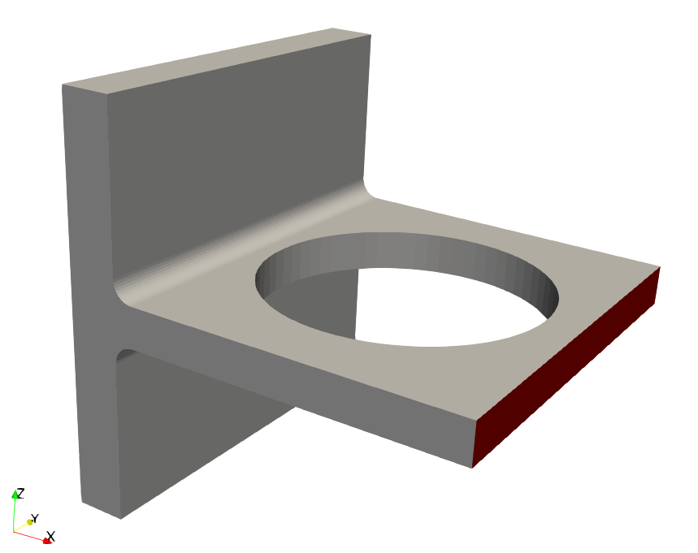
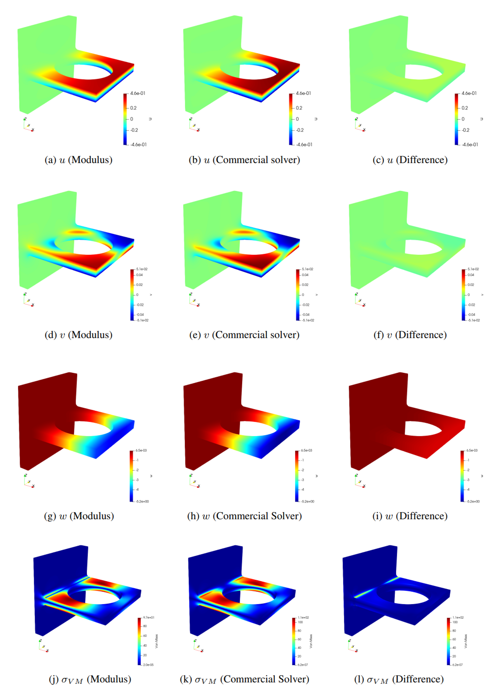
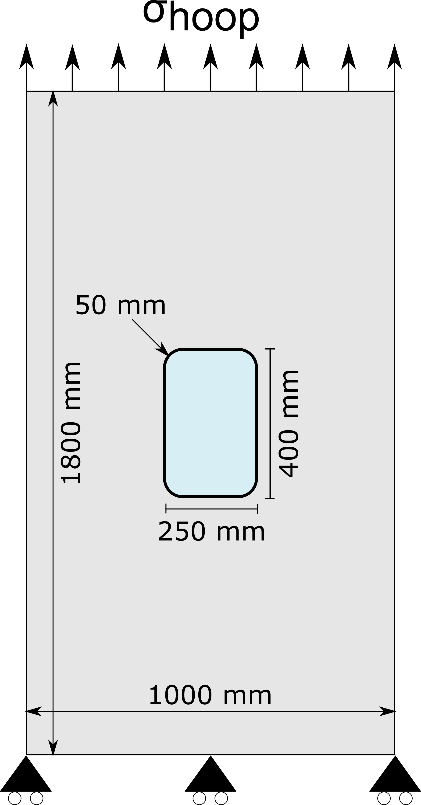
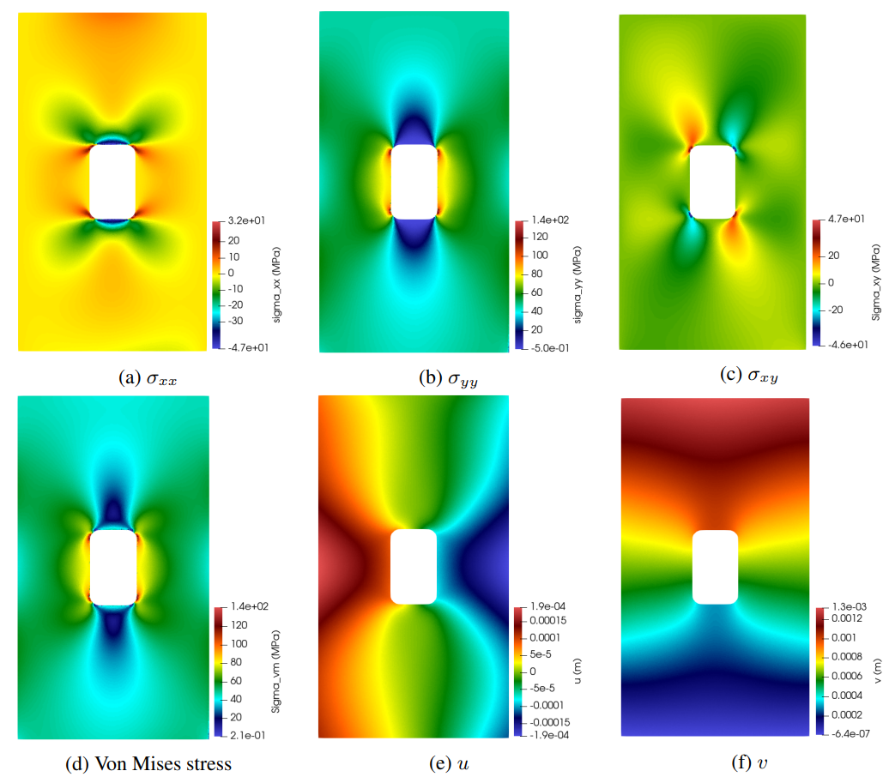
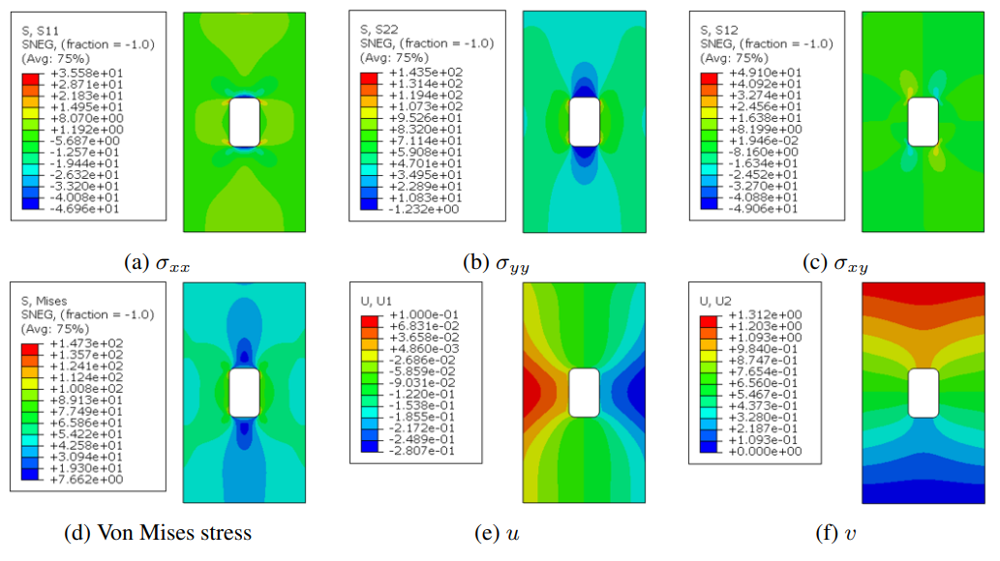
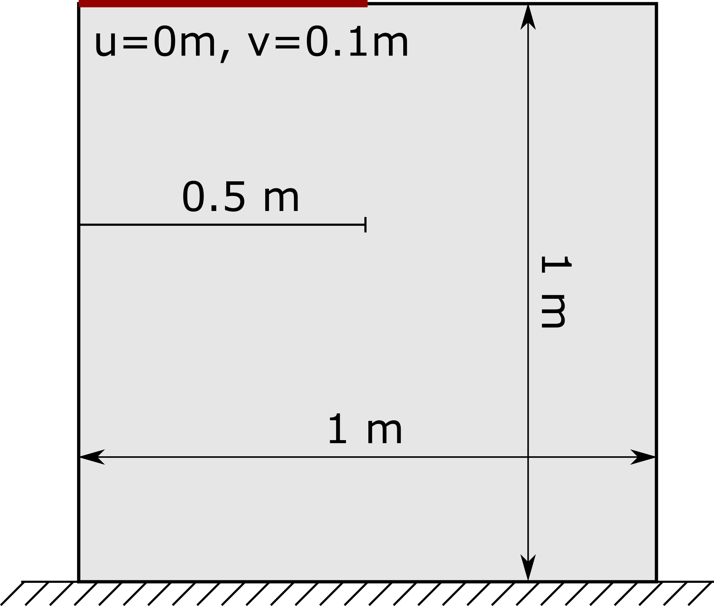
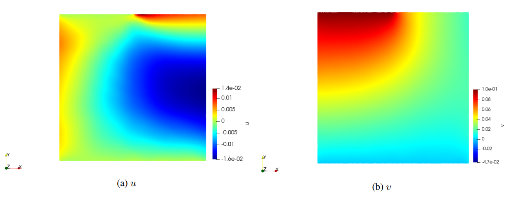

# Linear Elasticity

[公式ページ](https://docs.nvidia.com/deeplearning/modulus/modulus-sym/user_guide/foundational/linear_elasticity.html)

## Introduction

このチュートリアルでは、Modulus Symにおける線形弾性解析の実装について説明します。  
Modulus Symを使って、線形弾性方程式をもとにした様々な境界条件下での問題を解くことが可能です。  
この章では、3つの例題を使って、Modulus Symにおける線形弾性の詳細について解説します。このチュートリアルでは、以下の内容を学習します：

・微分形式および変分形式を使用して線形弾性方程式を解く方法

・3Dおよび薄い2D構造（平面応力）の線形弾性問題を解決する方法

・弾性方程式を無次元化する方法
  
Note :
このチュートリアルは、導入チュートリアルを完了し、Modulus Sym APIの基本に慣れていることを前提としています。
PDEの弱解に関する詳細は、[別資料](https://docs.nvidia.com/deeplearning/modulus/modulus-sym/user_guide/theory/phys_informed.html#weak-solutions-pinn)を参照してください。
いくつかの境界条件は、チュートリアル[変分法の例題](https://docs.nvidia.com/deeplearning/modulus/modulus-sym/user_guide/intermediate/variational_example.html#variational-example)でより詳細に定義されています。

Modulus Symにおける線形弾性方程式は、ソースコードディレクトリ```modulus/eq/pdes/linear_elasticity.py```で定義されています。

Warning :
この例題ではPythonパッケージ quadpy <https://github.com/nschloe/quadpy> が必要になります。
pip install quadpy を使用してインストールしてください（Modulus Dockerでを利用すればインストールの必用はありません）。

## Linear Elasticity in the Differential Form

## Linear elasticity equations in the displacement form

（定常状態の）線形弾性方程式による変位は、ナビエ方程式として知られており、次のように定義されます。

<div id="eq149"></div>

$$
(\lambda + \mu) u_{j,ji} + \mu u_{i,jj} + f_i = 0 
\tag{149}$$

ここで、 $u_i$ ​は変位ベクトル、$f_i$ ​は単位体積あたりの体積力、$\lambda, \mu$はラメ定数として以下のように定義されます。

<div id="eq150"></div>

$$
\lambda = \frac{E \nu}{(1+\nu)(1-2\nu)} 
\tag{150}$$

<div id="eq151"></div>

$$
\mu = \frac{E}{2(1+\nu)}
\tag{151}$$

ここで, $E$, $v$ はそれぞれヤング率とポアソン比を示します。

## Linear elasticity equations in the mixed form

変位形式に加えて、線形弾性は混合変数形式でも記述できます。  
内部実験および[1](#ref1)で報告された研究に基づき、混合変数形式は、低次の微分項により、ニューラルネットワークソルバーが学習しやすいと考えられています。  
混合変数形式では、平衡方程式は次のように定義されます：

<div id="eq152"></div>

$$
\sigma_{ji,j} + f_i = 0
\tag{151}$$
ここで $\sigma_{ij}$ コーシー応力テンソルです。応力-変位方程式も次のように定義されます：

<div id="eq153"></div>

$$
\sigma_{ij} = \lambda \epsilon_{kk} \delta_{ij} + 2 \mu \epsilon_{ij}
\tag{153}$$

ここで $\delta_{ij}$ はクロネッカーのデルタ関数であり、 $\epsilon_{ij}$ ​は以下の形式をとるひずみテンソルです。

<div id="eq154"></div>

$$
\epsilon_{ij} = \frac{1}{2}\left( u_{i,j} + u_{j,i} \right)
\tag{154}$$

## Nondimensionalized linear elasticity equations

弾性方程式の正規化された無次元数を用いることは、訓練の収束性と精度を向上させるのに有効です。  
無次元数は、以下のように定義できます：

<div id="eq155"></div>

$$
\hat{x}_i = \frac{x_i}{L}
\tag{155}$$

<div id="eq156"></div>

$$
\hat{u}_i = \frac{u_i}{U}
\tag{156}$$

<div id="eq157"></div>

$$
\hat{\lambda} = \frac{\lambda}{\mu_c}
\tag{157}$$

<div id="eq158"></div>

$$
\hat{\mu} = \frac{\mu}{\mu_c}
\tag{158}$$

ここで $L$ は特徴長さ, $U$ は特徴変位, $\mu_c$ は無次元のせん断係数です。
無次元化されたナビエ方程式と平衡方程式は、方程式の両側に $L^2/\mu_c U$ を掛けることにより得られます。  
これは次のようになります

<div id="eq159"></div>

$$
(\hat{\lambda} + \hat{\mu}) \hat{u}_{j,ji} + \hat{\mu} \hat{u}_{i,jj} + \hat{f}_i = 0
\tag{159}$$

<div id="eq160"></div>

$$
\hat{\sigma}_{ji,j} + \hat{f_i} = 0
\tag{160}$$

ここで、無次元化された体積力と応力テンソルは次のようになります：

<div id="eq161"></div>

$$
\hat{f}_{i} = \frac{L^2}{\mu_c U} f_{i}
\tag{161}$$

<div id="eq162"></div>

$$
\hat{\sigma}_{ij} = \frac{L}{\mu_c U}\sigma_{ij}
\tag{162}$$

同様に、応力-変位方程式の無次元化形式は、方程式の両側に$L/\mu_c U$を掛けることで得られます。これは次のようになります：

<div id="eq163"></div>

$$
\hat{\sigma}_{ij} = \hat{\lambda} \hat{\epsilon}_{kk} \delta_{ij} + 2 \hat{\mu} \hat{\epsilon}_{ij}
\tag{163}$$

<div id="eq164"></div>

$$
\hat{\epsilon}_{ij} = \frac{1}{2}\left( \hat{u}_{i,j} + \hat{u}_{j,i} \right)
\tag{164}$$

## Plane stress equations

薄い構造物の平面応力状態では、以下が仮定されます：

<div id="eq165"></div>

$$
\hat{\sigma}_{zz} =  \hat{\sigma}_{xz} = \hat{\sigma}_{yz} = 0
\tag{165}$$

したがって、次の関係が成立します：

<div id="eq166"></div>

$$
\hat{\sigma}_{zz} = \hat{\lambda} \left(\frac{\partial \hat{u}}{\partial \hat{x}} + \frac{\partial \hat{v}}{\partial \hat{y}} + \frac{\partial \hat{w}}{\partial \hat{z}} \right) + 2 \hat{\mu} \frac{\partial \hat{w}}{\partial \hat{z}} = 0 \Rightarrow \frac{\partial \hat{w}}{\partial \hat{z}} = \frac{-\hat{\lambda}}{(\hat{\lambda} +2\hat{\mu})}  \left(\frac{\partial \hat{u}}{\partial \hat{x}} + \frac{\partial \hat{v}}{\partial \hat{y}} \right)
\tag{166}$$

それに応じて、$\hat{\sigma}_{xx}$ ​および $\hat{\sigma}_{yy}$ ​の方程式は以下のように更新できます：

<div id="eq167"></div>

$$
\hat{\sigma}_{xx} = \hat{\lambda} \left(\frac{\partial \hat{u}}{\partial \hat{x}} + \frac{\partial \hat{v}}{\partial \hat{y}} + \frac{-\hat{\lambda}}{(\hat{\lambda} +2\hat{\mu})}  \left(\frac{\partial \hat{u}}{\partial \hat{x}} + \frac{\partial \hat{v}}{\partial \hat{y}} \right)  \right) + 2 \hat{\mu} \frac{\partial \hat{u}}{\partial \hat{x}}
\tag{167}$$

<div id="eq168"></div>

$$
\hat{\sigma}_{yy} = \hat{\lambda} \left(\frac{\partial \hat{u}}{\partial \hat{x}} + \frac{\partial \hat{v}}{\partial \hat{y}} + \frac{-\hat{\lambda}}{(\hat{\lambda} +2\hat{\mu})}  \left(\frac{\partial \hat{u}}{\partial \hat{x}} + \frac{\partial \hat{v}}{\partial \hat{y}} \right)  \right) + 2 \hat{\mu} \frac{\partial \hat{v}}{\partial \hat{y}}.
\tag{168}$$

### Problem 1: Deflection of a bracket
---

下図に示される3Dブラケットの線形弾性チュートリアルを紹介します。  
この例は部分的に[MATLAB PDEツールボックス](https://www.mathworks.com/help/pde/ug/deflection-analysis-of-a-bracket.html)から採用されています。  
このブラケットの背面は固定され、正面（赤で示される面）には$4 \times 10^4 \text{Pa}$の外力がマイナス$z$方向に適用されます。
残りの表面は外力が働かない境界とみなされます。
その他の物性は以下のように設定されています。
$$(E, \nu) = (100 \,\text{GPa}, 0.3)$$
線形弾性方程式を無次元化するために、以下のような定義を行います：

<div id="eq169"></div>

$$
L=1\text{m}, U=0.0001 \text{m}, \mu_c=0.01 \mu
\tag{169}$$



Fig.69 Geometry of the bracket. The back face of the bracket is clamped, and a shear stress is applied to the front face in the negative z-direction.

```python
# Specify parameters
    nu = 0.3
    E = 100e9
    lambda_ = nu * E / ((1 + nu) * (1 - 2 * nu))
    mu = E / (2 * (1 + nu))
    mu_c = 0.01 * mu
    lambda_ = lambda_ / mu_c
    mu = mu / mu_c
    characteristic_length = 1.0
    characteristic_displacement = 1e-4
    sigma_normalization = characteristic_length / (characteristic_displacement * mu_c)
    T = -4e4 * sigma_normalization
```

一般に、特徴的な長さは、ジオメトリの最大寸法を(−1,1)(−1,1)に制限するように選ぶことができます。  
特徴的な変位と $μ_c$ ​も、適用された牽引力と最大変位が順に1に近くなるように選ぶことができます。  
最大変位は事前にはわかりませんが、初期推測に基づいて変位のおおよそのオーダーに基づいて合理的に選択される限り、特徴的な変位の選択に対する収束の感度は低いことが観察されています。  
PDEの無次元化に関する詳細は、[微分方程式のスケーリング](https://hplgit.github.io/scaling-book/doc/pub/book/html/sphinx-cbc/index.html) で見つけることができます。

### Case Setup and Results

この問題の完全なPythonスクリプトは、```examples/bracket/bracket.py```にあります。変位と応力に対して、以下のように2つの別々のニューラルネットワークが使用されます。

```python
# make list of nodes to unroll graph on
    le = LinearElasticity(lambda_=lambda_, mu=mu, dim=3)
    disp_net = instantiate_arch(
        input_keys=[Key("x"), Key("y"), Key("z")],
        output_keys=[Key("u"), Key("v"), Key("w")],
        cfg=cfg.arch.fully_connected,
    )
    stress_net = instantiate_arch(
        input_keys=[Key("x"), Key("y"), Key("z")],
        output_keys=[
            Key("sigma_xx"),
            Key("sigma_yy"),
            Key("sigma_zz"),
            Key("sigma_xy"),
            Key("sigma_xz"),
            Key("sigma_yz"),
        ],
        cfg=cfg.arch.fully_connected,
    )
    nodes = (
        le.make_nodes()
        + [disp_net.make_node(name="displacement_network")]
        + [stress_net.make_node(name="stress_network")]
    )
```

この例では、線形弾性方程式の混合形式が使用されているため、訓練の制約は以下のように定義されます：

```python
# add constraints to solver
    # make geometry
    x, y, z = Symbol("x"), Symbol("y"), Symbol("z")
    support_origin = (-1, -1, -1)
    support_dim = (0.25, 2, 2)
    bracket_origin = (-0.75, -1, -0.1)
    bracket_dim = (1.75, 2, 0.2)
    cylinder_radius = 0.1
    cylinder_height = 2.0
    aux_lower_origin = (-0.75, -1, -0.1 - cylinder_radius)
    aux_lower_dim = (cylinder_radius, 2, cylinder_radius)
    aux_upper_origin = (-0.75, -1, 0.1)
    aux_upper_dim = (cylinder_radius, 2, cylinder_radius)
    cylinder_lower_center = (-0.75 + cylinder_radius, 0, 0)
    cylinder_upper_center = (-0.75 + cylinder_radius, 0, 0)
    cylinder_hole_radius = 0.7
    cylinder_hole_height = 0.5
    cylinder_hole_center = (0.125, 0, 0)

    support = Box(
        support_origin,
        (
            support_origin[0] + support_dim[0],
            support_origin[1] + support_dim[1],
            support_origin[2] + support_dim[2],
        ),
    )
    bracket = Box(
        bracket_origin,
        (
            bracket_origin[0] + bracket_dim[0],
            bracket_origin[1] + bracket_dim[1],
            bracket_origin[2] + bracket_dim[2],
        ),
    )
    aux_lower = Box(
        aux_lower_origin,
        (
            aux_lower_origin[0] + aux_lower_dim[0],
            aux_lower_origin[1] + aux_lower_dim[1],
            aux_lower_origin[2] + aux_lower_dim[2],
        ),
    )
    aux_upper = Box(
        aux_upper_origin,
        (
            aux_upper_origin[0] + aux_upper_dim[0],
            aux_upper_origin[1] + aux_upper_dim[1],
            aux_upper_origin[2] + aux_upper_dim[2],
        ),
    )
    cylinder_lower = Cylinder(cylinder_lower_center, cylinder_radius, cylinder_height)
    cylinder_upper = Cylinder(cylinder_upper_center, cylinder_radius, cylinder_height)
    cylinder_hole = Cylinder(
        cylinder_hole_center, cylinder_hole_radius, cylinder_hole_height
    )
    cylinder_lower = cylinder_lower.rotate(np.pi / 2, "x")
    cylinder_upper = cylinder_upper.rotate(np.pi / 2, "x")
    cylinder_lower = cylinder_lower.translate([0, 0, -0.1 - cylinder_radius])
    cylinder_upper = cylinder_upper.translate([0, 0, 0.1 + cylinder_radius])

    curve_lower = aux_lower - cylinder_lower
    curve_upper = aux_upper - cylinder_upper
    geo = support + bracket + curve_lower + curve_upper - cylinder_hole

    # Doamin bounds
    bounds_x = (-1, 1)
    bounds_y = (-1, 1)
    bounds_z = (-1, 1)
    bounds_support_x = (-1, -0.65)
    bounds_support_y = (-1, 1)
    bounds_support_z = (-1, 1)
    bounds_bracket_x = (-0.65, 1)
    bounds_bracket_y = (-1, 1)
    bounds_bracket_z = (-0.1, 0.1)

    # make domain
    domain = Domain()

    # back BC
    backBC = PointwiseBoundaryConstraint(
        nodes=nodes,
        geometry=geo,
        outvar={"u": 0, "v": 0, "w": 0},
        batch_size=cfg.batch_size.backBC,
        lambda_weighting={"u": 10, "v": 10, "w": 10},
        criteria=Eq(x, support_origin[0]),
    )
    domain.add_constraint(backBC, "backBC")

    # front BC
    frontBC = PointwiseBoundaryConstraint(
        nodes=nodes,
        geometry=geo,
        outvar={"traction_x": 0, "traction_y": 0, "traction_z": T},
        batch_size=cfg.batch_size.frontBC,
        criteria=Eq(x, bracket_origin[0] + bracket_dim[0]),
    )
    domain.add_constraint(frontBC, "frontBC")

    # surface BC
    surfaceBC = PointwiseBoundaryConstraint(
        nodes=nodes,
        geometry=geo,
        outvar={"traction_x": 0, "traction_y": 0, "traction_z": 0},
        batch_size=cfg.batch_size.surfaceBC,
        criteria=And((x > support_origin[0]), (x < bracket_origin[0] + bracket_dim[0])),
    )
    domain.add_constraint(surfaceBC, "surfaceBC")

    # support interior
    interior = PointwiseInteriorConstraint(
        nodes=nodes,
        geometry=geo,
        outvar={
            "equilibrium_x": 0.0,
            "equilibrium_y": 0.0,
            "equilibrium_z": 0.0,
            "stress_disp_xx": 0.0,
            "stress_disp_yy": 0.0,
            "stress_disp_zz": 0.0,
            "stress_disp_xy": 0.0,
            "stress_disp_xz": 0.0,
            "stress_disp_yz": 0.0,
        },
        batch_size=cfg.batch_size.interior_support,
        bounds={x: bounds_support_x, y: bounds_support_y, z: bounds_support_z},
        lambda_weighting={
            "equilibrium_x": Symbol("sdf"),
            "equilibrium_y": Symbol("sdf"),
            "equilibrium_z": Symbol("sdf"),
            "stress_disp_xx": Symbol("sdf"),
            "stress_disp_yy": Symbol("sdf"),
            "stress_disp_zz": Symbol("sdf"),
            "stress_disp_xy": Symbol("sdf"),
            "stress_disp_xz": Symbol("sdf"),
            "stress_disp_yz": Symbol("sdf"),
        },
    )
    domain.add_constraint(interior, "interior_support")

    # bracket interior
    interior = PointwiseInteriorConstraint(
        nodes=nodes,
        geometry=geo,
        outvar={
            "equilibrium_x": 0.0,
            "equilibrium_y": 0.0,
            "equilibrium_z": 0.0,
            "stress_disp_xx": 0.0,
            "stress_disp_yy": 0.0,
            "stress_disp_zz": 0.0,
            "stress_disp_xy": 0.0,
            "stress_disp_xz": 0.0,
            "stress_disp_yz": 0.0,
        },
        batch_size=cfg.batch_size.interior_bracket,
        bounds={x: bounds_bracket_x, y: bounds_bracket_y, z: bounds_bracket_z},
        lambda_weighting={
            "equilibrium_x": Symbol("sdf"),
            "equilibrium_y": Symbol("sdf"),
            "equilibrium_z": Symbol("sdf"),
            "stress_disp_xx": Symbol("sdf"),
            "stress_disp_yy": Symbol("sdf"),
            "stress_disp_zz": Symbol("sdf"),
            "stress_disp_xy": Symbol("sdf"),
            "stress_disp_xz": Symbol("sdf"),
            "stress_disp_yz": Symbol("sdf"),
        },
    )
    domain.add_constraint(interior, "interior_bracket")

    # add validation data

    mapping = {
        "X Location (m)": "x",
        "Y Location (m)": "y",
        "Z Location (m)": "z",
        "Directional Deformation (m)": "u",
    }
    mapping_v = {"Directional Deformation (m)": "v"}
    mapping_w = {"Directional Deformation (m)": "w"}
    mapping_sxx = {"Normal Stress (Pa)": "sigma_xx"}
    mapping_syy = {"Normal Stress (Pa)": "sigma_yy"}
    mapping_szz = {"Normal Stress (Pa)": "sigma_zz"}
    mapping_sxy = {"Shear Stress (Pa)": "sigma_xy"}
    mapping_sxz = {"Shear Stress (Pa)": "sigma_xz"}
    mapping_syz = {"Shear Stress (Pa)": "sigma_yz"}

    file_path = "commercial_solver"
    if os.path.exists(to_absolute_path(file_path)):
        commercial_solver_var = csv_to_dict(
            to_absolute_path("commercial_solver/deformation_x.txt"),
            mapping,
            delimiter="\t",
        )
        commercial_solver_var_v = csv_to_dict(
            to_absolute_path("commercial_solver/deformation_y.txt"),
            mapping_v,
            delimiter="\t",
        )
        commercial_solver_var_w = csv_to_dict(
            to_absolute_path("commercial_solver/deformation_z.txt"),
            mapping_w,
            delimiter="\t",
        )
        commercial_solver_var_sxx = csv_to_dict(
            to_absolute_path("commercial_solver/normal_x.txt"),
            mapping_sxx,
            delimiter="\t",
        )
        commercial_solver_var_syy = csv_to_dict(
            to_absolute_path("commercial_solver/normal_y.txt"),
            mapping_syy,
            delimiter="\t",
        )
        commercial_solver_var_szz = csv_to_dict(
            to_absolute_path("commercial_solver/normal_z.txt"),
            mapping_szz,
            delimiter="\t",
        )
        commercial_solver_var_sxy = csv_to_dict(
            to_absolute_path("commercial_solver/shear_xy.txt"),
            mapping_sxy,
            delimiter="\t",
        )
        commercial_solver_var_sxz = csv_to_dict(
            to_absolute_path("commercial_solver/shear_xz.txt"),
            mapping_sxz,
            delimiter="\t",
        )
        commercial_solver_var_syz = csv_to_dict(
            to_absolute_path("commercial_solver/shear_yz.txt"),
            mapping_syz,
            delimiter="\t",
        )
        commercial_solver_var["x"] = commercial_solver_var["x"]
        commercial_solver_var["y"] = commercial_solver_var["y"]
        commercial_solver_var["z"] = commercial_solver_var["z"]
        commercial_solver_var["u"] = (
            commercial_solver_var["u"] / characteristic_displacement
        )
        commercial_solver_var["v"] = (
            commercial_solver_var_v["v"] / characteristic_displacement
        )
        commercial_solver_var["w"] = (
            commercial_solver_var_w["w"] / characteristic_displacement
        )
        commercial_solver_var["sigma_xx"] = (
            commercial_solver_var_sxx["sigma_xx"] * sigma_normalization
        )
        commercial_solver_var["sigma_yy"] = (
            commercial_solver_var_syy["sigma_yy"] * sigma_normalization
        )
        commercial_solver_var["sigma_zz"] = (
            commercial_solver_var_szz["sigma_zz"] * sigma_normalization
        )
        commercial_solver_var["sigma_xy"] = (
            commercial_solver_var_sxy["sigma_xy"] * sigma_normalization
        )
        commercial_solver_var["sigma_xz"] = (
            commercial_solver_var_sxz["sigma_xz"] * sigma_normalization
        )
        commercial_solver_var["sigma_yz"] = (
            commercial_solver_var_syz["sigma_yz"] * sigma_normalization
        )
        commercial_solver_invar = {
            key: value
            for key, value in commercial_solver_var.items()
            if key in ["x", "y", "z"]
        }
        commercial_solver_outvar = {
            key: value
            for key, value in commercial_solver_var.items()
            if key
            in [
                "u",
                "v",
                "w",
                "sigma_xx",
                "sigma_yy",
                "sigma_zz",
                "sigma_xy",
                "sigma_xz",
                "sigma_yz",
            ]
        }
        commercial_solver_validator = PointwiseValidator(
            nodes=nodes,
            invar=commercial_solver_invar,
            true_outvar=commercial_solver_outvar,
            batch_size=128,
        )
        domain.add_validator(commercial_solver_validator)

        # add inferencer data
        grid_inference = PointwiseInferencer(
            nodes=nodes,
            invar=commercial_solver_invar,
            output_names=[
                "u",
                "v",
                "w",
                "sigma_xx",
                "sigma_yy",
                "sigma_zz",
                "sigma_xy",
                "sigma_xz",
                "sigma_yz",
            ],
            batch_size=128,
        )
        domain.add_inferencer(grid_inference, "inf_data")
    else:
        warnings.warn(
            f"Directory{file_path}does not exist. Will skip adding validators. Please download the additional files from NGC https://catalog.ngc.nvidia.com/orgs/nvidia/teams/modulus/resources/modulus_sym_examples_supplemental_materials"
        )

    # make solver
    slv = Solver(cfg, domain)

    # start solver
    slv.solve()


if __name__ == "__main__":
    run()
```

訓練の制約は、2つの異なる内部点のセット（つまり、```interior_support```と```interior_bracket```）から構成されます。これは、内部点をより効率的に生成するために行われます。

下図は、Modulus Symの結果と商用ソルバーの結果の比較を示しています。
これら2つのソルバーの結果は、最大変異で8%の差しかなく、良好な一致を示しています。



Fig. 70 shows the Modulus Sym results and also a comparison with a commercial solver results

### Problem 2: Stress analysis for aircraft fuselage panel

２つ目の問題として、航空機の胴体パネルにおける応力集中の解析の例を考えます。
飛行機の高度に応じて、胴体パネルは異なるフープ応力にさらされるため、時間とともにパネルは疲労が蓄積され、損傷を引き起こす可能性があります。
そのため、設計やメンテナンスを目的とした航空機胴体の疲労累積解析を実施する場合、様々なフープ応力条件に対して応力シミュレーションを行う必要があります。
ここでは、下図に示すような簡略化された航空機胴体パネルを考えます。
この例題では、モデルの学習後、パネル内の応力と変位を異なるフープ応力値に対して予測できるモデルが構築されることになります。



Fig. 71 Geometry and boundary conditions of the simplified aircraft fuselage panel.

### Case Setup and Results

パネルの材料はアルミニウム2024-T3で、$(E, \nu) = (73 \,\text{GPa}, 0.33)$です。
目的は、異なる$sigma_{hoop} \in (46, 56.5)$に対してパラメータ化されたモデルを訓練することです。
パネルの厚さが非常に小さいため（$2 \, \text{mm}$程度）、この例では平面応力方程式が使用されます。
サンプルファイルは、```examples/fuselage_panel/panel_solver.py```です。
Modulus Symの線弾性方程式の平面応力変形は、```LinearElasticityPlaneStress```クラスを使用して呼び出すことができます。

```python
le = LinearElasticityPlaneStress(lambda_=lambda_, mu=mu)
    elasticity_net = instantiate_arch(
        input_keys=[Key("x"), Key("y"), Key("sigma_hoop")],
        output_keys=[
            Key("u"),
            Key("v"),
            Key("sigma_xx"),
            Key("sigma_yy"),
            Key("sigma_xy"),
        ],
        cfg=cfg.arch.fully_connected,
    )
    nodes = le.make_nodes() + [elasticity_net.make_node(name="elasticity_network")]
```

下図に、パネルの変位と応力に関するModulus Symの結果を示します。
また、比較のため、商用ソルバーの結果も下図に示しています。
Modulus Symと商用ソルバーの結果は、最大フォン・ミーゼス応力において5%未満の差で、密接な一致を示しています。



Fig. 72 Modulus Sym linear elasticity results for the aircraft fuselage panel example with parameterized hoop stress. The results are for $\sigma_{hoop}$ = 46



Fig. 73 Commercial solver linear elasticity results for the aircraft fuselage panel example with $\sigma_{hoop}$ = 46

## Linear Elasticity in the Variational Form

### Linear elasticity equations in the variational form
---
線弾性方程式の微分形式に加えて、Modulus Symではこれらの方程式の変分形式の使用も可能です。
このセクションでは、Modulus Symで実装された変分形式の線弾性方程式を紹介します。
この導出では、無次元化された変数が使用されます。
方程式 $\sigma_{ji,j} + f_i = 0$ とベクトルテスト関数 $v \in \mathbf{V}$ の内積を取り、領域全体で積分したものは次のようになります。

<div id="eq169"></div>

$$
\int_{\Omega} \hat{\sigma}_{ji,j} v_i d \mathbf{x}+ \int_{\Omega} \hat{f_i} v_i d \mathbf{x} = 0.
\tag{169}$$

部分積分を使用して、

<div id="eq170"></div>

$$
\int_{\partial \Omega} \hat{T_i} v_i d \mathbf{s}  -\int_{\Omega} \hat{\sigma}_{ji} v_{j,i} d \mathbf{x} + \int_{\Omega} \hat{f_i} v_i d \mathbf{x} = 0,
\tag{170}$$

ここで、 $T_i$ はトラクションです。トラクションフリー境界において最初の項はゼロになります。  
[式(170)](#eq170)は、Modulus Symで採用されている線弾性方程式の変分形式です。
この方程式中の\hat${\sigma}_{ji}$は、[式(163)](#eq163)の応力-変位関係を使用して計算されます。

### Problem 3: Plane displacement

この例では、変分形式で線弾性平面応力方程式を解きます。  
片側でクランプされ、他端で変位境界条件の下にある正方形の板を考えます。その他の境界はトラクションフリーです。  
材料特性は$(E, \nu) = (10 ,\text{MPa}, 0.2)$と仮定されています。この例は、[1](#ref1)から採用されています。

### Case Setup and Results

この問題を変分形式で解くために、変位境界条件は微分形式で強制されます。  
また、[式(170)](#eq170)の積分の評価に使用するために、内部および境界点が生成されます。  
この問題のPythonスクリプトは、```examples/plane_displacement/plane_displacement.py```で見つけることができます。



Fig. 74 Geometry and boundary conditions of the plane displacement example. This example is adopted from [1](#ref1)

```python
@modulus.sym.main(config_path="conf", config_name="config")
def run(cfg: ModulusConfig) -> None:
    # make list of nodes to unroll graph on
    elasticity_net = instantiate_arch(
        input_keys=[Key("x"), Key("y")],
        output_keys=[Key("u"), Key("v")],
        cfg=cfg.arch.fully_connected,
    )
    nodes = [elasticity_net.make_node(name="elasticity_net")]
    # domain
    square = Rectangle(
        domain_origin,
        (domain_origin[0] + domain_dim[0], domain_origin[1] + domain_dim[1]),
    )
    geo = square

    # make domain
    domain = Domain()
    bottomBC = PointwiseBoundaryConstraint(
        nodes=nodes,
        geometry=geo,
        outvar={"u": 0.0, "v": 0.0},
        batch_size=cfg.batch_size.bottom,
        batch_per_epoch=5000,
        lambda_weighting={"u": 10.0, "v": 10.0},
        criteria=Eq(y, domain_origin[1]),
    )
    domain.add_constraint(bottomBC, "bottomBC_differential")

    topBC = PointwiseBoundaryConstraint(
        nodes=nodes,
        geometry=geo,
        outvar={"u": 0.0, "v": 0.1},
        batch_size=cfg.batch_size.top,
        batch_per_epoch=5000,
        lambda_weighting={"u": 10.0, "v": 10.0},
        criteria=Eq(y, domain_origin[1] + domain_dim[1])
        & (x <= domain_origin[0] + domain_dim[0] / 2.0),
    )
    domain.add_constraint(topBC, "topBC_differential")

    # register variational data
    batch_per_epoch = 1
    variational_datasets = {}
    batch_sizes = {}
    # bottomBC, index : 0
    invar = geo.sample_boundary(
        batch_per_epoch * cfg.batch_size.bottom,
        criteria=Eq(y, domain_origin[1]),
        quasirandom=True,
    )
    invar["area"] *= batch_per_epoch
    variational_datasets["bottom_bc"] = DictVariationalDataset(
        invar=invar,
        outvar_names=["u__x", "u__y", "v__x", "v__y"],
    )
    batch_sizes["bottom_bc"] = cfg.batch_size.bottom

    # topBC, index : 1
    invar = geo.sample_boundary(
        batch_per_epoch * cfg.batch_size.top,
        criteria=Eq(y, domain_origin[1] + domain_dim[1])
        & (x <= domain_origin[0] + domain_dim[0] / 2.0),
        quasirandom=True,
    )
    invar["area"] *= batch_per_epoch
    variational_datasets["top_bc"] = DictVariationalDataset(
        invar=invar,
        outvar_names=["u__x", "u__y", "v__x", "v__y"],
    )
    batch_sizes["top_bc"] = cfg.batch_size.top

    # Interior, index : 2
    invar = geo.sample_interior(
        batch_per_epoch * cfg.batch_size.interior,
        bounds={x: bounds_x, y: bounds_y},
        quasirandom=True,
    )
    invar["area"] *= batch_per_epoch
    variational_datasets["interior"] = DictVariationalDataset(
        invar=invar,
        outvar_names=["u__x", "u__y", "v__x", "v__y"],
    )
    batch_sizes["interior"] = cfg.batch_size.interior

    # make variational constraints
    variational_constraint = VariationalConstraint(
        datasets=variational_datasets,
        batch_sizes=batch_sizes,
        nodes=nodes,
        num_workers=1,
        loss=DGLoss(),
    )
    domain.add_constraint(variational_constraint, "variational")

    # add inferencer data
    inferencer = PointwiseInferencer(
        nodes=nodes,
        invar=geo.sample_interior(
            2 * cfg.batch_size.interior,
            bounds={x: bounds_x, y: bounds_y},
        ),
        output_names=["u", "v"],
        batch_size=2048,
        plotter=InferencerPlotter(),
    )
    domain.add_inferencer(inferencer)

    # make solver
    slv = Solver(cfg, domain)

    # start solver
    slv.solve()


if __name__ == "__main__":
    run()
```

変位境界条件は通常のPINN損失関数に含まれています。  
変分制約については、まず、各境界条件に対して```invar```と必要な```outvar_names```を指定して```VariationalDataset```が作成されます。  
これらの出力変数は、変分損失を計算する際に使用されます。  
次に、ネットワークのノードと```variational_datasets```の辞書を使用して```VariationalConstraint```が構築されます。  
損失には、変分損失を含むカスタム損失関数である```DGLoss()```が指定されます。  
この節の残りの部分では、この変分損失（```DGLoss()```）を生成する方法について説明します。  
まず、内部および境界点でのニューラルネットワークの解と勾配が読み込まれます。

```python
class DGLoss(Loss):
    def __init__(self):
        super().__init__()
        test_fn = Test_Function(
            name_ord_dict={
                Legendre_test: [k for k in range(10)],
                Trig_test: [k for k in range(10)],
            },
            box=[
                [domain_origin[0], domain_origin[1]],
                [domain_origin[0] + domain_dim[0], domain_origin[1] + domain_dim[1]],
            ],
            diff_list=["grad"],
        )

        self.v = Vector_Test(test_fn, test_fn, mix=0.02)

    def forward(
        self,
        list_invar,
        list_outvar,
        step: int,
    ):
        torch.cuda.nvtx.range_push("Make_DGLoss")
        torch.cuda.nvtx.range_push("Make_DGLoss_Get_Data")
        # self.v.sample_vector_test()
        # get points on the interior
        x_interior = list_invar[2]["x"]
        y_interior = list_invar[2]["y"]
        area_interior = list_invar[2]["area"]

        # compute solution for the interior
        u_x_interior = list_outvar[2]["u__x"]
        u_y_interior = list_outvar[2]["u__y"]
        v_x_interior = list_outvar[2]["v__x"]
        v_y_interior = list_outvar[2]["v__y"]

        # get points on the boundary
        x_bottom_dir = list_invar[0]["x"]
        y_bottom_dir = list_invar[0]["y"]
        normal_x_bottom_dir = list_invar[0]["normal_x"]
        normal_y_bottom_dir = list_invar[0]["normal_y"]
        area_bottom_dir = list_invar[0]["area"]

        x_top_dir = list_invar[1]["x"]
        y_top_dir = list_invar[1]["y"]
        normal_x_top_dir = list_invar[1]["normal_x"]
        normal_y_top_dir = list_invar[1]["normal_y"]
        area_top_dir = list_invar[1]["area"]

        # compute solution for the boundary
        u_x_bottom_dir = list_outvar[0]["u__x"]
        u_y_bottom_dir = list_outvar[0]["u__y"]
        v_x_bottom_dir = list_outvar[0]["v__x"]
        v_y_bottom_dir = list_outvar[0]["v__y"]

        u_x_top_dir = list_outvar[1]["u__x"]
        u_y_top_dir = list_outvar[1]["u__y"]
        v_x_top_dir = list_outvar[1]["v__x"]
        v_y_top_dir = list_outvar[1]["v__y"]

```

次のステップでは、テスト関数が定義され、内部および境界点でテスト関数とその必要な勾配が計算されます。

```python
# test functions
        vx_x_interior, vy_x_interior = self.v.eval_test("vx", x_interior, y_interior)
        vx_y_interior, vy_y_interior = self.v.eval_test("vy", x_interior, y_interior)
        vx_bottom_dir, vy_bottom_dir = self.v.eval_test("v", x_bottom_dir, y_bottom_dir)
        vx_top_dir, vy_top_dir = self.v.eval_test("v", x_top_dir, y_top_dir)
```

ここでは、Legendre多項式と三角関数からなる一連のテスト関数が構築され、これらのテスト関数の2%がランダムにサンプリングされます。
ここでは、[式(170)](#eq170)で変分損失に現れる項のみが計算されます。
例えば、境界点において入力座標に関するテスト関数の導関数を計算する必要はありません。

次のステップは、平面応力方程式の[式(167)](#eq167)と[式(168)](#eq168)での応力項と、トラクション項を計算することです。

```python
w_z_interior = -lambda_ / (lambda_ + 2 * mu) * (u_x_interior + v_y_interior)
        sigma_xx_interior = (
            lambda_ * (u_x_interior + v_y_interior + w_z_interior)
            + 2 * mu * u_x_interior
        )
        sigma_yy_interior = (
            lambda_ * (u_x_interior + v_y_interior + w_z_interior)
            + 2 * mu * v_y_interior
        )
        sigma_xy_interior = mu * (u_y_interior + v_x_interior)

        w_z_bottom_dir = (
            -lambda_ / (lambda_ + 2 * mu) * (u_x_bottom_dir + v_y_bottom_dir)
        )
        sigma_xx_bottom_dir = (
            lambda_ * (u_x_bottom_dir + v_y_bottom_dir + w_z_bottom_dir)
            + 2 * mu * u_x_bottom_dir
        )
        sigma_yy_bottom_dir = (
            lambda_ * (u_x_bottom_dir + v_y_bottom_dir + w_z_bottom_dir)
            + 2 * mu * v_y_bottom_dir
        )
        sigma_xy_bottom_dir = mu * (u_y_bottom_dir + v_x_bottom_dir)

        w_z_top_dir = -lambda_ / (lambda_ + 2 * mu) * (u_x_top_dir + v_y_top_dir)
        sigma_xx_top_dir = (
            lambda_ * (u_x_top_dir + v_y_top_dir + w_z_top_dir) + 2 * mu * u_x_top_dir
        )
        sigma_yy_top_dir = (
            lambda_ * (u_x_top_dir + v_y_top_dir + w_z_top_dir) + 2 * mu * v_y_top_dir
        )
        sigma_xy_top_dir = mu * (u_y_top_dir + v_x_top_dir)

        traction_x_bottom_dir = (
            sigma_xx_bottom_dir * normal_x_bottom_dir
            + sigma_xy_bottom_dir * normal_y_bottom_dir
        )
        traction_y_bottom_dir = (
            sigma_xy_bottom_dir * normal_x_bottom_dir
            + sigma_yy_bottom_dir * normal_y_bottom_dir
        )
        traction_x_top_dir = (
            sigma_xx_top_dir * normal_x_top_dir + sigma_xy_top_dir * normal_y_top_dir
        )
        traction_y_top_dir = (
            sigma_xy_top_dir * normal_x_top_dir + sigma_yy_top_dir * normal_y_top_dir
        )
```

最後に、[式(170)](#eq170)に従って、変分内部および境界積分項が定義され、変分損失が形成され、次のように全体の損失に追加されます。

```python
torch.cuda.nvtx.range_push("Make_DGLoss_Integral")
        interior_loss = tensor_int(
            area_interior,
            sigma_xx_interior * vx_x_interior
            + sigma_yy_interior * vy_y_interior
            + sigma_xy_interior * (vx_y_interior + vy_x_interior),
        )
        boundary_loss1 = tensor_int(
            area_bottom_dir,
            traction_x_bottom_dir * vx_bottom_dir
            + traction_y_bottom_dir * vy_bottom_dir,
        )
        boundary_loss2 = tensor_int(
            area_top_dir,
            traction_x_top_dir * vx_top_dir + traction_y_top_dir * vy_top_dir,
        )
        torch.cuda.nvtx.range_pop()
        torch.cuda.nvtx.range_push("Make_DGLoss_Register_Loss")
        losses = {
            "variational_plane": torch.abs(
                interior_loss - boundary_loss1 - boundary_loss2
            )
            .pow(2)
            .sum()
        }
        torch.cuda.nvtx.range_pop()
        torch.cuda.nvtx.range_pop()
        return losses
```

下図は、この平面変位の例に対するModulus Symの結果を示しています。これらの結果は、資料1に報告されたFEMの結果と良好な一致を示しており、変分形式でのModulus Symの結果の正確性を検証しています。[1](#ref1)



Fig. 75 Modulus Sym results for the plane displacement example.

<a id="ref1"></a>

$$
\text{ref1 : Chengping Rao, \ Hao Sun, \ and Yang Liu. Physics informed deep learning for computational elastodynamics without labeled data. arXiv preprint arXiv:2006.08472, 2020}
\tag{ref1}$$
