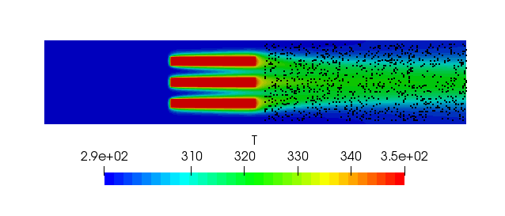
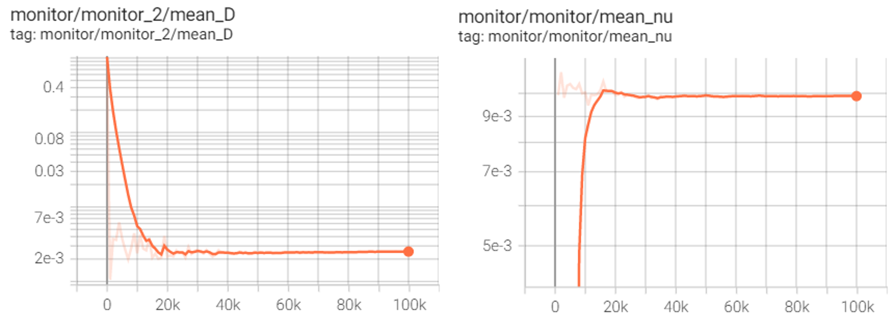

# Inverse Problem: Finding Unknown Coefficients of a PDE

[公式ページ](https://docs.nvidia.com/deeplearning/modulus/modulus-sym/user_guide/foundational/inverse_problem.html)

## Introduction

このチュートリアルでは、Modulus Symを使用して観測データからのデータ同化を行い、逆問題を解決します。OpenFOAMによって計算された流れ場を入力として、PINNsの役割は流れを特徴づけるパラメータ（例：粘度（$\nu$）や熱拡散率（$\alpha$）など）を予測することです。このチュートリアルでは以下のことを学びます：

・Modulus Symで解析的/実験的/シミュレーションデータを同化する方法  

・Modulus Symで```PointwiseConstraint```を使用して、.csvファイル/NumPy配列の形式で読み込むことができるデータから制約を作成する方法  

・同化されたデータを使用して未知の量の予測を行う方法  

Note :  
このチュートリアルは、LDCのチュートリアルを完了し、Modulus Symの基本的なAPIに精通していることを前提とします。

## Problem Description

このチュートリアルでは、OpenFOAMシミュレーションから得られた流れ場情報を入力として、PINNsによって流体の粘度と熱拡散率を予測します。  
この問題の学習データは、OpenFOAMを使った流体シミュレーションから得られた($u_i$, $v_i$, $p_i$, $T_i$)です。  
モデルは連続の式、ナビエ・ストークス方程式、および移流拡散方程式を満たす($\nu$, $\alpha$)を予測するようにトレーニングされます。

OpenFOAMシミュレーションで使用される$\nu$と$\alpha$はそれぞれ$0.01$と$0.002$です。

$T$は、[式171](#eq171)に示されているように、新しい輸送変数$c$を定義するためにスケーリングされます。

<div id="eq171"></div>

$$
\begin{split}
c &=\frac{T_{actual}}{T_{base}} - 1.0\\
T_{base} &=293.498 K
\end{split}
\tag{171}$$

ヒートシンクの後流領域における熱拡散を確認するため、PINNsには学習領域として後流領域のみを指定し、ポイントをサンプリングします（下図）。
また、保存則からの損失を最小化するようネットワークを学習するため、境界に近いポイントは削除します。



Fig. 76 Batch of training points sampled from OpenFOAM data

## Case Setup

このチュートリアルでは、.csvファイルからトレーニングデータを作成するために```PointwiseConstraint```クラスを使用します。3つのネットワークを作成します。　　
最初のネットワークは、($x$, $y$)から($u$, $v$, $p$)へのマッピングを開発して流れ場を記憶します。2番目のネットワークは、($x$, $y$)から($c$)へのマッピングを開発して温度場を記憶します。3番目のネットワークは、求める($\nu$, $\alpha$)を逆推定するために訓練されます。  
この問題では、PDESモジュールから```NavierStokes```および```AdvectionDiffusion```方程式を使用します。

Note :  
この問題のPythonスクリプトは、```examples/three_fin_2d/heat_sink_inverse.py```にあります。

### Importing the required packages

インポートするパッケージ/モジュールのリストは以下の通りです。

```python
import os
import sys
import warnings

import torch
import numpy as np
from sympy import Symbol, Eq

import modulus.sym
from modulus.sym.hydra import to_absolute_path, instantiate_arch, ModulusConfig
from modulus.sym.solver import Solver
from modulus.sym.domain import Domain
from modulus.sym.geometry.primitives_2d import Rectangle, Line, Channel2D
from modulus.sym.utils.sympy.functions import parabola
from modulus.sym.utils.io import csv_to_dict
from modulus.sym.eq.pdes.navier_stokes import NavierStokes, GradNormal
from modulus.sym.eq.pdes.basic import NormalDotVec
from modulus.sym.eq.pdes.turbulence_zero_eq import ZeroEquation
from modulus.sym.eq.pdes.advection_diffusion import AdvectionDiffusion
from modulus.sym.domain.constraint import (
    PointwiseBoundaryConstraint,
    PointwiseInteriorConstraint,
    IntegralBoundaryConstraint,
    PointwiseConstraint,
)
from modulus.sym.domain.monitor import PointwiseMonitor
from modulus.sym.domain.validator import PointwiseValidator
from modulus.sym.key import Key
from modulus.sym.node import Node
```

### Defining the Equations, Networks and Nodes for a Inverse problem

逆問題のためのニューラルネットワークを作成するプロセスは、以前のチュートリアルで見た多くの問題と類似しています。  
ただし、流れ変数の情報、およびそれらの勾配は既に（OpenFOAMデータから）ネットワークが記憶するために存在しています。したがって、この例ではこれらの変数をそれぞれの方程式の計算グラフから切り離します。つまり、「```'nu'```」と「```'D'```」を予測するネットワークのみが方程式の残差を最小化するように最適化されます。速度、圧力、およびそれらの勾配は正解データとして扱われます。

また、この問題では粘度と拡散率は文字列（それぞれ```'nu'```と```'D'```）として方程式に渡されることに注意してください。この問題では未知数です。

[Scalar Transport: 2D Advection Diffusion](https://docs.nvidia.com/deeplearning/modulus/modulus-sym/user_guide/foundational/scalar_transport.html#advection-diffusion)のチュートリアルと同様に、流れ変数（$u$、$v$、$p$）とスカラー輸送変数（$c$）を記憶するために2つの別々のネットワークをトレーニングします。また、```'nu'```と```'D'```はカスタム変数として定義されているため、出力ノードで$\nu$と$\alpha$を生成する別々のネットワーク```invert_net_nu```と```invert_net_D```があります。

この問題のノードを生成するコードは以下の通りです：

```python
nu, D = Symbol("nu"), Symbol("D")

    # make list of nodes to unroll graph on
    ns = NavierStokes(nu=nu, rho=1.0, dim=2, time=False)
    ade = AdvectionDiffusion(T="c", rho=1.0, D=D, dim=2, time=False)
    flow_net = instantiate_arch(
        input_keys=[Key("x"), Key("y")],
        output_keys=[Key("u"), Key("v"), Key("p")],
        cfg=cfg.arch.fully_connected,
    )
    heat_net = instantiate_arch(
        input_keys=[Key("x"), Key("y")],
        output_keys=[Key("c")],
        cfg=cfg.arch.fully_connected,
    )
    invert_net_nu = instantiate_arch(
        input_keys=[Key("x"), Key("y")],
        output_keys=[Key("nu")],
        cfg=cfg.arch.fully_connected,
    )
    invert_net_D = instantiate_arch(
        input_keys=[Key("x"), Key("y")],
        output_keys=[Key("D")],
        cfg=cfg.arch.fully_connected,
    )

    nodes = (
        ns.make_nodes(
            detach_names=[
                "u",
                "u__x",
                "u__x__x",
                "u__y",
                "u__y__y",
                "v",
                "v__x",
                "v__x__x",
                "v__y",
                "v__y__y",
                "p",
                "p__x",
                "p__y",
            ]
        )
        + ade.make_nodes(
            detach_names=["u", "v", "c", "c__x", "c__y", "c__x__x", "c__y__y"]
        )
        + [flow_net.make_node(name="flow_network")]
        + [heat_net.make_node(name="heat_network")]
        + [invert_net_nu.make_node(name="invert_nu_network")]
        + [invert_net_D.make_node(name="invert_D_network")]
    )

    base_temp = 293.498
```

### Assimilating data from CSV files/point clouds to create Training data

```PointwiseConstraint```：ここでは、チュートリアルは全領域の問題を解決しません。  
したがって、サンプリングポイントのジオメトリを作成するためにジオメトリモジュールを使用しません。代わりに、.csvファイルの形式でポイントクラウドデータを使用します。  
このような入力データを処理するために```PointwiseConstraint```クラスを使用できます。このクラスは、入力変数と出力変数用の別々の辞書を取ります。  
これらの辞書には、各変数のキーと、そのキーに関連付けられた値のNumPy配列があります。また、このチュートリアルでは、この.csvポイントクラウドのサンプリングのためのバッチサイズを提供します。  
これは、```batch_size```引数に必要なバッチサイズを指定することによって行われます。

問題の一部は与えられた流れ場を記憶することです。したがって、入力キーとして```['x', 'y']```、および出力キーとして```['u', 'v', 'p', 'c', 'continuity', 'momentum_x', 'momentum_y', 'advection_diffusion']```を使用します。  
OpenFOAMデータから```['u', 'v', 'p', 'c']```を入力値として設定することで、ネットワークにこれらの変数のOpenFOAM分布を選択した領域で同化させます。また、```['continuity', 'momentum_x', 'momentum_y', 'advection_diffusion']```を$0$に設定することで、サンプリングされたポイントでPDEの損失を満たすようにネットワークに指示します。  
$\nu$と$\alpha$を除くPDEのすべての変数は既知です。したがって、ネットワークはこの情報をもとに未知数を逆に推定することができます。

このような境界条件を生成するコードは以下の通りです：

```python
# OpenFOAM data
    file_path = "openfoam/heat_sink_Pr5_clipped2.csv"
    if not os.path.exists(to_absolute_path(file_path)):
        warnings.warn(
            f"Directory{file_path}does not exist. Cannot continue. Please download the additional files from NGC https://catalog.ngc.nvidia.com/orgs/nvidia/teams/modulus/resources/modulus_sym_examples_supplemental_materials"
        )
        sys.exit()

    mapping = {
        "Points:0": "x",
        "Points:1": "y",
        "U:0": "u",
        "U:1": "v",
        "p": "p",
        "T": "c",
    }
    openfoam_var = csv_to_dict(
        to_absolute_path("openfoam/heat_sink_Pr5_clipped2.csv"), mapping
    )
    openfoam_var["c"] = openfoam_var["c"] / base_temp - 1.0
    openfoam_invar_numpy = {
        key: value for key, value in openfoam_var.items() if key in ["x", "y"]
    }
    openfoam_outvar_numpy = {
        key: value for key, value in openfoam_var.items() if key in ["u", "v", "p", "c"]
    }
    openfoam_outvar_numpy["continuity"] = np.zeros_like(openfoam_outvar_numpy["u"])
    openfoam_outvar_numpy["momentum_x"] = np.zeros_like(openfoam_outvar_numpy["u"])
    openfoam_outvar_numpy["momentum_y"] = np.zeros_like(openfoam_outvar_numpy["u"])
    openfoam_outvar_numpy["advection_diffusion_c"] = np.zeros_like(
        openfoam_outvar_numpy["u"]
    )

    # make domain
    domain = Domain()

    # interior
    data = PointwiseConstraint.from_numpy(
        nodes=nodes,
        invar=openfoam_invar_numpy,
        outvar=openfoam_outvar_numpy,
        batch_size=cfg.batch_size.data,
    )
    domain.add_constraint(data, "interior_data")
```

### Adding Monitors

このチュートリアルでは、解が進行するにつれてドメイン内の平均```'nu'```と```'D'```の収束を監視するためのモニターを作成します。  
これらの値が一定の値に達したら、シミュレーションを終了できます。```PointwiseMonitor```を生成するコードは以下の通りです：

```python
# add monitors
    monitor = PointwiseMonitor(
        openfoam_invar_numpy,
        output_names=["nu"],
        metrics={"mean_nu": lambda var: torch.mean(var["nu"])},
        nodes=nodes,
    )
    domain.add_monitor(monitor)

    monitor = PointwiseMonitor(
        openfoam_invar_numpy,
        output_names=["D"],
        metrics={"mean_D": lambda var: torch.mean(var["D"])},
        nodes=nodes,
    )
    domain.add_monitor(monitor)
```

<br>

### Training the model

Pythonファイルがセットアップされたら、Pythonスクリプトを実行するだけで簡単にトレーニングを開始できます。

```bash
python heat_sink_inverse.py
```

<br>

### Results and Post-processing

シミュレーションの収束を確認するためにTensorboardで結果を確認します。
Tensorboardを確認すると下図のような結果が確認できるはずです。

<br>

Table 3 Comparison of the inverted coefficients with the actual values

| Property                         | OpenFOAM (True)  | Modulus Sym (Predicted) |
| -------------------------------- | ---------------- | ----------------------- |
| Kinematic Viscosity ($m^{2}/s$)  | $1.00 × 10^{-2}$ | $9.87 × 10^{-3}$        |
| Thermal Diffusivity ($m^{2}/s$)  | $2.00 × 10^{-3}$ | $2.53 × 10^{-3}$        |

<br><br>



Fig. 77 Tensorboard plots for $\alpha$ and $\nu$
