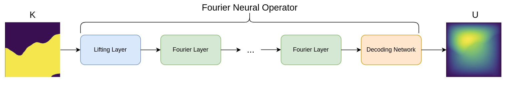
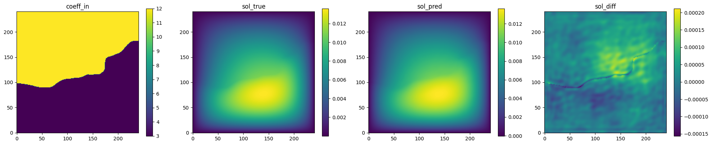
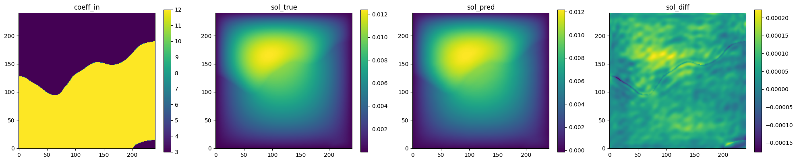
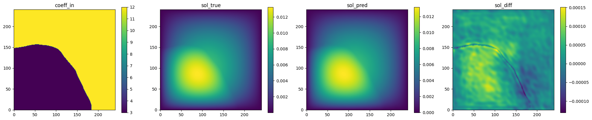

# Darcy Flow with Fourier Neural Operator

[公式ページ](https://docs.nvidia.com/deeplearning/modulus/modulus-sym/user_guide/neural_operators/darcy_fno.html)

## Introduction

このチュートリアルでは、Modulus Symを使用して、Modulus Sym内のFourier Neural Operator（FNO）アーキテクチャを使用して2Dダルシー流のデータ駆動モデルを設定します。このチュートリアルでは、以下のことを学びます。

1. グリッドデータを読み込み、データ駆動の制約を設定する方法
2. グリッドバリデータノードを作成する方法
3. Modulus SymでFourier Neural Operatorアーキテクチャを使用する方法

Note :
このチュートリアルでは、Modulus Symの基本的な機能とFNOアーキテクチャを理解していることを前提としています。追加情報については、:ref:Introductory Exampleセクションと:ref:fnoセクションをご覧ください。

Warning :
この例を実行するには、すでに例のデータをダウンロードして変換していない場合、Pythonパッケージ [gdown](https://github.com/wkentaro/gdown)が必要です。
次のコマンドを使用してインストールしてください： pip install gdown。

## Problem Description

ダルシー方程式（Darcy PDE）は、次の形式の2階の楕円型偏微分方程式です：

$$
-\nabla \cdot \left(k(\textbf{x})\nabla u(\textbf{x})\right) = f(\textbf{x}), \quad \textbf{x} \in D,
$$

ここで、$u(\textbf{x})$ は流れの圧力、$k(\textbf{x})$ は浸透率場、$f(\cdot)$ は強制関数です。ダルシー流は、多様なシステムをパラメータ化できます。例えば、多孔質媒体を通る流れ、弾性材料、および熱伝導が挙げられます。
ここでは、領域を2次元の単位正方形 $D=\left{x,y \in (0,1)\right}$ と定義し、境界条件を $u(\textbf{x})=0, \textbf{x}\in\partial D$ とします。FNOを適用するには、$D = \textbf{x}{i}$（ただし $i \in \mathbb{N}{N\times N}$）のような構造化されたユークリッド入力が必要です。したがって、浸透率および流れ場は、2次元行列 $\textbf{K}, \textbf{U} \in \mathbb{R}^{N \times N}$ に離散化されます。

この問題では、浸透率場と圧力場の間のマッピング、$\textbf{K} \rightarrow \textbf{U}$、つまり、浸透率場の分布 $\textbf{K} \sim p(\textbf{K})$ に対する圧力場を学習する代替モデルを開発します。
これは、他の例との重要な違いです。単一の解だけでなく、分布を学習している点です。



Fig. 78 FNO surrogate model for 2D Darcy flow

## Case Setup

この例はデータ駆動型の問題です。つまり、コーディングを開始する前に、トレーニングデータと検証データの両方を用意する必要があります。
この例のトレーニングおよび検証データセットは、[Fourier Neural Operator](https://github.com/zongyi-li/fourier_neural_operator)で入手できます。
以下は、このデータセットをダウンロードして変換するための自動スクリプトです。
このスクリプトを実行するには、[gdown](https://github.com/wkentaro/gdown)パッケージが必要です。これは pip install gdown を使用して簡単にインストールできます。

Note :
この問題のPythonスクリプトは、examples/darcy/darcy_FNO_lazy.py にあります。

## Configuration

この問題の設定は、Modulus Sym内でかなり標準的です。
注意すべきは、設定内に2つのアーキテクチャがあることです：1つはFNO用のポイントごとのデコーダーであり、もう1つは最終的にデコーダーを取り込むFNOモデルです。
FNOモデルの最も重要なパラメータは「dimension」であり、これはModulus Symに1次元、2次元、または3次元のFNOアーキテクチャを読み込むように指示します。
「nr_fno_layers」はモデル内のフーリエ畳み込み層の数です。
FNO内の潜在的な特徴のサイズは、デコーダーの入力キー「z」に基づいて決定されます。この場合、埋め込み特徴空間のサイズは32です。

```yaml
# Copyright (c) 2023, NVIDIA CORPORATION & AFFILIATES. All rights reserved.
#
# Licensed under the Apache License, Version 2.0 (the "License");
# you may not use this file except in compliance with the License.
# You may obtain a copy of the License at
#
# http://www.apache.org/licenses/LICENSE-2.0
#
# Unless required by applicable law or agreed to in writing, software
# distributed under the License is distributed on an "AS IS" BASIS,
# WITHOUT WARRANTIES OR CONDITIONS OF ANY KIND, either express or implied.
# See the License for the specific language governing permissions and
# limitations under the License.

defaults:
  - modulus_default
  - /arch/conv_fully_connected_cfg@arch.decoder
  - /arch/fno_cfg@arch.fno
  - scheduler: tf_exponential_lr
  - optimizer: adam
  - loss: sum
  - _self_

arch:
  decoder:
    input_keys: [z, 32]
    output_keys: sol
    nr_layers: 1
    layer_size: 32

  fno:
    input_keys: coeff
    dimension: 2
    nr_fno_layers: 4
    fno_modes: 12
    padding: 9

scheduler:
  decay_rate: 0.95
  decay_steps: 1000

training:
  rec_results_freq: 1000
  max_steps: 10000

batch_size:
  grid: 32
  validation: 32
```

Note :
Modulus Symの設定では、ユーザーがYAMLファイル内でキーを定義できます。
この場合、「input_keys: [z,32]」はサイズ32の単一のキーを作成し、「input_keys: coeff」はサイズ1の単一の入力キーを作成します。

## Loading Data

このデータ駆動型の問題では、最初のステップはトレーニングデータをModulus Symに取り込むことです。
データを読み込む前に、データに適用する任意の正規化値を設定します。
このデータセットでは、入力浸透率フィールドと出力圧力の両方について、scaleとshiftパラメータを計算します。
次に、それぞれのキーにシフト/スケールを指定して、Modulus Sym内でこの正規化を設定します。Key(name, scale=(shift, scale))。

```python
# load training/ test data
    input_keys = [Key("coeff", scale=(7.48360e00, 4.49996e00))]
    output_keys = [Key("sol", scale=(5.74634e-03, 3.88433e-03))]

    download_FNO_dataset("Darcy_241", outdir="datasets/")
    train_path = to_absolute_path(
        "datasets/Darcy_241/piececonst_r241_N1024_smooth1.hdf5"
    )
    test_path = to_absolute_path(
        "datasets/Darcy_241/piececonst_r241_N1024_smooth2.hdf5"
    )
```

データの読み込みには2つの方法があります。まず、イーガーローディングがあります。ここでは、データセット全体を一度にメモリに読み込みます。
代わりに、モデルがトレーニングに必要なときにデータが1つずつ読み込まれるレイジーローディングを使用することもできます。
前者は、トレーニング中にデータをディスクから読み込む際の潜在的なオーバーヘッドを排除しますが、大規模なデータセットにはスケールできません。
この例では、大規模な問題に対するこのユーティリティをデモンストレーションするために、トレーニングデータセットにはレイジーローディングが使用されています。

```python
# make datasets
    train_dataset = HDF5GridDataset(
        train_path, invar_keys=["coeff"], outvar_keys=["sol"], n_examples=1000
    )
    test_dataset = HDF5GridDataset(
        test_path, invar_keys=["coeff"], outvar_keys=["sol"], n_examples=100
    )
```

このデータはHDF5形式であり、HDF5GridDatasetオブジェクトを使用してレイジーローディングを行うのに最適です。

Note :
イーガーローディングとレイジーローディングの設定方法の主な違いは、変数辞書 invar_train と outvar_train に渡されるオブジェクトです。
イーガーローディングでは、これらの辞書は Dict[str: np.array] のタイプである必要があります。ここで、各変数はデータのnumpy配列です。
レイジーローディングでは、Dict[str: DataFile] のタイプの辞書が使用されます。これは DataFile オブジェクトで構成され、例のインデックスとデータファイルの間のマッピングに使用されるクラスです。

## Initializing the Model

FNO initialization allows users to define their own pointwise decoder model.
Thus we first initialize the small fully-connected decoder network, which we then provide to the FNO model as a parameter.

```python
# make list of nodes to unroll graph on
    decoder_net = instantiate_arch(
        cfg=cfg.arch.decoder,
        output_keys=output_keys,
    )
    fno = instantiate_arch(
        cfg=cfg.arch.fno,
        input_keys=input_keys,
        decoder_net=decoder_net,
    )
    nodes = [fno.make_node("fno")]
```

## Adding Data Constraints

Modulus Symの物理学に基づいた問題では、通常、境界条件と支配方程式に基づいてジオメトリと制約を定義する必要があります。
ここでは、唯一の制約として SupervisedGridConstraint があり、グリッドデータに対して標準的な教師ありトレーニングを行います。
この制約は、複数のワーカーの使用をサポートしており、レイジーローディングを使用する場合に特に重要です。

```python
# make domain
    domain = Domain()

    # add constraints to domain
    supervised = SupervisedGridConstraint(
        nodes=nodes,
        dataset=train_dataset,
        batch_size=cfg.batch_size.grid,
        num_workers=4,  # number of parallel data loaders
    )
    domain.add_constraint(supervised, "supervised")
```

Note :
グリッドデータとは、画像のようなテンソルで定義されるデータのことを指します。Modulus Sym内では、このデータのグリッドは通常、空間領域を表し、標準的な次元の形式 [バッチ、チャネル、xdim、ydim、zdim] に従う必要があります。ここで、チャネルは状態変数の次元です。
フーリエおよび畳み込みモデルの両方が、1回のフォワードパスで整個の領域を効率的に学習および予測するために、グリッドベースのデータを使用します。これは、標準的なPINNアプローチのポイントワイズ予測とは対照的です。

## Adding Data Validator

構造化データを扱う場合は、GridValidator を使用して検証データをドメインに追加します。
トレーニング制約とは異なり、検証用のローディングにはイーガーローディングを使用します。
したがって、制約にはnumpy配列の辞書が渡されます。

```python
# add validator
    val = GridValidator(
        nodes,
        dataset=test_dataset,
        batch_size=cfg.batch_size.validation,
        plotter=GridValidatorPlotter(n_examples=5),
    )
    domain.add_validator(val, "test")
```

## Training the Model

Pythonスクリプトを実行してトレーニングを開始します。

```bash
python darcy_FNO_lazy.py
```

## Results and Post-processing

チェックポイントディレクトリは、その派生物の「rec_results_freq」パラメータで指定された結果の記録頻度に基づいて保存されます。詳細については、:ref:hydra_resultsを参照してください。
ネットワークディレクトリフォルダー（この場合は「outputs/darcy_fno/validators」）には、さまざまな検証予測のいくつかのプロットが含まれています。以下にいくつかを示しますが、以前に見たことのない浸透率フィールドに対して圧力フィールドを正確に予測できることがわかります。



Fig. 79 FNO validation prediction 1. (Left to right) Input permeability, true pressure, predicted pressure, error.



Fig. 80 FNO validation prediction 2. (Left to right) Input permeability, true pressure, predicted pressure, error.



Fig. 81 FNO validation prediction 3. (Left to right) Input permeability, true pressure, predicted pressure, error.
