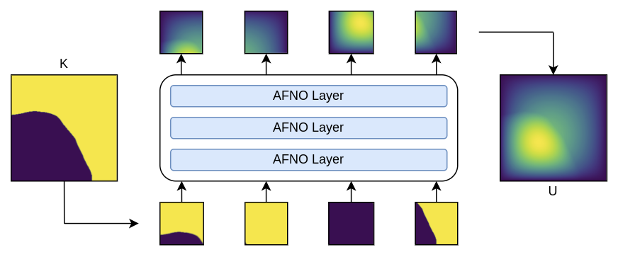
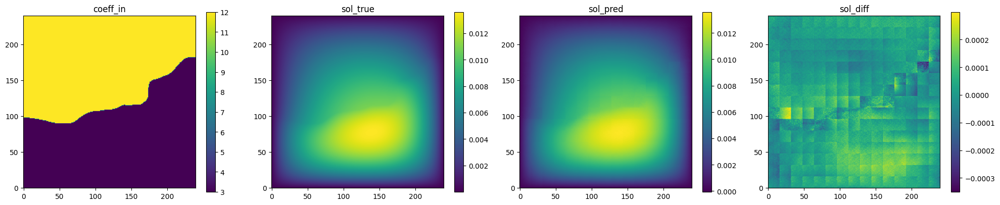
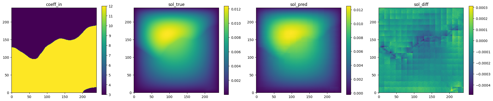
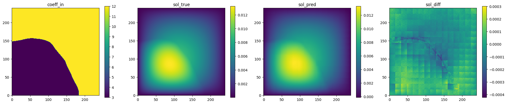

# Darcy Flow with Adaptive Fourier Neural Operator

[公式ページ](https://docs.nvidia.com/deeplearning/modulus/modulus-sym/user_guide/neural_operators/darcy_fno.html)

## Introduction

このチュートリアルでは、Modulus Sym で Adaptive Fourier Neural Operators (AFNO) に基づくトランスフォーマーネットワークの使用方法を示しています。
畳み込みアーキテクチャを持つ :ref:fno とは対照的に、AFNO はコンピュータビジョン領域で現代のトランスフォーマーアーキテクチャを活用しています。
ビジョントランスフォーマーはコンピュータビジョンで大きな成功を収めています。
これは主に効果的な自己注意メカニズムによるものです。
ただし、自己注意はピクセル数の二乗でスケールし、高解像度の入力では実現不可能になります。
この課題に対処するために、Guibas ら [#guibas2021adaptive] は、Fourier ドメインでの効率的な注意メカニズムとして Adaptive Fourier Neural Operator (AFNO) を提案しました。
AFNO は、オペレーター学習の原理に基づいており、注意を入力解像度に依存せずに連続的なグローバル畳み込みとしてフレーム化することができます。
この原理は以前、Fourier ドメインでのグローバル畳み込みを効率的に解決する FNO を設計するために使用されました。
画像の不連続性や高解像度の入力などのビジョンにおける課題を処理するために、AFNO は FNO に原理的なアーキテクチャの変更を提案し、メモリおよび計算効率を向上させました。
これには、チャンネル混合重みにブロック対角構造を課すこと、トークン間で重みを適応的に共有すること、およびソフトしきい値化と縮小を使用したスパースな周波数モードが含まれます。

このチュートリアルでは、AFNOトランスフォーマーを使用してPDEシステムをモデリングする方法を紹介しています。
AFNOは、FNOがうまく扱えない極めて高解像度の入力にスケーリングするように設計されています（詳細は[#pathak2022fourcastnet]を参照）。しかし、ここではダルシー流の単純な例を使用しています。
この問題は、Modulus SymでAFNOを使用したデータ駆動型トレーニングの示唆的な出発点として意図されていますが、AFNOの機能のすべてを十分に活用するものとは見なされません。

これは、:ref:darcy_fno 章の拡張です。このチュートリアルで学ぶユニークなトピックは以下の通りです：

1. Modulus SymでAFNOトランスフォーマーアーキテクチャを使用する方法
2. AFNOトランスフォーマーとFourier Neural Operatorの違い

Note :
このチュートリアルでは、Modulus Symの基本機能に精通しており、AFNOアーキテクチャを理解していることを前提としています。
詳細については、追加情報として :ref:Introductory Example および :ref:afno セクションをご覧ください。
さらに、このチュートリアルは、この前に読んでおく必要がある :ref:darcy_fno に基づいています。

Warning :
この例を実行するには、例のデータがすでにダウンロードされて変換されていない場合、Pythonパッケージ gdown <https://github.com/wkentaro/gdown>_ が必要です。
pip install gdown を使用してインストールしてください。

## Problem Description

この問題では、ダルシー流システムの透水率と圧力場の間のマッピングを学習するサロゲートモデルを開発します。
学習されるマッピング、$\textbf{K} \rightarrow \textbf{U}$ は、透水率場の分布 $\textbf{K} \sim p(\textbf{K})$ に対して真でなければなりません。
:ref:afno の理論でさらに議論されているように、AFNOは画像トランスフォーマーバックボーンに基づいています。
すべてのトランスフォーマーアーキテクチャと同様に、AFNOは入力フィールドをトークン化します。
各トークンは画像のパッチから埋め込まれます。
トークン化された画像は、トランスフォーマーレイヤーによって処理され、その後に出力画像を生成する線形デコーダーによって処理されます。



Fig. 82 AFNO surrogate model for 2D Darcy flow

## Case Setup

この例では、FNO章と同様に、トレーニングおよび検証データは Fourier Neural Operator Githubページ <https://github.com/zongyi-li/fourier_neural_operator>_ で見つけることができます。
また、このデータセットをダウンロードして変換するための自動化されたスクリプトも含まれています。
これには、pip install gdown を使用して簡単にインストールできるパッケージ gdown <https://github.com/wkentaro/gdown>_ が必要です。

Note :
この問題のPythonスクリプトは examples/darcy/darcy_afno.py にあります。

## Configuration

AFNOはViTトランスフォーマーアーキテクチャに基づいており、入力のトークン化が必要です。ここでは、各トークンは画像のパッチであり、パッチサイズは構成ファイル内のパラメータ patch_size を介して定義されます。
embed_dim パラメータは、モデル内の各パッチに使用される潜在的な埋め込み特徴のサイズを定義します。

```yaml
# Copyright (c) 2023, NVIDIA CORPORATION & AFFILIATES. All rights reserved.
#
# Licensed under the Apache License, Version 2.0 (the "License");
# you may not use this file except in compliance with the License.
# You may obtain a copy of the License at
#
# http://www.apache.org/licenses/LICENSE-2.0
#
# Unless required by applicable law or agreed to in writing, software
# distributed under the License is distributed on an "AS IS" BASIS,
# WITHOUT WARRANTIES OR CONDITIONS OF ANY KIND, either express or implied.
# See the License for the specific language governing permissions and
# limitations under the License.

defaults:
  - modulus_default
  - arch:
      - afno
  - scheduler: tf_exponential_lr
  - optimizer: adam
  - loss: sum
  - _self_

arch:
  afno:
    patch_size: 16
    embed_dim: 256
    depth: 4
    num_blocks: 8
    
scheduler:
  decay_rate: 0.95
  decay_steps: 1000

training:
  rec_results_freq: 1000
  max_steps: 10000

batch_size:
  grid: 32
  validation: 32
```

## Loading Data

トレーニングおよび検証データセットをメモリに読み込むプロセスは、:ref:darcy_fno の例と同様の手順に従います。

``` python
# load training/ test data
    input_keys = [Key("coeff", scale=(7.48360e00, 4.49996e00))]
    output_keys = [Key("sol", scale=(5.74634e-03, 3.88433e-03))]

    download_FNO_dataset("Darcy_241", outdir="datasets/")
    invar_train, outvar_train = load_FNO_dataset(
        "datasets/Darcy_241/piececonst_r241_N1024_smooth1.hdf5",
        [k.name for k in input_keys],
        [k.name for k in output_keys],
        n_examples=1000,
    )
    invar_test, outvar_test = load_FNO_dataset(
        "datasets/Darcy_241/piececonst_r241_N1024_smooth2.hdf5",
        [k.name for k in input_keys],
        [k.name for k in output_keys],
        n_examples=100,
    )
```

AFNOの入力は、指定されたパッチサイズ（この例では patch_size=16）で完全に割り切れる必要がありますが、このデータセットではそのような状況ではありません。
そのため、入力/出力の特徴を適切な次元 241x241 -> 240x240 にトリムしてください。

``` python
# get training image shape
    img_shape = [
        next(iter(invar_train.values())).shape[-2],
        next(iter(invar_train.values())).shape[-1],
    ]

    # crop out some pixels so that img_shape is divisible by patch_size of AFNO
    img_shape = [s - s % cfg.arch.afno.patch_size for s in img_shape]
    print(f"cropped img_shape:{img_shape}")
    for d in (invar_train, outvar_train, invar_test, outvar_test):
        for k in d:
            d[k] = d[k][:, :, : img_shape[0], : img_shape[1]]
            print(f"{k}:{d[k].shape}")

    # make datasets
    train_dataset = DictGridDataset(invar_train, outvar_train)
    test_dataset = DictGridDataset(invar_test, outvar_test)
```

## Initializing the Model

モデルとドメインの初期化は、他の例と同様の手順に従います。AFNOの場合、データセットを読み込んだ後にドメインのサイズを計算します。
ドメインはAFNOモデルで定義する必要があり、instantiate_arch 呼び出しで img_shape キーワード引数を使用して提供されます。

``` python
# make list of nodes to unroll graph on
    model = instantiate_arch(
        input_keys=input_keys,
        output_keys=output_keys,
        cfg=cfg.arch.afno,
        img_shape=img_shape,
    )
    nodes = [model.make_node(name="AFNO")]
```

## Adding Data Constraints and Validators

ドメインにはデータ駆動型の制約や検証子が追加されます。
詳細については、:ref:darcy_fno 章を参照してください。

``` python
# make domain
    domain = Domain()

    # add constraints to domain
    supervised = SupervisedGridConstraint(
        nodes=nodes,
        dataset=train_dataset,
        batch_size=cfg.batch_size.grid,
    )
    domain.add_constraint(supervised, "supervised")

    # add validator
    val = GridValidator(
        nodes,
        dataset=test_dataset,
        batch_size=cfg.batch_size.validation,
        plotter=GridValidatorPlotter(n_examples=5),
    )
    domain.add_validator(val, "test")
```

## Training the Model

トレーニングは、単純にPythonスクリプトを実行することで開始できます。

``` bash
python darcy_AFNO.py
```

## Training with model parallelism

モデル並列処理を使用すると、AFNOモデルを並列化して複数のGPUで1つのバッチ要素を分割して並行処理することができます。これは、収束をより速く得たり、メモリフットプリントを削減したりするために非常に有益です。特に、活性化関数やモデルパラメータが単一のGPUに収まりきらない場合に役立ちます。

この例のモデル並列バージョンのPythonスクリプトは、examples/darcy/darcy_AFNO_MP.py にあります。標準のAFNO例と比較して、主な変更点は2つあります。1つ目は、構成ファイルでモデルアーキテクチャを afno から distributed_afno に変更することです。

```yaml
# Copyright (c) 2023, NVIDIA CORPORATION & AFFILIATES. All rights reserved.
#
# Licensed under the Apache License, Version 2.0 (the "License");
# you may not use this file except in compliance with the License.
# You may obtain a copy of the License at
#
# http://www.apache.org/licenses/LICENSE-2.0
#
# Unless required by applicable law or agreed to in writing, software
# distributed under the License is distributed on an "AS IS" BASIS,
# WITHOUT WARRANTIES OR CONDITIONS OF ANY KIND, either express or implied.
# See the License for the specific language governing permissions and
# limitations under the License.

defaults:
  - modulus_default
  - arch:
      - distributed_afno
  - scheduler: tf_exponential_lr
  - optimizer: adam
  - loss: sum
  - _self_

arch:
  distributed_afno:
    patch_size: 16
    embed_dim: 256
    depth: 4
    num_blocks: 8
    
scheduler:
  decay_rate: 0.95
  decay_steps: 1000

training:
  rec_results_freq: 1000
  max_steps: 10000

batch_size:
  grid: 32
  validation: 32
```

2番目の変更は、モデル並列通信バックエンドを初期化するために MODEL_PARALLEL_SIZE 環境変数を設定することです。

``` python
# Set model parallel size to 2
os.environ["MODEL_PARALLEL_SIZE"] = "2"
```

これにより、分散AFNOモデルが1つのモデルインスタンスあたり2つのGPUを使用するように構成されます。使用するGPUの数は、以下の条件を満たしている限り変更できます：

1. ジョブ内の合計GPU数は MODEL_PARALLEL_SIZE の正確な倍数でなければなりません。
2. 構成内の num_blocks パラメータは MODEL_PARALLEL_SIZE の正確な倍数でなければなりません。
3. 埋め込み次元 embed_dim は MODEL_PARALLEL_SIZE の正確な倍数でなければなりません。

その後、例のモデル並列バージョンのトレーニングを次のようにして開始できます：

``` bash
mpirun -np 2 python darcy_AFNO_MP.py
```

Warning :
rootユーザー（通常はコンテナ内）で実行している場合、OpenMPIには --allow-run-as-root オプションを追加する必要があります：
mpirun --allow-run-as-root -np 2 python darcy_AFNO_MP.py

## Results and Post-processing

チェックポイントディレクトリは、その派生物の rec_results_freq パラメータで指定された結果の記録頻度に基づいて保存されます。詳細については、:ref:hydra_results を参照してください。
ネットワークディレクトリフォルダー（この場合は 'outputs/darcy_afno/validators'）には、さまざまな検証予測の複数のプロットが含まれています。

/images/user_guide/afno_darcy_pred1.png

Fig. 83 AFNO validation prediction 1. (Left to right) Input permeability, true pressure, predicted pressure, error.



Fig. 84 AFNO validation prediction 2. (Left to right) Input permeability, true pressure, predicted pressure, error.



Fig. 85 AFNO validation prediction 3. (Left to right) Input permeability, true pressure, predicted pressure, error.

AFNOの強みは、この章で使用されているモデルサイズやデータセットよりもはるかに大きな規模やデータセットにスケーリングできる能力にあります。この例では示していませんが、この例はユーザーがより大規模な問題に拡張するためのAFNOアーキテクチャを使用したデータ駆動型トレーニングの基本的な実装を示しています。

## Reference

.. rubric:: References

.. [#guibas2021adaptive] Guibas, John, et al. "Adaptive fourier neural operators: Efficient token mixers for transformers" International Conference on Learning Representations, 2022.
.. [#pathak2022fourcastnet] Pathak, Jaideep, et al. "FourCastNet : A global data-driven high-resolution weather model using adaptive Fourier neural operators" arXiv preprint arXiv:2202.11214 (2022).
.. [#dosovitskiy2020image] Dosovitskiy, Alexey et al. "An image is worth 16x16 words: Transformers for image recognition at scale" arXiv preprint arXiv:2010.11929 (2020).
