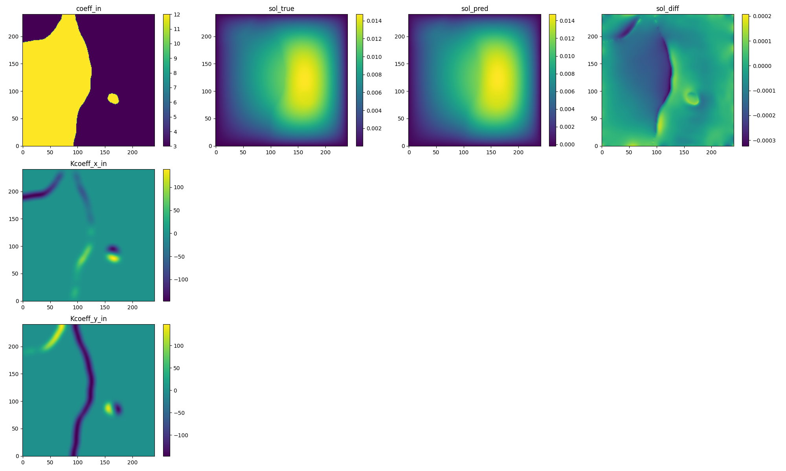
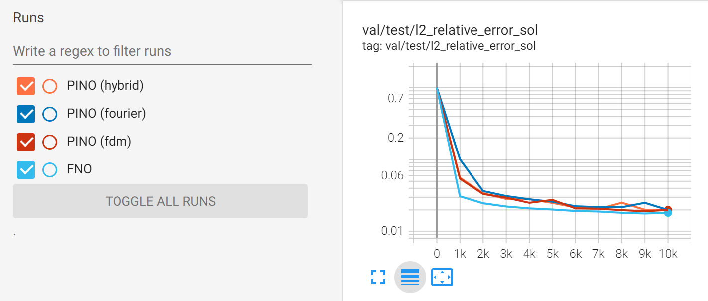
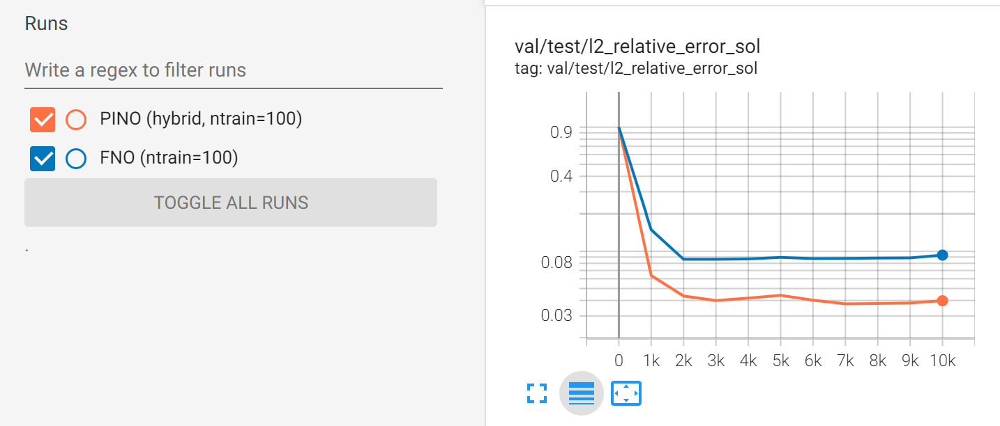

# Darcy Flow with Physics-Informed Fourier Neural Operator

[公式ページ](https://docs.nvidia.com/deeplearning/modulus/modulus-sym/user_guide/neural_operators/darcy_pino.html)

## Introduction

このチュートリアルでは、物理情報を持つニューラルオペレーター（PINO）を使用して2Dダルシー流れの問題を解決します（#li2021physics）。このチュートリアルでは、以下のことを学びます：

1. PINOとフーリエニューラルオペレーター（FNO）の違い。
2. Modulus SymでPINOを設定およびトレーニングする方法。
3. グリッドデータ用のカスタムPDE制約の定義方法。

Note :
このチュートリアルでは、Modulus Symの基本的な機能に精通しており、PINOアーキテクチャを理解していることを前提としています。詳細については、追加情報として「:ref:Introductory Example」および「:ref:pino」セクションを参照してください。さらに、このチュートリアルは「:ref:darcy_fno」に基づいており、このチュートリアルよりも前に読む必要があります。

Warning :
この例を実行するには、例のデータをすでにダウンロードして変換していない場合は、Pythonパッケージgdown <https://github.com/wkentaro/gdown>_が必要です。次のコマンドを使用してインストールしてください：pip install gdown。

## Problem Description

この問題は、ダルシー流れシステムの透水率と圧力場の間のマッピングを学習する代替モデルを開発することを示しています。学習されたマッピング$\textbf{K} \rightarrow \textbf{U}$は、透水率フィールド$\textbf{K} \sim p(\textbf{K})$の分布に対して真であるべきであり、単一の解に対してだけでなく。

PINOとFNOの主な違いは、PINOがFNOの損失関数に物理情報を追加する点です。詳細は「:ref:pino」理論でさらに議論されていますが、PINOの損失関数は次のように記述されます：

$$
\mathcal{L} = \mathcal{L}_{data} + \mathcal{L}_{pde}
$$

ここで

$$
\mathcal{L}_{data} = \lVert u - \mathcal{G}_\theta(a)  \rVert^2
$$

ここで、$\mathcal{G}\theta(a)$は学習可能なパラメータ$\theta$と入力フィールド$a$を持つFNOモデルであり、$\mathcal{L}{pde}$は適切なPDE損失です。2Dダルシー問題（:ref:darcy_fnoを参照）の場合、これは以下のようになります：

$$
\mathcal{L}_{pde} = \lVert -\nabla \cdot \left(k(\textbf{x})\nabla \mathcal{G}_\theta(a)(\textbf{x})\right) - f(\textbf{x}) \rVert^2 ,
$$

ここで、$k(\textbf{x})$は透水率フィールド、$f(\textbf{x})$はこの場合に1に等しい強制関数であり、$a=k$です。

PDE損失には、FNOのアンサッツ$\mathcal{G}_\theta(a)$のさまざまな偏微分を計算する必要があります。一般的に、これは非自明な作業です。Modulus Symでは、これらを計算するための3つの異なる方法が提供されています。これらは、元のPINO論文に基づいています。

1. 有限差分法（FDM）を使用した数値微分計算
2. スペクトル導関数による数値微分計算
3. 「正確な」フーリエ / 自動微分アプローチに基づく数値微分

最後のアプローチは、固定されたデコーダーモデルにのみ適用されます。
「正確な」勾配計算を有効にすると、デコーダーネットワークがTanh活性化関数を持つ2層の全結合モデルに切り替わります。
これは、このアプローチには高価なヘッセ行列の計算が必要であるためです。
この2層モデルのために明示的にヘッセ行列の計算が定義されているため、それ以外の場合は非常に高価になる自動微分を回避できます。

## Case setup

この問題のセットアップは、主にFNOの例（:ref:darcy_fno）と同じですが、PDE損失が定義され、FNOモデルがそれを使用して制約されています。
このプロセスについては、以下の:ref:darcy_pino_pdeで詳しく説明されています。

FNOの章と同様に、この例のトレーニングおよび検証データはFourier Neural OperatorのGitHubページ <https://github.com/zongyi-li/fourier_neural_operator>で入手できます。
ただし、このデータセットをダウンロードして変換するための自動スクリプトが含まれています。
これには、gdown <https://github.com/wkentaro/gdown> パッケージが必要ですが、これは pip install gdown を使用して簡単にインストールできます。

Note :
この問題のPythonスクリプトは、「examples/darcy/darcy_pino.py」にあります。

## Configuration

The configuration for this problem is similar to the FNO example, 
but importantly there is an extra parameter ``custom.gradient_method`` where the method for computing the gradients in the PDE loss is selected.
This can be one of ``fdm``, ``fourier``, ``exact`` corresponding to the three options above.
The balance between the data and PDE terms in the loss function can also be controlled using the ``loss.weights`` parameter group.

```yaml
```

## Defining PDE Loss

この例では、様々な提案された方法を使用してカスタムPDE残差計算が定義されています。
sympyと自動微分を使用してカスタムPDE残差を定義する方法は、:ref:transientで議論されていますが、この問題では導関数の計算に標準的な自動微分に頼ることはありません。
代わりに、PDEがどのように計算されるかを明示的に定義し、torch.nn.Moduleと呼ばれるカスタムモジュールDarcyを使用します。
このモジュールの目的は、FNOモデルの入力および出力テンソルからDarcy PDE残差を計算して返すことであり、これはその.forward(...)メソッドを介して行われます。

``` python
from modulus.models.layers import fourier_derivatives # helper function for computing spectral derivatives
from ops import dx, ddx # helper function for computing finite difference derivatives
```

```python
```

FNOの解の勾配は、上記で選択した勾配法に従って計算されます。
exactメソッドが使用される場合、FNOモデルは自動的に一次および二次の勾配を出力し、そのためこれらを追加で計算する必要はありません。
さらに、浸透率場の勾配は既にFNO入力トレーニングデータにテンソルとして含まれています（キーはKcoeff_xおよびKcoeff_y）ので、これらを計算する必要はありません。

次に、このモジュールをModulus Symに組み込むために、それをModulus SymのNodeにラップします。
これにより、モジュールがModulus Symの計算グラフに組み込まれ、FNOを最適化するために使用できるようになります。

``` python
from modulus.sym.node import Node
```

```python
```

最後に、PDE損失項を定義するために、darcy出力変数に制約を追加します（以下の:ref:darcy_pino_constraintsを参照）。

## Loading Data

トレーニングデータセットと検証データセットの読み込みも、FNOの例と同様のプロセスに従います。

```python
```

## Initializing the Model

モデルの初期化もFNOの例と同様のプロセスに従います。

```python
```

ただし、exact勾配法が使用される場合、モデルに適切な勾配を出力するように指示するために、これらの勾配を出力キーに指定する必要があります。

## Adding Constraints

最後に、FNOの例と同様の方法でモデルに制約を追加します。
同じ「SupervisedGridConstraint」を使用できます。
PDE損失項を含めるためには、上記で定義した「darcy」出力変数に対して追加のターゲット値を定義し（PDE残差を最小化するためにゼロを使用）、それらを「outvar_train」辞書に追加します。

```python
```

FNOの例と同じデータバリデータが使用されています。

## Training the Model

トレーニングは、単純にPythonスクリプトを実行することで開始できます。

``` bash
python darcy_PINO.py
```

## Results and Post-processing

チェックポイントディレクトリは、その派生物の「rec_results_freq」パラメーターで指定された結果記録頻度に基づいて保存されます。詳細については、:ref:hydra_resultsを参照してください。
ネットワークディレクトリフォルダー（この場合は「'outputs/darcy_pino/validators'」）には、さまざまな検証予測のプロットがいくつか含まれています。



Fig. 86 PINO validation prediction. (Left to right) Input permeability and its spatial derivatives, true pressure, predicted pressure, error.

## Comparison to FNO

以下のTensorBoardプロットは、PINO（すべての3つの勾配法）とFNOの検証損失を比較しています。
大量のトレーニングデータ（1000のトレーニング例）を使用すると、FNOとPINOの両方が同様のパフォーマンスを発揮することがわかります。



Fig. 87 Comparison between PINO and FNO accuracy for surrogate modeling Darcy flow.

PINOの利点の1つは、PDE損失がモデルを正則化することであり、これは「小さなデータ」の領域でより効果的である可能性があります。
以下のプロットは、両方のモデルがわずか100のトレーニング例で訓練された場合の検証損失を示しています：



Fig. 88 Comparison between PINO and FNO accuracy for surrogate modeling Darcy flow (small data regime).

この場合、PINOの方がFNOよりも優れていることが観察できます。

## Reference

.. [#li2021physics] Li, Zongyi, et al. "Physics-informed neural operator for learning partial differential equations." arXiv preprint arXiv:2111.03794 (2021).

.. [#ft1] Note that the "exact" method is technically not exact because it uses a combination of numerical spectral derivatives and exact differentiation. See the original paper for more details.
