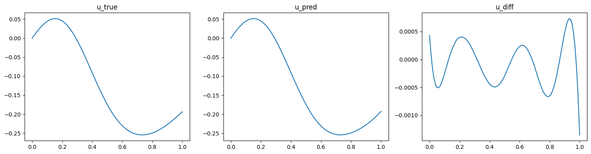
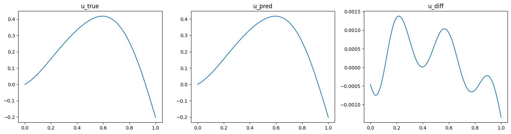
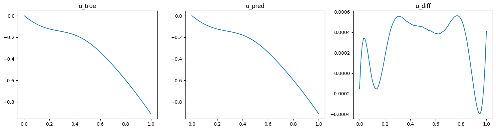
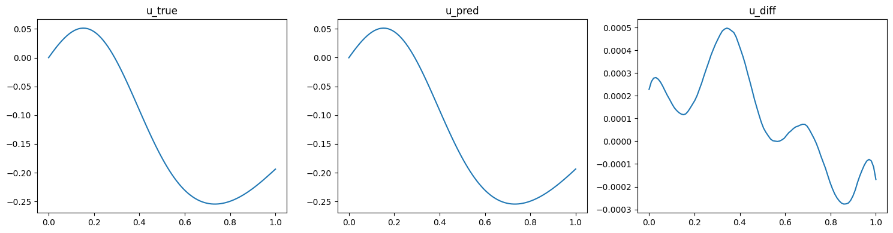
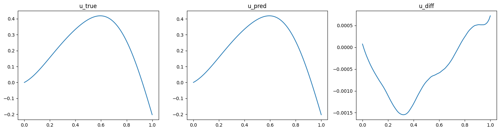
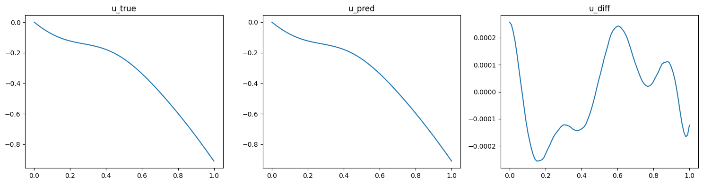
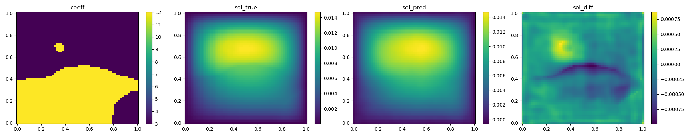
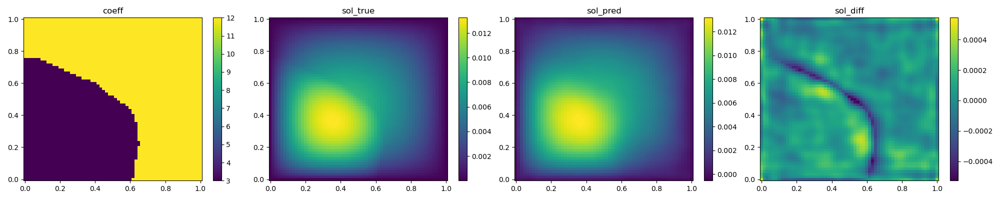
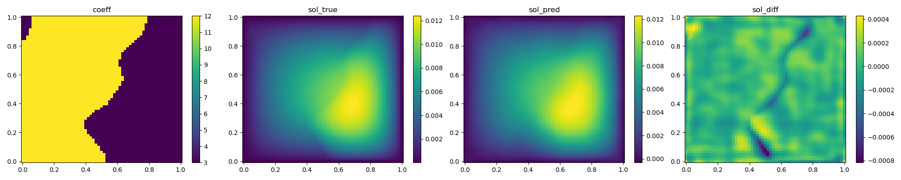

# Deep Operator Network

[公式ページ](https://docs.nvidia.com/deeplearning/modulus/modulus-sym/user_guide/neural_operators/deeponet.html)

## Introduction

このチュートリアルでは、Modulus Sym内のデータに基づいた情報と物理に基づいたDeep operator network (DeepONet) を使用して抽象演算子を学習する方法を説明します。このチュートリアルでは、

1. Modulus SymでDeepONetアーキテクチャを使用する方法
2. 演算子を学習するためのデータに基づいた情報と物理に基づいたDeepONetの設定方法

Note :
このチュートリアルでは、:ref:Introductory Example のチュートリアルを完了し、Modulus Sym APIに精通していることを前提としています。

## Problem 1: Anti-derivative (data-informed)

## Problem Description

1次元の初期値問題を考えます。

$$
\frac{du}{dx} = a(x), \quad x \in [0, 1]
$$

初期条件 $u(0)=0$ のもとで、区間 $[0,1]$ 上の反導関数演算子 $G$ が与えられるとします。

$$
G:\quad a(x) \mapsto G(a)(x):= \int_0^x a(t) dt, \quad x \in [0,1]
$$

DeepONetを設定して演算子 $G$ を学習します。この場合、$a$ はブランチネットワークの入力として、$x$ はトランクネットワークの入力として使用されます。ブランチネットワークの入力として、$a$ は固定された一様なグリッド上で離散化されます。これらは、DeepONetモデルが評価されるクエリ座標 $x$ と同じである必要はありません。例えば、$a$ のデータを ${a(0),\ a(0.5),\ a(1)}$ として与えても、出力を ${G(a)(0.1), G(u)(0.8), G(u)(0.9)}$ で評価することができます。これは、Fourierニューラル演算子と比較してDeepONetの利点の1つです。

## Data Preparation

データの準備として、平均がゼロの指数二次カーネルの長さスケール$l=0.2$を持つガウスランダムフィールド（GRF）から異なる入力関数$a$を$10,000$個生成します。次に、明示的なルンゲ・クッタ法を使用して、対応する$10,000$個のODE解$u$を取得します。各入出力のペア$(a,u)$について、$u(\cdot)$の観測は1つだけ選択されることに注意してください。これは、DeepONetがさまざまなデータ構造に対処する柔軟性を示しています。トレーニングおよび検証データは、「/examples/anti_derivative/data/」に提供されます。このデータを使用して、データに基づいたDeepONetコードを開始できます。

Note :
この問題のPythonスクリプトは、「/examples/anti_derivative/data_informed.py」で見つけることができます。

## Case Setup

まず、必要なパッケージをインポートしましょう。

```python

```

## Initializing the Model

この場合、ブランチネットワークとして完全に接続されたネットワークを使用し、トランクネットワークとしてFourier特徴ネットワークを使用します。ブランチネットワークでは、"Key("a", 100)"と"Key("branch", 128)"は、1つの入力関数$a$に対応する入力と出力の形状を指定します。同様に、トランクネットワークでは、"Key("x", 1)"と"Key("trunk", 128)"が1つの座標点$x$に対応する入力と出力の形状を指定します。configでは、これらのモデルは"arch" configグループの下で定義されています。

```yaml

```

Pythonスクリプトでモデルは以下のように初期化されます。

```python

```

Note :
Modulus SymのDeepONetアーキテクチャは非常に柔軟であり、ユーザーは異なるブランチネットワークとトランクネットワークを使用することができます。たとえば、ブランチネットワークに畳み込みモデルを使用し、トランクに完全に接続されたモデルを使用することができます。

## Loading Data

その後、.npy ファイルからデータをインポートします。

```python

```

## Adding Data Constraints

データ制約を追加するには、DeepONetConstraint を使用します。

```python

```

## Adding Data Validator

結果を検証するために、バリデータを設定することができます。

```python

```

## Training the Model

Start the training by executing the python script.

```bash
python data_informed.py
```

## Results

検証結果（正解、DeepONetの予測、および差分）は以下のように表示されます（:numref:fig-data-deeponet-0, :numref:fig-data-deeponet-1, :numref:fig-data-deeponet-2）。



   Data informed DeepONet validation result, sample 1


   Data informed DeepONet validation result, sample 2



   Data informed DeepONet validation result, sample 3

## Problem 2: Anti-derivative (physics-informed)

このセクションでは、初期条件のみが与えられたODEシステムの反導演算子を学習するために、物理に基づいたDeepONetを使用します。トレーニングデータは必要ありませんが、検証のためにいくつかのデータが必要です。

Note :
この問題のPythonスクリプトは、「/examples/anti_derivative/physics_informed.py」で見つけることができます。

## Case Setup

物理に基づいたDeepONetの設定のほとんどは、データに基づいたバージョンと同じです。まず、必要なパッケージをインポートします。

```python

```

## Initializing the Model

run関数内で、それぞれブランチとトランクのネットワークを設定します。この部分は、データに基づいたバージョンと同じです。

```python

```

## Loading Data

その後、データをデータに基づいたバージョンと同様にインポートします。

```python

```

## Adding Constraints

物理に基づいたバージョンとデータに基づいたバージョンの主な違いが強調されます。まず、$a(0)=0$ の初期値制約を課します。これを達成する方法は、トランクネットワークの入力をすべてゼロのデータに設定することです。その後、出力関数は $0$ のみで評価されます。

```python

```

次に、導関数の制約 $\frac{d}{dx}u(x) = a(x)$ を課します。ここで、$u_x$ は $u$ を $x$ に関して微分したものです。

```python

```

## Adding Data Validator

最後に、バリデータを追加します。これはデータに基づいたバージョンと同じです。

```python

```

## Training the Model

Pythonスクリプトを実行してトレーニングを開始します。

```bash
python physics_informed.py
```

## Results

検証結果（正解、DeepONetの予測、および差分）は以下のように表示されます（:numref:fig-physics-deeponet-0, :numref:fig-physics-deeponet-1, :numref:fig-physics-deeponet-2）。



Fig. 92 Physics informed DeepONet validation result, sample 1



Fig. 93 Physics informed DeepONet validation result, sample 2



Fig. 94 Physics informed DeepONet validation result, sample 3

## Problem 3: Darcy flow (data-informed)

## Case Setup

このセクションでは、Modulus Symで2次元のダルシー流の解演算子を学習するためのデータに基づいたDeepONetを設定します。問題の設定とトレーニングデータは、Fourier Neural Operatorsと同じです。詳細については、:ref:darcy_fnoのチュートリアルを参照してください。Modulus Symの組み込みネットワークアーキテクチャをDeepONetモデルで使用できることを強調する価値があります。

Note :
この問題のPythonスクリプトは、examples/darcy/darcy_DeepO.py で見つけることができます。


## Loading Data

トレーニングおよび検証データセットをメモリに読み込むプロセスは、:ref:darcy_fnoの例と同様の手順に従います。

```python

```

## Initializing the Model

DeepONetとドメインの初期化は、反導演算子の例と似ていますが、今回は畳み込みモデルを使用します。FNOの例と同様に、モデルは完全にconfigファイルを介して構成できます。Pix2Pix畳み込みモデルがブランチネットワークとして使用され、完全に接続されたモデルがトランクとして使用されます。DeepONetアーキテクチャは自動的に次元の違いを処理します。

```yaml

```

Pythonスクリプト内でモデルは以下のように初期化されます。

```python

```

## Adding Data Constraints and Validators

その後、以前と同様にデータ制約を追加できます。

```python

```

```python

```

## Training the Model

Pythonスクリプトを実行することで、トレーニングを簡単に開始できます。

```bash
python darcy_DeepO.py
```

## Results and Post-processing

以下に、検証結果（正解、DeepONetの予測、および差分）が示されています。



Fig. 95 DeepONet validation result, sample 1



Fig. 96 DeepONet validation result, sample 2



Fig. 97 DeepONet validation result, sample 3
