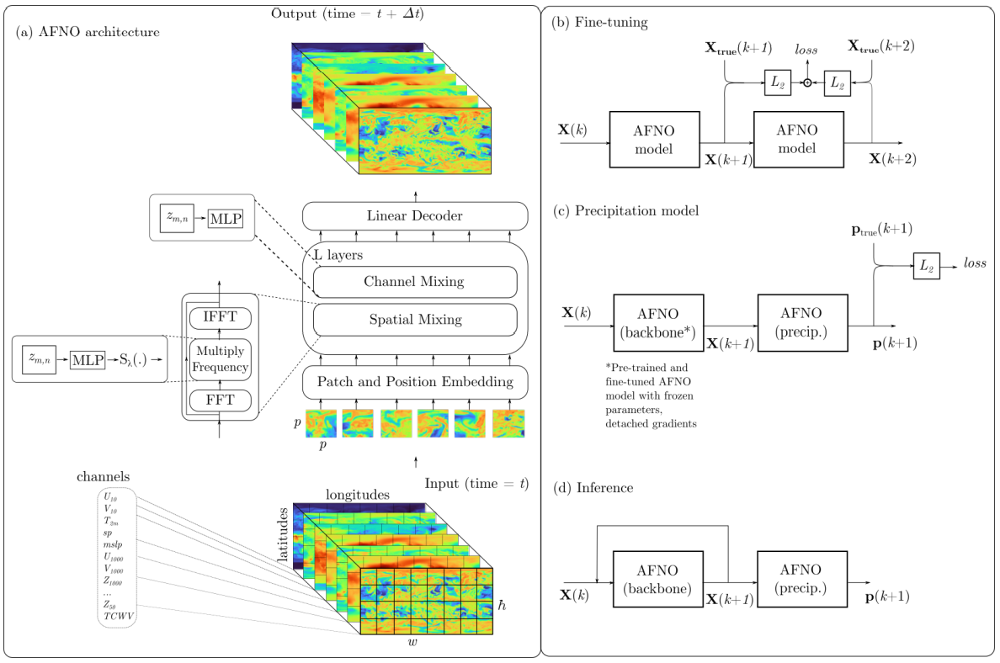
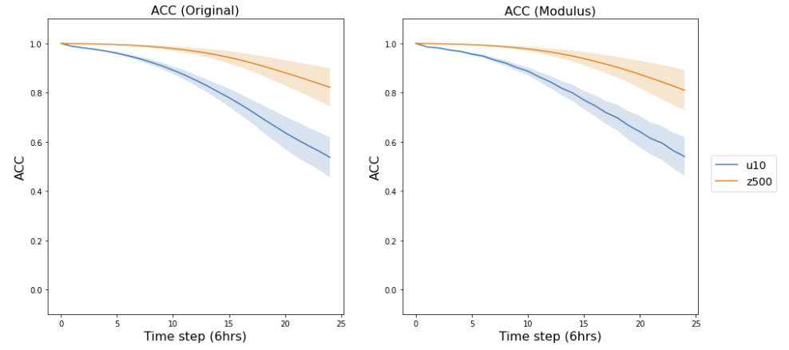
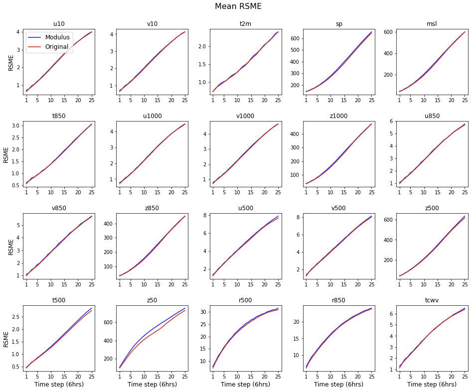
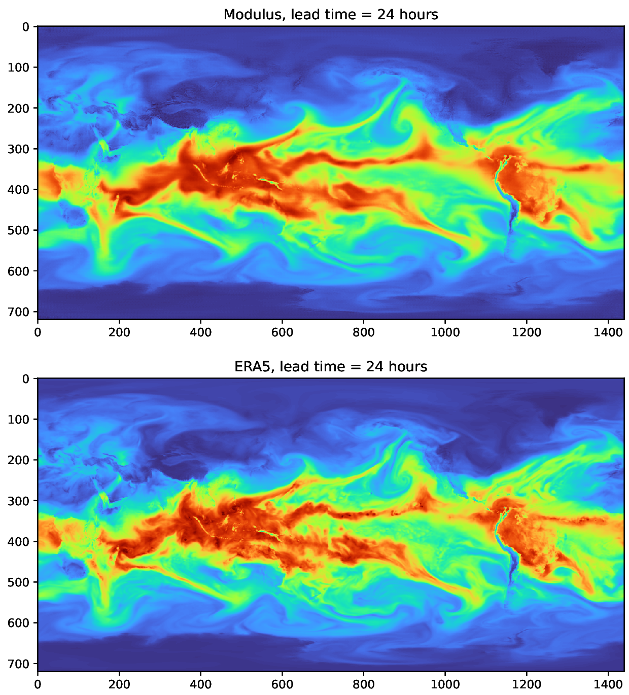

# FourCastNet

[公式ページ](https://docs.nvidia.com/deeplearning/modulus/modulus-sym/user_guide/neural_operators/fourcastnet.html)

## Introduction

この例では、Modulus Symを使用してFourCastNetを再現しています。FourCastNetは、**Four**ier Fore**Cast**ing Neural **Net**workの略であり、0.25◦の解像度で正確な短中期のグローバル予測を提供するグローバルデータ駆動型の気象予測モデルです。FourCastNetは、ECMWF統合予測システム（IFS）よりもはるかに速く、同等以上の精度で、週間の予測を2秒未満で生成します。IFSは、最先端の数値気象予測（NWP）モデルであり、比較可能またはより良い精度を提供します。FourCastNetは、ECMWFのERA5再解析データセットの一部から訓練されており、緯度と経度の解像度が$0.25^{\circ}`のいくつかの大気変数の毎時の推定値で構成されています。ERA5データセットからの初期条件を入力として与えると、FourCastNetは後の時間ステップでその動態を予測するためにAdaptive Fourier Neural Operator（AFNO）ネットワークを再帰的に適用します。現在のイテレーションでは、FourCastNetは20の大気変数を予測しています。これらの変数は、以下の表にリストされており、6時間ごとの時間分解能でERA5データセットからサンプリングされています。

Table 4 FourCastNet modeled variables

|Vertical Level | Variable |
| --- | --- |
|Surface | U10, V10, T2M, SP, MSLP|
|1000 hPa | U, V, Z |
|850 hPa|T, U, V, Z, RH|
|500 hPa|T, U, V, Z, RH|
|50 hPa|Z|
|Integrated|TCWV|

このチュートリアルでは、Modulus SymでFourCastNetを定義、訓練、評価する方法を説明します。ここでカバーされるトピックは以下の通りです：

    Modulus SymにERA5データセットをロードする方法

    Modulus SymでFourCastNetアーキテクチャを定義する方法

    FourCastNetの訓練方法

    天気予報を生成し、性能を定量的に評価する方法

Note :
AFNOに関する詳細は、:ref:afnoと:ref:darcy_afnoで詳しく説明されており、まずこれらの章を読むことをお勧めします。また、元の実装に関する詳細については、ArXivのプレプリント <https://arxiv.org/abs/2202.11214>_ も参照してください。 [#pathak2022fourcastnet]_

Warning :
ERA5データセットは非常に大きく（5 TB以上）、このチュートリアルの一部として提供していません。ERA5データ [#hersbach2020era5]_ は、Copernicus気候変動サービス（C3S）の気候データストア [#hersbach2018pl], [#hersbach2018sl] からダウンロードされました。

## Problem Description

FourCastNetの目標は、最大で10日間の短い時間スケールでモデル化された変数を予測することです。FourCastNetは、ERA5再解析データセットからの初期条件を使用して初期化されます。
以下の図は、FourCastNetがどのように動作するかの概要を示しています：



Fig. 98 FourCastNet overview. Figure reproduced with permission from [#pathak2022fourcastnet]_.

天気予測を行うために、地球全体を網羅する$720\times 1440$の次元の正規の緯度/経度グリッド上に定義された20種類の異なるERA5変数が、ある開始時間ステップ$t$でモデルへの入力として与えられます（図の左下）。
次に、AFNOアーキテクチャ（左中央）を使用して、これらの変数を後の時間ステップ$t+\Delta t$で予測します（元の論文では、固定時間差$\Delta t$として6時間を使用しています）。
推論中に、これらの予測値は再帰的にAFNOにフィードバックされるため、モデルは複数の時間ステップ先を予測できます（右下）。
さらに、単一のステップ予測を使用してネットワークを訓練するか、$n$ステップにネットワークを展開して、各予測された時間ステップをトレーニングデータに一致させる損失関数を使用してネットワークを訓練することができます（右上）。
通常、初期のトレーニングには単一ステップ予測が使用され、その後、2ステップ予測がよりコストがかかるため、微調整に使用されます。

Note :
元の論文では、追加の降水モデル（右中央）が使用されていますが、ここではAFNO "バックボーン"モデルのみを実装しています。

## Case Setup

FourCastNetのトレーニングには、1979年から2015年まで（両方を含む）のERA5データを使用します。性能をテストする際には、2018年の外部サンプルのERA5データを使用します。
20の変数とERA5データセットに適用される前処理の説明については、元の論文を参照してください。これらは、低層風や降水に影響を与える重要なプロセスをモデル化するために特に選択されています。
データは以下のディレクトリ構造を使用して格納されています：

```:
    era5
    ├── train
    │   ├── 1979.h5
    │   ├── ...
    │   ├── 2015.h5
    ├── test
    │   ├── 2018.h5
    └── stats
        ├── global_means.npy
        └── global_stds.py
```

各HDF5ファイルには、各年のすべての変数が含まれており、時間ステップが1460個あり、時間差が6時間（つまり、形状が（1460、20、720、1440））です。

Note :
この例のすべてのPythonスクリプトは、examples/fourcastnet/にあります。

## Configuration

FourCastNetの設定ファイルは、:ref:darcy_afnoの例で使用される設定ファイルと類似しており、以下に示します。

```yaml
# Copyright (c) 2023, NVIDIA CORPORATION & AFFILIATES. All rights reserved.
#
# Licensed under the Apache License, Version 2.0 (the "License");
# you may not use this file except in compliance with the License.
# You may obtain a copy of the License at
#
# http://www.apache.org/licenses/LICENSE-2.0
#
# Unless required by applicable law or agreed to in writing, software
# distributed under the License is distributed on an "AS IS" BASIS,
# WITHOUT WARRANTIES OR CONDITIONS OF ANY KIND, either express or implied.
# See the License for the specific language governing permissions and
# limitations under the License.

defaults:
  - modulus_default
  - arch:
      - afno
  - scheduler: cosine_annealing
  - optimizer: adam
  - loss: sum
  - _self_

arch:
  afno:
    patch_size: 8
    embed_dim: 768
    depth: 12
    num_blocks: 8

optimizer:
  lr: 0.0005

scheduler:
  T_max: 80000

custom:
  n_channels: 20
  tstep: 1
  n_tsteps: 1
  train_dataset:
    kind: "default"
    data_path: "/era5/ngc_era5_data/train" # Training dataset path here
  test_dataset:
    kind: "default"
    data_path: "/era5/ngc_era5_data/test" # Test dataset path here
  num_workers:
    grid: 8
    validation: 8
  tag:

batch_size:
  grid: 2
  validation: 2

training:
  amp: true
  rec_constraint_freq: 100000 # Dont bother recording constraint here
  rec_results_freq: 5000
  save_network_freq: 5000
  print_stats_freq: 100
  summary_freq: 5000
  max_steps: 70000 # 80 epochs * (55k samples / 64 batch size)
```

さらに、custom.tstepとcustom.n_tstepsパラメータを追加しました。これらは、AFNOの入力と出力の時間ステップ間の時間差（通常は6時間の倍数で、通常は1に設定されます）と、FourCastNetがトレーニング中に展開される時間ステップの数を定義します。

## Loading Data

Modulus Sym FourCastNetには、現在、データを読み込むための2つのオプションがあります：

1. NVIDIA Data Loading Library（DALI）を使用したDALIベースのデータローダー。これは、データの読み込みと処理を高速化するためにNVIDIA Data Loading Library ([DALI](https://developer.nvidia.com/dali))を使用しています。

2. 標準のPyTorchデータローダー。

DALIデータローダーはデフォルトのオプションですが、custom.train_dataset.kindオプションをpytorchに設定することで変更できます。

どちらのデータローダーも、ERA5データ形式をサポートし、fourcastnet/src/dataset.pyで定義された共有実装を使用しています。

```python
class ERA5HDF5GridBaseDataset:
    """Lazy-loading ERA5 dataset.
Provides common implementation that is used in map- or iterable-style datasets.

Parameters
----------
data_dir : str
Directory where ERA5 data is stored
chans : List[int]
Defines which ERA5 variables to load
tstep : int
Defines the size of the timestep between the input and output variables
n_tsteps : int, optional
Defines how many timesteps are included in the output variables
Default is 1
patch_size : int, optional
If specified, crops input and output variables so image dimensions are
divisible by patch_size
Default is None
n_samples_per_year : int, optional
If specified, randomly selects n_samples_per_year samples from each year
rather than all of the samples per year
Default is None
stats_dir : str, optional
Directory to test data statistic numpy files that have the global mean and variance
"""

    def __init__(
        self,
        data_dir: str,
        chans: List[int],
        tstep: int = 1,
        n_tsteps: int = 1,
        patch_size: int = None,
        n_samples_per_year: int = None,
        stats_dir: str = None,
        **kwargs,
    ):
        self.data_dir = Path(to_absolute_path(data_dir))
        self.chans = chans
        self.nchans = len(self.chans)
        self.tstep = tstep
        self.n_tsteps = n_tsteps
        self.patch_size = patch_size
        self.n_samples_per_year = n_samples_per_year

        if stats_dir is None:
            self.stats_dir = self.data_dir.parent / "stats"

        # check root directory exists
        assert (
            self.data_dir.is_dir()
        ), f"Error, data directory{self.data_dir}does not exist"
        assert (
            self.stats_dir.is_dir()
        ), f"Error, stats directory{self.stats_dir}does not exist"

        # get all input data files
        self.data_paths = sorted(self.data_dir.glob("????.h5"))
        for data_path in self.data_paths:
            logging.info(f"ERA5 file found:{data_path}")
        self.n_years = len(self.data_paths)
        logging.info(f"Number of years:{self.n_years}")

        # get total number of examples and image shape from the first file,
        # assuming other files have exactly the same format.
        logging.info(f"Getting file stats from{self.data_paths[0]}")
        with h5py.File(self.data_paths[0], "r") as f:
            self.n_samples_per_year_all = f["fields"].shape[0]
            self.img_shape = f["fields"].shape[2:]
            logging.info(f"Number of channels available:{f['fields'].shape[1]}")

        # get example indices to use
        if self.n_samples_per_year is None:
            self.n_samples_per_year = self.n_samples_per_year_all
            self.samples = [
                np.arange(self.n_samples_per_year) for _ in range(self.n_years)
            ]
        else:
            if self.n_samples_per_year > self.n_samples_per_year_all:
                raise ValueError(
                    f"n_samples_per_year ({self.n_samples_per_year}) > number of samples available ({self.n_samples_per_year_all})!"
                )
            self.samples = [
                np.random.choice(
                    np.arange(self.n_samples_per_year_all),
                    self.n_samples_per_year,
                    replace=False,
                )
                for _ in range(self.n_years)
            ]
        logging.info(f"Number of samples/year:{self.n_samples_per_year}")

        # get total length
        self.length = self.n_years * self.n_samples_per_year

        # adjust image shape if patch_size defined
        if self.patch_size is not None:
            self.img_shape = [s - s % self.patch_size for s in self.img_shape]
        logging.info(f"Input image shape:{self.img_shape}")

        # load normalisation values
        # has shape [1, C, 1, 1]
        self.mu = np.load(self.stats_dir / "global_means.npy")[:, self.chans]
        # has shape [1, C, 1, 1]
        self.sd = np.load(self.stats_dir / "global_stds.npy")[:, self.chans]
        assert (
            self.mu.shape == self.sd.shape == (1, self.nchans, 1, 1)
        ), "Error, normalisation arrays have wrong shape"

    @property
    def invar_keys(self):
        return ["x_t0"]

    @property
    def outvar_keys(self):
        return [f"x_t{(i+1)*self.tstep}" for i in range(self.n_tsteps)]
```

与えられた例のインデックスに対して、データセットの__getitem__メソッドは、単一のModulus Sym入力変数x_t0を返します。これは、開始時間ステップでの形状が（20、720、1440）のテンソルであり、20のERA5変数を含みます。そして、同じ形状の複数の出力変数x_t1、x_t2、...があります。各出力変数は、FourCastNetが展開される各予測時間ステップに対応します。

```python
class ERA5HDF5GridDataset(ERA5HDF5GridBaseDataset, Dataset):
    """Map-style ERA5 dataset."""

    def __getitem__(self, idx):
        # get local indices from global index
        year_idx = int(idx / self.n_samples_per_year)
        local_idx = int(idx % self.n_samples_per_year)
        in_idx = self.samples[year_idx][local_idx]

        # get output indices
        out_idxs = []
        for i in range(self.n_tsteps):
            out_idx = in_idx + (i + 1) * self.tstep
            # if at end of dataset, just learn identity instead
            if out_idx > (self.n_samples_per_year_all - 1):
                out_idx = in_idx
            out_idxs.append(out_idx)

        # get data
        xs = []
        for idx in [in_idx] + out_idxs:
            # get array
            # has shape [C, H, W]
            x = self.data_files[year_idx]["fields"][idx, self.chans]
            assert x.ndim == 3, f"Expected 3 dimensions, but got{x.shape}"

            # apply input / output normalisation (broadcasted operation)
            x = (x - self.mu[0]) / self.sd[0]

            # crop data if needed
            if self.patch_size is not None:
                x = x[..., : self.img_shape[0], : self.img_shape[1]]

            xs.append(x)

        # convert to tensor dicts
        assert len(self.invar_keys) == 1
        invar = {self.invar_keys[0]: xs[0]}

        assert len(self.outvar_keys) == len(xs) - 1
        outvar = {self.outvar_keys[i]: x for i, x in enumerate(xs[1:])}

        invar = Dataset._to_tensor_dict(invar)
        outvar = Dataset._to_tensor_dict(outvar)

        lambda_weighting = Dataset._to_tensor_dict(
            {k: np.ones_like(v) for k, v in outvar.items()}
        )

        return invar, outvar, lambda_weighting

```

トレーニングスクリプト内のfourcastnet/era5_FCN.pyでは、ERA5データセットは次のように初期化されます：

```python
train_dataset = _create_dataset(
        cfg.custom.train_dataset.kind,
        data_dir=cfg.custom.train_dataset.data_path,
        chans=channels,
        tstep=cfg.custom.tstep,
        n_tsteps=cfg.custom.n_tsteps,
        patch_size=cfg.arch.afno.patch_size,
        batch_size=cfg.batch_size.grid,
        num_workers=cfg.custom.num_workers.grid,
        shuffle=True,
    )

    test_dataset = _create_dataset(
        cfg.custom.test_dataset.kind,
        data_dir=cfg.custom.test_dataset.data_path,
        chans=channels,
        tstep=cfg.custom.tstep,
        n_tsteps=cfg.custom.n_tsteps,
        patch_size=cfg.arch.afno.patch_size,
        n_samples_per_year=20,
        batch_size=cfg.batch_size.validation,
        num_workers=cfg.custom.num_workers.validation,
    )
```

## FourCastNet Model

次に、FourCastNetをカスタムのModulus Symアーキテクチャとして定義する必要があります。
このモデルは、fourcastnet/src/fourcastnet.py内に見つかります。これは、Modulus SymのAFNOモデルのラッパークラスです。
FourCastNetには2つのトレーニングフェーズがあります：最初は単一ステップ予測、次が2ステップ予測です。
この小さなラッパーは、AFNOを任意のn_tstepsの時間ステップに対して実行し、自己回帰的な順方向パスを使用します。

```python
class FourcastNetArch(Arch):
    "Defines the FourcastNet architecture"

    def __init__(
        self,
        input_keys: List[Key],
        output_keys: List[Key],
        img_shape: Tuple[int, int],
        detach_keys: List[Key] = [],
        patch_size: int = 16,
        embed_dim: int = 256,
        depth: int = 4,
        num_blocks: int = 4,
    ) -> None:
        """Fourcastnet model. This is a simple wrapper for Modulus' AFNO model.
The only difference is that FourcastNet needs multi-step training. This class
allows the model to auto-regressively predict multiple timesteps

Parameters (Same as AFNO)
----------
input_keys : List[Key]
Input key list. The key dimension size should equal the variables channel dim.
output_keys : List[Key]
Output key list. The key dimension size should equal the variables channel dim.
img_shape : Tuple[int, int]
Input image dimensions (height, width)
detach_keys : List[Key], optional
List of keys to detach gradients, by default []
patch_size : int, optional
Size of image patchs, by default 16
embed_dim : int, optional
Embedded channel size, by default 256
depth : int, optional
Number of AFNO layers, by default 4
num_blocks : int, optional
Number of blocks in the frequency weight matrices, by default 4
"""
        super().__init__(
            input_keys=input_keys,
            output_keys=output_keys,
            detach_keys=detach_keys,
        )

        # get number of timesteps steps to unroll
        assert (
            len(self.input_keys) == 1
        ), "Error, FourcastNet only accepts one input variable (x_t0)"
        self.n_tsteps = len(self.output_keys)
        logging.info(f"Unrolling FourcastNet over{self.n_tsteps}timesteps")

        # get number of input/output channels
        in_channels = self.input_keys[0].size
        out_channels = self.output_keys[0].size

        # intialise AFNO kernel
        self._impl = AFNONet(
            in_channels=in_channels,
            out_channels=out_channels,
            patch_size=(patch_size, patch_size),
            img_size=img_shape,
            embed_dim=embed_dim,
            depth=depth,
            num_blocks=num_blocks,
        )

    def forward(self, in_vars: Dict[str, Tensor]) -> Dict[str, Tensor]:
        # prepare input tensor
        x = self.prepare_input(
            input_variables=in_vars,
            mask=self.input_key_dict.keys(),
            detach_dict=self.detach_key_dict,
            dim=1,
            input_scales=self.input_scales,
        )

        # unroll model over multiple timesteps
        ys = []
        for t in range(self.n_tsteps):
            x = self._impl(x)
            ys.append(x)
        y = torch.cat(ys, dim=1)

        # prepare output dict
        return self.prepare_output(
            output_tensor=y,
            output_var=self.output_key_dict,
            dim=1,
            output_scales=self.output_scales,
        )
```

FourCastNetモデルは、トレーニングスクリプトであるfourcastnet/era5_FCN.pyで初期化されます。

```python
# make list of nodes to unroll graph on
    model = FourcastNetArch(
        input_keys=input_keys,
        output_keys=output_keys,
        img_shape=test_dataset.img_shape,
        patch_size=cfg.arch.afno.patch_size,
        embed_dim=cfg.arch.afno.embed_dim,
        depth=cfg.arch.afno.depth,
        num_blocks=cfg.arch.afno.num_blocks,
    )
    nodes = [model.make_node(name="FCN")]
```

## Adding Constraints

ERA5データを読み込むためのカスタムデータセットとFourCastNetモデルが作成されたので、次のステップはModulus Symのトレーニングドメインを設定することです。
メインのトレーニングスクリプトは fourcastnet/era5_FCN.pyで、Modulus Symでモデルをトレーニングするために必要な標準の手順が制約されています。
標準のデータ駆動グリッド制約が作成されます：

```python
# make domain
    domain = Domain()

    # add constraints to domain
    supervised = SupervisedGridConstraint(
        nodes=nodes,
        dataset=train_dataset,
        batch_size=cfg.batch_size.grid,
        loss=LpLoss(),
        num_workers=cfg.custom.num_workers.grid,
    )
    domain.add_constraint(supervised, "supervised")
```

トレーニングスクリプトにはバリデータも追加されます。Pythonスクリプトを実行するだけでトレーニングを開始できます。

```python
# add validator
    val = GridValidator(
        nodes,
        dataset=test_dataset,
        batch_size=cfg.batch_size.validation,
        plotter=GridValidatorPlotter(n_examples=5),
        num_workers=cfg.custom.num_workers.validation,
    )
    domain.add_validator(val, "test")
```

## Training the Model

Pythonスクリプトを実行するだけで、トレーニングを簡単に開始できます。

```bash
python fcn_era5.py
```

## Results and Post-processing

訓練されたモデルfourcastnet/inferencer.pyを使用して、緯度重み付きの平均二乗誤差（RMSE）と緯度重み付きの異常相関係数（ACC）の値を計算します。
inferencerスクリプトは、テストデータセットで提供される複数の初期条件で訓練されたモデルを実行します。
以下に、Modulus Symで訓練されたモデルのACCとRMSEの値が、元の論文の結果と比較され、元の作業との優れた比較が示されます [#pathak2022fourcastnet]_。
さらに、Modulus Symによって予測された大気水蒸気の積分鉛直柱と目標ERA5データセットを比較した24時間の予測も示されます。

Note :
これらのメトリクスがどのように計算されるかの詳細については、元のArXiv論文またはsrc/metrics.pyを参照してください。
関心のあるメトリクスを適切に計算するには、複数のデータセット統計が必要です。



Fig. 99 Comparison of the anomaly correlation coefficient (ACC) of the predicted 10 meter `u` component wind speed (`u10`) and geopotential height (`z500`) using the original FourCastNet model (Original) and the version trained in Modulus Sym.



Fig. 100 Comparison of the predictive root mean square error (RMSE) of each variable between the original FourCastNet model (Original) and the version trained in Modulus Sym.



Fig. 101 24 hour prediction of the integrated vertical column of atmospheric water vapor predicted by Modulus Sym compared to the ground truth ERA5 dataset from ECMWF.

## Reference

.. rubric:: References
.. [#pathak2022fourcastnet] Pathak, Jaideep, et al. "FourCastNet : A global data-driven high-resolution weather model using adaptive Fourier neural operators" arXiv preprint arXiv:2202.11214 (2022).
.. [#hersbach2020era5] Hersbach, Hans, et al. "The ERA5 global reanalysis" Quarterly Journal of the Royal Meteorological Society (2020).
.. [#hersbach2018pl] Hersbach, Hans, et al. "ERA5 hourly data on pressure levels from 1959 to present. Copernicus Climate Change Service (C3S) Climate Data Store (CDS)." , 10.24381/cds.bd0915c6 (2018)
.. [#hersbach2018sl] Hersbach, Hans et al., "ERA5 hourly data on single levels from 1959 to present. Copernicus Climate Change Service (C3S) Climate Data Store (CDS)." , 10.24381/cds.adbb2d47 (2018)
.. [#guibas2021adaptive] Guibas, John, et al. "Adaptive fourier neural operators: Efficient token mixers for transformers" International Conference on Learning Representations, 2022.
