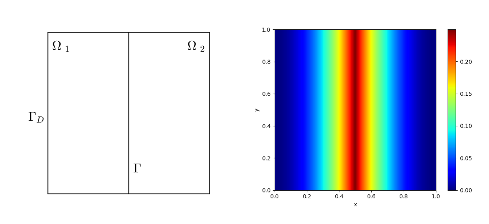
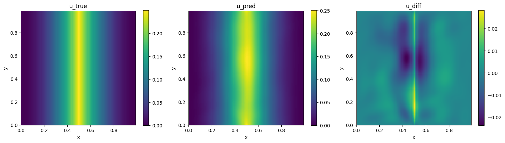
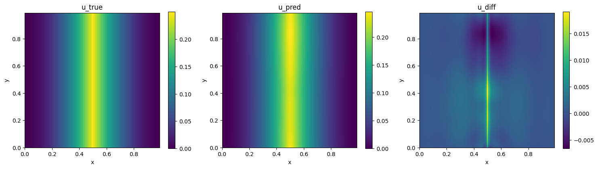
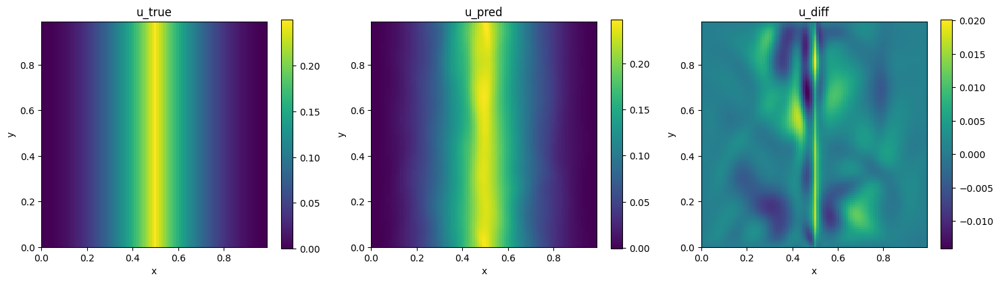
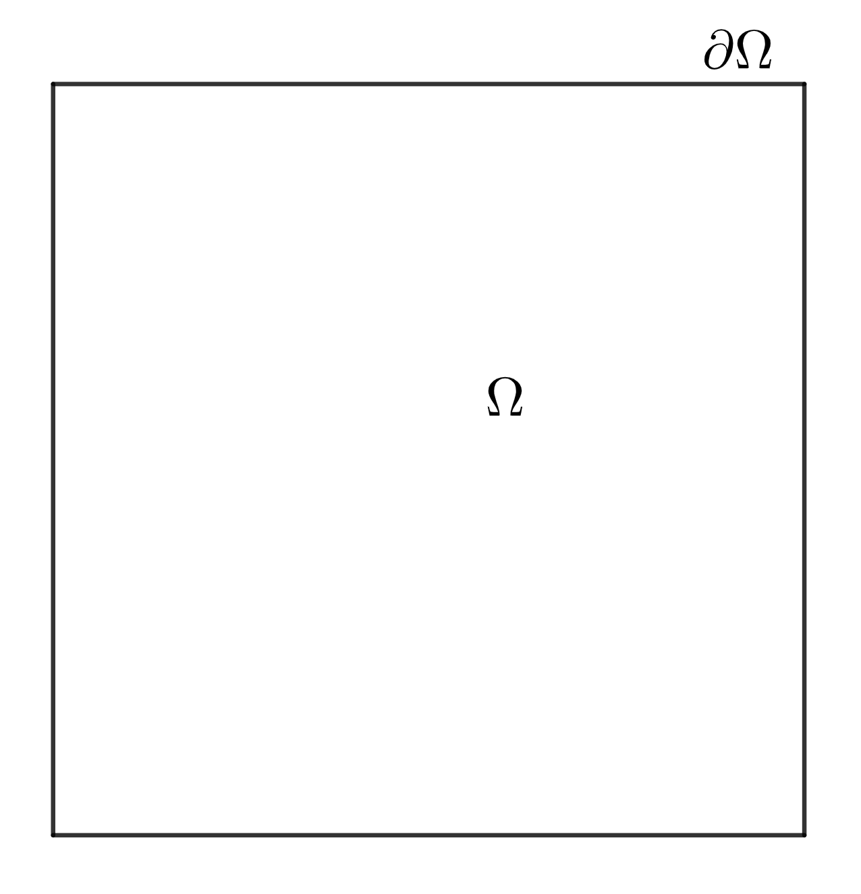
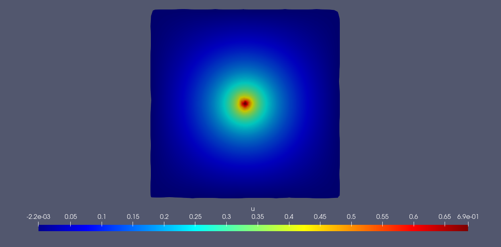

# Interface Problem by Variational Method

[公式ページ](https://docs.nvidia.com/deeplearning/modulus/modulus-sym/user_guide/intermediate/variational_example.html)

## Introduction

このチュートリアルでは、変分形式を使用して偏微分方程式を解くプロセスを示します。変分法を使用して Modulus Sym を使用して界面 PDE 問題を解く方法を示します。変分法（弱形式）の使用は、点源を持つ問題を容易に扱うことも可能であり、このチュートリアルでも取り上げられます。このチュートリアルでは、以下のことが学べます。

1. Modulus Sym で PDE の変分形式（連続的および不連続的）を解く方法。
2. 望ましい点集合上でのテスト関数とその導関数データの生成方法。
3. Modulus Sym での数値積分の使用方法。
4. 点源（ディラックデルタ関数）を持つ問題を解く方法。

Note :
このチュートリアルでは、Lid Driven Cavity の :ref:Introductory Example チュートリアルを完了し、Modulus Sym API の基本に精通していることを前提としています。また、PDE の弱解に関する詳細については、理論章の :ref:weak-solutions-pinn セクションも参照してください。

このチュートリアルで参照されるすべてのスクリプトは、examples/discontinuous_galerkin/ 内にあります。

Warning :
これらの例には Python パッケージ quadpy <https://github.com/nschloe/quadpy>_ が必要です。 pip install quadpy を使用してインストールしてください（:ref:install_modulus_docker も参照してください）。

## Problem Description

このチュートリアルでは、Dirichlet境界条件を持つPoisson方程式の解法を示します。この問題は、二つの領域の間の界面を表しています。$\Omega_1 = (0,0.5)\times(0,1)$、$\Omega_2 = (0.5,1)\times(0,1)$、$\Omega=(0,1)^2$とします。界面は$\Gamma=\overline{\Omega}_1\cap\overline{\Omega}_2$であり、Dirichlet境界は$\Gamma_D=\partial\Omega$です。問題の領域は:numref:fig-domainに示すように視覚化できます。この問題は、[#zang2020weak]_で元々定義されました。



Fig. 102 Left: Domain of interface problem. Right: True Solution

問題のPDEは次のように定義されます。

$$
-\Delta u = f \quad \text{in}\quad \Omega,
$$

$$
u = g_D \quad \text{on} \quad \Gamma_D,
$$

$$
\left[\frac{\partial u}{\partial \mathbf{n}} \right] =g_I \quad \text{on} \quad\Gamma
$$

$f=-2$、$g_I=2$、そして

$$
g_D =
\begin{cases}
x^2 &   0\leq x\leq \frac{1}{2}\\
(x-1)^2 &   \frac{1}{2}< x\leq 1
\end{cases}
$$

$g_D$ は、界面 $\Gamma$ 上の正確な解であり、$\Gamma$ 上のジャンプ $[\cdot]$ は以下で定義されます。

$$
\left[\frac{\partial u}{\partial \mathbf{n}}\right]=\nabla u_1\cdot\mathbf{n}_1+\nabla u_2\cdot\mathbf{n}_2,\label{var_ex-example}
$$

ここで、$u_i$ は $\Omega_i$ 内の解であり、$\mathbf{n}_i$ は $\partial\Omega_i\cap\Gamma$ 上の単位法線です。

元の参照文献で示唆されているように、この問題は強い（古典的な）解を受け入れませんが、一意の弱解（$g_D$）のみを受け入れます。これは:numref:fig:domainに示されています。

Note :
了解しました。元の論文 [#zang2020weak] では、PDEが間違っていることが指摘されており、:eq:ex1-example-:eq:ex3-exampleが問題の修正されたPDEを定義しています。

## Variational Form

:eq:ex3-exampleによると、解の導関数が界面（$\Gamma$）で断裂することを示唆しているため、$\Omega_1$ と $\Omega_2$ で変分形式を別々に行う必要があります。方程式:eq:var_cont-exampleと:eq:var_discont-exampleは、上記の問題の連続的および不連続的な変分形式を示しています。簡潔さのために、ここでは最終的な変分形式のみが示されています。これらの形式の詳細な導出については、理論付録の :ref:variational-appendix を参照してください。

連続型の変分形式は以下の通りです：

$$
\int_{\Omega}(\nabla u\cdot\nabla v - fv) dx - \int_{\Gamma} g_Iv ds - \int_{\Gamma_D} \frac{\partial u}{\partial \mathbf{n}}v ds = 0
$$

不連続型の変分形式は以下の通りです：

$$
\sum_{i=1}^2(\nabla u_i\cdot v_i - fv_i) dx - \sum_{i=1}^2\int_{\Gamma_D}\frac{\partial u_i}{\partial \mathbf{n}} v_i ds-\int_{\Gamma}(g_I\langle v \rangle+\langle \nabla u \rangle[\![ v ]\!]) ds =0
$$

以下のサブセクションでは、これらの変分形式を Modulus Sym で実装する方法を示します。

## Continuous type formulation

このサブセクションでは、連続型の変分形式 :eq:var_cont-example を Modulus Sym で実装する方法を示します。この例のコードは./dg/dg.pyにあります。

まず、必要なすべてのパッケージをインポートします。

```python
import torch

import modulus.sym
from modulus.sym.hydra import instantiate_arch, ModulusConfig
from modulus.sym.solver import Solver
from modulus.sym.geometry import Bounds
from modulus.sym.geometry.primitives_2d import Rectangle
from modulus.sym.key import Key
from modulus.sym.eq.pdes.diffusion import Diffusion
from modulus.sym.utils.vpinn.test_functions import (
    RBF_Function,
    Test_Function,
    Legendre_test,
    Trig_test,
)
from modulus.sym.utils.vpinn.integral import tensor_int, Quad_Rect, Quad_Collection
from modulus.sym.domain import Domain
from modulus.sym.domain.constraint import (
    PointwiseBoundaryConstraint,
    PointwiseInteriorConstraint,
    VariationalConstraint,
)
from modulus.sym.dataset import DictVariationalDataset
from modulus.sym.domain.validator import PointwiseValidator
from modulus.sym.domain.inferencer import PointwiseInferencer
from modulus.sym.utils.io.plotter import ValidatorPlotter, InferencerPlotter
from modulus.sym.loss import Loss
from sympy import Symbol, Heaviside, Eq
import numpy as np
import quadpy
```

## Creating the Geometry

ドメインの中心にあるインターフェースを使用して、ジオメトリを左右の部分に分けて定義することができます。これにより、両側に共通する境界でサンプリングすることで、インターフェース情報をキャプチャすることができます。

```python
# add constraints to solver
    x, y = Symbol("x"), Symbol("y")

    # make geometry
    rec_1 = Rectangle((0, 0), (0.5, 1))
    rec_2 = Rectangle((0.5, 0), (1, 1))
    rec = rec_1 + rec_2

    # make training domain for traditional PINN
    eps = 0.02
    rec_pinn = Rectangle((0 + eps, 0 + eps), (0.5 - eps, 1 - eps)) + Rectangle(
        (0.5 + eps, 0 + eps), (1 - eps, 1 - eps)
    )
```

この例では、従来のPINNsと組み合わせて変分形式を使用します。PINNsの損失は基本的に点ごとの残差であり、損失関数は滑らかな解に対してよく機能します。したがって、境界や界面から離れた領域に対しては、従来のPINNsの損失を課します。

## Defining the Boundary conditions and Equations to solve

問題のジオメトリが定義されたら、境界条件やPDEの制約を定義できます。

PDEは変分形式によって処理されます。しかし、変分形式が存在する場合でも、古典的な形式のPDE制約を適用することには問題はありません。経験則としては、古典的な形式のPDE制約を使用すると、ニューラルネットワークの収束が速くなりますが、計算グラフが大きくなります。以下のコードセグメントでは、古典的な形式のPDE制約を適用しています。これは変分制約のためオプションです。

```python
# make domain
    domain = Domain()

    # PINN constraint
    # interior = PointwiseInteriorConstraint(
    # nodes=nodes,
    # geometry=rec_pinn,
    # outvar={"diffusion_u": 0},
    # batch_size=4000,
    # bounds={x: (0 + eps, 1 - eps), y: (0 + eps, 1 - eps)},
    # lambda_weighting={"diffusion_u": 1.},
    # )
    # domain.add_constraint(interior, "interior")

    # exterior boundary
    g = ((x - 1) ** 2 * Heaviside(x - 0.5)) + (x**2 * Heaviside(-x + 0.5))
    boundary = PointwiseBoundaryConstraint(
        nodes=nodes,
        geometry=rec,
        outvar={"u": g},
        batch_size=cfg.batch_size.boundary,
        lambda_weighting={"u": 10.0},  # weight edges to be zero
        criteria=~Eq(x, 0.5),
    )
    domain.add_constraint(boundary, "boundary")

    batch_per_epoch = 100
    variational_datasets = {}
    batch_sizes = {}
    # Middle line boundary
    invar = rec.sample_boundary(
        batch_per_epoch * cfg.batch_size.boundary, criteria=~Eq(x, 0.5)
    )
    invar["area"] *= batch_per_epoch
    variational_datasets["boundary1"] = DictVariationalDataset(
        invar=invar,
        outvar_names=["u__x", "u__y"],
    )
    batch_sizes["boundary1"] = cfg.batch_size.boundary
    # Middle line boundary
    invar = rec_1.sample_boundary(
        batch_per_epoch * cfg.batch_size.boundary, criteria=Eq(x, 0.5)
    )
    invar["area"] *= batch_per_epoch
    variational_datasets["boundary2"] = DictVariationalDataset(
        invar=invar,
        outvar_names=["u__x"],
    )
    batch_sizes["boundary2"] = cfg.batch_size.boundary

    # Interior points
    if cfg.training.use_quadratures:
        paras = [
            [
                [[0, 0.5], [0, 1]],
                20,
                True,
                lambda n: quadpy.c2.product(quadpy.c1.gauss_legendre(n)),
            ],
            [
                [[0.5, 1], [0, 1]],
                20,
                True,
                lambda n: quadpy.c2.product(quadpy.c1.gauss_legendre(n)),
            ],
        ]
        quad_rec = Quad_Collection(Quad_Rect, paras)
        invar = {
            "x": quad_rec.points_numpy[:, 0:1],
            "y": quad_rec.points_numpy[:, 1:2],
            "area": np.expand_dims(quad_rec.weights_numpy, -1),
        }

        variational_datasets["interior"] = DictVariationalDataset(
            invar=invar,
            outvar_names=["u__x", "u__y"],
        )
        batch_sizes["interior"] = min(
            [quad_rec.points_numpy.shape[0], cfg.batch_size.interior]
        )
    else:
        invar = rec.sample_interior(
            batch_per_epoch * cfg.batch_size.interior,
            bounds=Bounds({x: (0.0, 1.0), y: (0.0, 1.0)}),
        )
        invar["area"] *= batch_per_epoch
        variational_datasets["interior"] = DictVariationalDataset(
            invar=invar,
            outvar_names=["u__x", "u__y"],
        )
        batch_sizes["interior"] = cfg.batch_size.interior

    # Add points for RBF
    if cfg.training.test_function == "rbf":
        invar = rec.sample_interior(
            batch_per_epoch * cfg.batch_size.rbf_functions,
            bounds=Bounds({x: (0.0, 1.0), y: (0.0, 1.0)}),
        )
        invar["area"] *= batch_per_epoch
        variational_datasets["rbf"] = DictVariationalDataset(
            invar=invar,
            outvar_names=[],
        )
        batch_sizes["rbf"] = cfg.batch_size.rbf_functions

    variational_constraint = VariationalConstraint(
        datasets=variational_datasets,
        batch_sizes=batch_sizes,
        nodes=nodes,
        num_workers=1,
        loss=DGLoss(cfg.training.test_function),
    )
    domain.add_constraint(variational_constraint, "variational")
```

変分制約に関しては、「run」関数で、まず変分形式を定式化するために必要なデータを収集します。
内部点に関しては、2つのオプションがあります。
1つ目のオプションは、積分則です。Modulus Sym には、基本的な幾何学とメッシュに基づいて quadpy <https://github.com/nschloe/quadpy>_ パッケージを使用して積分則を作成する機能があります。
積分則は、高い精度と効率を持っているため、可能な場合は積分則を使用します。
もう1つのオプションは、ランダムな点を使用することです。sample_interior で quasirandom=True を設定することで、準ランダム点を使用して積分の精度を高めることができます。
この例では、Hydra 設定ファイルの cfg.quad を使用してオプションを選択できます。

また、基底関数の中心の追加データを使用して、基底関数の中心の追加データを使用することもできます。

## Creating the Validator

閉じた形式の解が既知であるため、予測と真の解を比較するための検証器を作成します。

```python
# add validation data
    delta_x = 0.01
    delta_y = 0.01
    x0 = np.arange(0, 1, delta_x)
    y0 = np.arange(0, 1, delta_y)
    x_grid, y_grid = np.meshgrid(x0, y0)
    x_grid = np.expand_dims(x_grid.flatten(), axis=-1)
    y_grid = np.expand_dims(y_grid.flatten(), axis=-1)
    u = np.where(x_grid <= 0.5, x_grid**2, (x_grid - 1) ** 2)
    invar_numpy = {"x": x_grid, "y": y_grid}
    outvar_numpy = {"u": u}
    openfoam_validator = PointwiseValidator(
        nodes=nodes,
        invar=invar_numpy,
        true_outvar=outvar_numpy,
        plotter=ValidatorPlotter(),
    )
    domain.add_validator(openfoam_validator)
```

## Creating the Inferencer

希望する領域で解を生成するために、インファレンサーを追加します。

```python
# add inferencer data
    inferencer = PointwiseInferencer(
        nodes=nodes,
        invar=invar_numpy,
        output_names=["u"],
        batch_size=2048,
        plotter=InferencerPlotter(),
    )
    domain.add_inferencer(inferencer)
```

## Creating the Variational Loss

このサブセクションでは、変分損失の形成方法を示します。収集されたデータを使用し、VariationalConstraint に登録してこの損失を形成します。

まず、使用するテスト関数を選択します。

Modulus Symでは、Legendre、1次および2次のChebyshev多項式、および三角関数がすでにテスト関数として実装されており、直接選択できます。また、meta_test_function クラスで、名前、定義域、およびSymPy式を提供して独自のテスト関数を定義することもできます。Test_Functionでは、テスト関数の名前と次数の辞書（パラメータリストの name_ord_dict ）、定義域の上限と下限（パラメータリストの box ）、必要な微分の種類（パラメータリストの diff_list ）を提供する必要があります。たとえば、$v_{xxy}$ が必要な場合、diff_list に [1,1,2] を追加します。 diff_list にはショートカットがあります。テスト関数の勾配のすべての成分が必要な場合は、diff_list に 'grad' を追加し、テスト関数のラプラシアンが必要な場合は、'Delta' を追加します。 box パラメーターは指定しない場合、デフォルトの値に設定されます。つまり、Legendre多項式の場合は $[-1, 1]^n$、三角関数の場合は $[0, 1]^n$ などです。

テスト関数の定義は、「DGLoss」クラスの初期化子に配置されます。

```python
# custom variational loss
class DGLoss(Loss):
    def __init__(self, test_function):
        super().__init__()
        # make test function
        self.test_function = test_function
        if test_function == "rbf":
            self.v = RBF_Function(dim=2, diff_list=["grad"])
            self.eps = 10.0
        elif test_function == "legendre":
            self.v = Test_Function(
                name_ord_dict={
                    Legendre_test: [k for k in range(10)],
                    Trig_test: [k for k in range(5)],
                },
                diff_list=["grad"],
            )
```

その後は、「DGLoss」の「forward」関数を定義するだけで十分です。「forward」では、変分損失を形成して返す必要があります。:eq:var_cont-exampleに従って、変分損失は次のコードで形成されます：

```python
def forward(
        self,
        list_invar,
        list_outvar,
        step: int,
    ):
        # calculate test function
        if self.test_function == "rbf":
            v_outside = self.v.eval_test(
                "v",
                x=list_invar[0]["x"],
                y=list_invar[0]["y"],
                x_center=list_invar[3]["x"],
                y_center=list_invar[3]["y"],
                eps=self.eps,
            )
            v_center = self.v.eval_test(
                "v",
                x=list_invar[1]["x"],
                y=list_invar[1]["y"],
                x_center=list_invar[3]["x"],
                y_center=list_invar[3]["y"],
                eps=self.eps,
            )
            v_interior = self.v.eval_test(
                "v",
                x=list_invar[2]["x"],
                y=list_invar[2]["y"],
                x_center=list_invar[3]["x"],
                y_center=list_invar[3]["y"],
                eps=self.eps,
            )
            vx_interior = self.v.eval_test(
                "vx",
                x=list_invar[2]["x"],
                y=list_invar[2]["y"],
                x_center=list_invar[3]["x"],
                y_center=list_invar[3]["y"],
                eps=self.eps,
            )
            vy_interior = self.v.eval_test(
                "vy",
                x=list_invar[2]["x"],
                y=list_invar[2]["y"],
                x_center=list_invar[3]["x"],
                y_center=list_invar[3]["y"],
                eps=self.eps,
            )
        elif self.test_function == "legendre":
            v_outside = self.v.eval_test(
                "v", x=list_invar[0]["x"], y=list_invar[0]["y"]
            )
            v_center = self.v.eval_test("v", x=list_invar[1]["x"], y=list_invar[1]["y"])
            v_interior = self.v.eval_test(
                "v", x=list_invar[2]["x"], y=list_invar[2]["y"]
            )
            vx_interior = self.v.eval_test(
                "vx", x=list_invar[2]["x"], y=list_invar[2]["y"]
            )
            vy_interior = self.v.eval_test(
                "vy", x=list_invar[2]["x"], y=list_invar[2]["y"]
            )

        # calculate du/dn on surface
        dudn = (
            list_invar[0]["normal_x"] * list_outvar[0]["u__x"]
            + list_invar[0]["normal_y"] * list_outvar[0]["u__y"]
        )

        # form integrals of interior
        f = -2.0
        uxvx = list_outvar[2]["u__x"] * vx_interior
        uyvy = list_outvar[2]["u__y"] * vy_interior
        fv = f * v_interior

        # calculate integrals
        int_outside = tensor_int(list_invar[0]["area"], v_outside, dudn)
        int_center = tensor_int(list_invar[1]["area"], 2.0 * v_center)
        int_interior = tensor_int(list_invar[2]["area"], uxvx + uyvy - fv)

        losses = {
            "variational_poisson": torch.abs(int_interior - int_center - int_outside)
            .pow(2)
            .sum()
        }
        return losses
```

「list_invar」にはジオメトリからのすべての入力が含まれており、「list_outvar」にはすべての要求された出力が含まれています。テスト関数「v」はメソッド「v.eval_test」によって評価できます。パラメータは、関数の名前と関数を評価する座標です。

今、テスト関数のすべての結果変数、例えば「v_interior」などは、$N$ 行 $M$ 列のテンソルです。ここで、$N$ は点の数であり、$M$ はテスト関数の数です。

積分を形成するために、Modulus Sym の「tensor_int」関数を使用できます。この関数には w、v、u の3つのパラメータがあります。w は積分のための重みで、一様ランダム点または準ランダム点の場合、正確に平均領域です。v は $N$ 行 $M$ 列のテンソルであり、u は $1$ 行 $M$ 列のテンソルです。u が提供された場合、この関数は $1$ 行 $M$ 列のテンソルを返し、各エントリは $\int_\Omega u v_i dx$、$i=1,\cdots, M$ です。u が提供されない場合、これは $1$ 行 $M$ 列のテンソルを返し、各エントリは $\int_\Omega v_i dx$、$i=1,\cdots, M$ です。

## Results and Post-processing

異なる設定で問題を解決します。

まず、積分則なしでLegendre多項式と三角関数のテスト関数を使用して問題を解決します。
結果は:numref:fig-dg_pinnに示されています。



Fig. 103 Left: Modulus Sym. Center: Analytical. Right: Difference.

積分則を使用すると、結果は:numref:fig-dg_quadに示されています。



Fig. 104 Left: Modulus Sym. Center: Analytical. Right: Difference.

積分則とRBFテスト関数を使用すると、結果は:numref:fig-dg_rbfに示されています。



Fig. 105 Left: Modulus Sym. Center: Analytical. Right: Difference.

## Point source and Dirac Delta function

弱形式は、分布（例：ディラックデルタ関数）を持つPDEの解を可能にします。ディラックデルタ関数 $\delta(x)$ は以下のように定義されます。

$$
\int_{\mathbb{R}}f(x)\delta(x) dx  = f(0)
$$

for all continuous compactly supported functions $f`.

This subsection solves the following problem:

$$
\begin{aligned}
-\Delta u &= \delta \quad \text{ in } \Omega\\
u &= 0 \quad \text{ on } \partial\Omega\end{aligned}
$$

ここで、$\Omega=(-0.5,0.5)^2$ (:numref:fig-point-source) です。物理学では、これはドメインの中央にポイントソースがあり、$\mathbb{R}^2$ でのレベック測度が $0$ であることを意味します。対応する弱形式は次のようになります。

$$
\int_{\Omega}\nabla u\cdot \nabla v dx - \int_{\Gamma} \frac{\partial u}{\partial \mathbf{n}}v ds = v(0, 0)
$$

この例のコードは、「./point_source/point_source.py」にあります。



Fig. 106 Domain for the point source problem.

## Creating the Geometry

弱形式と差分形式の両方を使用して、:eq:delta_diffと:eq:delta_varを解決します。解には原点周辺で急激な勾配があるため、従来のPINNでは問題が発生します。この領域をlambda重み関数を使用して低く重み付けします。幾何学は以下のように定義できます：

```python
# make geometry
    rec = Rectangle((-0.5, -0.5), (0.5, 0.5))
```

## Creating the Variational Loss and Solver

:eq:delta_varに示されているように、以前の例との唯一の違いは、右側の項が積分の代わりに $v$ の値であることです。コード内の fv を変更する必要があります。 DGLoss の全コードは以下の通りです：

```python
# make domain
    domain = Domain()

    Wall = PointwiseBoundaryConstraint(
        nodes=nodes,
        geometry=rec,
        outvar={"u": 0.0},
        lambda_weighting={"u": 10.0},
        batch_size=cfg.batch_size.boundary,
        fixed_dataset=False,
        batch_per_epoch=1,
        quasirandom=True,
    )
    domain.add_constraint(Wall, name="OutsideWall")

    # PINN constraint
    interior = PointwiseInteriorConstraint(
        nodes=nodes,
        geometry=rec,
        outvar={"diffusion_u": 0.0},
        batch_size=cfg.batch_size.interior,
        bounds=Bounds({x: (-0.5, 0.5), y: (-0.5, 0.5)}),
        lambda_weighting={"diffusion_u": (x**2 + y**2)},
        fixed_dataset=False,
        batch_per_epoch=1,
        quasirandom=True,
    )
    domain.add_constraint(interior, "interior")

    # Variational contraint
    variational = VariationalDomainConstraint(
        nodes=nodes,
        geometry=rec,
        outvar_names=["u__x", "u__y"],
        boundary_batch_size=cfg.batch_size.boundary,
        interior_batch_size=cfg.batch_size.interior,
        interior_bounds=Bounds({x: (-0.5, 0.5), y: (-0.5, 0.5)}),
        loss=DGLoss(),
        batch_per_epoch=1,
        quasirandom=True,
    )
    domain.add_constraint(variational, "variational")

    # add inferencer data
    inferencer = PointwiseInferencer(
        nodes=nodes,
        invar=rec.sample_interior(10000),
        output_names=["u"],
        batch_size=2048,
        plotter=InferencerPlotter(),
    )
    domain.add_inferencer(inferencer)

    # make solver
    slv = Solver(cfg, domain)

    # start solver
    slv.solve()
```

## Results and Post-processing

問題の結果は、:numref:fig:dg_point_sourceに示されています。



Fig. 107 Modulus Sym prediction

原点で真の解が非有界であるため、それを正確な解と比較することは有用ではありません。

## Reference

.. [#zang2020weak] Zang, Y., Bao, G., Ye, X. and Zhou, H., 2020. Weak adversarial networks for high-dimensional partial differential equations. Journal of Computational Physics, 411, p.109409.
