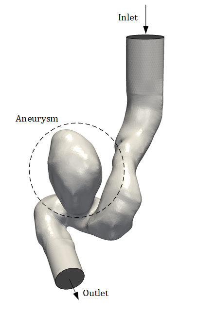
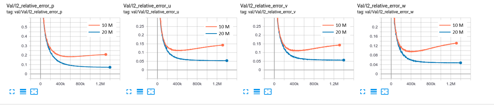
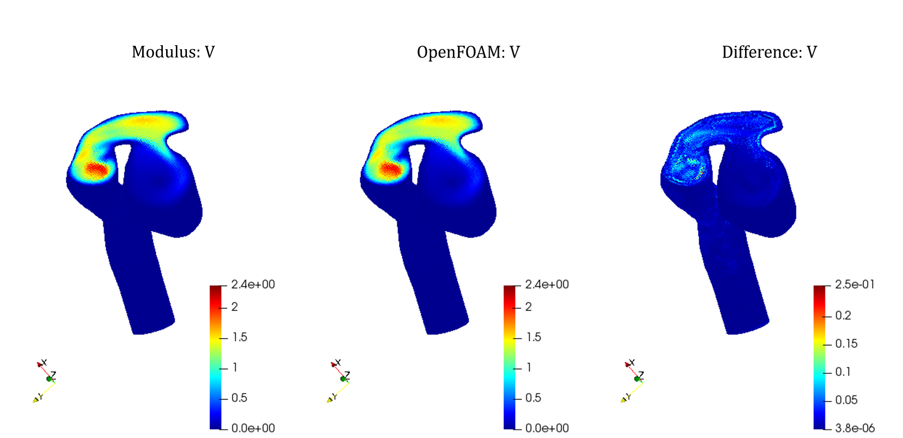
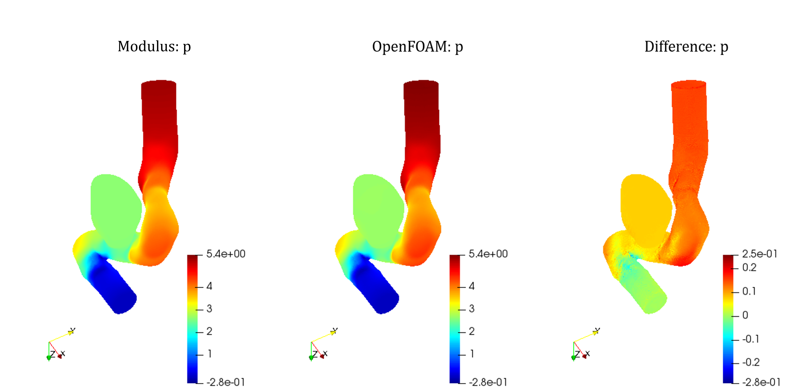
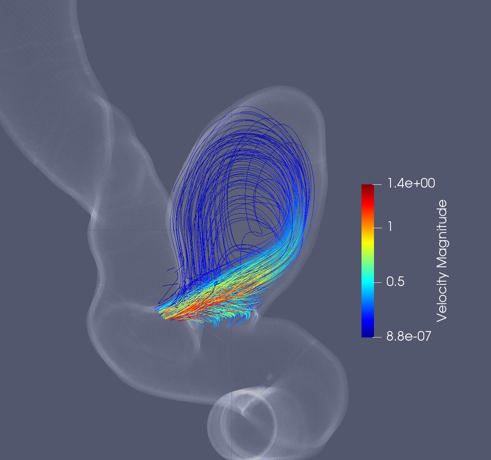
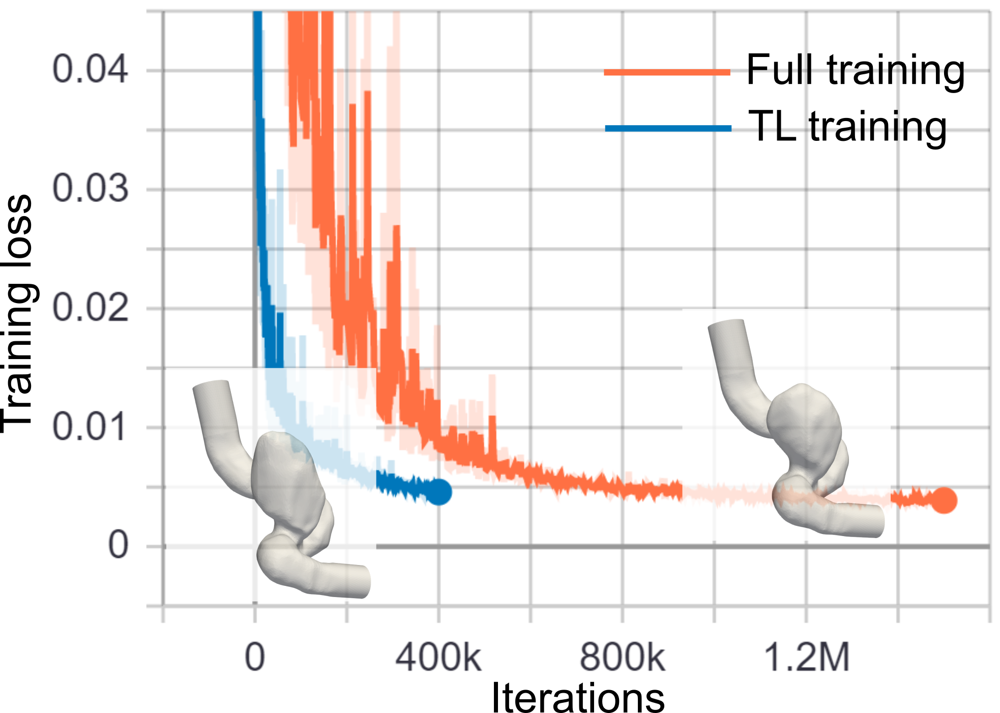

# STL Geometry: Blood Flow in Intracranial Aneurysm

[公式ページ](https://docs.nvidia.com/deeplearning/modulus/modulus-sym/user_guide/intermediate/adding_stl_files.html)

## Introduction

このチュートリアルでは、複雑なジオメトリのSTLファイルをインポートし、Modulus SymのSDFライブラリを使用して表面およびSTLの内部の点をサンプリングし、PINNをトレーニングしてこの複雑なジオメトリ内の流れを予測します。このチュートリアルでは、以下のことを学びます：

1. Modulus SymでSTLファイルをインポートし、ジオメトリの内部および表面の点をサンプリングする方法。



Fig. 108 Aneurysm  STL file

Note :
このチュートリアルでは、チュートリアル:ref:入門的な例を完了し、Modulus Sym APIの基本を理解していることを前提としています。さらに、このチュートリアルで説明されているモジュールを使用するには、システムがSDFライブラリの要件 (:ref:システム要件) を満たしていることを確認してください。

内部のサンプリングが機能するようにするには、STLジオメトリが水密であることを確認してください。この要件は、表面上の点のサンプリングには必要ありません。

この問題のすべてのPythonスクリプトは、examples/aneurysm/で見つけることができます。

## Problem Description

このシミュレーションでは、動脈瘤の壁に対してノースリップ境界条件が使用されます。つまり、$u,v,w=0$です。流入口では、ピーク速度が1.5の正規方向に流れるパラボリックな流れが使用されます。出口では圧力条件が$0$であり、流体の運動粘度は$0.025$、密度は定数の$1.0$です。

## Case Setup

このチュートリアルでは、Modulus SymのTessellationモジュールを使用して、STLジオメトリを使用して点をサンプリングします。このモジュールは、Modulus Symのジオメトリモジュールと同様に機能します。つまり、PointwiseInteriorConstraintおよびPointwiseBoundaryConstraintを使用して、ジオメトリの内部と境界に点をサンプリングし、適切な制約を定義できます。ジオメトリの各境界ごとに個別のSTLファイルが必要であり、また、ジオメトリの内部で点をサンプリングするための別の水密ジオメトリも必要です。

## Importing the required packages

必要なパッケージのリストは以下の通りです。Modulus SymのTessellationモジュールをインポートして、STLジオメトリ上のサンプル点を取得します。

``` python
import os
import warnings

import torch
import numpy as np
from sympy import Symbol, sqrt, Max

import modulus.sym
from modulus.sym.hydra import to_absolute_path, instantiate_arch, ModulusConfig
from modulus.sym.solver import Solver
from modulus.sym.domain import Domain
from modulus.sym.domain.constraint import (
    PointwiseBoundaryConstraint,
    PointwiseInteriorConstraint,
    IntegralBoundaryConstraint,
)
from modulus.sym.domain.validator import PointwiseValidator
from modulus.sym.domain.monitor import PointwiseMonitor
from modulus.sym.key import Key
from modulus.sym.eq.pdes.navier_stokes import NavierStokes
from modulus.sym.eq.pdes.basic import NormalDotVec
from modulus.sym.utils.io import csv_to_dict
from modulus.sym.geometry.tessellation import Tessellation
```

## Using STL files to generate point clouds

Tessellation.from_stl() 関数を使用してSTLジオメトリをインポートします。この関数は、STLジオメトリのパスを入力として受け取ります。オープンサーフェス（たとえば、境界のSTLファイル）に対しては、属性 airtight の値を False として指定する必要があります。

その後、これらのメッシュオブジェクトを使用して、PointwiseBoundaryConstraint または PointwiseInteriorConstraint を使用して、チュートリアル:ref:入門的な例と同様の境界または内部の制約を作成できます。

Note :
このチュートリアルでは、ジオメトリをスケーリングして原点（0, 0, 0）を中心に配置して正規化することができます。これにより、トレーニングプロセスを高速化することができます。

以下に、STLジオメトリを使用してサンプリングし、これらの関数や境界条件を定義するためのコードが示されています。

``` python
point_path = to_absolute_path("./stl_files")
    inlet_mesh = Tessellation.from_stl(
        point_path + "/aneurysm_inlet.stl", airtight=False
    )
    outlet_mesh = Tessellation.from_stl(
        point_path + "/aneurysm_outlet.stl", airtight=False
    )
    noslip_mesh = Tessellation.from_stl(
        point_path + "/aneurysm_noslip.stl", airtight=False
    )
    integral_mesh = Tessellation.from_stl(
        point_path + "/aneurysm_integral.stl", airtight=False
    )
    interior_mesh = Tessellation.from_stl(
        point_path + "/aneurysm_closed.stl", airtight=True
    )

    # params
    nu = 0.025
    inlet_vel = 1.5

    # inlet velocity profile
    def circular_parabola(x, y, z, center, normal, radius, max_vel):
        centered_x = x - center[0]
        centered_y = y - center[1]
        centered_z = z - center[2]
        distance = sqrt(centered_x**2 + centered_y**2 + centered_z**2)
        parabola = max_vel * Max((1 - (distance / radius) ** 2), 0)
        return normal[0] * parabola, normal[1] * parabola, normal[2] * parabola

    # normalize meshes
    def normalize_mesh(mesh, center, scale):
        mesh = mesh.translate([-c for c in center])
        mesh = mesh.scale(scale)
        return mesh

    # normalize invars
    def normalize_invar(invar, center, scale, dims=2):
        invar["x"] -= center[0]
        invar["y"] -= center[1]
        invar["z"] -= center[2]
        invar["x"] *= scale
        invar["y"] *= scale
        invar["z"] *= scale
        if "area" in invar.keys():
            invar["area"] *= scale**dims
        return invar

    # scale and normalize mesh and openfoam data
    center = (-18.40381048596882, -50.285383353981196, 12.848136936899031)
    scale = 0.4
    inlet_mesh = normalize_mesh(inlet_mesh, center, scale)
    outlet_mesh = normalize_mesh(outlet_mesh, center, scale)
    noslip_mesh = normalize_mesh(noslip_mesh, center, scale)
    integral_mesh = normalize_mesh(integral_mesh, center, scale)
    interior_mesh = normalize_mesh(interior_mesh, center, scale)
```

## Defining the Equations, Networks and Nodes

このプロセスは他のチュートリアルと類似しています。この問題では、層流流れのみを解くため、NavierStokesとNormalDotVec方程式のみを使用し、チュートリアル:ref:入門的な例と類似したネットワークを定義できます。ネットワークと必要なノードを生成するコードは以下の通りです。

``` python
# make list of nodes to unroll graph on
    ns = NavierStokes(nu=nu * scale, rho=1.0, dim=3, time=False)
    normal_dot_vel = NormalDotVec(["u", "v", "w"])
    flow_net = instantiate_arch(
        input_keys=[Key("x"), Key("y"), Key("z")],
        output_keys=[Key("u"), Key("v"), Key("w"), Key("p")],
        cfg=cfg.arch.fully_connected,
    )
    nodes = (
        ns.make_nodes()
        + normal_dot_vel.make_nodes()
        + [flow_net.make_node(name="flow_network")]
    )
```

## Setting up Domain and adding Constraints

定義されたすべてのノードとジオメトリ要素を使用して、PointwiseBoundaryConstraint または PointwiseInteriorConstraint を使用して、チュートリアル:ref:入門的な例と同様の境界または内部の制約を作成できます。

``` python
# make aneurysm domain
    domain = Domain()
    # add constraints to solver
    # inlet
    u, v, w = circular_parabola(
        Symbol("x"),
        Symbol("y"),
        Symbol("z"),
        center=inlet_center,
        normal=inlet_normal,
        radius=inlet_radius,
        max_vel=inlet_vel,
    )
    inlet = PointwiseBoundaryConstraint(
        nodes=nodes,
        geometry=inlet_mesh,
        outvar={"u": u, "v": v, "w": w},
        batch_size=cfg.batch_size.inlet,
    )
    domain.add_constraint(inlet, "inlet")

    # outlet
    outlet = PointwiseBoundaryConstraint(
        nodes=nodes,
        geometry=outlet_mesh,
        outvar={"p": 0},
        batch_size=cfg.batch_size.outlet,
    )
    domain.add_constraint(outlet, "outlet")

    # no slip
    no_slip = PointwiseBoundaryConstraint(
        nodes=nodes,
        geometry=noslip_mesh,
        outvar={"u": 0, "v": 0, "w": 0},
        batch_size=cfg.batch_size.no_slip,
    )
    domain.add_constraint(no_slip, "no_slip")

    # interior
    interior = PointwiseInteriorConstraint(
        nodes=nodes,
        geometry=interior_mesh,
        outvar={"continuity": 0, "momentum_x": 0, "momentum_y": 0, "momentum_z": 0},
        batch_size=cfg.batch_size.interior,
    )
    domain.add_constraint(interior, "interior")

    # Integral Continuity 1
    integral_continuity = IntegralBoundaryConstraint(
        nodes=nodes,
        geometry=outlet_mesh,
        outvar={"normal_dot_vel": 2.540},
        batch_size=1,
        integral_batch_size=cfg.batch_size.integral_continuity,
        lambda_weighting={"normal_dot_vel": 0.1},
    )
    domain.add_constraint(integral_continuity, "integral_continuity_1")

    # Integral Continuity 2
    integral_continuity = IntegralBoundaryConstraint(
        nodes=nodes,
        geometry=integral_mesh,
        outvar={"normal_dot_vel": -2.540},
        batch_size=1,
        integral_batch_size=cfg.batch_size.integral_continuity,
        lambda_weighting={"normal_dot_vel": 0.1},
    )
    domain.add_constraint(integral_continuity, "integral_continuity_1")
```

## Adding Validators and Monitors

検証データとモニターを追加するプロセスは以前のチュートリアルと類似しています。この例では、OpenFOAMからのシミュレーションを使用して、Modulus Symの結果を検証します。また、動脈瘤を横断する圧力降下のモニターを作成し、収束をモニターし、OpenFOAMデータと比較できます。これらのドメインを生成するコードは以下に示されています。

``` python
# add validation data
    file_path = "./openfoam/aneurysm_parabolicInlet_sol0.csv"
    if os.path.exists(to_absolute_path(file_path)):
        mapping = {
            "Points:0": "x",
            "Points:1": "y",
            "Points:2": "z",
            "U:0": "u",
            "U:1": "v",
            "U:2": "w",
            "p": "p",
        }
        openfoam_var = csv_to_dict(to_absolute_path(file_path), mapping)
        openfoam_invar = {
            key: value for key, value in openfoam_var.items() if key in ["x", "y", "z"]
        }
        openfoam_invar = normalize_invar(openfoam_invar, center, scale, dims=3)
        openfoam_outvar = {
            key: value
            for key, value in openfoam_var.items()
            if key in ["u", "v", "w", "p"]
        }
        openfoam_validator = PointwiseValidator(
            nodes=nodes,
            invar=openfoam_invar,
            true_outvar=openfoam_outvar,
            batch_size=4096,
        )
        domain.add_validator(openfoam_validator)
    else:
        warnings.warn(
            f"Directory{file_path}does not exist. Will skip adding validators. Please download the additional files from NGC https://catalog.ngc.nvidia.com/orgs/nvidia/teams/modulus/resources/modulus_sym_examples_supplemental_materials"
        )

    # add pressure monitor
    pressure_monitor = PointwiseMonitor(
        inlet_mesh.sample_boundary(16),
        output_names=["p"],
        metrics={"pressure_drop": lambda var: torch.mean(var["p"])},
        nodes=nodes,
    )
    domain.add_monitor(pressure_monitor)
```

## Training the model

Pythonファイルがセットアップされたら、Pythonスクリプトを実行して簡単にトレーニングを開始できます。

``` bash
python aneurysm.py
```

## Results and Post-processing

このチュートリアルでは、PINNsにおけるトレーニングデータの過適合の例を示すために使用します。:numref:fig-aneurysm_errors は、2つの異なるポイント密度で達成された検証エラープロットの比較を示しています。10 Mポイントを使用した場合、初期収束が示され、トレーニングエラーが低下している間も後に発散します。これは、ネットワークがサンプリングされたポイントに過度に適合している一方で、その間の流れの精度を犠牲にしていることを意味します。ポイントを20 Mに増やすと、その問題が解決され、フロー場がより良い解像度で一般化されます。



Fig. 109 Convergence  plots for different point density

:numref:fig-aneurysm-p は、動脈瘤および静脈内で発生する圧力を示しています。:numref:fig-aneurysm-v の断面図は、動脈瘤内の速度の分布を示しています。この問題の主な課題の1つは、動脈瘤嚢内および流線図の開発を得ることです。:numref:fig-aneurysm-streamの流線図は、Modulus Symが内部の流れ場を成功裏に捉えていることを示しています。



Fig. 110 Cross-sectional  view aneurysm showing velocity magnitude. Left: Modulus Sym. Center: OpenFOAM. Right: Difference



Fig. 111 Pressure  across aneurysm. Left: Modulus Sym. Center: OpenFOAM. Right: Difference



Fig. 112 Flow streamlines inside the aneurysm generated from Modulus Sym simulation.

## Accelerating the Training of Neural Network Solvers via Transfer Learning

科学や工学のさまざまなアプリケーションでは、異なる患者固有モデルでの血液流れのシミュレーションなど、繰り返しのシミュレーションが必要です。従来のソルバーは、これらのモデルを独立してかつゼロからシミュレートします。モデルジオメトリのわずかな変更（例えば、患者固有の医用画像セグメンテーションの調整）でさえ、新しいシミュレーションが必要になります。興味深いことに、従来のソルバーとは異なり、ニューラルネットワークソルバーは転移学習を介して異なるニューラルネットワークモデル間で知識を転送することができます。転移学習では、物理システムのために（ソース）トレーニングされたニューラルネットワークモデルが、わずかに異なる特性（ジオメトリの違いなど）を持つ類似の物理システムのためにトレーニングされる（ターゲット）別のニューラルネットワークモデルに知識が転送されます。ターゲットモデルのネットワークパラメータは、ソースモデルから初期化され、新しいシステム特性に対処するために再トレーニングされますが、ニューラルネットワークモデルをゼロからトレーニングする必要はありません。この知識の転送により、ニューラルネットワークソルバーの収束時間が効果的に短縮されます。例えば、:numref:fig-aneurysm_transfer_learningは、異なる嚢の形状を持つ2つの頭蓋内動脈瘤モデルのニューラルネットワークソルバーのトレーニングで転移学習の応用を示しています。



Fig. 113 Transfer  learning accelerates intracranial aneurysm simulations. Results are for two intracranial aneurysms with different sac shapes.

Modulus Symで転移学習を使用するには、設定で'initialize_network_dir'をソースモデルのネットワークチェックポイントに設定します。また、転移学習では、ソースモデルをゼロからトレーニングする代わりに、比較的小さな学習率を使用し、イテレーション数を少なくし、より速い減衰率を使用します。

``` yaml
    
    defaults :
      - modulus_default
      - arch:
          - fully_connected
      - scheduler: tf_exponential_lr
      - optimizer: adam
      - loss: sum
      - _self_
    
    scheduler:
      decay_rate: 0.95
      #decay_steps: 15000 # full run
      decay_steps: 6000   # TL run
    
    network_dir : "network_checkpoint_target"
    initialization_network_dir : "../aneurysm/network_checkpoint_source/"

    training:
      rec_results_freq : 10000
      rec_constraint_freq: 50000
      #max_steps: 1500000 # full run
      max_steps: 400000   # TL run
    
    batch_size:
      inlet: 1100
      outlet: 650
      no_slip: 5200
      interior: 6000
      integral_continuity: 310
```
