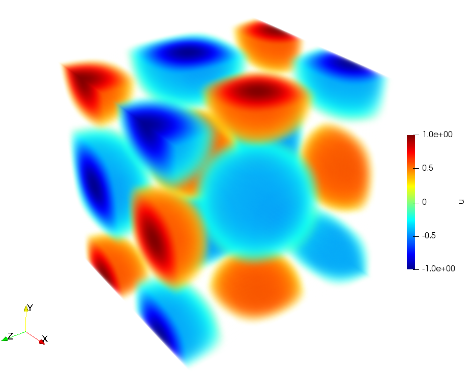
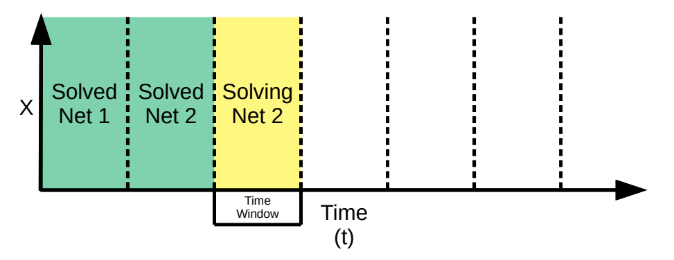
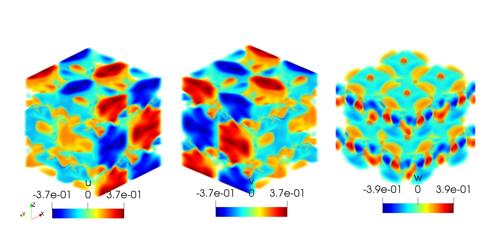
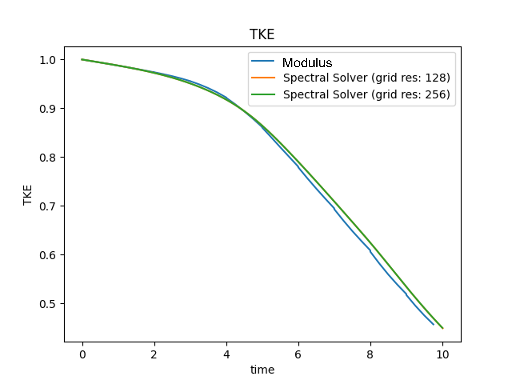

# Moving Time Window: Taylor Green Vortex Decay

[公式ページ](https://docs.nvidia.com/deeplearning/modulus/modulus-sym/user_guide/intermediate/moving_time_window.html)

## Introduction

過去のチュートリアルのいくつかは、継続時間アプローチを用いて瞬時の問題を解決する方法を示してきました。このチュートリアルでは、複雑な瞬時のナビエ・ストークス問題を解決するための移動時間ウィンドウアプローチを紹介します。このチュートリアルでは、以下のことを学びます：

1. Modulus Symで問題/領域のシーケンスを解決する方法
2. 周期境界条件を設定する方法

Note :
このチュートリアルでは、:ref:transientのチュートリアルを完了していることを前提としています。

## Problem Description

チュートリアルで言及されているように、連続時間の方法だけを用いて瞬時のシミュレーションを解くことは、長時間の期間にわたって難しいことがあります。このチュートリアルでは、移動時間ウィンドウを使用することでこれを克服する方法を示します。例題として取り上げるのは、レイノルズ数500の3次元テイラー・グリーン渦減衰です。テイラー・グリーン渦問題は、ソルバーを比較するためのベンチマークとしてよく使われ、この場合、検証データはスペクトルソルバーを用いて生成されます。領域は、すべての側面に周期境界条件がある長さ$2\pi$の立方体です。使用する初期条件は、

$$
\begin{aligned}
u(x,y,z,0) &= sin(x)cos(y)cos(z) \\
v(x,y,z,0) &= -cos(x)sin(y)cos(z) \\
w(x,y,z,0) &= 0 \\
p(x,y,z,0) &= \frac{1}{16} (cos(2x) + cos(2y))(cos(2z) + 2) \\\end{aligned}
$$

この問題では、密度が$1$、粘度が$0.002$の非圧縮性ナビエ・ストークス方程式を時間依存性で解くことを示しています。すべての側面に周期境界があるため、境界条件は必要ありません。



Fig. 114 Taylor-Green vortex initial conditions.

移動時間ウィンドウアプローチは、シミュレーションを進めるために小さな時間ウィンドウを反復的に解くことによって機能します。時間ウィンドウは、前のウィンドウを新しい初期条件として使用します。特定のウィンドウ内での解法には連続時間法が使用されます。この方法の図は、仮想の1次元の問題について:numref:fig-moving_time_windowに示されています。学習率の減衰は、各時間ウィンドウ後に再開されます。同様のアプローチは、[#wight2020solving]で見つけることができます。



Fig. 115 Moving Time Window Method

## Case Setup

この問題のケース設定は、以前の多くのチュートリアルと似ていますが、2つの主要な違いがあります。この例では、反復的に解くための一連の領域を設定する方法を示しています。

Note :
この問題のPythonスクリプトは、examples/taylor_green/にあります。

## Sequence of Train Domains

まず、以前の問題と同様にジオメトリを構築します。

また、時間ウィンドウの大きさを定義します。この場合、$1$単位の時間まで解き、その後すべての必要なノードを構築します。

```python
# make geometry for problem
    channel_length = (0.0, 2 * np.pi)
    channel_width = (0.0, 2 * np.pi)
    channel_height = (0.0, 2 * np.pi)
    box_bounds = {x: channel_length, y: channel_width, z: channel_height}

    # define geometry
    rec = Box(
        (channel_length[0], channel_width[0], channel_height[0]),
        (channel_length[1], channel_width[1], channel_height[1]),
    )
```

以下のようにアーキテクチャを作成できます。

```python
# make network for current step and previous step
    flow_net = FullyConnectedArch(
        input_keys=[Key("x"), Key("y"), Key("z"), Key("t")],
        output_keys=[Key("u"), Key("v"), Key("w"), Key("p")],
        periodicity={"x": channel_length, "y": channel_width, "z": channel_height},
        layer_size=256,
    )
    time_window_net = MovingTimeWindowArch(flow_net, time_window_size)

    # make nodes to unroll graph on
    nodes = ns.make_nodes() + [time_window_net.make_node(name="time_window_network")]
```

注意してください。周期性は、ネットワークアーキテクチャを作成する際に設定されます。これにより、ネットワークは構築時に指定された境界で周期的な解を与えるように強制されます。今、2つの領域が定義されています。1つは初期条件用であり、もう1つは将来のすべての時間ウィンドウで使用されます。

```python
# make initial condition domain
    ic_domain = Domain("initial_conditions")

    # make moving window domain
    window_domain = Domain("window")

    # make initial condition
    ic = PointwiseInteriorConstraint(
        nodes=nodes,
        geometry=rec,
        outvar={
            "u": sin(x) * cos(y) * cos(z),
            "v": -cos(x) * sin(y) * cos(z),
            "w": 0,
            "p": 1.0 / 16 * (cos(2 * x) + cos(2 * y)) * (cos(2 * z) + 2),
        },
        batch_size=cfg.batch_size.initial_condition,
        bounds=box_bounds,
        lambda_weighting={"u": 100, "v": 100, "w": 100, "p": 100},
        parameterization={t_symbol: 0},
    )
    ic_domain.add_constraint(ic, name="ic")

    # make constraint for matching previous windows initial condition
    ic = PointwiseInteriorConstraint(
        nodes=nodes,
        geometry=rec,
        outvar={"u_prev_step_diff": 0, "v_prev_step_diff": 0, "w_prev_step_diff": 0},
        batch_size=cfg.batch_size.interior,
        bounds=box_bounds,
        lambda_weighting={
            "u_prev_step_diff": 100,
            "v_prev_step_diff": 100,
            "w_prev_step_diff": 100,
        },
        parameterization={t_symbol: 0},
    )
    window_domain.add_constraint(ic, name="ic")

    # make interior constraint
    interior = PointwiseInteriorConstraint(
        nodes=nodes,
        geometry=rec,
        outvar={"continuity": 0, "momentum_x": 0, "momentum_y": 0, "momentum_z": 0},
        bounds=box_bounds,
        batch_size=4094,
        parameterization=time_range,
    )
    ic_domain.add_constraint(interior, name="interior")
    window_domain.add_constraint(interior, name="interior")

    # add inference data for time slices
    for i, specific_time in enumerate(np.linspace(0, time_window_size, 10)):
        vtk_obj = VTKUniformGrid(
            bounds=[(0, 2 * np.pi), (0, 2 * np.pi), (0, 2 * np.pi)],
            npoints=[128, 128, 128],
            export_map={"u": ["u", "v", "w"], "p": ["p"]},
        )
        grid_inference = PointVTKInferencer(
            vtk_obj=vtk_obj,
            nodes=nodes,
            input_vtk_map={"x": "x", "y": "y", "z": "z"},
            output_names=["u", "v", "w", "p"],
            requires_grad=False,
            invar={"t": np.full([128**3, 1], specific_time)},
            batch_size=100000,
        )
        ic_domain.add_inferencer(grid_inference, name="time_slice_" + str(i).zfill(4))
        window_domain.add_inferencer(
            grid_inference, name="time_slice_" + str(i).zfill(4)
        )
```

In the moving time window domain there is a new initial condition that will come from
the previous time window. Now that the domain files have been constructed for the initial conditions and future time windows You can put it all together and make your sequential solver.

## Sequence Solver

```python
# make solver
    slv = SequentialSolver(
        cfg,
        [(1, ic_domain), (nr_time_windows, window_domain)],
        custom_update_operation=time_window_net.move_window,
    )

    # start solver
    slv.solve()
```

通常の```Solver```クラスの代わりに、```SequentialSolver```クラスを使用します。このクラスは、各要素が解決回数と指定されたドメインのタプルであるリストを受け取ります。この場合、初期条件ドメインを1回解決し、その後、時間ウィンドウドメインを複数回解決します。```custom_update_operation```が提供されており、これは各反復後に呼び出され、この場合はネットワークパラメータを更新するために使用されます。

ここでは、反復的なドメインを非常に一般的な方法で解決しています。後の章では、この構造を使用して、共役熱伝達問題を解決するための複雑な反復アルゴリズムを実装します。

## Results and Post-processing

この問題を解決した後、結果を可視化できます。ネットワークディレクトリを見ると、次のようなファイルがあります。

```current_step.txt initial_conditions window_0000 window_0001...```

これらのディレクトリのいずれかを見ると、ネットワークのチェックポイントと結果を保存する典型的なファイルが見つかります。時間15でのプロットはスナップショット:numref:fig-taylor_green_initial_conditionsを提供します。シミュレーションの検証のために、結果はスペクトルソルバーの結果と比較されます。瞬時シミュレーションの点ごとの誤差を比較することは誤解を招く可能性があります。なぜなら、これはカオス的な力学系であり、わずかな誤差でもすぐに大きな違いを生じさせるからです。代わりに、シミュレーションの平均乱流運動エネルギーの減衰（TKE）を見ることができます。これに関する図は以下に示されています。



Fig. 116 Taylor-Green vortex at time $15.0$.



Fig. 117 Taylor-Green Turbulent kinetic energy decay.

## Reference

.. rubric:: References

.. [#wight2020solving] Colby L Wight and Jia Zhao. Solving allen-cahn and cahn-hilliard equations using the adaptive physics informed neural networks. arXiv preprint arXiv:2007.04542, 2020.
