# Electromagnetics: Frequency Domain Maxwell's Equation

[公式ページ](https://docs.nvidia.com/deeplearning/modulus/modulus-sym/user_guide/intermediate/em.html)

# Introduction

このチュートリアルでは、Modulus Symを使用して電磁(EM)シミュレーションを行う方法を示します。現在、Modulus Symは以下のような周波数領域のEMシミュレーション機能を提供しています：

1. スカラー形式での周波数領域のマクスウェル方程式。これはヘルムホルツ方程式と同じです。(1次元、2次元、3次元で利用可能です。現在は実数形式のみ利用可能です。)

2. ベクトル形式での周波数領域のマクスウェル方程式。(3次元の場合に利用可能で、現在は実数形式のみ利用可能です。)

3. 2次元および3次元の完全電子導体(PEC)境界条件。

4. 放射境界条件(または吸収境界条件)、3次元の場合。

5. 2次元導波管ソースの1次元導波管ポートソルバー。

このチュートリアルでは、:ref:Introductory Exampleのチュートリアルを完了し、Modulus SymのAPIに精通していることを前提としています。

このチュートリアルで参照されるすべてのスクリプトは、「examples/waveguide/」にあります。

Note :
このチュートリアルでは、:ref:Introductory Exampleのチュートリアルを完了し、Modulus SymのAPIに精通していることを前提としています。

このチュートリアルで参照されるすべてのスクリプトは、「examples/waveguide/」にあります。

# Problem 1: 2D Waveguide Cavity

以下に示すように、2次元の領域$\Omega=[0, 2]\times [0, 2]$を考えます。全領域が真空です。相対誘電率は$\epsilon_r = 1$とします。左境界は導波管ポートであり、右境界は吸収境界（またはABC）です。上部と下部はPECです。

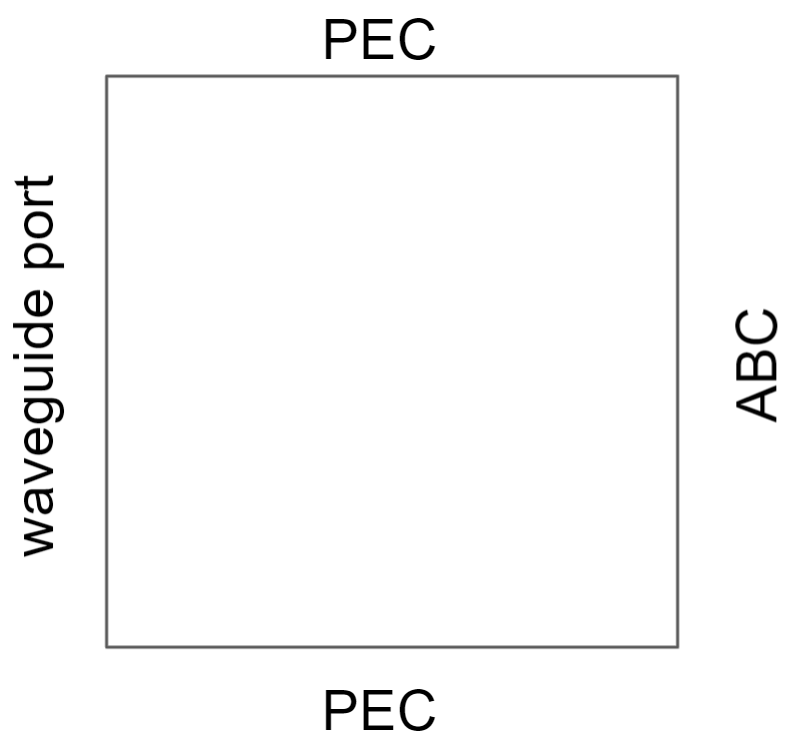

Fig. 118 Domain of 2D waveguide

この例では、導波管問題は横磁気（$TM_z$）モードで解かれるため、未知変数は$E_z(x,y)$です。$\Omega$内の支配方程式は以下の通りです。

$$
\Delta E_z(x,y) + k^2E_z(x,y) = 0
$$

ここで、$k$は波数です。2次元のスカラー場合、PECとABCはそれぞれ以下のように単純化されます。

$$
E_z(x,y)=0\text{ on top and bottom boundaries, }\frac{\partial E_z}{\partial y}=0\text{ on right boundary.}
$$

## Case Setup

このサブセクションでは、Modulus Symを使用してEMソルバーを設定する方法を示します。前のチュートリアルと同様に、まず必要なライブラリをインポートします。

```python

```

次に、sympyの記号計算用の変数とジオメトリのパラメータを定義します。また、Modulus Symのメインクラスを定義する前に、導波管ソルバーの固有モードを計算する必要があります。材料が均一（真空）であるため、固有モードの閉形式は$\sin(\frac{k\pi y}{L})$の形を取ります。ここで、$L$はポートの長さであり、$k = 1, 2,\cdots$です。その後、sympy関数を使用して導波管ポートを直接定義します。ジオメトリと固有モードの計算のコードは以下にあります。

```python

```

For wave simulation, since the result is always periodic, Fourier
feature will be greatly helpful for the convergence and accuracy. The
frequency of the Fourier feature can be implied by the wavenumber. This
block of code shows the solver setup.
Also, define the normal gradient for the boundary conditions. Finally, make the domain for training.

```python

```

今、PDEおよび境界条件の制約を定義します。境界条件は上記の説明に基づいて定義されます。内部領域では、PDEの重みは1.0/wave_number**2です。これは、波数が大きい場合、PDEの損失が最初に非常に大きくなり、トレーニングが破損する可能性があるためです。この重み付け方法を使用すると、この現象を排除できます。

```python

```

結果を検証するために、以下の検証領域のcsvファイルをインポートできます。

```python

```

インファレンサーが実装され、結果をプロットすることができます。

```python

```

## Results

この例の完全なコードは、「examples/waveguide/cavity_2D/waveguide2D_TMz.py」にあります。波数が$32$のシミュレーションです。商用ソルバーからの解、Modulus Symの予測、およびその差分を以下に示します。

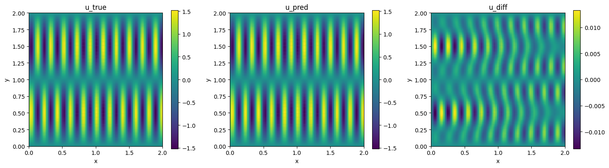

Fig. 119 ModSym, wavenumber=\ $32$

## Problem 2: 2D Dielectric slab waveguide

このセクションでは、2次元導波路シミュレーションを誘電体スラブと共に使用する方法を示します。問題のセットアップは、以前とほぼ同じですが、ドメインの中央に水平な誘電体スラブがあります。以下に、ドメインが示されています。


Fig. 120 Domain of 2D Dielectric slab waveguide

誘電体中では、相対誘電率を$\epsilon_r=2$に設定します。つまり、

$$
\epsilon_r = 
\begin{cases}
2   & \text{ in dielectric slab,}\\
1   & \text{ otherwise.}
\end{cases}
$$

他のすべての設定は前の例と同じままです。

## Case setup

ここでは、簡単のため、前の例と異なる部分のコードのみを示します。主な違いは空間に依存した誘電率です。まず、左境界での固有関数を計算します。

```python

```

ジオメトリ部分では、スラブと対応する誘電率関数を定義する必要があります。eps_sympyには平方根がありますが、HelmholtzEquationでは、波数が二乗されるためです。次に、誘電率関数に基づいて、固有値ソルバーを使用して数値的な導波管ポートを取得します。

```python

```

PDEおよびニューラルネットワークの構造の定義では、HelmholtzEquationのkを波数と誘電率関数の積として設定します。また、問題に合わせてフーリエ特徴の周波数を更新します。

```python

```

今、制約を定義します。ここで唯一の違いは、左境界で、それはnumpy配列で与えられるでしょう。変更された境界条件のみを以下に示します：

```python

```

## Results

この例の完全なコードは、「examples/waveguide/slab_2D/slab_2D.py」にあります。それぞれ波数が$16$と$32$のシミュレーションを行います。結果は以下の図に示されています。

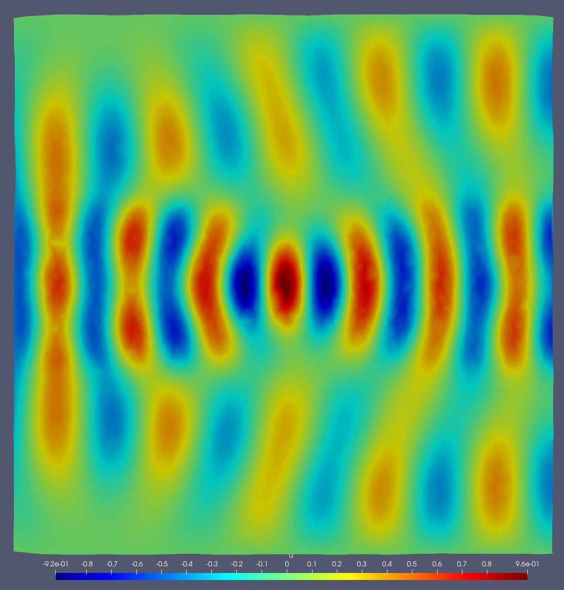

Fig. 121 Modulus Sym, wavenumber=\ $16$

## Problem 3: 3D waveguide cavity

この例では、Modulus Symで3D導波管シミュレーションを設定する方法を示しています。以前の例とは異なり、境界条件を定義するためにModulus Symで使用される機能を使用しています。ジオメトリは$\Omega = [0,2]^3$であり、以下に示されています。

## Problem setup

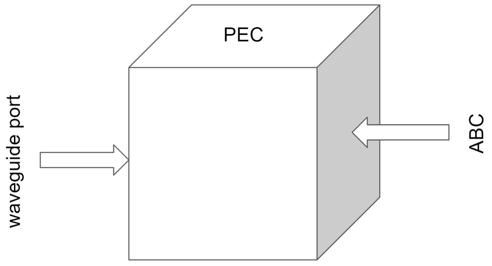

Fig. 122 3D waveguide geometry

3次元の周波数領域のマクスウェル方程式を電子場$\mathbf{E}=(E_x, E_y, E_z)$に対して解きます。

$$
\nabla\times \nabla\times \mathbf{E}+\epsilon_rk^2\mathbf{E} = 0
$$

ここで、$\epsilon_r$は誘電率であり、$k$は波数です。現時点では、Modulus Symは実数の誘電率と波数のみをサポートしています。簡単のために、透磁率を$\mu_r=1$と仮定します。前述のように、左側に導波管ポートを適用しました。右側には吸収境界条件を適用し、残りの部分にはPECを適用します。3次元の場合、実数形式の吸収境界条件は次のようになります。

$$
\mathbf{n}\times\nabla\times \mathbf{E} = 0
$$

一方、PECは

$$
\mathbf{n}\times \mathbf{E} = 0
$$

## Case setup

このセクションでは、Modulus Symを使用して3D周波数EMソルバーを設定する方法を示します。特に境界条件についてです。

まず、必要なライブラリをインポートします。

```python

```

sympyの変数、ジオメトリ、および導波管関数を定義します。

```python

```

PDEクラスとニューラルネットワークの構造を定義します。

```python

```

次に、PDEおよび境界条件の制約、およびすべての境界条件を定義します。3Dマクスウェル方程式はMaxwell_Freq_real_3Dに実装されており、PECはPEC_3Dに実装されています。吸収境界条件はSommerfeldBC_real_3Dに実装されています。これらの機能を直接使用して、対応する制約を適用できます。

```python

```

注意してください、これは3Dで行われているため、PDE、PEC、および吸収境界は3つの出力コンポーネントを持ちます。

インファレンサードメインが定義され、結果を確認します。

```python

```

## Results

この例の完全なコードは、「examples/waveguide/waveguide3D.py」にあります。波数は$32$であり、$y$と$z$に対して2番目の固有モードを使用します。3つの成分のスライスが以下に示されています。

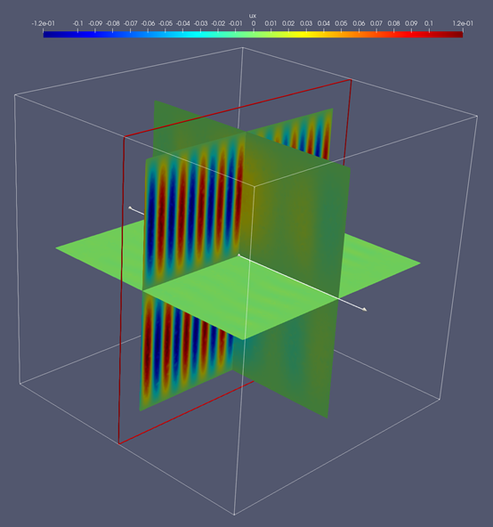

   3D waveguide, $E_x$

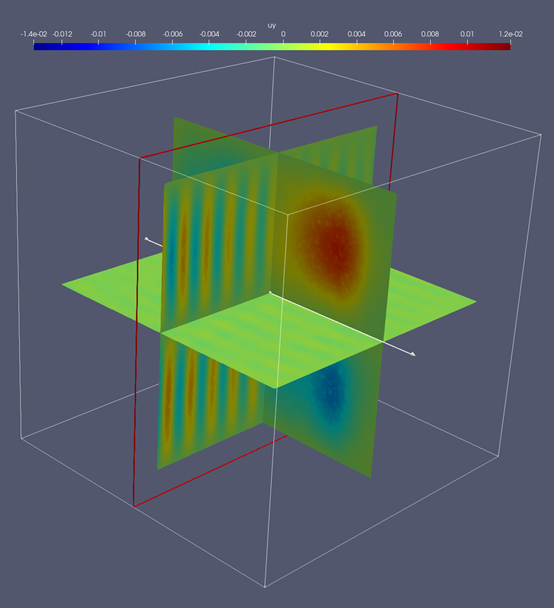
   3D waveguide, $E_y$

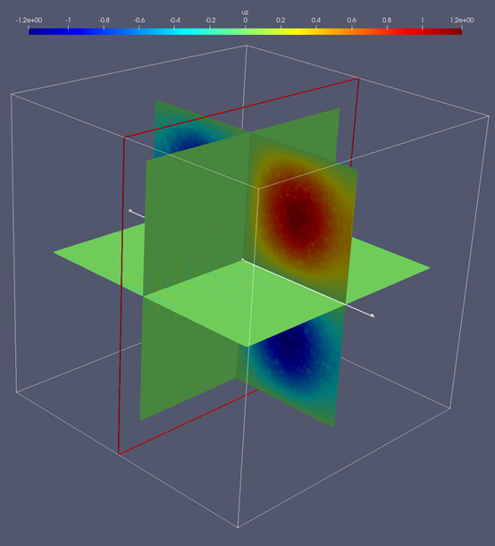
   3D waveguide, $E_z$

## Problem 4: 3D Dielectric slab waveguide

この例では、3D誘電体スラブ導波路を示しています。この場合、$y$軸に沿って中央に誘電体スラブが配置された単位立方体$[0,1]^3$を考えます。スラブの長さは$0.2$です。以下の:numref:fig-3Dslab_geoと:numref:fig-3Dslab_geo_crossは、全体のジオメトリと誘電体スラブを示す$xz$断面を示しています。

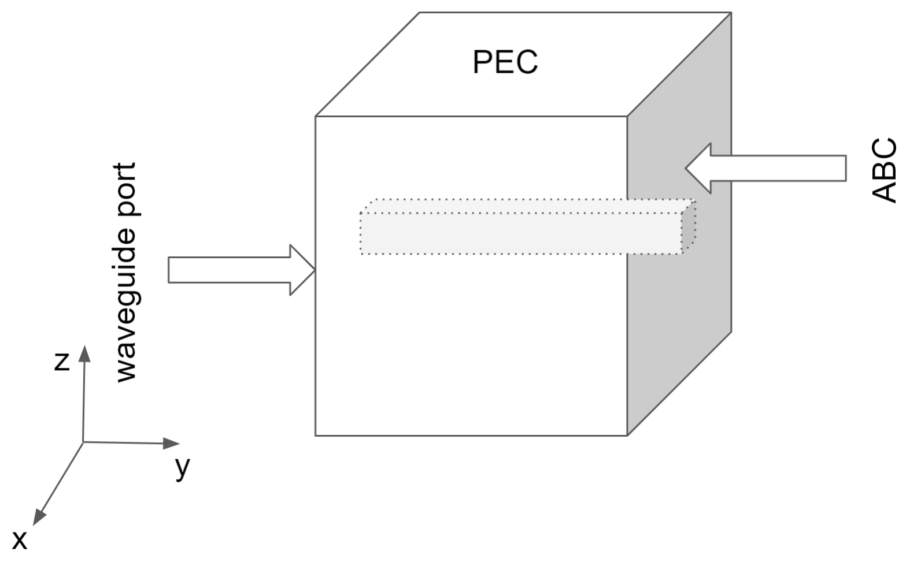

Fig. 126 Geometry for 3D dielectric slab waveguide

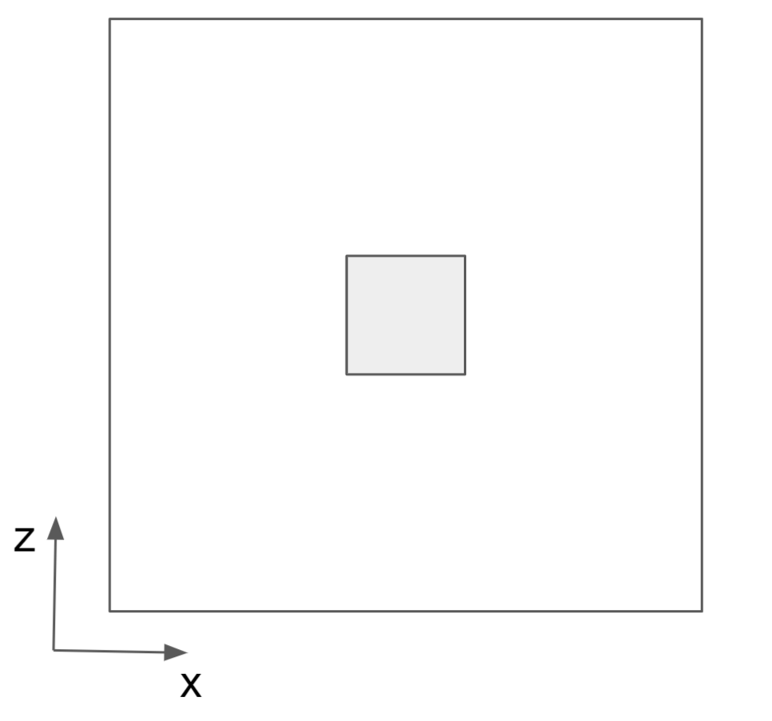

Fig. 127 $xz$ cross-sectional view

The permittivity is defined as follows

$$
\epsilon_r = 
\begin{cases}
1.5   & \text{ in dielectric slab,}\\
1   & \text{ otherwise.}
\end{cases}
$$

## Case setup

簡単のため、前回の例との違いのみをここでカバーします。このシミュレーションの主な違いは、csvファイルから導波管の結果をインポートし、それを導波管ポートの境界条件として使用する必要がある点です。

まず、ジオメトリとsympy誘電率関数を定義します。ピースワイズなsympy関数を定義するには、後者は現時点ではModulus Symでコンパイルできないため、Piecewiseの代わりにHeavisideを使用します。導波管データも、csv_to_dict()関数を使用してインポートできます。

```python

```

validation/2Dwaveguideport.csvには6つの固有モードがあります。より興味深い結果を探るために、異なるモードを試すことができます。

次に、PDEクラスとニューラルネットワークの構造を定義します。

```python

```

次に、制約を定義します。ここでは、インポートされたデータが導波管ポートの境界条件として使用されます。

```python

```

最後に、インファレンサーを定義します。これらは、ドメインのboundsを除いて前の例と同じです。

```python

```

## Results

この例の完全なコードは、「examples/waveguide/slab_3D/slab_3D.py」にあります。異なる波数のシミュレーションが行われています。以下の図は、波数が$16$の場合の結果を示しています。

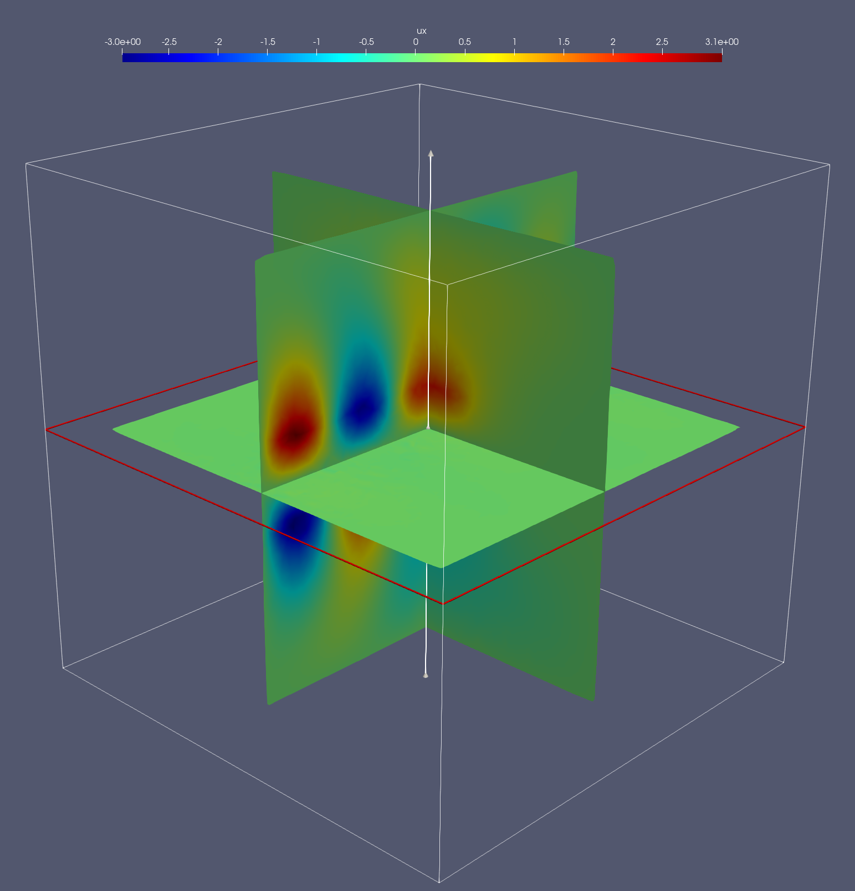

Fig. 128 3D dielectric slab, $E_x$

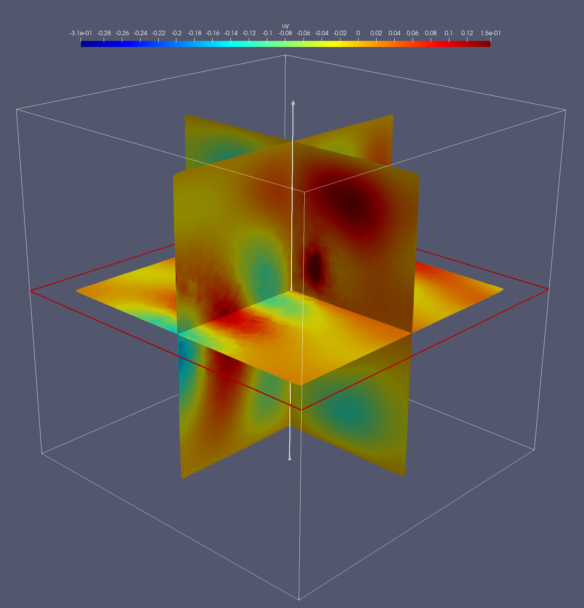

Fig. 129 3D dielectric slab, $E_y$

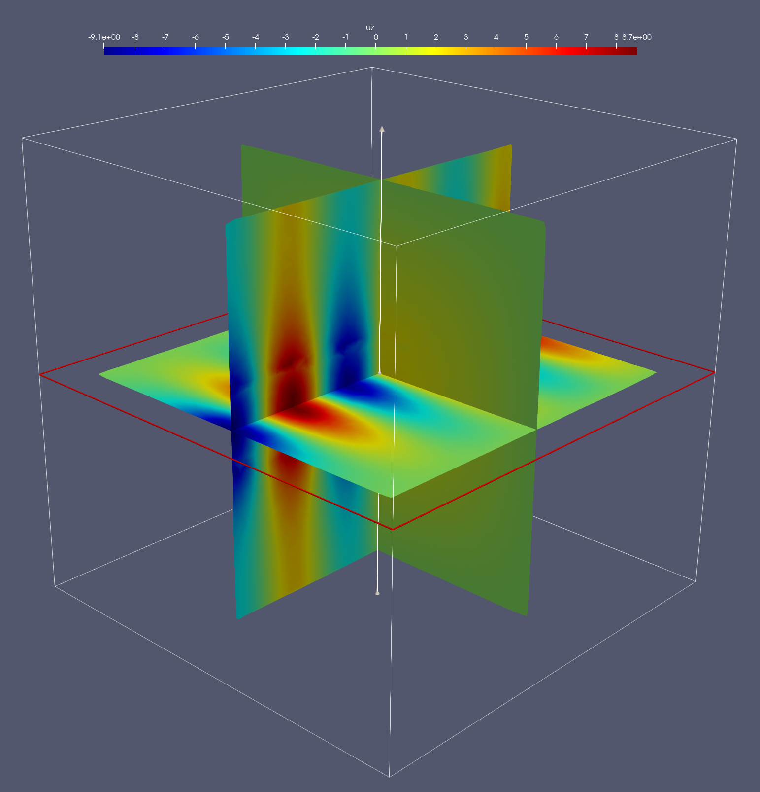

Fig. 130 3D dielectric slab, $E_z$

高い波数$32$の結果も以下に示されています。

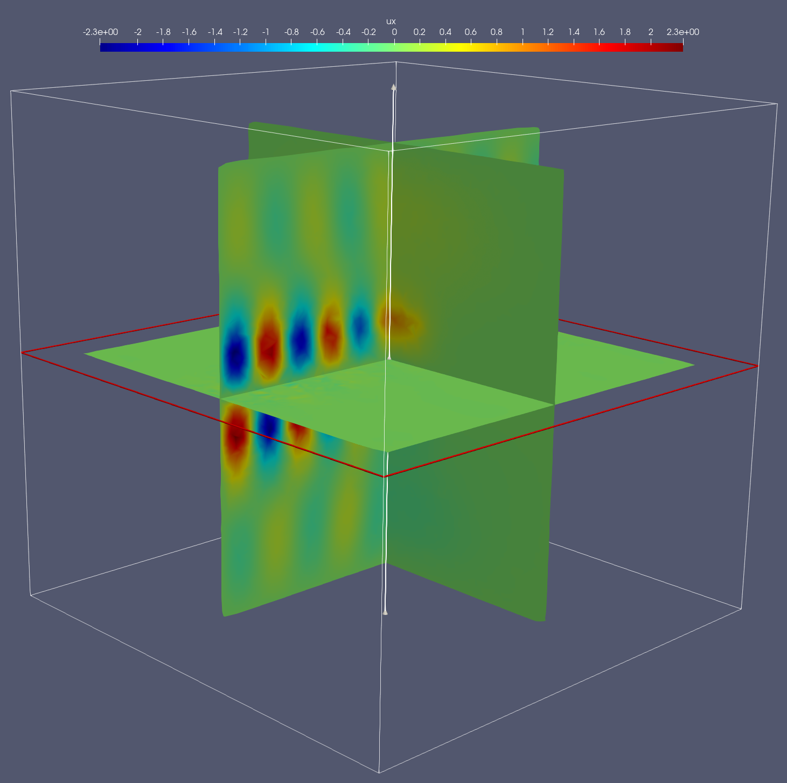

Fig. 131 3D dielectric slab, $E_x$

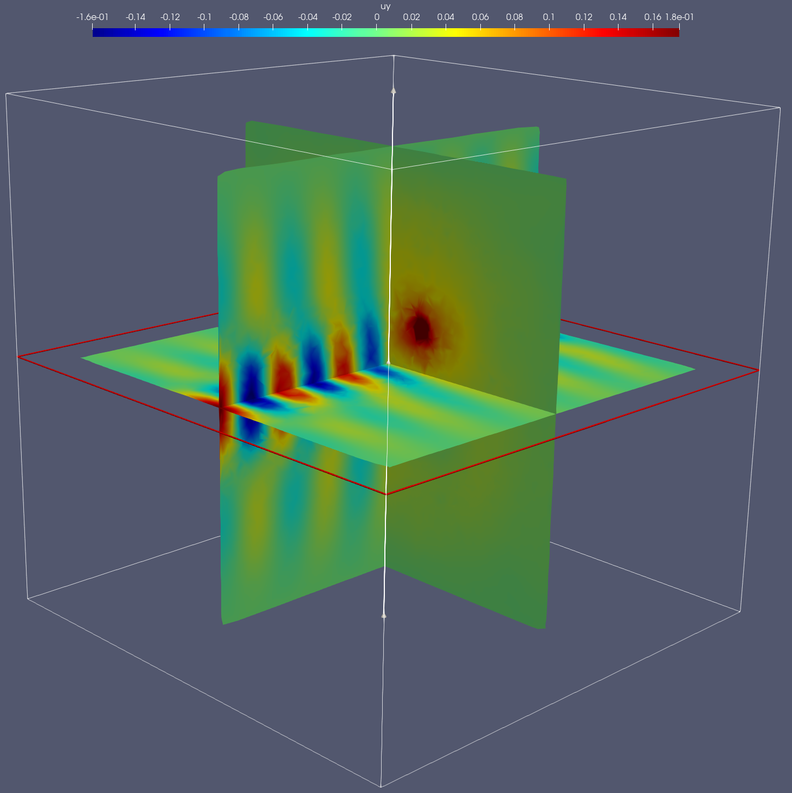

Fig. 132 3D dielectric slab, $E_y$

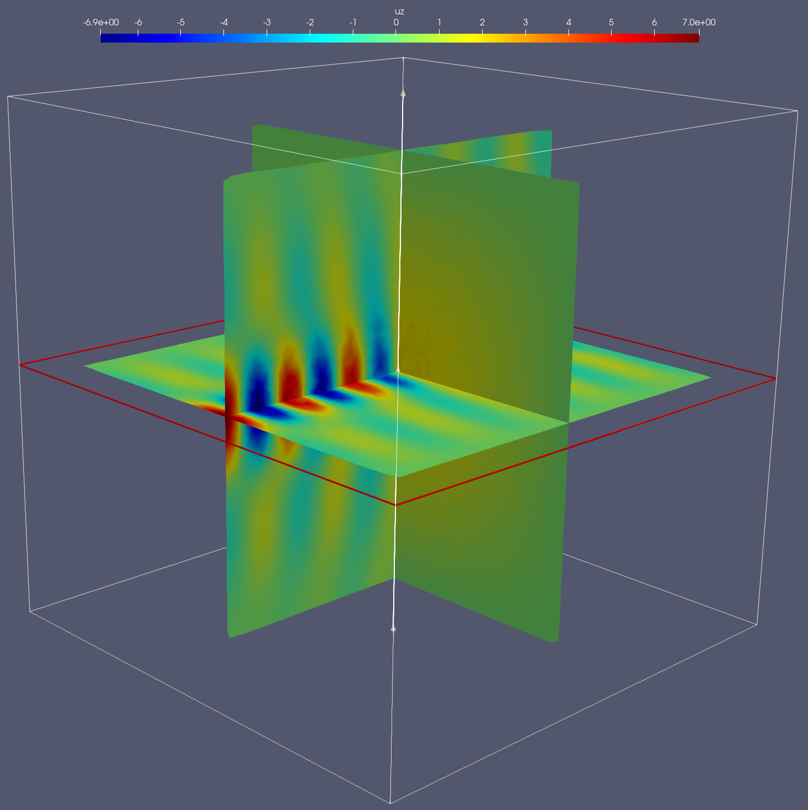

Fig. 133 3D dielectric slab, $E_z$
