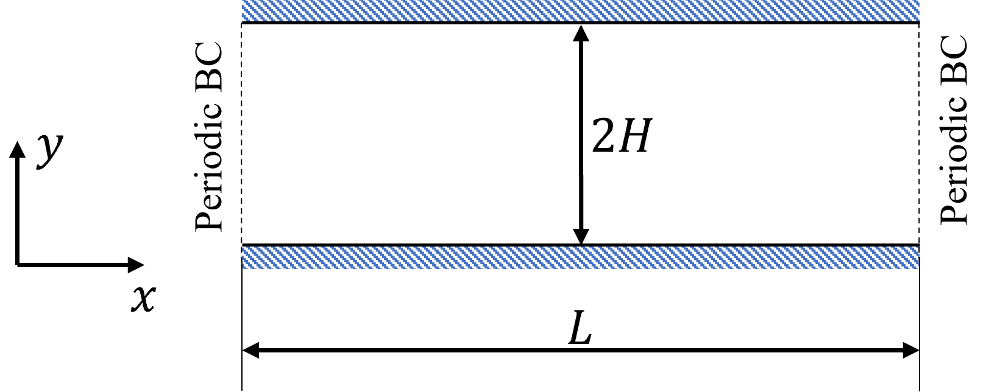
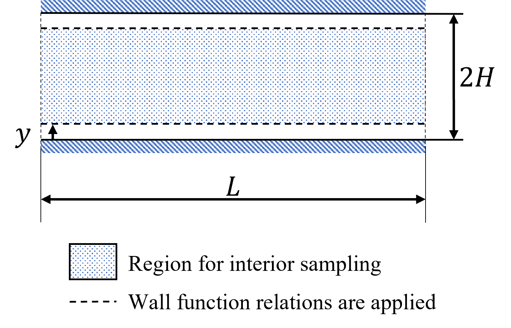
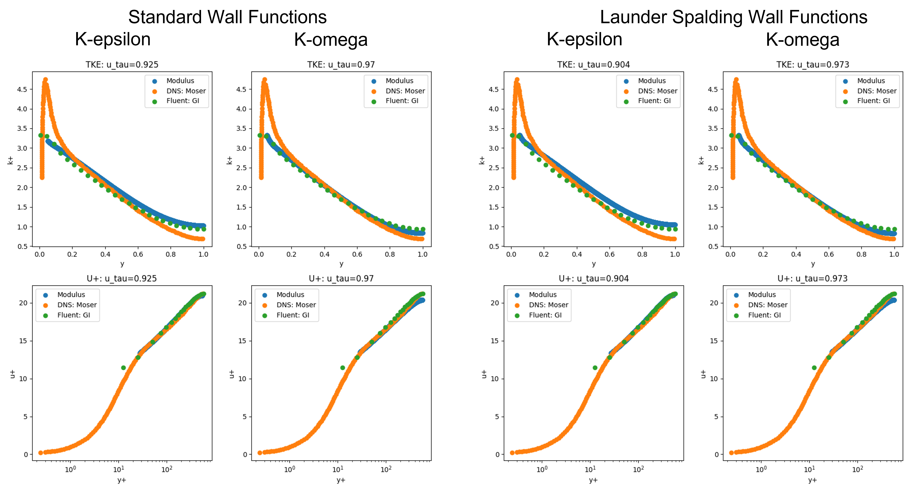

# Fully Developed Turbulent Channel Flow

[公式ページ](https://docs.nvidia.com/deeplearning/modulus/modulus-sym/user_guide/intermediate/two_equation_turbulent_channel.html)

## Introduction

このチュートリアルでは、トレーニングデータを使用せずに、2Dチャネル内の典型的な乱流流れを解くためにPINNsを使用する方法を示します。また、2つの方程式乱流モデルと壁関数を使用し、一部の乱流モデリングにおいてニューラルネットワークを使用する方法を示すためのルックアップテーブルの作成も行います。

Note :
PINNsやニューラルネットワークを使用して乱流を解くことは、一般的に研究が活発な分野です。PINNsで汎用的な乱流モデルを実装することは野心的な目標ですが、この例では、2つの方程式モデルと壁関数を使用して乱流系を解くためのいくつかの潜在的なアイデアを提供することを目指しています。

Note :
この章は継続的に開発され、新しい方法や改善が随時追加されます。

## Problem Description

このチュートリアルでは、乱流の実装と壁関数を完全に発達したチャネル流れのケースでテストします。流れは、y方向で距離2Hで分離された2つの平板の間に設定され、流れの駆動力は流れ方向に一定の負圧勾配で与えられます。流れは流れ方向に周期的であり、z方向に均一です。



Fig. 134 Turbulent flow in a 2D channel

摩擦レイノルズ数が590の問題を解決してください。摩擦レイノルズ数は、以下のように定義されます。

$$
Re_{\tau} = \frac{u_{\tau}H}{\nu}
$$

The pressure gradient is determined from the friction velocity as 

$$
\frac{\partial p}{\partial x} = \frac{u_{\tau}^2}{H}
$$

## Governing Equations

この例では、壁関数を使用した標準k-epsilonモデルの高レイノルズ数バージョンを実装しています。
目標は、壁から一定の距離以降で方程式を解き、粘性サブ層を解決しないようにすることです。
k-epsilonモデルの乱流方程式は次のようになります：

$$
\frac{\partial k}{\partial t} + U \cdot \nabla k = \nabla \cdot \left[ \left( \nu + \frac{\nu_t}{\sigma_k} \right) \nabla k \right] + P_k - \varepsilon
$$

$$
\frac{\partial \varepsilon}{\partial t} + U \cdot \nabla \varepsilon = \nabla \cdot \left[ \left( \nu + \frac{\nu_t}{\sigma_{\varepsilon}} \right) \nabla \varepsilon \right] + (C_{\varepsilon 1}P_k - C_{\varepsilon 2} \varepsilon)\frac{\varepsilon}{k}
$$

次に、このチュートリアルでは壁関数に焦点を当てます。:numref:fig-point-samplingは、この例で使用される壁モデリング手法を示しています。図から分かるように、特定の壁高さを超えると方程式が適用されますが、この壁高さは事前に選択されます。この選択された壁高さ以下の点は破棄されます。次のセクションで示される壁関数の関係は、この壁高さで適用されます。壁高さは、慣性サブ層の仮定が有効であることを確認するために$y^+$が約30になるように選択されます。



Fig. 135 Sampling for interior and wall function points

ここに提示されている式のすべてが、この問題の定式化に使用される重要な式ではありません。壁関数の詳細な説明については、[#bredberg2000wall]_と[#lacasse2004judicious]_を参照してください。

## Standard Wall Functions

壁に最も近い点（$P'$）が対数層内にあると仮定すると、接線速度は次のように設定できます。

$$
\begin{align}
U &= \frac{u_{\tau}}{\kappa} \ln{(E y^+)} 
\end{align}
$$

ここで、$\kappa=0.4187$、$E=9.793$です。

ここでは、$U$と$u_{\tau}$が暗黙的に関連しているため、$U$と壁距離$y$が与えられた場合に$u_{\tau}$を解くためのルックアップテーブルアプローチを使用できます。
このアプローチは、こちらで議論されているものと類似しています [#kalitzin2005near]_。

$k$と$\varepsilon$は以下の関係式を使用して設定できます。

$$
\begin{align}
k &= \frac{u_{\tau}^2}{\sqrt{C_{\mu}}} \\
\varepsilon &= \frac{C_{\mu} ^ {3 / 4} k ^ {3 / 2}}{\kappa y}
\end{align}
$$

壁面では、層流せん断が支配的であり、乱流せん断応力はゼロになります。一方、対数層では、乱流せん断応力が支配的です。適切にせん断応力を設定するために、壁面での総せん断応力が対数層における乱流せん断応力と等しいと仮定されます。$y^+$値が30に近い場合、この仮定は大きな誤差につながらないと考えられています。 [#moser1999direct]_ [#bredberg2000wall]_

したがって、以下に示すように、対数則の仮定と上記の近似を使用して壁摩擦を設定することができます。

$$
\tau_w \equiv \mu \frac{\partial U}{\partial y} \Bigg|_{w} \approx (\mu + \mu_t) \frac{\partial U}{\partial y} \Bigg|_{P} = \frac{\rho u_{\tau}U \kappa}{\ln{(E y^+)}}
$$

## Launder Spalding Wall Functions

ローンダー・スパルディング壁関数の定式化に関する関係式は、標準的なものと類似していますが、ここでは乱流運動エネルギーから摩擦速度を直接計算することができます。

$$
\begin{align}
u_{\tau} &= C_{\mu} ^ {1 / 4} k ^ {1 / 2} \\
U &= \frac{C_{\mu} ^ {1 / 4} k ^ {1 / 2}}{\kappa} \ln{(E y^+)} 
\end{align}
$$

この定式化では、$k$に対する明示的な境界条件は必要ありませんでした。対数則、$\varepsilon$の関係、そして$\tau_w$は、点$P$でのすべての変数を定義するのに十分です。

$$
\begin{align}
\varepsilon &= \frac{C_{\mu} ^ {3 / 4} k ^ {3 / 2}}{\kappa y} \\
\tau_w \equiv \mu \frac{\partial U}{\partial y} \Bigg|_{w} \approx (\mu + \mu_t) \frac{\partial U}{\partial y} \Bigg|_{P} &= \frac{\rho C_{\mu} ^ {1 / 4} k ^ {1 / 2} U \kappa}{\ln{(E y^+)}}
\end{align}
$$

Note :
この問題のPythonコードは、ディレクトリ「examples/turbulent_channel/」に見つけることができます。

## Case Setup - Standard Wall Functions

方程式は、カスタムPDE（Modulus SymでのカスタムPDEの設定の詳細については、:ref:transientを参照してください）を用いて象徴的に定義されます。これらの問題では、収束の挙動はネットワークの初期化に大きく影響されます。したがって、この例では、乱流流量の定数プロファイルを予測するためにネットワークをトレーニングし、その後、方程式の損失をゆっくりと増加させながら初期化の損失を減少させます。これを行うために、:ref:custom_aggregatorが定義されています。

標準壁関数アプローチでは、方程式 :eq:log-law が厳密に満たされる必要があります。したがって、$u_{\tau}$ の値をルックアップできるニューラルネットワークをトレーニングします。これは、$u$ と $y$ の範囲で log law を解決し、ニュートン・ラプソン法を使用してゼロを見つけることによって行われます。テーブルが準備できたら、これらの値を取り込むためにネットワークをトレーニングできます。

では、各セクションを1つずつ見ていきましょう。

このコードは、ルックアップテーブルを生成し、その値をニューラルネットワークに取り込むスクリプトを示しています。

```python
# Copyright (c) 2023, NVIDIA CORPORATION & AFFILIATES. All rights reserved.
#
# Licensed under the Apache License, Version 2.0 (the "License");
# you may not use this file except in compliance with the License.
# You may obtain a copy of the License at
#
# http://www.apache.org/licenses/LICENSE-2.0
#
# Unless required by applicable law or agreed to in writing, software
# distributed under the License is distributed on an "AS IS" BASIS,
# WITHOUT WARRANTIES OR CONDITIONS OF ANY KIND, either express or implied.
# See the License for the specific language governing permissions and
# limitations under the License.

import torch
import numpy as np
from sympy import Symbol, Eq, sin, cos, Min, Max, Abs, log, exp
from scipy import optimize

import modulus.sym
from modulus.sym.hydra import to_absolute_path, instantiate_arch, ModulusConfig
from modulus.sym.solver import Solver
from modulus.sym.domain import Domain
from modulus.sym.utils.io import csv_to_dict
from modulus.sym.domain.constraint import (
    PointwiseBoundaryConstraint,
    PointwiseInteriorConstraint,
    IntegralBoundaryConstraint,
    PointwiseConstraint,
)
from modulus.sym.domain.monitor import PointwiseMonitor
from modulus.sym.domain.inferencer import PointwiseInferencer
from modulus.sym.domain.validator import PointwiseValidator
from modulus.sym.key import Key
from modulus.sym.node import Node


@modulus.sym.main(config_path="conf_u_tau_lookup", config_name="config")
def run(cfg: ModulusConfig) -> None:
    u = np.linspace(1e-3, 50, num=100)
    y = np.linspace(1e-3, 0.5, num=100)

    U, Y = np.meshgrid(u, y)

    U = np.reshape(U, (U.size,))
    Y = np.reshape(Y, (Y.size,))

    Re = 590
    nu = 1 / Re

    def f(u_tau, y, u):
        return u_tau * np.log(9.793 * y * u_tau / nu) - u * 0.4187

    def fprime(u_tau, y, u):
        return 1 + np.log(9.793 * y * u_tau / nu)

    u_tau = []
    for i in range(len(U)):
        u_tau_calc = optimize.newton(
            f,
            1.0,
            fprime=fprime,
            args=(Y[i], U[i]),
            tol=1.48e-08,
            maxiter=200,
            fprime2=None,
        )
        u_tau.append(u_tau_calc)

    # save tabulations to a csv file
    results = np.concatenate(
        (
            np.reshape(U, (len(U), 1)),
            np.reshape(Y, (len(Y), 1)),
            np.reshape(u_tau, (len(u_tau), 1)),
        ),
        axis=1,
    )
    np.savetxt("u_tau.csv", results, delimiter=",")

    invar = {"u_in": np.reshape(U, (len(U), 1)), "y_in": np.reshape(Y, (len(Y), 1))}
    outvar = {"u_tau_out": np.reshape(u_tau, (len(u_tau), 1))}

    u = np.random.uniform(1e-3, 50, size=100)
    y = np.random.uniform(1e-3, 0.5, size=100)

    U, Y = np.meshgrid(u, y)

    U = np.reshape(U, (U.size,))
    Y = np.reshape(Y, (Y.size,))

    u_tau_val = []
    for i in range(len(U)):
        u_tau_calc = optimize.newton(
            f,
            1.0,
            fprime=fprime,
            args=(Y[i], U[i]),
            tol=1.48e-08,
            maxiter=200,
            fprime2=None,
        )
        u_tau_val.append(u_tau_calc)

    # save tabulations to a csv file
    results = np.concatenate(
        (
            np.reshape(U, (len(U), 1)),
            np.reshape(Y, (len(Y), 1)),
            np.reshape(u_tau, (len(u_tau), 1)),
        ),
        axis=1,
    )
    np.savetxt("u_tau_val.csv", results, delimiter=",")

    invar_val = {"u_in": np.reshape(U, (len(U), 1)), "y_in": np.reshape(Y, (len(Y), 1))}
    outvar_val = {"u_tau_out": np.reshape(u_tau_val, (len(u_tau_val), 1))}

    # make list of nodes to unroll graph on
    u_tau_net = instantiate_arch(
        input_keys=[Key("u_in"), Key("y_in")],
        output_keys=[Key("u_tau_out")],
        cfg=cfg.arch.fully_connected,
    )

    nodes = [u_tau_net.make_node(name="u_tau_network")]

    # make domain
    domain = Domain()

    train = PointwiseConstraint.from_numpy(
        nodes=nodes,
        invar=invar,
        outvar=outvar,
        batch_size=10000,
    )
    domain.add_constraint(train, "LogLawLoss")

    # add validation
    validator = PointwiseValidator(nodes=nodes, invar=invar_val, true_outvar=outvar_val)
    domain.add_validator(validator)

    # make solver
    slv = Solver(cfg, domain)

    # start solver
    slv.solve()


if __name__ == "__main__":
    run()
```

以下のコードは、カスタムPDEの定義を示しています。初期化損失、方程式損失、および壁関数損失に対して別々のPDEを定義します。これには、ここで議論されているCFD問題に使用されている初期化戦略を使用してください。

``` python
# Copyright (c) 2023, NVIDIA CORPORATION & AFFILIATES. All rights reserved.
#
# Licensed under the Apache License, Version 2.0 (the "License");
# you may not use this file except in compliance with the License.
# You may obtain a copy of the License at
#
# http://www.apache.org/licenses/LICENSE-2.0
#
# Unless required by applicable law or agreed to in writing, software
# distributed under the License is distributed on an "AS IS" BASIS,
# WITHOUT WARRANTIES OR CONDITIONS OF ANY KIND, either express or implied.
# See the License for the specific language governing permissions and
# limitations under the License.

"""Equations related to Navier Stokes Equations
"""

from sympy import Symbol, Function, Number, log, Abs, simplify

from modulus.sym.eq.pde import PDE
from modulus.sym.node import Node


class kEpsilonInit(PDE):
    def __init__(self, nu=1, rho=1):
        # set params
        nu = Number(nu)
        rho = Number(rho)

        # coordinates
        x = Symbol("x")
        y = Symbol("y")

        # make input variables
        input_variables = {"x": x, "y": y}

        # velocity componets
        u = Function("u")(*input_variables)
        v = Function("v")(*input_variables)
        p = Function("p")(*input_variables)
        k = Function("k")(*input_variables)
        ep = Function("ep")(*input_variables)

        # flow initialization
        C_mu = 0.09
        u_avg = 21  # Approx average velocity
        Re_d = (
            u_avg * 1 / nu
        )  # Reynolds number based on centerline and channel hydraulic dia
        l = 0.038 * 2  # Approx turbulent length scale
        I = 0.16 * Re_d ** (
            -1 / 8
        )  # Turbulent intensity for a fully developed pipe flow

        u_init = u_avg
        v_init = 0
        p_init = 0
        k_init = 1.5 * (u_avg * I) ** 2
        ep_init = (C_mu ** (3 / 4)) * (k_init ** (3 / 2)) / l

        # set equations
        self.equations = {}
        self.equations["u_init"] = u - u_init
        self.equations["v_init"] = v - v_init
        self.equations["p_init"] = p - p_init
        self.equations["k_init"] = k - k_init
        self.equations["ep_init"] = ep - ep_init


class kEpsilon(PDE):
    def __init__(self, nu=1, rho=1):
        # set params
        nu = Number(nu)
        rho = Number(rho)

        # coordinates
        x = Symbol("x")
        y = Symbol("y")

        # make input variables
        input_variables = {"x": x, "y": y}

        # velocity componets
        u = Function("u")(*input_variables)
        v = Function("v")(*input_variables)
        p = Function("p")(*input_variables)
        k = Function("k")(*input_variables)
        ep = Function("ep")(*input_variables)

        # Model constants
        sig_k = 1.0
        sig_ep = 1.3
        C_ep1 = 1.44
        C_ep2 = 1.92
        C_mu = 0.09
        E = 9.793

        # Turbulent Viscosity
        nu_t = C_mu * (k**2) / (ep + 1e-4)

        # Turbulent Production Term
        P_k = nu_t * (
            2 * (u.diff(x)) ** 2
            + 2 * (v.diff(y)) ** 2
            + (u.diff(y)) ** 2
            + (v.diff(x)) ** 2
            + 2 * u.diff(y) * v.diff(x)
        )

        # set equations
        self.equations = {}
        self.equations["continuity"] = simplify(u.diff(x) + v.diff(y))
        self.equations["momentum_x"] = simplify(
            u * u.diff(x)
            + v * u.diff(y)
            + p.diff(x)
            - ((nu + nu_t) * u.diff(x)).diff(x)
            - ((nu + nu_t) * u.diff(y)).diff(y)
        )
        self.equations["momentum_y"] = simplify(
            u * v.diff(x)
            + v * v.diff(y)
            + p.diff(y)
            - ((nu + nu_t) * v.diff(x)).diff(x)
            - ((nu + nu_t) * v.diff(y)).diff(y)
        )
        self.equations["k_equation"] = simplify(
            u * k.diff(x)
            + v * k.diff(y)
            - ((nu + nu_t / sig_k) * k.diff(x)).diff(x)
            - ((nu + nu_t / sig_k) * k.diff(y)).diff(y)
            - P_k
            + ep
        )
        self.equations["ep_equation"] = simplify(
            u * ep.diff(x)
            + v * ep.diff(y)
            - ((nu + nu_t / sig_ep) * ep.diff(x)).diff(x)
            - ((nu + nu_t / sig_ep) * ep.diff(y)).diff(y)
            - (C_ep1 * P_k - C_ep2 * ep) * ep / (k + 1e-3)
        )


class kEpsilonStdWF(PDE):
    def __init__(self, nu=1, rho=1):
        # set params
        nu = Number(nu)
        rho = Number(rho)

        # coordinates
        x = Symbol("x")
        y = Symbol("y")

        # make input variables
        input_variables = {"x": x, "y": y}

        # velocity componets
        u = Function("u")(*input_variables)
        v = Function("v")(*input_variables)
        k = Function("k")(*input_variables)
        ep = Function("ep")(*input_variables)

        # normals
        normal_x = -1 * Symbol(
            "normal_x"
        )  # Multiply by -1 to flip the direction of normal
        normal_y = -1 * Symbol(
            "normal_y"
        )  # Multiply by -1 to flip the direction of normal

        # wall distance
        normal_distance = Function("normal_distance")(*input_variables)

        # Model constants
        C_mu = 0.09
        E = 9.793
        C_k = -0.36
        B_k = 8.15
        karman_constant = 0.4187

        # Turbulent Viscosity
        nu_t = C_mu * (k**2) / (ep + 1e-4)

        u_tau = Function("u_tau")(*input_variables)
        y_plus = u_tau * normal_distance / nu
        u_plus = log(Abs(E * y_plus)) / karman_constant

        ep_true = (C_mu ** (3 / 4)) * (k ** (3 / 2)) / karman_constant / normal_distance

        u_parallel_to_wall = [
            u - (u * normal_x + v * normal_y) * normal_x,
            v - (u * normal_x + v * normal_y) * normal_y,
        ]
        du_parallel_to_wall_dx = [
            u.diff(x) - (u.diff(x) * normal_x + v.diff(x) * normal_y) * normal_x,
            v.diff(x) - (u.diff(x) * normal_x + v.diff(x) * normal_y) * normal_y,
        ]
        du_parallel_to_wall_dy = [
            u.diff(y) - (u.diff(y) * normal_x + v.diff(y) * normal_y) * normal_x,
            v.diff(y) - (u.diff(y) * normal_x + v.diff(y) * normal_y) * normal_y,
        ]

        du_dsdf = [
            du_parallel_to_wall_dx[0] * normal_x + du_parallel_to_wall_dy[0] * normal_y,
            du_parallel_to_wall_dx[1] * normal_x + du_parallel_to_wall_dy[1] * normal_y,
        ]

        wall_shear_stress_true_x = (
            u_tau * u_parallel_to_wall[0] * karman_constant / log(Abs(E * y_plus))
        )
        wall_shear_stress_true_y = (
            u_tau * u_parallel_to_wall[1] * karman_constant / log(Abs(E * y_plus))
        )

        wall_shear_stress_x = (nu + nu_t) * du_dsdf[0]
        wall_shear_stress_y = (nu + nu_t) * du_dsdf[1]

        u_normal_to_wall = u * normal_x + v * normal_y
        u_normal_to_wall_true = 0

        u_parallel_to_wall_mag = (
            u_parallel_to_wall[0] ** 2 + u_parallel_to_wall[1] ** 2
        ) ** 0.5
        u_parallel_to_wall_true = u_plus * u_tau

        # k_normal_gradient = normal_x*k.diff(x) + normal_y*k.diff(y)
        # k_normal_gradient_true = 0
        k_true = u_tau**2 / C_mu**0.5

        # set equations
        self.equations = {}
        self.equations["velocity_wall_normal_wf"] = (
            u_normal_to_wall - u_normal_to_wall_true
        )
        self.equations["velocity_wall_parallel_wf"] = (
            u_parallel_to_wall_mag - u_parallel_to_wall_true
        )
        self.equations["k_wf"] = k - k_true
        self.equations["ep_wf"] = ep - ep_true
        self.equations["wall_shear_stress_x_wf"] = (
            wall_shear_stress_x - wall_shear_stress_true_x
        )
        self.equations["wall_shear_stress_y_wf"] = (
            wall_shear_stress_y - wall_shear_stress_true_y
        )
```

## Custom Aggregator

Modulus Symのアグリゲータは、さまざまな損失項目を組み合わせて、最適化中にネットワークが使用するグローバル損失を形成します。アグリゲータのデフォルトの動作は、すべての重み付けされた損失を合計することです。ただし、この例では、モデルのトレーニングの最初（初期化損失）に適用される損失と、後で適用される損失（方程式と壁関数の関係）を変化させます。これには、異なる損失を滑らかに増減させるために、$tanh$ 関数が使用されます。以下に、これに関するコードを示します。

```python
# Copyright (c) 2023, NVIDIA CORPORATION & AFFILIATES. All rights reserved.
#
# Licensed under the Apache License, Version 2.0 (the "License");
# you may not use this file except in compliance with the License.
# You may obtain a copy of the License at
#
# http://www.apache.org/licenses/LICENSE-2.0
#
# Unless required by applicable law or agreed to in writing, software
# distributed under the License is distributed on an "AS IS" BASIS,
# WITHOUT WARRANTIES OR CONDITIONS OF ANY KIND, either express or implied.
# See the License for the specific language governing permissions and
# limitations under the License.

# Import libraries
import torch
from torch import nn
from typing import Dict, List

# Import from Modulus
from modulus.sym.eq.derivatives import gradient
from modulus.sym.loss.aggregator import Aggregator


class CustomSum(Aggregator):
    """
Loss aggregation by summation
"""

    def __init__(self, params, num_losses, weights=None):
        super().__init__(params, num_losses, weights)

    def forward(self, losses: Dict[str, torch.Tensor], step: int) -> torch.Tensor:
        """
Aggregates the losses by summation

Parameters
----------
losses : Dict[str, torch.Tensor]
A dictionary of losses
step : int
Optimizer step

Returns
-------
loss : torch.Tensor
Aggregated loss
"""

        # weigh losses
        losses = self.weigh_losses(losses, self.weights)

        # Initialize loss
        loss: torch.Tensor = torch.zeros_like(self.init_loss)

        smoothness = 0.0005  # use 0.0005 to smoothen the transition over ~10k steps
        step_tensor = torch.tensor(step, dtype=torch.float32)
        decay_weight = (torch.tanh((20000 - step_tensor) * smoothness) + 1.0) * 0.5

        # Add losses
        for key in losses.keys():
            if "init" not in key:
                loss += (1 - decay_weight) * (losses[key])
            else:
                loss += decay_weight * (losses[key])
        return loss
```

カスタムアグリゲータは、次のように loss 設定グループの下の設定ファイルで呼び出されます。

```yaml
# Copyright (c) 2023, NVIDIA CORPORATION & AFFILIATES. All rights reserved.
#
# Licensed under the Apache License, Version 2.0 (the "License");
# you may not use this file except in compliance with the License.
# You may obtain a copy of the License at
#
# http://www.apache.org/licenses/LICENSE-2.0
#
# Unless required by applicable law or agreed to in writing, software
# distributed under the License is distributed on an "AS IS" BASIS,
# WITHOUT WARRANTIES OR CONDITIONS OF ANY KIND, either express or implied.
# See the License for the specific language governing permissions and
# limitations under the License.

defaults:
  - modulus_default
  - arch:
      - fourier
      - fully_connected
  - optimizer: adam
  - scheduler: tf_exponential_lr
  - loss: custom-aggregator
  - _self_

jit: false
scheduler: 
  decay_rate: 0.95
  decay_steps: 8000

network_dir: "network_checkpoint"
initialization_network_dir: "../u_tau_lookup/network_checkpoint/"
save_filetypes: "vtk,npz"

cuda_graphs: False

optimizer: 
  lr: 1e-4

training:
  rec_validation_freq: 1000
  rec_inference_freq: 1000
  rec_monitor_freq: 1000
  rec_constraint_freq: 1000
  max_steps: 400000

batch_size:
  wf_pt: 512
  interior: 2048 
  inlet: 256
  outlet: 256
  interior_init: 2048
```

すべての前提条件が定義されたら、乱流チャネル流れを解くことができます。configファイルでは、適切な初期化ディレクトリを設定することで、以前のチュートリアルから u_tau_network をインポートします。そのネットワークの optimize パラメータを False に設定して、トレーニング中にそのネットワークの重みとバイアスが変わらないようにします。また、領域内の周期性を設定するために、$x$ を $sin(x)$ に変換する象徴的なノードを作成します。これは、ニューラルネットワークの入力となります。

```python
# Copyright (c) 2023, NVIDIA CORPORATION & AFFILIATES. All rights reserved.
#
# Licensed under the Apache License, Version 2.0 (the "License");
# you may not use this file except in compliance with the License.
# You may obtain a copy of the License at
#
# http://www.apache.org/licenses/LICENSE-2.0
#
# Unless required by applicable law or agreed to in writing, software
# distributed under the License is distributed on an "AS IS" BASIS,
# WITHOUT WARRANTIES OR CONDITIONS OF ANY KIND, either express or implied.
# See the License for the specific language governing permissions and
# limitations under the License.

import torch
import numpy as np
from sympy import Symbol, Eq, sin, cos, Min, Max, Abs, log, exp

import modulus.sym
from modulus.sym.hydra import to_absolute_path, instantiate_arch, ModulusConfig
from modulus.sym.solver import Solver
from modulus.sym.domain import Domain
from modulus.sym.geometry.primitives_2d import Rectangle, Line, Channel2D
from modulus.sym.utils.sympy.functions import parabola
from modulus.sym.utils.io import csv_to_dict
from modulus.sym.eq.pdes.navier_stokes import NavierStokes
from modulus.sym.domain.constraint import (
    PointwiseBoundaryConstraint,
    PointwiseInteriorConstraint,
    IntegralBoundaryConstraint,
)
from modulus.sym.domain.monitor import PointwiseMonitor
from modulus.sym.domain.inferencer import PointwiseInferencer
from modulus.sym.key import Key
from modulus.sym.node import Node

from custom_k_ep import kEpsilonInit, kEpsilon, kEpsilonStdWF


@modulus.sym.main(config_path="conf_re590_k_ep", config_name="config")
def run(cfg: ModulusConfig) -> None:
    # simulation parameters
    Re = 590
    nu = 1 / Re
    y_plus = 30
    karman_constant = 0.4187
    resolved_y_start = y_plus * nu
    channel_width = (-1, 1)
    channel_length = (-np.pi / 2, np.pi / 2)

    inlet = Line(
        (channel_length[0], channel_width[0]),
        (channel_length[0], channel_width[1]),
        normal=1,
    )
    outlet = Line(
        (channel_length[1], channel_width[0]),
        (channel_length[1], channel_width[1]),
        normal=1,
    )

    geo_sdf = Channel2D(
        (channel_length[0], channel_width[0]), (channel_length[1], channel_width[1])
    )

    # geometry where the equations are solved
    geo_resolved = Channel2D(
        (channel_length[0], channel_width[0] + resolved_y_start),
        (channel_length[1], channel_width[1] - resolved_y_start),
    )

    # make list of nodes to unroll graph on
    init = kEpsilonInit(nu=nu, rho=1.0)
    eq = kEpsilon(nu=nu, rho=1.0)
    wf = kEpsilonStdWF(nu=nu, rho=1.0)

    u_tau_net = instantiate_arch(
        input_keys=[Key("u_in"), Key("y_in")],
        output_keys=[Key("u_tau_out")],
        cfg=cfg.arch.fully_connected,
    )
    flow_net = instantiate_arch(
        input_keys=[Key("x_sin"), Key("y")],
        output_keys=[Key("u"), Key("v")],
        frequencies=("axis", [i / 2 for i in range(8)]),
        frequencies_params=("axis", [i / 2 for i in range(8)]),
        cfg=cfg.arch.fourier,
    )
    p_net = instantiate_arch(
        input_keys=[Key("x"), Key("y")],
        output_keys=[Key("p")],
        frequencies=("axis", [i / 2 for i in range(8)]),
        frequencies_params=("axis", [i / 2 for i in range(8)]),
        cfg=cfg.arch.fourier,
    )
    k_net = instantiate_arch(
        input_keys=[Key("x_sin"), Key("y")],
        output_keys=[Key("k_star")],
        frequencies=("axis", [i / 2 for i in range(8)]),
        frequencies_params=("axis", [i / 2 for i in range(8)]),
        cfg=cfg.arch.fourier,
    )
    ep_net = instantiate_arch(
        input_keys=[Key("x_sin"), Key("y")],
        output_keys=[Key("ep_star")],
        frequencies=("axis", [i / 2 for i in range(8)]),
        frequencies_params=("axis", [i / 2 for i in range(8)]),
        cfg=cfg.arch.fourier,
    )
    nodes = (
        init.make_nodes()
        + eq.make_nodes()
        + wf.make_nodes()
        + [
            Node.from_sympy(
                sin(2 * np.pi * Symbol("x") / (channel_length[1] - channel_length[0])),
                "x_sin",
            )
        ]
        + [Node.from_sympy(Min(log(1 + exp(Symbol("k_star"))) + 1e-4, 20), "k")]
        + [Node.from_sympy(Min(log(1 + exp(Symbol("ep_star"))) + 1e-4, 180), "ep")]
        + [flow_net.make_node(name="flow_network")]
        + [p_net.make_node(name="p_network")]
        + [k_net.make_node(name="k_network")]
        + [ep_net.make_node(name="ep_network")]
    )

    nodes_u_tau = (
        [Node.from_sympy(Symbol("normal_distance"), "y_in")]
        + [
            Node.from_sympy(
                (
                    (
                        Symbol("u")
                        - (
                            Symbol("u") * (-Symbol("normal_x"))
                            + Symbol("v") * (-Symbol("normal_y"))
                        )
                        * (-Symbol("normal_x"))
                    )
                    ** 2
                    + (
                        Symbol("v")
                        - (
                            Symbol("u") * (-Symbol("normal_x"))
                            + Symbol("v") * (-Symbol("normal_y"))
                        )
                        * (-Symbol("normal_y"))
                    )
                    ** 2
                )
                ** 0.5,
                "u_parallel_to_wall",
            )
        ]
        + [Node.from_sympy(Symbol("u_parallel_to_wall"), "u_in")]
        + [Node.from_sympy(Symbol("u_tau_out"), "u_tau")]
        + [u_tau_net.make_node(name="u_tau_network", optimize=False)]
    )

    # add constraints to solver
    p_grad = 1.0

    x, y = Symbol("x"), Symbol("y")

    # make domain
    domain = Domain()

    # Point where wall funciton is applied
    wf_pt = PointwiseBoundaryConstraint(
        nodes=nodes + nodes_u_tau,
        geometry=geo_resolved,
        outvar={
            "velocity_wall_normal_wf": 0,
            "velocity_wall_parallel_wf": 0,
            "ep_wf": 0,
            "k_wf": 0,
            "wall_shear_stress_x_wf": 0,
            "wall_shear_stress_y_wf": 0,
        },
        lambda_weighting={
            "velocity_wall_normal_wf": 100,
            "velocity_wall_parallel_wf": 100,
            "ep_wf": 1,
            "k_wf": 1,
            "wall_shear_stress_x_wf": 100,
            "wall_shear_stress_y_wf": 100,
        },
        batch_size=cfg.batch_size.wf_pt,
        parameterization={"normal_distance": resolved_y_start},
    )
    domain.add_constraint(wf_pt, "WF")

    # interior
    interior = PointwiseInteriorConstraint(
        nodes=nodes,
        geometry=geo_resolved,
        outvar={
            "continuity": 0,
            "momentum_x": 0,
            "momentum_y": 0,
            "k_equation": 0,
            "ep_equation": 0,
        },
        lambda_weighting={
            "continuity": 100,
            "momentum_x": 1000,
            "momentum_y": 1000,
            "k_equation": 10,
            "ep_equation": 1,
        },
        batch_size=cfg.batch_size.interior,
        bounds={x: channel_length, y: channel_width},
    )
    domain.add_constraint(interior, "Interior")

    # pressure pc
    inlet = PointwiseBoundaryConstraint(
        nodes=nodes,
        geometry=inlet,
        outvar={"p": p_grad * (channel_length[1] - channel_length[0])},
        lambda_weighting={"p": 10},
        batch_size=cfg.batch_size.inlet,
    )
    domain.add_constraint(inlet, "Inlet")

    # pressure pc
    outlet = PointwiseBoundaryConstraint(
        nodes=nodes,
        geometry=outlet,
        outvar={"p": 0},
        lambda_weighting={"p": 10},
        batch_size=cfg.batch_size.outlet,
    )
    domain.add_constraint(outlet, "Outlet")

    # flow initialization
    interior = PointwiseInteriorConstraint(
        nodes=nodes,
        geometry=geo_resolved,
        outvar={"u_init": 0, "v_init": 0, "k_init": 0, "p_init": 0, "ep_init": 0},
        batch_size=cfg.batch_size.interior_init,
        bounds={x: channel_length, y: channel_width},
    )
    domain.add_constraint(interior, "InteriorInit")

    # add inferencing and monitor
    invar_wf_pt = geo_resolved.sample_boundary(
        1024, parameterization={"normal_distance": resolved_y_start}
    )
    u_tau_monitor = PointwiseMonitor(
        invar_wf_pt,
        output_names=["u_tau"],
        metrics={"mean_u_tau": lambda var: torch.mean(var["u_tau"])},
        nodes=nodes + nodes_u_tau,
    )
    domain.add_monitor(u_tau_monitor)

    # add inferencer data
    inference = PointwiseInferencer(
        nodes=nodes,
        invar=geo_resolved.sample_interior(
            5000, bounds={x: channel_length, y: channel_width}
        ),
        output_names=["u", "v", "p", "k", "ep"],
    )
    domain.add_inferencer(inference, "inf_interior")

    inference = PointwiseInferencer(
        nodes=nodes + nodes_u_tau,
        invar=geo_resolved.sample_boundary(
            10, parameterization={"normal_distance": resolved_y_start}
        ),
        output_names=["u", "v", "p", "k", "ep", "normal_distance", "u_tau"],
    )
    domain.add_inferencer(inference, "inf_wf")

    # make solver
    slv = Solver(cfg, domain)

    # start solver
    slv.solve()


if __name__ == "__main__":
    run()
```

## Case Setup - Launder Spalding Wall Functions

この問題のケース設定は以前のものと非常に似ていますが、今回は乱流運動エネルギーを使用して $u_{\tau}$ を明示的に定義できるため、ルックアップネットワークのトレーニングを回避できます。カスタムPDEを定義するプロセスは以前と同様です。Launder Spalding壁関数のカスタムPDEは、examples/turbulent_channel/2d/custom_k_ep_ls.py にあります。

以前に定義した同じカスタムアグリゲータを使用してください。同様の初期化戦略はこの問題でも機能します。PDEとアグリゲータを定義したら、以下に示すように問題を解くためのスクリプトを設定できます。ルックアップテーブル用の別個のネットワークはなく、壁での損失は標準壁関数の式とは異なります。

```python
# Copyright (c) 2023, NVIDIA CORPORATION & AFFILIATES. All rights reserved.
#
# Licensed under the Apache License, Version 2.0 (the "License");
# you may not use this file except in compliance with the License.
# You may obtain a copy of the License at
#
# http://www.apache.org/licenses/LICENSE-2.0
#
# Unless required by applicable law or agreed to in writing, software
# distributed under the License is distributed on an "AS IS" BASIS,
# WITHOUT WARRANTIES OR CONDITIONS OF ANY KIND, either express or implied.
# See the License for the specific language governing permissions and
# limitations under the License.

import torch
import numpy as np
from sympy import Symbol, Eq, sin, cos, Min, Max, Abs, log, exp

import modulus.sym
from modulus.sym.hydra import to_absolute_path, instantiate_arch, ModulusConfig
from modulus.sym.solver import Solver
from modulus.sym.domain import Domain
from modulus.sym.geometry.primitives_2d import Rectangle, Line, Channel2D
from modulus.sym.eq.pdes.navier_stokes import NavierStokes
from modulus.sym.domain.constraint import (
    PointwiseBoundaryConstraint,
    PointwiseInteriorConstraint,
    IntegralBoundaryConstraint,
)
from modulus.sym.domain.monitor import PointwiseMonitor
from modulus.sym.domain.inferencer import PointwiseInferencer
from modulus.sym.key import Key
from modulus.sym.node import Node

from custom_k_ep_ls import kEpsilonInit, kEpsilon, kEpsilonLSWF


@modulus.sym.main(config_path="conf_re590_k_ep_LS", config_name="config")
def run(cfg: ModulusConfig) -> None:
    # simulation parameters
    Re = 590
    nu = 1 / Re
    y_plus = 30
    karman_constant = 0.4187
    resolved_y_start = y_plus * nu
    channel_width = (-1, 1)
    channel_length = (-np.pi / 2, np.pi / 2)

    inlet = Line(
        (channel_length[0], channel_width[0]),
        (channel_length[0], channel_width[1]),
        normal=1,
    )
    outlet = Line(
        (channel_length[1], channel_width[0]),
        (channel_length[1], channel_width[1]),
        normal=1,
    )

    geo_sdf = Channel2D(
        (channel_length[0], channel_width[0]), (channel_length[1], channel_width[1])
    )

    # geometry where the equations are solved
    geo_resolved = Channel2D(
        (channel_length[0], channel_width[0] + resolved_y_start),
        (channel_length[1], channel_width[1] - resolved_y_start),
    )

    # make list of nodes to unroll graph on
    init = kEpsilonInit(nu=nu, rho=1.0)
    eq = kEpsilon(nu=nu, rho=1.0)
    wf = kEpsilonLSWF(nu=nu, rho=1.0)

    flow_net = instantiate_arch(
        input_keys=[Key("x_sin"), Key("y")],
        output_keys=[Key("u"), Key("v")],
        frequencies=("axis", [i / 2 for i in range(8)]),
        frequencies_params=("axis", [i / 2 for i in range(8)]),
        cfg=cfg.arch.fourier,
    )
    p_net = instantiate_arch(
        input_keys=[Key("x"), Key("y")],
        output_keys=[Key("p")],
        frequencies=("axis", [i / 2 for i in range(8)]),
        frequencies_params=("axis", [i / 2 for i in range(8)]),
        cfg=cfg.arch.fourier,
    )
    k_net = instantiate_arch(
        input_keys=[Key("x_sin"), Key("y")],
        output_keys=[Key("k_star")],
        frequencies=("axis", [i / 2 for i in range(8)]),
        frequencies_params=("axis", [i / 2 for i in range(8)]),
        cfg=cfg.arch.fourier,
    )
    ep_net = instantiate_arch(
        input_keys=[Key("x_sin"), Key("y")],
        output_keys=[Key("ep_star")],
        frequencies=("axis", [i / 2 for i in range(8)]),
        frequencies_params=("axis", [i / 2 for i in range(8)]),
        cfg=cfg.arch.fourier,
    )
    nodes = (
        init.make_nodes()
        + eq.make_nodes()
        + wf.make_nodes()
        + [
            Node.from_sympy(
                sin(2 * np.pi * Symbol("x") / (channel_length[1] - channel_length[0])),
                "x_sin",
            )
        ]
        + [Node.from_sympy(Min(log(1 + exp(Symbol("k_star"))) + 1e-4, 20), "k")]
        + [Node.from_sympy(Min(log(1 + exp(Symbol("ep_star"))) + 1e-4, 180), "ep")]
        + [flow_net.make_node(name="flow_network")]
        + [p_net.make_node(name="p_network")]
        + [k_net.make_node(name="k_network")]
        + [ep_net.make_node(name="ep_network")]
    )

    # add constraints to solver
    p_grad = 1.0

    x, y = Symbol("x"), Symbol("y")

    # make domain
    domain = Domain()

    # Point where wall funciton is applied
    wf_pt = PointwiseBoundaryConstraint(
        nodes=nodes,
        geometry=geo_resolved,
        outvar={
            "velocity_wall_normal_wf": 0,
            "velocity_wall_parallel_wf": 0,
            "ep_wf": 0,
            "wall_shear_stress_x_wf": 0,
            "wall_shear_stress_y_wf": 0,
        },
        lambda_weighting={
            "velocity_wall_normal_wf": 100,
            "velocity_wall_parallel_wf": 100,
            "ep_wf": 1,
            "wall_shear_stress_x_wf": 100,
            "wall_shear_stress_y_wf": 100,
        },
        batch_size=cfg.batch_size.wf_pt,
        parameterization={"normal_distance": resolved_y_start},
    )
    domain.add_constraint(wf_pt, "WF")

    # interior
    interior = PointwiseInteriorConstraint(
        nodes=nodes,
        geometry=geo_resolved,
        outvar={
            "continuity": 0,
            "momentum_x": 0,
            "momentum_y": 0,
            "k_equation": 0,
            "ep_equation": 0,
        },
        lambda_weighting={
            "continuity": 100,
            "momentum_x": 1000,
            "momentum_y": 1000,
            "k_equation": 10,
            "ep_equation": 1,
        },
        batch_size=cfg.batch_size.interior,
        bounds={x: channel_length, y: channel_width},
    )
    domain.add_constraint(interior, "Interior")

    # pressure pc
    inlet = PointwiseBoundaryConstraint(
        nodes=nodes,
        geometry=inlet,
        outvar={"p": p_grad * (channel_length[1] - channel_length[0])},
        lambda_weighting={"p": 10},
        batch_size=cfg.batch_size.inlet,
    )
    domain.add_constraint(inlet, "Inlet")

    # pressure pc
    outlet = PointwiseBoundaryConstraint(
        nodes=nodes,
        geometry=outlet,
        outvar={"p": 0},
        lambda_weighting={"p": 10},
        batch_size=cfg.batch_size.outlet,
    )
    domain.add_constraint(outlet, "Outlet")

    # flow initialization
    interior = PointwiseInteriorConstraint(
        nodes=nodes,
        geometry=geo_resolved,
        outvar={"u_init": 0, "v_init": 0, "k_init": 0, "p_init": 0, "ep_init": 0},
        batch_size=cfg.batch_size.interior_init,
        bounds={x: channel_length, y: channel_width},
    )
    domain.add_constraint(interior, "InteriorInit")

    # add inferencing and monitor
    invar_wf_pt = geo_resolved.sample_boundary(
        1024,
    )
    u_tau_monitor = PointwiseMonitor(
        invar_wf_pt,
        output_names=["k"],
        metrics={
            "mean_u_tau": lambda var: torch.mean((0.09**0.25) * torch.sqrt(var["k"]))
        },
        nodes=nodes,
    )
    domain.add_monitor(u_tau_monitor)

    # add inferencer data
    inference = PointwiseInferencer(
        nodes=nodes,
        invar=geo_resolved.sample_interior(
            5000, bounds={x: channel_length, y: channel_width}
        ),
        output_names=["u", "v", "p", "k", "ep"],
    )
    domain.add_inferencer(inference, "inf_interior")

    inference = PointwiseInferencer(
        nodes=nodes,
        invar=geo_resolved.sample_boundary(
            10, parameterization={"normal_distance": resolved_y_start}
        ),
        output_names=["u", "v", "p", "k", "ep", "normal_distance"],
    )
    domain.add_inferencer(inference, "inf_wf")

    # make solver
    slv = Solver(cfg, domain)

    # start solver
    slv.solve()


if __name__ == "__main__":
    run()
```

## Post-processing, Results and Discussion

Modulus Symの結果は、以下の図にDNSデータ[#moser1999direct]_およびソルバーデータ[#gistanford]_とともに示されています。次元をなくした速度と乱流運動エネルギーのプロファイルがDNSおよびソルバーデータと非常によく一致していることに注目してください。また、k-ωモデルはk-εモデルと比較して摩擦速度をより正確に予測することができています。



Fig. 136 Turbulent channel flow results

上記のプロットを生成するスクリプトや、k-ωモデルのスクリプトは、examples/turbulent_channel/ディレクトリにあります。

## References

.. [#bredberg2000wall] Bredberg, Jonas. "On the wall boundary condition for turbulence models." Chalmers University of Technology, Department of Thermo and Fluid Dynamics. Internal Report 00/4. G oteborg (2000): 8-16.

.. [#lacasse2004judicious] Lacasse, David, Eric Turgeon, and Dominique Pelletier. "On the judicious use of the k–ε model, wall functions and adaptivity." International Journal of Thermal Sciences 43.10 (2004): 925-938.

.. [#moser1999direct] Moser, Robert D., John Kim, and Nagi N. Mansour. "Direct numerical simulation of turbulent channel flow up to Re τ= 590." Physics of fluids 11.4 (1999): 943-945.

.. [#kalitzin2005near] Kalitzin, Georgi, et al. "Near-wall behavior of RANS turbulence models and implications for wall functions." Journal of Computational Physics 204.1 (2005): 265-291.

.. [#gistanford] Gianluca Iaccarino Lecture handouts: Computational Methods in Fluid Dynamics using commercial CFD codes. https://web.stanford.edu/class/me469b/handouts/turbulence.pdf
