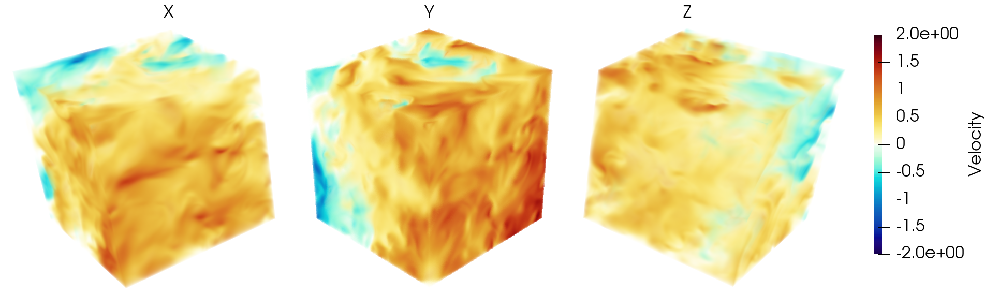
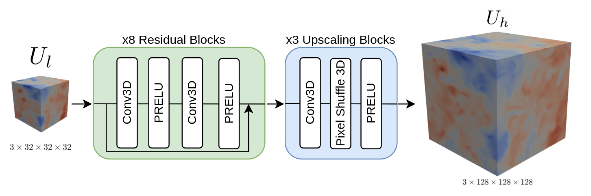
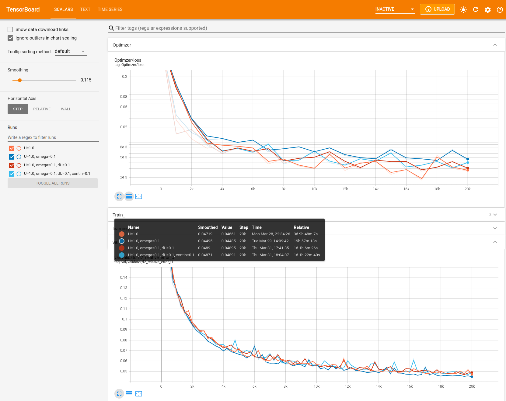
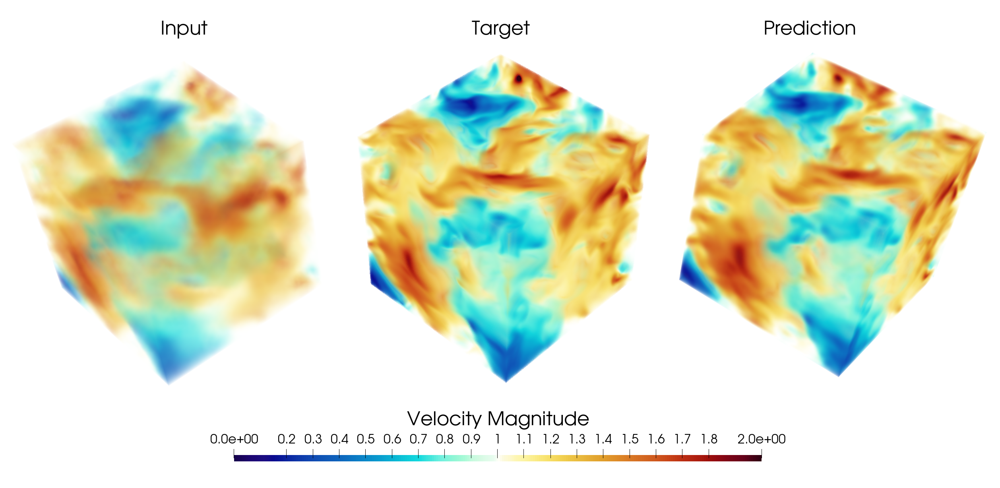
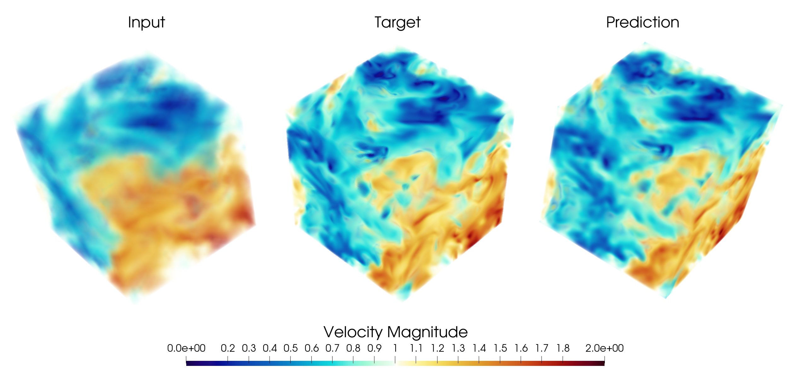

# Turbulence Super Resolution

[公式ページ](https://docs.nvidia.com/deeplearning/modulus/modulus-sym/user_guide/intermediate/turbulence_super_resolution.html)

## Introduction

この例では、Modulus Symを使用して、ジョンズ・ホプキンス・タービュランス・データベース <http://turbulence.pha.jhu.edu/>_ で提供されるフィルタリングされた低解像度の観測から高忠実度な均一等方性乱流場を予測するための超解像代替モデルをトレーニングします。
このモデルでは、標準のデータ駆動学習と、特定の問題に特化した独自のデータ駆動損失関数の定義方法を組み合わせます。
この例では、以下のことを学びます：

    Modulus Symでデータ駆動畳み込みニューラルネットワークモデルを使用する方法

    カスタムデータ駆動損失と制約の定義方法

    カスタムデータ駆動検証器の定義方法

    構造化/グリッドデータ向けのModulus Symの機能

    問題構成ファイルにカスタムパラメータを追加する方法

Note :
このチュートリアルでは、Lid Driven Cavity flowの:ref:Introductory Exampleチュートリアルを完了し、Modulus Symの基礎を理解していることを前提としています。
また、Modulus Symの畳み込みモデルである:ref:pix2pixと:ref:super_resについて基本的な理解を持っていることも前提としています。

Warning :
この例でトレーニングおよび検証データセットをダウンロードおよび処理するために、Pythonパッケージ pyJHTDB <https://github.com/idies/pyJHTDB>_ が必要です。
pip install pyJHTDB を使用してインストールしてください。

## Problem Description

この問題の目的は、低解像度のフィルタリングされた3次元流れ場から高品質な解へのマッピングを学習することです。
流れ場は、解像度 $1024^{3}$ で元々シミュレートされた、強制的な等方性乱流の直接数値シミュレーションのサンプルです。
このシミュレーションは、強制的なナビエ・ストークス方程式を解きます。

$$
\frac{\partial \textbf{u}}{\partial t} + \textbf{u} \cdot \nabla \textbf{u} = -\nabla p /\rho + \nu \nabla^{2}\textbf{u} + \textbf{f}
$$

強制項 $\textbf{f}$ は、シミュレーションにエネルギーを注入し、一定の総エネルギーを維持するために使用されます。
このデータセットには、0から10.05秒までの5028の時間ステップが含まれており、元の擬似スペクトルシミュレーションから10の時間ステップごとにサンプリングされています。



Fig. 137 Snap shot of $128^{3}$ isotropic turbulence velocity fields

この問題の目標は、等方性乱流データセット内の任意の低解像度サンプル $\textbf{U}{l} \sim p(\textbf{U}{l})$ に対する、低解像度速度場 $\textbf{U}{l} = \left{u{l}, v_{l}, w_{l}\right}$ から真の高解像度速度場 $\textbf{U}{h} = \left{u{h}, v_{h}, w_{h}\right}$ のマッピングを学習する代替モデルを構築することです。
完全なシミュレーション領域のサイズのため、このチュートリアルでは、代替モデルが低解像度の次元 $32^{3}$ から高解像度の次元 $128^{3}$ に学習するように、より小さなボリュームの予測に焦点を当てています。
このチュートリアルでは、:ref:super_res を使用しますが、必要に応じて :ref:pix2pix もこの問題に統合されており、代わりに使用することができます。



Fig. 138 Super resolution network for predicting high-resolution turbulent flow from low-resolution input

## Writing a Custom Data-Driven Constraint

この例では、独自のデータ駆動型制約を書く方法を示しています。Modulus Symには、構造化データ用の標準的な教師あり学習制約である「SupervisedGridConstraint」が付属しており、これは「darcy_fno」の例で使用されています。しかし、特定の問題に特化した損失を持ちたい場合は、基本となる「GridConstraint」を拡張することができます。ここでは、速度、連続性、渦度、エンストロフィ、ひずみ率などの流体流れに関するさまざまな測定間で損失を設定できる制約を設定します。

Note :
この問題のPythonスクリプトは、「examples/super_resolution/super_resolution.py」にあります。

```python
class SuperResolutionConstraint(Constraint):
    def __init__(
        self,
        nodes: List[Node],
        invar: Dict[str, np.array],
        outvar: Dict[str, np.array],
        batch_size: int,
        loss_weighting: Dict[str, int],
        dx: float = 1.0,
        lambda_weighting: Dict[str, Union[np.array, sp.Basic]] = None,
        num_workers: int = 0,
    ):
        dataset = DictGridDataset(
            invar=invar, outvar=outvar, lambda_weighting=lambda_weighting
        )
        super().__init__(
            nodes=nodes,
            dataset=dataset,
            loss=PointwiseLossNorm(),
            batch_size=batch_size,
            shuffle=True,
            drop_last=True,
            num_workers=num_workers,
        )

        self.dx = dx
        self.ops = FlowOps().to(self.device)

        self.loss_weighting = {}
        self.fields = set("U")
        for key, value in loss_weighting.items():
            if float(value) > 0:
                self.fields = set(key).union(self.fields)
                self.loss_weighting[key] = value
```

重要な点は、構成ファイルから提供される「loss_weighting」辞書を使用して、どの損失を貢献させたいかを制御できることです。これらの各測定値は、「examples/super_resolution/ops.py」で計算されており、詳細についてはそちらを参照できます。ただし、一般的な概念として、有限差分法が流れ場とその後の測定値の勾配を計算するために使用されます。

```python
def calc_flow_stats(self, data_var):
        output = {"U": data_var["U"]}
        vel_output = {}
        cont_output = {}
        vort_output = {}
        enst_output = {}
        strain_output = {}
        # compute derivatives
        if len(self.fields) > 1:
            grad_output = self.ops.get_velocity_grad(
                data_var["U"], dx=self.dx, dy=self.dx, dz=self.dx
            )
        # compute continuity
        if "continuity" in self.fields:
            cont_output = self.ops.get_continuity_residual(grad_output)
        # compute vorticity
        if "omega" in self.fields or "enstrophy" in self.fields:
            vort_output = self.ops.get_vorticity(grad_output)
        # compute enstrophy
        if "enstrophy" in self.fields:
            enst_output = self.ops.get_enstrophy(vort_output)
        # compute strain rate
        if "strain" in self.fields:
            strain_output = self.ops.get_strain_rate_mag(grad_output)

        if "dU" in self.fields:
            # Add to output dictionary
            grad_output = torch.cat(
                [
                    grad_output[key]
                    for key in [
                        "u__x",
                        "u__y",
                        "u__z",
                        "v__x",
                        "v__y",
                        "v__z",
                        "w__x",
                        "w__y",
                        "w__z",
                    ]
                ],
                dim=1,
            )
            vel_output = {"dU": grad_output}

        if "omega" in self.fields:
            vort_output = torch.cat(
                [vort_output[key] for key in ["omega_x", "omega_y", "omega_z"]], dim=1
            )
            vort_output = {"omega": vort_output}

        output.update(vel_output)
        output.update(cont_output)
        output.update(vort_output)
        output.update(enst_output)
        output.update(strain_output)
        return output
```

予測された速度場と目標速度場の間の相対MSEを計算するカスタムメソッドで損失計算を上書きし、その際に重み辞書「self.loss_weighting」で定義された流れの測定値を使用します。

```python
def loss(self, step: int) -> Dict[str, torch.Tensor]:
        # Calc flow related stats
        pred_outvar = self.calc_flow_stats(self._pred_outvar)
        target_vars = self.calc_flow_stats(self._target_vars)

        # compute losses
        losses = {}
        for key in target_vars.keys():
            mean = (target_vars[key] ** 2).mean()
            losses[key] = (
                self.loss_weighting[key]
                * (((pred_outvar[key] - target_vars[key]) ** 2) / mean).mean()
            )

        return losses
```

この問題の完全な損失は以下の通りです：

$$
\mathcal{L} = RMSE(\hat{U}_{h}, U_{h}) + \lambda_{dU}RMSE(\hat{dU}_{h}, dU_{h}) + \lambda_{cont}RMSE(\nabla\cdot\hat{U}_{h}, \nabla\cdot U_{h}) + \lambda_{\omega}RMSE(\hat{\omega}_{h}, \omega_{h}) \\
+ \lambda_{strain}RMSE(|\hat{D}|_{h}, |D|_{h}) + \lambda_{enst}RMSE(\hat{\epsilon}_{h}, \epsilon_{h})
$$

ここで、$\hat{U}_{h}$はニューラルネットワークからの予測であり、$U_{h}$は目標値です。
$dU$は速度テンソル、$\omega$は渦度、$|D|$はひずみ率の大きさ、$\epsilon$は流れのエンストロピーです。
これらすべては、設定ファイルのcustom.loss_weights構成グループでオン/オフにできます。

## Writing a Custom Data-Driven Validator

同様に、入力と出力の次元が異なるため、Modulus Symの組み込みのGridValidatorはすべてのテンソルが同じサイズであることを期待しているため機能しません。
これを拡張して、高解像度の出力と低解像度の出力を個別のVTK一様格子ファイルに書き出すことが簡単にできます。

```python
class SuperResolutionValidator(GridValidator):
    def __init__(self, *args, log_iter: bool = False, **kwargs):
        super().__init__(*args, **kwargs)
        self.log_iter = log_iter
        self.device = DistributedManager().device

    def save_results(self, name, results_dir, writer, save_filetypes, step):
        invar_cpu = {key: [] for key in self.dataset.invar_keys}
        true_outvar_cpu = {key: [] for key in self.dataset.outvar_keys}
        pred_outvar_cpu = {key: [] for key in self.dataset.outvar_keys}
        # Loop through mini-batches
        for i, (invar0, true_outvar0, lambda_weighting) in enumerate(self.dataloader):
            # Move data to device (may need gradients in future, if so requires_grad=True)
            invar = Constraint._set_device(
                invar0, device=self.device, requires_grad=self.requires_grad
            )
            true_outvar = Constraint._set_device(
                true_outvar0, device=self.device, requires_grad=self.requires_grad
            )
            pred_outvar = self.forward(invar)

            # Collect minibatch info into cpu dictionaries
            invar_cpu = {
                key: value + [invar[key].cpu().detach()]
                for key, value in invar_cpu.items()
            }
            true_outvar_cpu = {
                key: value + [true_outvar[key].cpu().detach()]
                for key, value in true_outvar_cpu.items()
            }
            pred_outvar_cpu = {
                key: value + [pred_outvar[key].cpu().detach()]
                for key, value in pred_outvar_cpu.items()
            }

        # Concat mini-batch tensors
        invar_cpu = {key: torch.cat(value) for key, value in invar_cpu.items()}
        true_outvar_cpu = {
            key: torch.cat(value) for key, value in true_outvar_cpu.items()
        }
        pred_outvar_cpu = {
            key: torch.cat(value) for key, value in pred_outvar_cpu.items()
        }
        # compute losses on cpu
        losses = GridValidator._l2_relative_error(true_outvar_cpu, pred_outvar_cpu)

        # convert to numpy arrays
        invar = {k: v.numpy() for k, v in invar_cpu.items()}
        true_outvar = {k: v.numpy() for k, v in true_outvar_cpu.items()}
        pred_outvar = {k: v.numpy() for k, v in pred_outvar_cpu.items()}

        # save batch to vtk file
        named_target_outvar = {"true_" + k: v for k, v in true_outvar.items()}
        named_pred_outvar = {"pred_" + k: v for k, v in pred_outvar.items()}
        for b in range(min(4, next(iter(invar.values())).shape[0])):
            if self.log_iter:
                grid_to_vtk(
                    {**named_target_outvar, **named_pred_outvar},
                    results_dir + name + f"_{b}_hr" + f"{step:06}",
                    batch_index=b,
                )
            else:
                grid_to_vtk(
                    {**named_target_outvar, **named_pred_outvar},
                    results_dir + name + f"_{b}_hr",
                    batch_index=b,
                )
            grid_to_vtk(invar, results_dir + name + f"_{b}_lr", batch_index=b)

        # add tensorboard plots
        if self.plotter is not None:
            self.plotter._add_figures(
                name,
                results_dir,
                writer,
                step,
                invar,
                true_outvar,
                pred_outvar,
            )

        # add tensorboard scalars
        for k, loss in losses.items():
            writer.add_scalar("val/" + name + "/" + k, loss, step, new_style=True)
```

ここでは、Modulus Symのgrid_to_vtk関数が使用されており、テンソルデータをVTKイメージデータセット（一様グリッド）に書き込みます。その後、Paraviewで表示することができます。
データが構造化されている場合、VTKイメージデータセットのメモリフットプリントがVTKポリデータセットよりも低いため、grid_to_vtkをvar_to_polyvtkよりも優先します。

## Case Setup

次に進む前に、この問題は最初の実行時にデータセットをダウンロードする必要があることに注意することが重要です。
Johns Hopkins Turbulence Database <http://turbulence.pha.jhu.edu/>_ からデータセットをダウンロードするには、アクセストークンをリクエストする必要があります。
このプロセスに関する情報は、データベースのウェブサイト <http://turbulence.pha.jhu.edu/authtoken.aspx>_ で確認できます。
取得したら、指定された場所の構成でデフォルトのトークンを上書きしてください。
データをダウンロードするために使用されるユーティリティはexamples/super_resolution/jhtdb_utils.pyにありますが、このチュートリアルでは議論されません。

Warning :
Johns Hopkins Turbulence Databaseのアクセストークンを取得し、登録することで、データセット自体の利用規約に同意することになります。この例はアクセストークンなしでは動作しません。

Warning :
デフォルトのトレーニングデータセットのサイズは512サンプルであり、検証データセットのサイズは16サンプルです。ダウンロードには、インターネット接続の速度に応じて数時間かかる場合があります。データの合計メモリフットプリントは約13.5ギガバイトです。設定ファイルでより小さなデータセットを設定することもできます。

### Configuration

この例の設定ファイルは以下の通りです。スーパーレゾリューションとpix2pixのエンコーダーデコーダーアーキテクチャの両方をテストするために、構成が含まれていることに注意してください。

```yaml
# Copyright (c) 2023, NVIDIA CORPORATION & AFFILIATES. All rights reserved.
#
# Licensed under the Apache License, Version 2.0 (the "License");
# you may not use this file except in compliance with the License.
# You may obtain a copy of the License at
#
# http://www.apache.org/licenses/LICENSE-2.0
#
# Unless required by applicable law or agreed to in writing, software
# distributed under the License is distributed on an "AS IS" BASIS,
# WITHOUT WARRANTIES OR CONDITIONS OF ANY KIND, either express or implied.
# See the License for the specific language governing permissions and
# limitations under the License.

defaults:
  - modulus_default
  - /arch/super_res_cfg@arch.super_res
  - /arch/pix2pix_cfg@arch.pix2pix
  - scheduler: tf_exponential_lr
  - optimizer: adam
  - loss: sum
  - _self_

jit: True
cuda_graphs: False # Graphs does not work with super res network

arch:
  super_res:
    scaling_factor: 4
  pix2pix:
    batch_norm: True
    n_downsampling: 1
    n_blocks: 9
    dimension: 3
    scaling_factor: 4

scheduler:
  decay_rate: 0.95
  decay_steps: 2000

optimizer:
  lr: 0.0001

training:
  rec_validation_freq: 250
  rec_constraint_freq: 250
  save_network_freq: 250
  print_stats_freq: 25
  max_steps: 20000

batch_size:
  train: 4
  valid: 4

custom:
  jhtdb:
    n_train: 512
    n_valid: 16
    domain_size: 128
    access_token: "edu.jhu.pha.turbulence.testing-201311" #Replace with your own token here

  loss_weights:
    U: 1.0
    dU: 0
    continuity: 0
    omega: 0.1
    enstrophy: 0
    strain: 0
```

「custom」構成グループは、Modulus Symの内部で使用されないケース固有のパラメータを保存するために使用できます。
ここでは、データセットのサイズ、流体容積のドメインサイズ、およびデータベースアクセストークンに関連するパラメータを定義するために、このグループを使用できます。ただし、アクセストークンは自分のもので置き換える必要があります！

Note :
データベースアクセストークンなしで、単なるおもちゃのデータセットでモデルをテストする場合は、以下の設定を使用することをお勧めします。

``` yaml
jhtdb:
    n_train: 4
    n_valid: 1
    domain_size: 16
    access_token: "edu.jhu.pha.turbulence.testing-201311" 
```

### Loading Data

データセットをメモリに読み込むために、以下のユーティリティを使用します。

```python
# load jhtdb datasets
    invar, outvar = make_jhtdb_dataset(
        nr_samples=cfg.custom.jhtdb.n_train,
        domain_size=cfg.custom.jhtdb.domain_size,
        lr_factor=cfg.arch.super_res.scaling_factor,
        token=cfg.custom.jhtdb.access_token,
        data_dir=to_absolute_path("datasets/jhtdb_training"),
        time_range=[1, 768],
        dataset_seed=123,
    )

    invar_valid, outvar_valid = make_jhtdb_dataset(
        nr_samples=cfg.custom.jhtdb.n_valid,
        domain_size=cfg.custom.jhtdb.domain_size,
        lr_factor=cfg.arch.super_res.scaling_factor,
        token=cfg.custom.jhtdb.access_token,
        data_dir=to_absolute_path("datasets/jhtdb_valid"),
        time_range=[768, 1024],
        dataset_seed=124,
    )
```

これにより、データセットがローカルにダウンロードされ、キャッシュされます。そのため、実行ごとにダウンロードする必要はありません。

### Initializing the Model

ここでは、標準的な Modulus Sym プロセスに従ってモデルを初期化します。
入力と出力のキーには、size=3 という指定があります。これは、これらの変数が 3 次元（速度成分）であることを Modulus Sym に伝えるものです。

```python
model = instantiate_arch(
        input_keys=[Key("U_lr", size=3)],
        output_keys=[Key("U", size=3)],
        cfg=cfg.arch.super_res,
    )
    nodes = [model.make_node(name="super_res")]
```

### Adding Data Constraints 

```python
# make super resolution domain
    jhtdb_domain = Domain()

    # make data driven constraint
    jhtdb_constraint = SuperResolutionConstraint(
        nodes=nodes,
        invar=invar,
        outvar=outvar,
        batch_size=cfg.batch_size.train,
        loss_weighting=cfg.custom.loss_weights,
        lambda_weighting=None,
        dx=2 * np.pi / 1024.0,
    )
    jhtdb_domain.add_constraint(jhtdb_constraint, "constraint")
```

### Adding Data Validator

```python
# make validator
    dataset = DictGridDataset(invar_valid, outvar_valid)
    jhtdb_validator = SuperResolutionValidator(
        dataset=dataset,
        nodes=nodes,
        batch_size=cfg.batch_size.valid,
        log_iter=False,
    )
    jhtdb_domain.add_validator(jhtdb_validator, "validator")
```

### Training the Model

NVIDIAは、最初の実行を単一のGPUで行うことをお勧めします。データセットをダウンロードするのはルートプロセスのみであり、他のプロセスは待機状態になります。

``` bash
python super_resolution.py
```

しかし、データセットがダウンロードされた後は、この問題に対して並列トレーニングが推奨されています。この例では、以下のコマンドを使用して、4つのV100 GPUでOpen MPIを介して実行されました。

``` bash
mpirun -np 4 python super_resolution.py
```

### Results and Post-processing

この例では、設定を介して制御可能なカスタムデータ駆動型損失の設定方法が示されており、複数の異なる損失コンポーネントがモデルのパフォーマンスに与える影響を比較できます。
TensorBoardのプロットは以下に示されており、検証データセットの損失が最も下のグラフに表示されます。
潜在的な損失コンポーネントの数が多いため、ここではごく一部のみが比較されています。

```U=1.0```: $\mathcal{L} = RMSE(\hat{U}_{h}, U_{h})$

```U=1.0, omega=0.1```:  $\mathcal{L} = RMSE(\hat{U}_{h}, U_{h}) + 0.1RMSE(\hat{\omega}_{h}, \omega_{h})$

```U=1.0, omega=0.1, dU=0.1```: $\mathcal{L} = RMSE(\hat{U}_{h}, U_{h}) + 0.1RMSE(\hat{\omega}_{h}, \omega_{h}) + 0.1RMSE(\hat{dU}_{h}, dU_{h})$

```U=1.0, omega=0.1, dU=0.1, contin=0.1```: $\mathcal{L} = RMSE(\hat{U}_{h}, U_{h}) + 0.1RMSE(\hat{\omega}_{h}, \omega_{h}) + 0.1RMSE(\hat{dU}_{h}, dU_{h}) + 0.1RMSE(\nabla\cdot\hat{U}_{h}, \nabla\cdot U_{h})$

検証エラーは、予測された高解像度速度場と真の速度場との間のL2相対誤差です。
損失方程式に渦度を含めると、モデルの精度が向上することがわかりますが、他の項目を含めると精度が向上しないことがわかります。
追加の流体測定値の損失組み合わせは、過去の研究で成功を収めています [#geneva2020multi]_ [#subramaniam2020turbulence]_。
ただし、追加の損失は、最適化をモデルにとってより困難にする可能性があり、精度に悪影響を及ぼす可能性があります。



Fig. 139 Tensorboard plot comparing different loss functions for turbulence super-resolution

出力のVTKファイルは、'outputs/super_resolution/validators'フォルダにあります。これらはParaviewで表示できます。
下の速度マグニチュード場の体積プロットを見ると、モデルが低解像度の速度場を劇的に改善していることがわかります。



Fig. 140 Velocity magnitude for a validation case using the super resolution model for predicting turbulence



Fig. 141 Velocity magnitude for a validation case using the super resolution model for predicting turbulence

## References

.. [#geneva2020multi] Geneva, Nicholas and Zabaras, Nicholas. "Multi-fidelity generative deep learning turbulent flows" Foundations of Data Science (2020).

.. [#subramaniam2020turbulence] Subramaniam, Akshay et al. "Turbulence enrichment using physics-informed generative adversarial networks" arXiv preprint arXiv:2003.01907 (2020).
