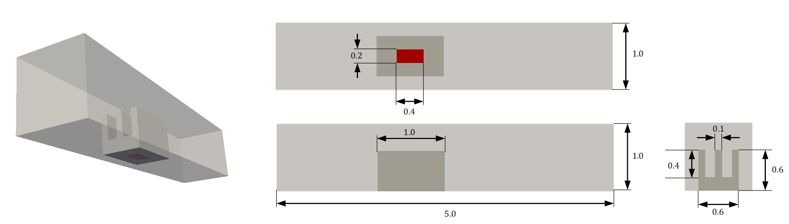
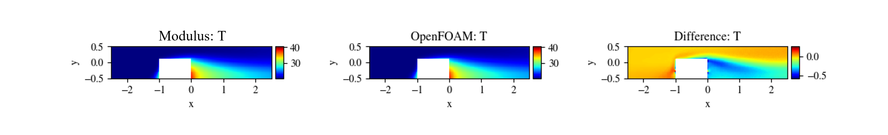
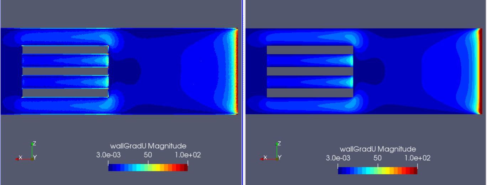

# Conjugate Heat Transfer

[公式ページ](https://docs.nvidia.com/deeplearning/modulus/modulus-sym/user_guide/advanced/conjugate_heat_transfer.html)

## Introduction

このチュートリアルでは、Modulus Symを使用してヒートシンクと周囲の流体の間の共役熱伝達を研究します。固体および流体内の温度変動は、適切な界面境界条件と組み合わせて解かれます。このチュートリアルでは、以下のことを学びます：

1. Modulus Symのジオメトリモジュールを使用して3Dジオメトリを生成する方法。
2. Modulus Symの界面境界条件を使用して共役熱伝達問題を設定する方法。
3. Modulus Symのマルチフェーズトレーニングアプローチを使用して、片方向結合された問題に対処する方法。

Note :
このチュートリアルでは、:ref:Introductory Exampleチュートリアルを完了し、Modulus Sym APIの基本を習得していることを前提としています。また、いくつかの熱境界条件の記述に関する詳細については、:ref:advection-diffusionチュートリアルを確認する必要があります。

Note :
この問題で使用されるスクリプトは、examples/three_fin_3d/で見つけることができます。これらのスクリプトは、Hydraの設定を構成するだけで、同じ三枚のフィンの問題を高いレイノルズ数やパラメータ化されたジオメトリなどに対応させることができるようになっています。この例では、このチュートリアルの目的がマルチフェーズトレーニングと共役熱伝達に関連するアイデアをカバーすることであるため、これをラミナー変型のものに焦点を当てています。:ref:ParameterizedSimチュートリアルでは、この問題のパラメータ化の側面に焦点を当てています。

したがって、この問題では、turbulentとparameterizedのカスタム設定がどちらもfalseに設定されています。

## Problem Description

3つのフィンのヒートシンクがチャネル内に配置されたジオメトリは、:numref:fig-threeFin_heatsinkに示されています。チャネルの入口は1 $m/s$です。出口の圧力は0 $Pa$として指定されています。ジオメトリの他のすべての表面は、ノースリップ壁として扱われます。



Fig. 142 Three fin heat sink geometry (All dimensions in $m`)

入口温度は273.15 $K$です。チャネル壁は断熱です。ヒートシンクには、底面の中央にある $0.2 \times 0.4$ $m$ の熱源があります。この熱源は、表面に垂直な方向で表面の温度勾配が360 $K/m$となるように熱を発生させます。流体と固体の接触面で共役熱伝達が行われます。

流体と固体の熱物性は次の通りです：

Table 5 Fluid and Solid Properties

|Property                       |Fluid |Solid |
|-------------------------------|------|------|
|Kinematic Viscosity $(m^2/s)$  |0.02  |NA    |
|Thermal Diffusivity $(m^2/s)$  |0.02  |0.0625|
|Thermal Conductivity $(W/m.K)$ |1.0   |5.0   |

## Case Setup

このチュートリアルでは、非圧縮流体のみを扱っているため、熱と流れの方程式の間に片方向の結合があります。つまり、流れ場が訓練され収束した後に温度場を訓練することが可能です。このようなアプローチは、片方向結合されたマルチフィジックス問題を訓練する際に便利であり、同じ流れ境界条件を持つが異なる熱境界条件を持つケースをシミュレートすることが可能です。異なる熱境界条件のために訓練するためには、同じ流れ場を入力として簡単に使用できます。

したがって、この問題では、ジオメトリ、流れソルバー、および熱ソルバーのために3つの別々のファイルがあります。three_fin_geometry.pyにはジオメトリのすべての定義が含まれます。three_fin_flow.pyとthree_fin_thermal.pyは、このジオメトリを使用して関連する流れと熱の制約を設定し、それらを個別に解決します。基本的な考え方は、流れモデルを収束させるために訓練し、その後、訓練された流れモデルから初期化して温度分布を同時に流体と固体で解決するために熱トレーニングを開始することです。

この問題では、次の方程式に従って温度を無次元化します：

$$
\theta= T/273.15 - 1.0
$$

## Creating Geometry

「three_fin_geometry.py」スクリプトには、ジオメトリ生成に関連するすべての詳細が含まれています。
3つのフィンのジオメトリを作成するために「Box」プリミティブを使用し、「Channel」プリミティブを使用してチャネルを生成します。
2Dと同様に、「Channel」と「Box」は2つの端点を使用して定義されます。2Dと同様に、「Channel」ジオメトリにはx方向に境界面がありません。
また、「repeat」メソッドを使用してフィンを作成します。これにより、同じジオメトリを個別に構築し、ブール演算を行ってそれらを組み立てるよりも、繰り返し構造の生成が高速化されます。

次のコードは、必要なジオメトリを生成するためのものです。入口と出口の平面の法線方向に注意してください。

また、熱の解決に必要なパラメータも事前に定義されています。例えば、熱源の寸法や位置などです。

注意：スクリプトには、パラメータ化されたジオメトリにのみ関連するいくつかの追加の定義が含まれています。このチュートリアルでは関係ありません。

```python

```

## Neural network, Nodes and Multi-Phase training

この問題の流れと熱を解決するために必要なネットワークとノードを見てみましょう。流れの問題のアーキテクチャとノードは以前のチュートリアルと非常に類似しています。NavierStokesとNormalDotVecのノードを追加し、座標を入力とし、速度成分と圧力を出力とする単一の流れネットワークを作成します。流れのノードのコードはこちらにあります：

```python

```

熱のノードを追加する場合、まず、この問題に関連するさまざまな熱境界条件を定義するために使用されるAdvectionDiffusion、Diffusion、DiffusionInterface、およびGradNormalなどの関連する方程式のノードを追加します。また、3つの別々のニューラルネットワークflow_net、thermal_f_net、thermal_s_netを作成します。最初のものは、流れスクリプトで定義された同じ流れネットワークです。熱スクリプト内のこのネットワークアーキテクチャの定義は、流れモデルの熱トレーニング中の正常な初期化のために、流れスクリプトと完全に一致している必要があります。熱トレーニング中に流れネットワークを最適化しないようにするために、流れネットワークのノードを作成する際にoptimize引数をFalseに設定します。最後に、流体と固体内の温度を予測するための別々のネットワークが作成されます。

```python

```

## Setting up Flow Domain and Constraints

「three_fin_flow.py」スクリプトの内容は以下の通りです。

### Inlet, Outlet and Channel and Heat Sink walls

入口境界条件では、x方向に1.0 $m/s$の一定速度を指定します。:ref:Introductory Exampleのチュートリアルと同様に、チャネルのSDFで速度を重み付けして、境界での急激な不連続性を回避します。出口では、圧力を0に指定します。チャネルの壁とヒートシンクの壁はすべてノースリップ境界として扱われます。

### Interior

問題の低解像度領域と高解像度領域で流れ方程式を指定するには、PointwiseInteriorConstraintを使用します。これにより、これらの2つの領域で独立したポイント密度を簡単に制御できます。

### Integral Continuity

入口の容積流量は1 $m^3/s$なので、「integral_continuity」キーの値を1.0と指定します。

流れ領域のコードは以下の通りです。

```python
```

Note :
積分連続性面の追加と密なサンプリングのための別々の流れボックスの追加は、トレーニングデータの追加と問題のユーザー知識/バイアスの例です。この追加は、精度と収束性を大幅に向上させるのに役立ち、可能な限り推奨されます。

## Setting up Thermal Multi-Phase Domain and Constraints

The contents of ``three_fin_thermal.py`` are described below.

### Inlet, Outlet and Channel walls

For the heat part, specify temperature at the inlet. All the
outlet and the channel walls will have a zero gradient boundary
condition which will be enforced by setting
``'normal_gradient_theta_f'`` equal to 0. We will use ``'theta_f'`` for
defining the temperatures in fluid and ``'theta_s'`` for defining the
temperatures in solid.

### Fluid and Solid Interior

:ref:advection-diffusionチュートリアルと同様に、低解像度と高解像度の流体領域の両方で'advection_diffusion'を0に設定します。固体内部では、'diffusion'を0に設定します。

### Fluid-Solid Interface

流体と固体の間の界面では、両方の境界条件をニューマンおよびディリクレ境界条件で強制するために、'diffusion_interface_dirichlet_theta_f_theta_s'と'diffusion_interface_neumann_theta_f_theta_s'をどちらも0に設定します。

Note :
界面境界条件で'theta_f'と'theta_s'を定義する順序は、PDE定義のDiffusionInterfaceと一致させる必要があります。グラフ展開エラーを回避するためには、対応する導電率もPDE定義で同じ順序で指定する必要があります。

## Heat Source

ヒートシンクの底面に熱源を定義する際に、$tanh$スムージングを適用します。急な境界をなめらかにすることは、ニューラルネットワークの収束を速めるのに役立ちます。ヒートシンクの底面で、熱源の領域では'normal_gradient_theta_s'をgrad_tに設定し、他のすべての場所で0に設定します。

ヒート領域のコードは以下の通りです。

```python
```

## Adding Validators and Monitors

このチュートリアルでは、流れ場シミュレーション中の圧力降下を監視し、熱シミュレーション中にソースチップでのピーク温度を監視します。

同様に、流れと熱のスクリプトに対応する検証データが追加されています。簡潔にするために、流れのモニターと検証機能のみを示します。

流れスクリプトのモニターと検証機能：

```python
```

## Training the Model

流れと熱のスクリプトが定義されたら、まずthree_fin_flow.pyを実行して流れ場を解決します。所望の収束レベルが達成されたら、three_fin_thermal.pyを実行して熱を解決できます。

## Results and Post-processing

下の表と図は、Modulus Symから得られた圧力降下とピーク温度の結果を示し、それをOpenFOAMソルバーの結果と比較しています。

Table 6 Comparisons of Results with OpenFOAM

|                                |Modulus Sym|OpenFOAM|
|--------------------------------|-----------|--------|
|Pressure Drop $(Pa)$            |7.51       |7.49    |
|Peak Temperature $(^{\circ} C)$ |78.35      |78.05   |


Fig. 143 Left: Modulus Sym. Center: OpenFOAM. Right: Difference. Top: Temperature distribution in Fluid. Bottom: Temperature distribution in Solid (*Temperature scales in C*)



Fig. 144 Left:  Modulus Sym. Center: OpenFOAM. Right: Difference. (*Temperature scales in C*)

## Plotting gradient quantities: Wall Velocity Gradients

様々なアプリケーションでは、ドメイン内のいくつかの量の勾配をプロットすることが望ましい場合があります。流体流れに関連する例として、壁の速度勾配と壁せん断応力が挙げられます。これらの量は、摩擦力などを計算するためにしばしばプロットされます。PointwiseInferencerを使用して、希望する変数の$x$、$y$、$z$の導関数を出力することで、Modulus Symでそのような量を視覚化できます。

```python
# add inferencer
inferencer = PointwiseInferencer(
    geo.sample_boundary(4000, parameterization=pr),
    ["u__x", "u__y", "u__z", 
    "v__x", "v__y", "v__z",
    "w__x", "w__y", "w__z"],
    nodes=flow_nodes,
)
flow_domain.add_inferencer(inferencer, "inf_data")
```

その後、選択した変数を視覚化するためにこれらの量を後処理できます。以下のプロットでは、ParaviewのCalculator Filter <https://kitware.github.io/paraview-docs/latest/python/paraview.simple.Calculator.html>_ が使用されました。OpenFOAMとModulus Symの壁の速度勾配の比較は、:numref:fig-3d_heat_sink_wall_velGradに示されています。



Fig. 145 Comparison of magnitude of wall velocity gradients. Left: Modulus Sym. Right: OpenFOAM
