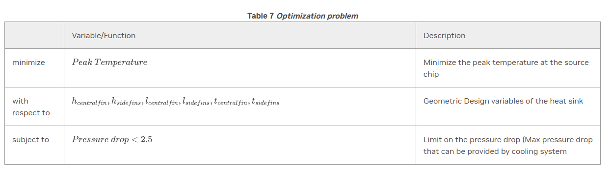

# Parameterized 3D Heat Sink

[公式ページ](https://docs.nvidia.com/deeplearning/modulus/modulus-sym/user_guide/advanced/parametrized_simulations.html)

## Introduction

このチュートリアルでは、Modulus Symを使用してパラメータ化された問題のシミュレーションプロセスを紹介します。Modulus Symのニューラルネットワークを使用すると、単一のトレーニングで複数のパラメータ/独立変数に対する問題を解決できます。これらのパラメータは、幾何変数、PDEの係数、または境界条件である場合があります。トレーニングが完了すると、順方向の問題を再解決することなく、複数の幾何学/物理パラメータの組み合わせで推論を実行することが可能です。このようなパラメータ化は、所望の設計空間全体を解決する際に、計算コストをわずかに増加させるだけであることがわかります。

この機能をデモンストレーションするために、この例では、フィンの高さ、フィンの厚さ、およびフィンの長さが可変である3フィンヒートシンクの流れと熱を解決します。次に、ヒートシンクの例で最適なフィン構成を見つけるために設計最適化を実行します。このチュートリアルの終わりまでに、Modulus SymのCSGモジュールとニューラルネットワークソルバーを使用して、どのようなシミュレーションでも簡単にパラメトリック設計調査に変換する方法を学びます。このチュートリアルでは、以下の内容を学びます:

1. Modulus Symでパラメトリックシミュレーションを設定する方法。

Note :
このチュートリアルは、Modulus Symを使用して共役熱問題を解決する方法について説明したチュートリアル :ref:cht の拡張です。このチュートリアルでは、同じ幾何学的設定を使用して、増加したレイノルズ数でパラメータ化された設定で解決します。そのため、幾何学的仕様や境界条件に関する追加の詳細については、チュートリアル :ref:cht を参照することを推奨します。

チュートリアル :ref:cht で使用された同じスクリプトが使用されます。シミュレーションをパラメータ化して乱流化するには、構成ファイルでカスタムフラグ「parameterized」と「turbulent」をどちらも「true」に設定します。

Note :
このチュートリアルでは、解決されている物理に独立したパラメータ化に焦点を当てます。これは、ユーザーガイドでカバーされている任意の問題クラスに適用できます。

## Problem Description

チュートリアル :ref:cht の3フィンヒートシンクの幾何学と境界条件を参照してください。この問題をパラメータ化して、単一のニューラルネットワークトレーニングで複数のヒートシンク設計を解決します。ヒートシンクのフィンの寸法（厚さ、長さ、高さ）を変更して、さまざまなヒートシンクの設計空間を作成します。この場合のReは500であり、ゼロ方程式乱流モデルを使用して乱流を取り込みます。

この問題では、中央フィンと両サイドフィンの高さ (:math:h)、長さ (:math:l)、および厚さ (:math:t) を変化させます。両サイドフィンの高さ、長さ、および厚さは同じままであり、したがって、合計6つの幾何学パラメータがあります。これらの幾何学パラメータの変動範囲は、式 :eq:param_ranges で与えられています。

$$
\begin{split}
h_{central fin} &= (0.0, 0.6),\\
h_{side fins} &= (0.0, 0.6),\\
l_{central fin} &= (0.5, 1.0) \\
l_{side fins} &= (0.5, 1.0) \\
t_{central fin} &= (0.05, 0.15) \\
t_{side fins} &= (0.05, 0.15)
\end{split}
$$


Fig. 146 Examples of some of the 3 Fin geometries covered in the chosen design space

## Case Setup

このチュートリアルでは、Modulus Symの3Dジオメトリモジュールを使用して、パラメータ化された3フィンヒートシンクのジオメトリを作成します。離散的なパラメータ化は、解に不連続性をもたらす場合があり、トレーニングを困難にすることがあります。したがって、このチュートリアルでは連続的なパラメータのみをカバーします。また、パラメータ化されたモデルをトレーニングし、次に、$h_{中央フィン}=0.4$、$h_{側面フィン}=0.4$、$l_{中央フィン}=1.0$、$l_{側面フィン}=1.0$、$t_{中央フィン}=0.1$、および $t_{側面フィン}=0.1$ の場合の推論を実行することで、モデルの検証を行います。チュートリアルの最後には、パラメータ化されたモデルから得られた上記のパラメータの組み合わせの結果と、同じ値のセットに対応する単一のジオメトリにトレーニングされた非パラメータ化モデルから得られた結果とを比較します。これにより、パラメータ化されたシミュレーションを行う際のPINNsの有用性が、いくつかの伝統的な方法と比較して強調されます。

問題の定義とセットアップの大部分は :ref:cht でカバーされているため、このチュートリアルではパラメータ化の重要な要素にのみ焦点を当てます。

## Creating Nodes and Architecture for Parameterized Problems

選択された変数のパラメータは、ニューラルネットワークへの追加入力として機能します。出力は同じままです。また、この例では変数が幾何学的であるため、方程式ノードの定義に変更を加える必要はありません（乱流モデルの追加を除く）。PDEの係数がパラメータ化されている場合、対応する係数は方程式ノードでシンボリックに定義する必要があります（すなわち、文字列を使用）。

この例では、粘度は乱流モデルの目的で NavierStokes コンストラクタ内で文字列として設定されます。ZeroEquation 方程式ノードの 'nu' は、ナビエ・ストークスの運動方程式への入力として機能する出力ノードです。

このパラメータ化された問題のコードは以下に示されています。構成ファイルで parameterized と turbulent が true に設定されていることに注意してください。

パラメータ化された流れネットワーク:

```python

```

パラメータ化された熱ネットワーク:

```python

```

## Setting up Domain and Constraints

このセクションは再び、:ref:cht チュートリアルに非常に似ています。唯一の違いは、今回は parameterization 引数への入力が、各設計変数の文字列をキーとし、その値がこれらの変数の変動範囲を指定する float/int のタプルであるキーと値のペアの辞書である点です。

パラメータ化された入力と制約のためのこれらの辞書を設定するコードは以下にあります。

パラメータの範囲を設定する（three_fin_geometry.py）

```python

```

```python

```

制約内で parameterization 引数を設定する。
ここでは、例を示す目的で流れ領域からのわずかな境界条件のみが示されています。
しかし、同じ設定が他のすべての境界条件にも適用されます。

```python

```

```python

```

## Training the Model

この部分は、チュートリアル :ref:cht とまったく同じであり、すべての定義が完了したら、パラメータ化された問題を他の問題と同様に実行できます。

## Design Optimization

前述の通り、トレーニングが完了したら、後処理ステップとして設計を最適化することができます。典型的な設計最適化には、いくつかの物理的/設計上の制約を満たすように最小化/最大化される目的関数が含まれます。

ヒートシンクの設計では、通常、ソースチップで達成可能なピーク温度が制限されています。この制限は、ヒートシンクが冷却目的で搭載されるチップの動作温度要件から生じます。設計は、ヒートシンクを取り囲む流れを押し出す冷却システムが提供できる最大圧力降下によって制約されます。数学的には、これは以下のように表現できます：

Table 7 Optimization problem



Modulus Symを使用すれば、トレーニング済みのパラメータ化されたモデルが準備されていれば、このような最適化問題を簡単に解決できます。
パラメータ化されたシミュレーションを解決する際に、いくつかの設計変数の組み合わせに対してピーク温度と圧力降下を追跡するためにモニターを作成しました。基本的には、同じプロセスに従い、複数の設計変数の組み合わせの値を見つけるために PointwiseMonitor コンストラクタを使用します。複数の設計をループしてこれを簡単に作成できます。これらのモニターは多数の設計変数の組み合わせに対して可能であるため、トレーニングが完了してからのみこれらのモニターを使用してより良い計算効率を実現することがお勧めされます。これを行うには、モデルがトレーニングされると、configファイルで 'run_mode=eval' を指定してフローおよび熱モデルを 'eval' モードで実行できます。

モデルが 'eval' モードで実行された後、圧力降下とピーク温度の値は .csv ファイル形式で保存されます。その後、目的関数を最小化/最大化し、必要な制約を満たす最適な設計を選択するためのシンプルなスクリプトを作成できます（この例では、ピーク温度が最小であり、圧力降下が最大でありかつ2.5未満である設計）。

```python

```

## Results

この問題の最適なヒートシンクの設計パラメータは次のとおりです：$h_{central fin} = 0.4$、$h_{side fins} = 0.4$、$l_{central fin} = 0.83$、$l_{side fins} = 1.0$、$t_{central fin} = 0.15$、$t_{side fins} = 0.15$。上記の設計は、圧力降下が2.46であり、ピーク温度が76.23 $^{\circ} C$である。


Fig. 147 Three Fin geometry after optimization

:numref:table-parameterized1は、OpenFOAMの単一ジオメトリとModulus Symの単一およびパラメータ化されたジオメトリの実行における計算された圧力降下とピーク温度を示しています。パラメータ化されたモデルの結果が単一のジオメトリモデルに近いことから、その精度の良さが示されています。

Table 8 A comparison for the OpenFOAM and Modulus Sym results
| Property   | OpenFOAM Single Run | Single Run | Parameterized Run |  
| --- | --- | --- | --- |  
| Pressure Drop  $(Pa)$  | 2.195 | 2.063 | 2.016 |
| Peak  Temperature  $(^{\circ} C)$ | 72.68 | 76.10 | 77.41  |

ジオメトリをパラメーター化することで、Modulus Symは従来のソルバーと比較して設計最適化を大幅に加速します。従来のソルバーは単一のジオメトリシミュレーションに制限されています。たとえば、設計変数ごとに3つの値（範囲の両端の値と中間の値）を使用すると、$3^6 = 729$ の単一ジオメトリ実行が得られます。この設計最適化に必要なOpenFOAMの総計算時間は、4099時間（20プロセッサーで）になります。Modulus Symは、同じ設計最適化を約17倍低い計算コストで実現できます。大量の設計変数やその値は、両方のアプローチにかかる時間の差を拡大させるだけです。

Note :
Modulus Symの計算は、4つのNVIDIA V100 GPUを使用して行われました。一方、OpenFOAMの計算は、20個のプロセッサーを使用して行われました。


Fig. 148 Streamlines colored with pressure and temperature profile in the fluid for optimal three fin geometry

ここでは、3フィンヒートシンクは、結合された共役熱伝達ソリューションが可能であるように、任意の熱物性を選んで解かれました。しかし、異なる物性値が界面で桁違いに異なる場合には問題が発生します。実際の材料特性が関与する場合に生じる問題を処理するために使用できる一部の高度なトリック/スキームを見るために、共役熱伝達の問題をチュートリアル :ref:2d_heat と :ref:limerock で再度取り上げます。
