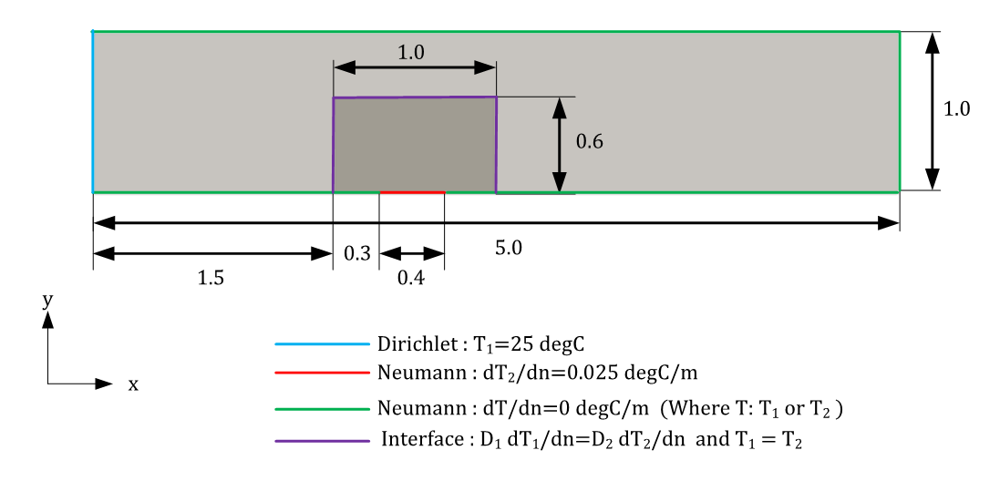
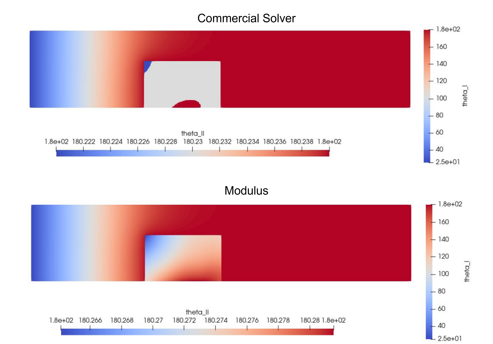
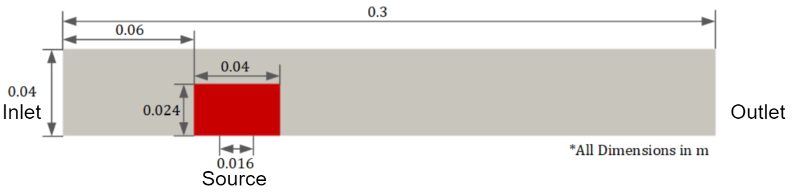
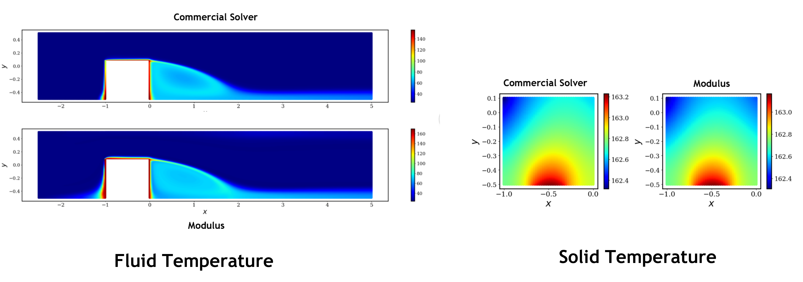

# Heat Transfer with High Thermal Conductivity

[公式ページ](https://docs.nvidia.com/deeplearning/modulus/modulus-sym/user_guide/advanced/2d_heat_transfer.html)

## Introduction

このチュートリアルでは、より現実的な材料を表すより高い熱伝導率を持つ共役熱伝達の問題を処理するために採用できる戦略について説明します。
:ref:cht チュートリアルでは、Modulus Symで単純な共役熱伝達問題を設定する方法について紹介されています。しかし、その例で使用される熱物性は、ヒートシンクを製造するために使用される実際の材料特性を表していません。
通常、ヒートシンクはアルミニウム/銅などの高い導電性材料で作られ、空冷ケースの場合、ヒートシンクを取り囲む流体は空気です。
これらの材料の導電率は桁違いに異なります。これにより、界面で急激な勾配が生じ、ニューラルネットワークのトレーニングが非常に複雑になります。
このチュートリアルでは、適切なスケーリングとアーキテクチャの選択を通じて、このような特性やシナリオがどのように扱われるかを示しています。

このチュートリアルでは、2つのシナリオを提供します。1つは両方の材料が固体であり、その間の導電率比が $10^4$ である場合です。もう1つは、固体と流体の間で共役熱伝達が発生し、固体が銅で流体が空気である場合です。この問題で使用されるスクリプトは、「examples/chip_2d/」ディレクトリにあります。

## 2D Solid-Solid Heat Transfer

問題のジオメトリは、異なる材料の導電率を持つ単純な複合2Dジオメトリです。熱源は、実際のヒートシンクとシナリオを再現するために、高い導電率の材料の内部に配置されます。このケースの目的は、銅 $(k=385 \text{ } W/m-K)$ と空気 $(k=0.0261 \text{ } W/m-K)$ の間の桁違いの差を模倣することです。したがって、ヒートシンクと周囲の固体の導電率をそれぞれ100と0.01に設定します。



Fig. 149 Geometry  for 2D solid-solid case

この問題では、ガウス周波数を持つ修正フーリエネットワークを使用すると、最良の結果が得られることが観察されました。
また、この問題では、温度を直接 $(^{\circ} C)$ で予測することができます。
これを実現するには、ネットワークの出力を、通常は問題の目標解のおおよその範囲に応じて再スケーリングする必要があります。これには問題のドメイン知識が必要です。
このシンプルな戦略は、トレーニングの収束を大幅に加速するだけでなく、モデルの性能と予測を効果的に改善します。
この問題のセットアップコードは次の通りです：

```python
```

Tensorboardのプロットをモニターして、シミュレーションの収束を確認できます。以下の表は、商用ソルバーとModulus Symの結果との間でヒートシンクが達成するピーク温度の比較を要約したものです。

Table 9 Comparison of the peak temperature with the reference values

|Property                       |OpenFOAM (Reference)|Modulus Sym (Predicted)|
|-------------------------------|--------------------|-----------------------|
|Peak temperature $(^{\circ} C)$|$180.24$            |$180.28$               |



Fig. 150 Results for 2D solid-solid case

## 2D Solid-Fluid Heat Transfer

問題のジオメトリは、以前のケースと非常に似ていますが、今回は固体チップを取り囲む流体があり、ジオメトリの寸法はより実際のヒートシンクのスケールに近くなっています。空気と銅の実際の特性もこの例で使用されます。この例は、特性/ジオメトリの無次元化を行い、ニューラルネットワークのトレーニングを改善する良いデモンストレーターでもあります。この図は、この問題のジオメトリと測定値を示しています。



Fig. 151 Geometry for 2D solid-fluid case

この問題では、固体-固体のケースで使用された熱解法に同じ戦略を採用し、修正フーリエネットワークをガウス周波数で使用できます。
流れの解法と熱の解法は片方向に連成されています。:ref:cht で紹介されたマルチフェーズトレーニングアプローチを使用してください。ネットワークの出力の再スケーリングを行うことで、モデルのパフォーマンスを改善するために同様のアプローチが取られます。

流れの解決に関するコードは、:ref:advection-diffusion や :ref:cht などの他の例と非常に似ています。
また、以前にカバーされた固体-固体のケースとも似ています。
流れ/熱の制約や境界条件の定義の詳細については、「examples/chip_2d/chip_2d_solid_fluid_heat_transfer_flow.py」と「examples/chip_2d/chip_2d_solid_fluid_heat_transfer_heat.py」を参照してください。

下の図は、固体と流体の熱解の視覚化を示しています。商用ソルバーと比較して、Modulus Symの予測は界面での温度の連続性をより良く予測していることがわかります。我々は、これらのソルバーの結果の違いは離散化誤差によるものであり、界面でのグリッド解像度を改善することで潜在的に修正できると考えています。一方、Modulus Symの予測はそのようなエラーに苦しむことはなく、物理的な制約がより正確に尊重されています。



Fig. 152 Results for 2D solid-fluid case
