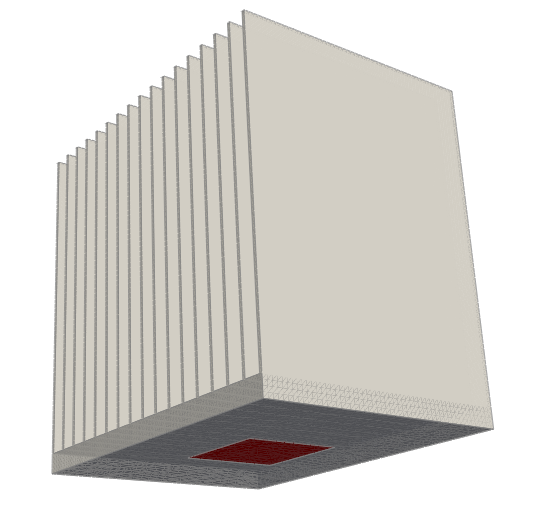
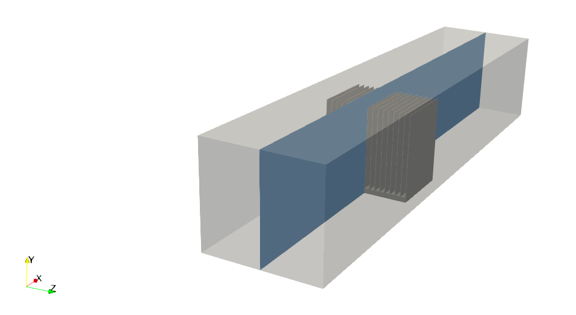
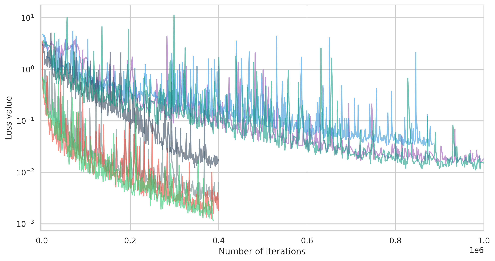
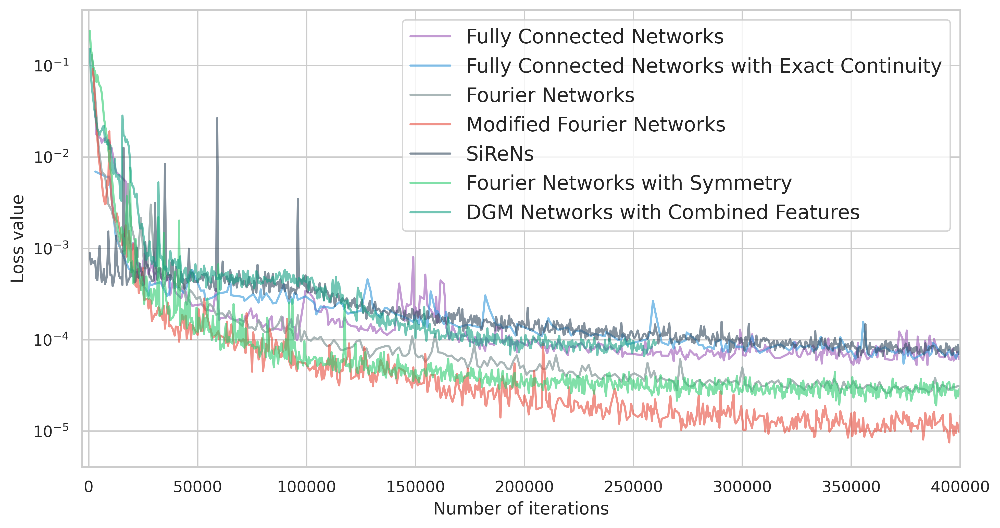

# FPGA Heat Sink with Laminar Flow

[公式ページ](https://docs.nvidia.com/deeplearning/modulus/modulus-sym/user_guide/advanced/fpga.html)

## Introduction

このチュートリアルでは、Modulus Symのいくつかの機能が複雑なFPGAヒートシンク設計に適用され、共役熱伝達が解決される方法を示しています。このチュートリアルでは以下のことを学びます：

1. 鋭い勾配を持つ複雑な形状に対してフーリエネットワークを使用する方法

2. 対称性境界条件を使用して対称な問題を解決する方法

3. 速度場をベクトルポテンシャルとして定式化する方法（厳密連続性機能）

4. Modulus Symの異なる機能やアーキテクチャが複雑な形状の問題でどのように機能するか

Note :
このチュートリアルは、:ref:chtおよび:ref:ParameterizedSimチュートリアルで示されている共役熱伝達の問題に非常に類似しています。ジオメトリ生成、制約などの詳細については、これらのチュートリアル（特に:ref:chtチュートリアル）を再確認する必要があります。このチュートリアルでは、これらのプロセスの説明を省略し、代わりに異なる機能の実装とケーススタディに焦点を当てています。

## Problem Description

FPGAヒートシンクのジオメトリは、:numref:fig-laminar_fpga_geom_2に示されています。この特定のジオメトリは、細かく密に配置されたフィンによって引き起こされる鋭い勾配のため、通常の完全に接続されたニューラルネットワークを使用して学習するのが特に困難です（収束が遅い）。



Fig. 153 FPGA heat sink geometry

このセクションでは、上記のジオメトリにおける共役熱伝達問題を$Re=50$で解決します。Modulus Symでモデル化されたジオメトリの寸法は、次のとおりです：

Tabel 10 FPGA Dimensions

|Dimension                        |  Value                 |
|---------------------------------|------------------------|
|Heat Sink Base ```(l x b x h)``` |  0.65 x 0.875 x 0.05   |
|Fin dimension ```(l x b x h)```  |  0.65 x 0.0075 x 0.8625|
|Heat Source ```(l x b)```        |  0.25 x 0.25           |
|Channel ```(l x b x h)```        |  5.0 x 1.125 x 1.0     |

すべての寸法は、チャンネルの高さが1$m$になるようにスケーリングされています。温度は次のようにスケーリングされます：$\theta=T / 273.15-1.0$。チャンネルの壁は断熱として扱われ、界面境界条件は流体-固体の界面に適用されます。その他の流体および熱パラメータは、以下の表に記載されています。

Table 11 Fluid and Solid Properties
|Property                                |Fluid  |Solid|
|----------------------------------------|-------|-----|
|Inlet Velocity $(m/s)$                  |1.0    |NA   |
|Density $(kg/m^3)$                      |1.0    |1.0  |
|Kinematic Viscosity $(m^2/s)$           |0.02   |NA   |
|Thermal Diffusivity $(m^2/s)$           |0.02   |0.1  |
|Thermal Conductivity $(W/m.K)$          |1.0    |1.0  |
|Inlet Temperature $(K)$                 |273.15 |NA   |
|Heat Source Temperature Gradient $(K/m)$|409.725|NA   |

## Case Setup

この問題のケース設定は、:ref:chtチュートリアルで説明されている問題と非常に類似しています。:ref:chtチュートリアルと同様に、ジオメトリ定義、流れ制約およびソルバー、熱制約およびソルバーの3つの個別のスクリプトがあります。

注：さまざまな機能バージョンを使用してこの問題のためのすべての関連するドメイン、流れおよび熱ソルバーファイルは、examples/fpga/にあります。

## Solver using Fourier Network Architecture

Modulus Symでは、:ref:theoryで説明されているように、ニューラルネットワークのスペクトルバイアスは、フーリエネットワークを使用することで克服することができます。これらのネットワークは、鋭い勾配を捉える能力により、通常の完全に接続されたニューラルネットワークよりも結果の大幅な改善が示されています。

ニューラルネットワークのアーキテクチャを変更する際に、ジオメトリと制約の定義方法に特別な変更は必要ありません。これはまた、アーキテクチャが解かれる物理学やパラメータ化とは独立しており、ユーザーガイドでカバーされている他の問題のクラスにも適用できることを意味します。アーキテクチャの構成に関する詳細は、Hydra構成セクション(:ref:config)で見つけることができます。

**周波数に関する注意**: これらのネットワークの主要なパラメータの1つは、周波数です。Modulus Symでは、サンプリングするスペクトル（full/axis/gaussian/diagonal）から周波数を選択し、スペクトル内の周波数の数を選択できます。最適な周波数の数は、各問題に依存し、追加のフーリエ特徴の使用による計算負荷と精度の利点とのバランスが必要です。FPGAの問題では、デフォルトの選択肢が層流の問題に適していますが、乱流の場合には周波数の数を35に増やす必要があります。

層流ケースのパラメータ化されたFPGA流れ場シミュレーションのソルバーファイルを以下に示します。異なるアーキテクチャは、設定ファイルで定義されたカスタム引数の適切なキーワードを設定することで選択できます。

```python

```

## Leveraging Symmetry of the Problem

対称的なジオメトリで変数フィールドが対称的である場合、全体のジオメトリをモデル化する計算負荷を最小限に抑えるために、平面または軸対称性に関する対称境界条件を使用することができます。FPGAヒートシンクでは、z平面に対称性があります（:numref:fig-fpga_symm）。対称境界条件については、:ref:theory-symmetryセクションで説明されています。対称性を利用してFPGAの問題をシミュレートすると、全領域でのトレーニングに比べて約33%のトレーニング時間の短縮が実現できます。

FPGA問題において対称性面がz平面である場合、:ref:theory-symmetryセクションで述べられている境界条件は次のように変換されます：

1. z座標軸に関して奇数関数である変数：'w'。したがって、対称面上では'w'=0となります。

2. z座標軸に関して偶数関数である変数：速度ベクトルの'u', 'v'成分や'p', 'theta_s', 'theta_f'などのスカラー量。対称面上では、それらの法線微分を$0$に設定します。例：'u__z'=0。



Fig. 154 FPGA plane of symmetry

Only the symmetry boundary conditions in the flow and heat
training domains are shown here. The rest of the training domain remains the same.
(Full files can be accessed at ``examples/fpga/laminar_symmetry/``)

```python

```

```python

```

## Imposing Exact Continuity

速度場をベクトルポテンシャルとして定義することで、それが発散せず、連続性を自動的に満たすようにすることができます。この形式は、ネットワークアーキテクチャに関係なく、このガイドでカバーされている任意の流れ問題に使用できます。ただし、完全に接続されたネットワークを使用すると最も効果的です。

以下のコードは、問題の出力ノードを修正して厳密な連続性がどのように実装されるかを示しています。厳密な連続性を使用する際は注意が必要であり、メモリ消費量が大きくなるため、問題をGPUメモリに適合させるためにバッチサイズを調整する必要があるかもしれません。

```python

```

## Results, Comparisons, and Summary

:ref:table-feature-summary表は、この章で議論された機能とその応用を要約しています。:ref:table-results-fpga表は、これらの機能がこのFPGA問題に与える重要な結果をまとめています。また、:numref:fig-fpga-loss-plotsでは、異なる実行からの損失値の比較を提供しています。

Table 12 Summary of features introduced in this tutorial

| Feature                        | Applicability to other problems                | Comments                                                                         |
|--------------------------------|------------------------------------------------|----------------------------------------------------------------------------------|
| Fourier Networks               | Applicable to all class of problems            | シャープな勾配を含む問題に対して非常に効果的であることが示されています。変更されたフーリエネットワークがパフォーマンスをさらに向上させることがわかりました。 |
| Symmetry                       | Applicable to all problems with a plane/axis of symmetry | 計算領域を半分に減らすことで、大幅な高速化が実現されます（完全な領域と比較してトレーニング時間が33%削減されます）。 |
| Exact Continuity               | Applicable to incompressible flow problems requiring solution to Navier Stokes equation | 速度-圧力形式よりも連続方程式の満足度が向上します。標準的な全結合ネットワークと最も良く機能することがわかりました。また、フーリエネットワークの結果の精度も向上します。 |
| SiReNs                         | Applicable to all class of problems            | シャープな勾配を持つ問題に対して効果的であることが示されています。しかし、精度の点では、フーリエネットワークを上回ることはありません。 |
| DGM Networks Global Adaptive, Activations and Halton Sequences, etc. | Applicable to all class of problems            | 通常の全結合ネットワークと比較して精度が向上します。                     |

Table 13 Comparison of pressure drop and peak temperatures from various runs

| **Case Description** | $P_{drop}$  $(Pa)$ | $T_{peak}$ $(^{\circ} C)$|
|---------------------|--------------------|---------------------|
| **Modulus Sym:** Fully Connected Networks    | 29.24  | 77.90 |
| **Modulus Sym:** Fully  Connected Networks with Exact  Continuity | 28.92 | 90.63  |
| **Modulus Sym:** Fourier  Networks  | 29.19 | 77.08  |
| **Modulus Sym:** Modified Fourier Networks | 29.23 | 80.96  |
| **Modulus Sym:** SiReNs   | 29.21  | 76.54  |
| **Modulus Sym:** Fourier  Networks with Symmetry| 29.14  | 78.56|
| **Modulus Sym:** DGM  Networks with Global    | 29.10  | 76.86  |
| Networks with Global  LR annealing, Global Adaptive  Activations, and Halton    | 29.10  | 76.86|
| **OpenFOAM Solver**       | 28.03  | 76.6  |
| **Commercial Solver**     | 28.38  | 84.93 |



Fig. 155 Flow comparisons



Fig. 156 Heat comparisons
