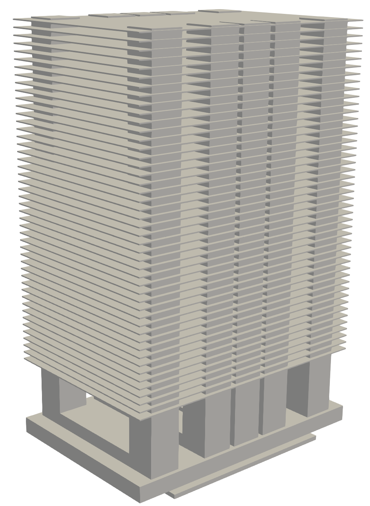
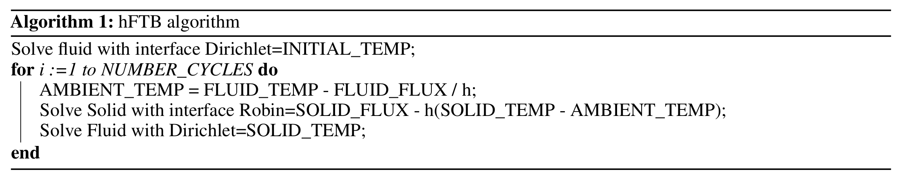
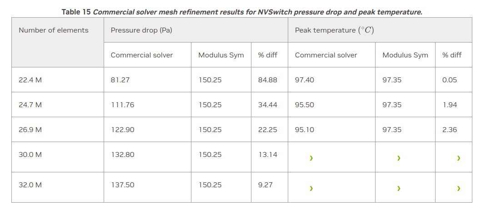
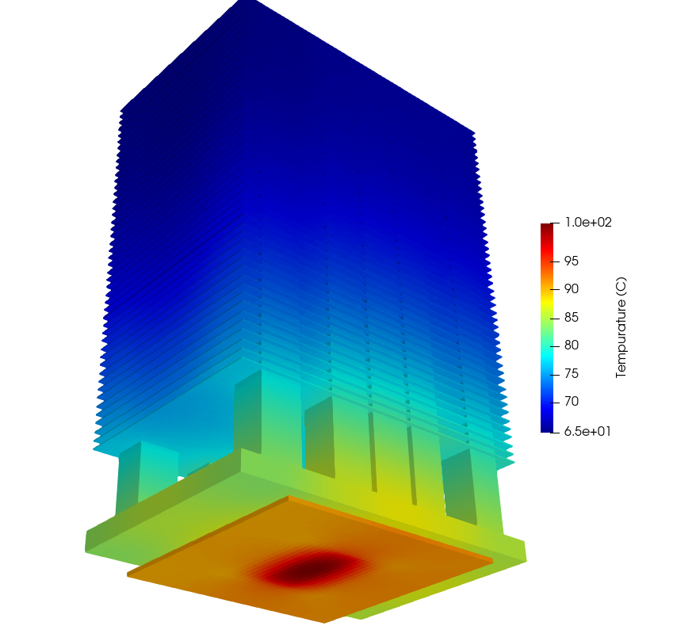
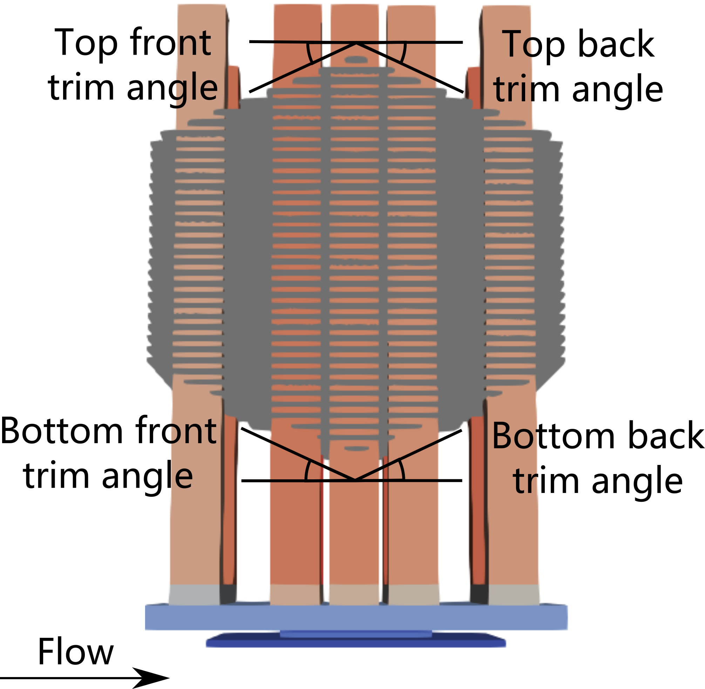
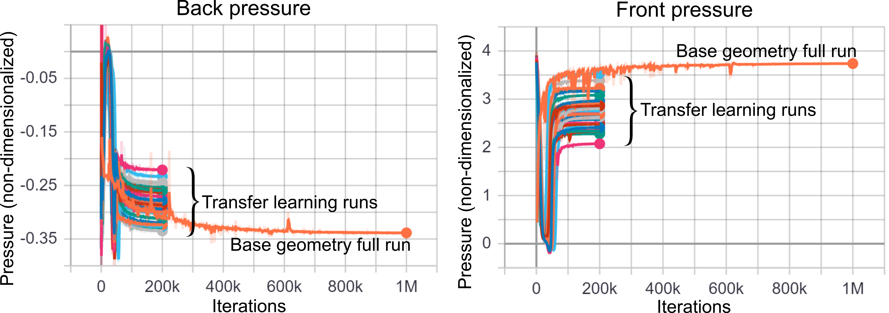

# Industrial Heat Sink

[公式ページ](https://docs.nvidia.com/deeplearning/modulus/modulus-sym/user_guide/advanced/industrial_heat_sink.html)

## Introduction

このチュートリアルでは、Modulus Symを使用してNVIDIAのNVSwitchヒートシンクの熱シミュレーションを行います。以下のことを学びます：

1. hFTBアルゴリズムを使用して共役熱伝達問題を解く方法
2. 転移学習を介してgPCベースのサロゲートを構築する方法

Note :
このチュートリアルは、過渡ナビエ・ストークスのチュートリアルと共役熱伝達に関するチュートリアルが完了していることを前提としています。

## Problem Description

このチュートリアルでは、前述の:numref:fig-limerock_originalに示されているように、NVIDIAのNVSwitchヒートシンクの共役熱伝達問題を解決します。前のFPGAの問題と同様に、ヒートシンクは入口速度がその動作条件に類似したチャンネルに配置されています。このケースはFPGAのものと異なり、大気中の空気と銅の熱伝導特性をヒートシンク材料として使用します。:ref:2d_heatとは異なり、大きな熱伝導率の違いを処理するためにhFTBアルゴリズムが使用されます。



Fig. 157 NVSwitch heat sink geometry

実際の熱伝導特性を使用すると、固体と流体の間の界面で問題が発生します。なぜなら、熱伝導率が大気（0.0261 $W/m.K$）と銅（385 $W/m.K$）では4桁も異なるからです。これを解決するために、Modulus Symには熱伝達係数の前方温度後方向き（hFTB）と呼ばれる静的な共役熱伝達アプローチがあります。この方法は、流体と固体の熱伝達を一方向に結合させながら反復的に解くことで機能します。hFTBメソッドを使用すると、固体の界面にロビン境界条件を割り当て、流体にはディリクレ境界条件を割り当てます。シミュレーションは、固体温度の初期推定値を与え、ロビン境界条件に超パラメータ$h$を使用して開始されます。アルゴリズムの説明は:numref:fig-hFTB_algorithmに示されています。より詳しい説明はこちらで見つけることができます[#school2018stability]_.



Fig. 158 hFTB algorithm

## Case Setup

この問題のケース設定は、FPGAと3つのフィンの例（チュートリアル:ref:ParameterizedSimおよび:ref:fpgaでカバーされています）と似ています。しかし、このセクションでは、hFTBメソッドを実装するために複数の列車領域の構築が示されています。

Note : この問題のPythonスクリプトはexamples/limerock/limerock_hFTBにあります。

## Defining Domain

このケース設定では、コードのいくつかのセクションをスキップし、hFTBアルゴリズムに関連する部分に焦点を当てています。以前のチュートリアルからの流れシミュレーションの設定方法については理解している必要があります。ジオメトリの構築についても詳細には議論されておらず、関連する情報はすべてexamples/limerock/limerock_hFTB/limerock_geometry.pyで見つけることができます。コードの説明は、シミュレーションのパラメータを定義し、必要なすべてのモジュールをインポートすることから始まります。

```python

```

Note :
すべてのパラメータを無次元化して、速度、温度、および圧力のスケールがおおよそ0から1の範囲になるようにします。このような無次元化により、ニューラルネットワークのトレーニングが効率的になります。

## Sequence Solver

ソルバーをセットアップします。前のサイクルの流体解から熱解を格納する別個のニューラルネットワークを、チュートリアル:ref:transient-navier-stokesでの移動時間ウィンドウの実装と同様に構築します。この問題は8つのGPUで実行するか、勾配集約周波数を8に設定することをお勧めします。複数のGPUおよび複数のノードでの実行の詳細については、チュートリアル:ref:performanceを参照してください。また、勾配集約の詳細については、チュートリアル:ref:configを参照してください。

次に、固体のディリクレ境界条件を与えられた流体内の温度のみを解決するトレインドメインを設定します。これは、hFTBメソッドの最初の段階になります。流体内の温度の初期解決を得た後、hFTBアルゴリズムのメインループを解決します。これで、流体と固体の両方を一方向に結合して解決します。固体のロビン境界条件は、流体解の前の反復から来ます。

Note :
可視化の目的で、結果をメッシュ上で表示することが役立つことがあります。ここでは、「VTKUniformGrid」メソッドを使用してこれを行います。SDFは、固体の外側での温度評価をフィルタリングするためのマスク関数として使用されました。

Warning :
現時点では、この問題に対するマルチGPUトレーニングはサポートされていません。

```python

```

## Results and Post-processing

モデルの正確性を確認するために、圧力損失とピーク温度の結果をOpenFOAMと商用ソルバーの結果と比較し、その結果を:numref:table-limerock1に報告しています。結果は、hFTBメソッドによって達成された良好な精度を示しています。:numref:table-limerock2では、商用ソルバーの解にメッシュの微調整が及ぼす影響を示しており、メッシュ密度とメッシュ品質が向上するにつれて、商用ソルバーの結果がModulus Symの結果に収束していく様子が示されています。ヒートシンクの温度プロファイルの視覚化は:numref:fig-limerock_thermalに示されています。

Table 14 A comparison for the solver and Modulus Sym results for NVSwitch pressure drop and peak temperature.

| Property | OpenFOAM | Commercial | Modulus Sym|
|---|---|---|---|
| Pressure Drop $(Pa)$ | $133.96$| $137.50$| $150.25$|
| Peak Temperature | $93.41$ | $95.10$ | $97.35$ |

Table 15 Commercial solver mesh refinement results for NVSwitch pressure drop and peak temperature.S





Fig. 159 NVSwitch Solid Temperature

## gPC Based Surrogate Modeling Accelerated via Transfer Learning

以前の章である:ref:ParameterizedSimでは、ニューラルネットワークの入力をパラメーター化することで、単一の実行で複数の設計パラメーターを解決し、そのパラメーター化されたネットワークを設計最適化に使用できることが示されました。このセクションでは、パラメーター化と設計最適化のための別のアプローチを紹介します。このアプローチは、限られた数の非パラメーター化されたニューラルネットワークモデルから得られた解を使用してサロゲートを構築するものです。CSGモジュールに制限されるパラメーター化ネットワークアプローチと比較して、このアプローチは構築ソリッドとSTLジオメトリの両方のパラメーター化に使用でき、さらに、高次元のパラメータースペースや一部またはすべての設計パラメーターが離散的である場合に特に精度が向上することができます。ただし、このアプローチには複数のニューラルネットワークのトレーニングが必要であり、マルチノードリソースが必要な場合があります。

このセクションでは、一般化多項式混沌（gPC）展開に基づくサロゲートに焦点を当てています。gPCは、限られたデータを使用した不確実性の量子化に効率的なツールであり、:ref:generalized_polynomial_chaosで紹介されています。まず、HaltonやSobolなどの低不均一シーケンスを使用して、パラメータースペースから必要な数の実現を生成します。次に、各実現に対して別個のニューラルネットワークモデルをトレーニングします。これらのトレーニングは互いに独立しているため、このトレーニングステップは極めて並列化されており、複数のGPUまたはノードで実行できます。最後に、パラメータースペースを対象量（例：ヒートシンク設計の圧力損失やピーク温度など）にマッピングするgPCサロゲートをトレーニングします。

このアプローチに関連する複数のモデルのトレーニングに伴う計算コストを削減するために、転移学習が使用されます。つまり、1つの実現に対してモデルが完全にトレーニングされると、他のモデルの初期化に使用され、これにより全体の収束までの時間を大幅に短縮できます。転移学習は、以前の章で紹介されています（:ref:stl）。

ここでは、転移学習を介して加速されたgPCサロゲートモデリングを示すために、先に紹介したNVIDIAのNVSwitchヒートシンクを考えます。:numref:fig-limerock_parameterized_geometryに示すように、フィンの切断角に関連する4つのジオメトリパラメーターを導入します。次に、圧力損失のサロゲートを構築します。同様に、ピーク温度のサロゲートも構築し、これら2つのサロゲートを使用してこのヒートシンクの設計最適化を行うこともできます。



Fig. 160 NVSwitch heat sink geometry parameterization. Each parameter ranges between 0 and $\pi/6$.

この例のスクリプトは、examples/limerock/limerock_transfer_learningにあります。:ref:generalized_polynomial_chaosに従って、以下のようにしてsample_generator.pyを実行することで、Haltonシーケンスに従って30のジオメトリ実現を生成できます。

```python

```

それぞれの実現に対して別個の流れネットワークをトレーニングします。これを行うには、ネットワークのチェックポイント、学習率と減衰率、および最大トレーニングイテレーションを更新してconf/config.pyを変更します。また、limerock_geometry.pyのsample_id変数も変更し、次にlimerock_flow.pyを実行します。これをジオメトリ実現がすべてカバーされるまで繰り返します。これらの流れモデルは、基本ジオメトリのトレーニングされたネットワーク（:numref:fig-limerock_originalに示されているように）を使用して初期化され、基本ジオメトリの合計トレーニングイテレーションの一部のみでトレーニングされます。これは、これらのモデルを頭からトレーニングするのではなく、微調整するだけで済むためです。転移学習ランを開始する前に、基本ジオメトリの流れネットワークを完全にトレーニングする必要があることに注意してください。

:numref:fig-limerock_pce_pressureでは、異なる実行に対する前後の圧力結果が示されています。明らかなように、転移学習ランでは、基本ジオメトリの完全なランと比較して圧力がより速く収束しており、転移学習により収束までの総時間が5倍に短縮されています。



Fig. 161 NVSwitch front and back pressure convergence results for different geometries using transfer learning.

最後に、これらのモデルから得られた圧力損失データをランダムにトレーニングセットとテストセットに分割し、以下のようにgPCサロゲートを構築します。

```python

```

このサロゲートを構築するコードは、limerock_pce_surrogate.pyで利用できます。:numref:fig-limerock_testsでは、テストセット上でのgPCサロゲートの性能が示されています。相対誤差は1%以下であり、構築されたgPC圧力損失サロゲートの良好な精度を示しています。


Fig. 162 The gPC pressure drop surrogate accuracy tested on four geometries

## Reference

.. [#school2018stability] Sebastian Scholl, Bart Janssens, and Tom Verstraete. Stability of static conjugate heat transfer coupling approaches using robin interface conditions. Computers & Fluids, 172, 06 2018.
